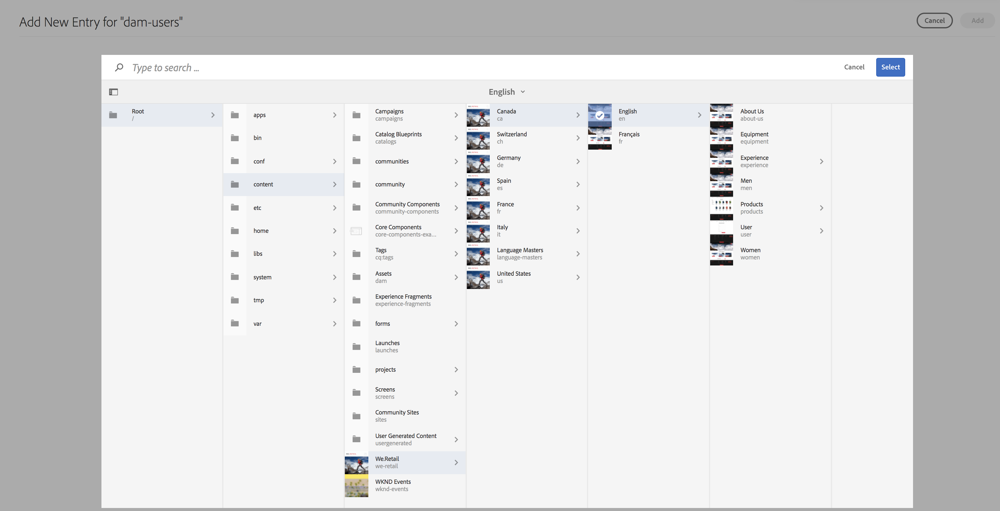
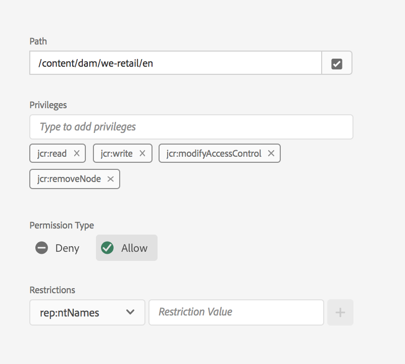
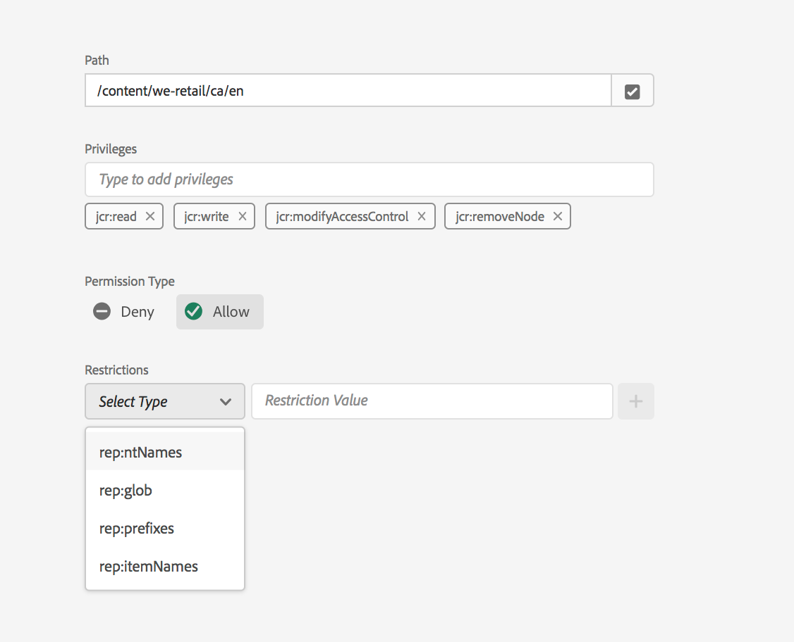
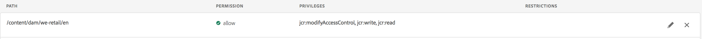

# 權限管理的承擔者視圖{#principal-view-for-permissions-management}

## 概覽 {#overview}

AEM 6.5推出「使用者和群組的權限管理」。 主要功能與傳統UI相同，但更方便使用，更有效率。

## 如何使用 {#how-to-use}

### 存取UI {#accessing-the-ui}

新的UI權限管理可透過「安全性」下方的「權限」卡存取，如下所示：

新檢視可讓您在已明確授與權限的所有路徑中，更輕鬆地查看特定承擔者的整組權限和限制。 這樣，您就不需要前往

CRXDE以管理進階權限和限制。 它已整合在相同的檢視中。 檢視預設為「每個人」群組。

有一個篩選器，允許用戶選擇查看用戶、組或全部的承擔者類 **型**，並 **搜索任何承擔者********。**

### 查看承擔者的權限 {#viewing-permissions-for-a-principal}

左側的畫格可讓使用者向下捲動以尋找任何承擔者，或根據選取的篩選條件搜尋群組或使用者，如下所示：

按一下名稱會顯示右側指派的權限。 權限窗格顯示特定路徑上的訪問控制項清單以及配置的限制。

### 為承擔者添加新訪問控制條目 {#adding-new-access-control-entry-for-a-principal}

通過按一下添加ACE按鈕添加新的訪問控制條目可以添加新權限。

這會顯示下列視窗，下一步是選擇需要設定權限的路徑。

在此，我們選取要為dam使用者設定權限的 **路徑**:

選取路徑後，工作流程會返回此畫面，然後使用者可從可用名稱空間(例如 `jcr`, `rep` 或 `crx`)選取一或多個權限，如下所示。

您可使用文字欄位搜尋，然後從清單中選取，來新增權限。

>[!NOTE]
>
>如需權限和說明的完整清單，請參閱 [本頁](/help/sites-administering/user-group-ac-admin.md#access-right-management)。

 

在選取權限清單後，使用者可以選擇權限類型：拒絕或允許，如下所示。

 

### 使用限制 {#using-restrictions}

除了指定路徑上的權限清單和權限類型外，此螢幕還允許添加細粒度訪問控制的限制，如下所示：

>[!NOTE]
>
>有關每項限制的詳細資訊，請參閱 [本頁](/help/sites-administering/user-group-ac-admin.md#restrictions)。

您可選擇限制類型、輸入值並點選+圖示，以新增限 **制** 。  

新ACE反映在訪問控制清單中，如下所示。 請注意， `jcr:write` 是包含上述新增之權 `jcr:removeNode` 限的匯總權限，但不會顯示為下面所涵蓋的權限 `jcr:write`。

### 編輯ACE {#editing-aces}

可以通過選擇承擔者並選擇要編輯的ACE來編輯訪問控制條目。

例如，我們可以在此處，按一下右 **邊的鉛筆圖示** ，編輯dam使用者的下列項目：

編輯螢幕中顯示了預先選擇的已配置ACE，可通過按一下它們旁邊的交叉表徵圖來刪除這些ACE，或者可以為給定路徑添加新權限，如下所示。

在此，我們新增 `addChildNodes` 指定路 **徑上dam使用者的權限** 。

按一下右上方的 **Save** （儲存）按鈕可儲存變更，而變更將反映在**dam-users **的新權限中，如下所示：

### 刪除ACE {#deleting-aces}

可以刪除訪問控制項，以刪除給特定路徑上承擔者的所有權限。 ACE旁邊的X表徵圖可用於刪除，如下所示：

 

### 傳統UI權限組合 {#classic-ui-privilege-combinations}

請注意，新權限UI會明確使用基本權限集，而非預先定義的組合，這些組合無法真正反映已授予的確切基礎權限。

它會造成對正在設定的內容的混淆。 下表列出了Classic UI中權限組合與構成權限的實際權限之間的映射：

<table>
 <tbody>
  <tr>
   <th>傳統UI權限組合</th>
   <th>權限UI權限</th>
  </tr>
  <tr>
   <td>讀取</td>
   <td><code>jcr:read</code></td>
  </tr>
  <tr>
   <td>修改</td>
   <td>
<code>jcr:modifyProperties</code>
 
<code>jcr:lockManagement</code>
 
<code>jcr:versionManagement</code>
 </td>
  </tr>
  <tr>
   <td>建立</td>
   <td>
<code>jcr:addChildNodes</code>
 
<code>jcr:nodeTypeManagement</code>
 </td>
  </tr>
  <tr>
   <td>刪除</td>
   <td>
<code>jcr:removeNode</code>
 
<code>jcr:removeChildNodes</code>
 </td>
  </tr>
  <tr>
   <td>讀取 ACL</td>
   <td><code>jcr:readAccessControl</code></td>
  </tr>
  <tr>
   <td>編輯 ACL</td>
   <td><code>jcr:modifyAccessControl</code></td>
  </tr>
  <tr>
   <td>複寫</td>
   <td><code>crx:replicate</code></td>
  </tr>
 </tbody>
</table>

