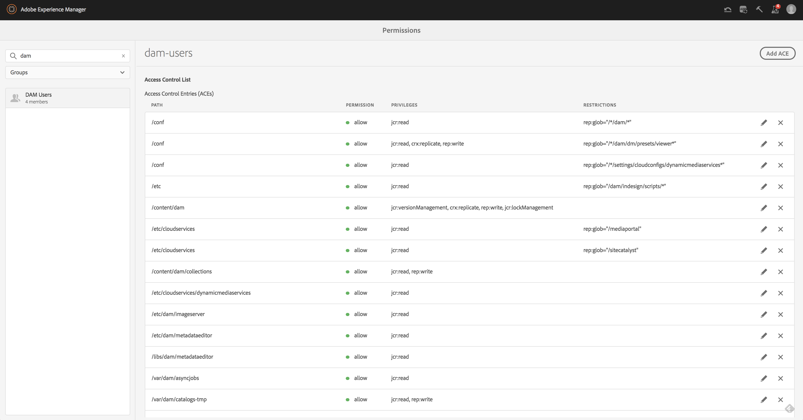
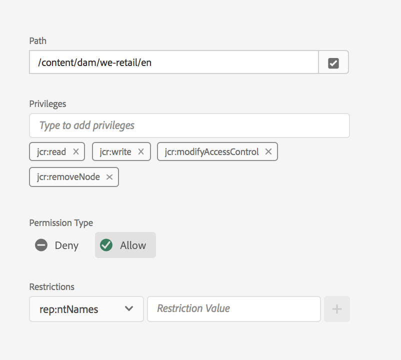
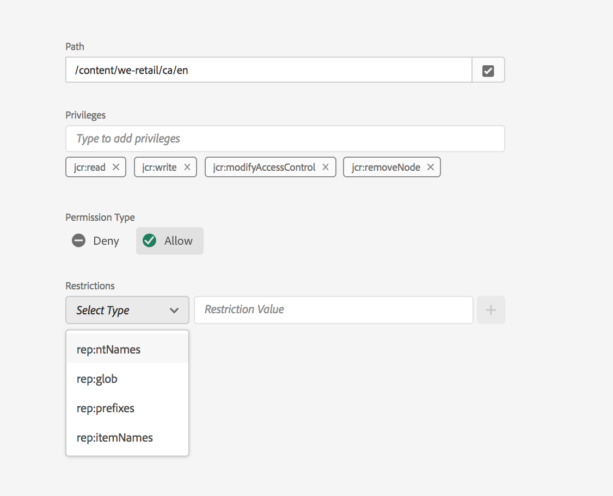

# 權限管理的主體視圖{#principal-view-for-permissions-management}

## 概觀 {#overview}

AEM 6.5推出使用者和群組的許可權管理。 其主要功能與傳統使用者介面相同，但更為使用者友善及有效率。

## 使用方式 {#how-to-use}

### 存取使用者介面 {#accessing-the-ui}

新的使用者介面型權限管理，可以透過「安全性」之下的「權限」卡片存取，如下所示：

透過新的視圖，可以在已明確授予權限的所有路徑上，更輕鬆地查看指定主體的完整權限與限制集。 如此一來，不需要前往

CRXDE 也能管理進階權限與限制。 其已合併於同一個視圖中。 該檢視預設為「所有人」群組。

設有一個篩選器讓使用者能夠選取要用於查看&#x200B;**使用者**、**群組**&#x200B;或&#x200B;**全部**&#x200B;的主體類型，以及搜尋任何主體&#x200B;**。**

### 檢視主體權限 {#viewing-permissions-for-a-principal}

使用者能運用位於左側的方框，向下捲動查找任何主體，或者根據所選取的篩選器搜尋群組或使用者，如下所示：

按一下名稱，已指派的權限便會顯示於右側。 權限窗格會顯示特定路徑上的存取控制項目清單，以及設定好的限制。

### 加入新的主體存取控制項目 {#adding-new-access-control-entry-for-a-principal}

可以透過新增存取控制項目來新增權限。 只要按一下「新增 ACE」按鈕即可。

然後便會帶出下方所示的視窗，下一步是選擇必須設定權限的路徑。

如此處所示，已選取一條路徑，您可以在其中設定 **dam-users** 的權限：

選取路徑後，工作流程會回到此畫面，使用者能夠從可供使用的命名空間中選取一個或多個權限 (如 `jcr`、`rep` 或 `crx`)，如下所示。

若要新增權限，可以使用文字欄位搜尋，然後自清單中選取。

>[!NOTE]
>
>關於權限的完整清單和說明，請參閱[使用者、群組和存取權管理](/help/sites-administering/user-group-ac-admin.md#access-right-management)。

 

選取權限清單後，使用者可以選擇權限類型：「拒絕」或「允許」，如下所示。

 

### 運用限制 {#using-restrictions}

除了指定路徑的許可權清單和許可權型別之外，此畫面還可讓您為精細存取控制新增限制，如下所示：

>[!NOTE]
>
>如需關於每項限制實際內容的詳細資訊，請參閱 [Jackrabbit Oak 文件](https://jackrabbit.apache.org/oak/docs/security/authorization/restriction.html)。

若要新增限制，請選擇限制類型、輸入值，並且點擊「**+**」圖示，如下所示。

 

新的 ACE 會反映在存取控制清單中，如下所示。 請注意，`jcr:write`是包含上面新增的`jcr:removeNode`的彙總許可權，但不會顯示於下方，因為它包含在`jcr:write`之下。

### 編輯 ACE {#editing-aces}

若要編輯存取控制項目，可以選取一個主體，然後選擇要編輯的 ACE。

例如，您可以按一下位於右側的鉛筆圖示，編輯 **dam-users** 的以下項目：

編輯畫面會顯示出來，並預先選取已設定的 ACE，按一下旁邊的十字圖示可以刪除這些 ACE，或者可以加入指定路徑的新權限，如下所示。

如此處所示，已在指定路徑上新增 **dam-users** 的 `addChildNodes` 權限。

按一下右上角的「**儲存**」按鈕可儲存變更，變更會反映在&#x200B;**dam-users**&#x200B;的新許可權中，如下所示：

### 刪除 ACE {#deleting-aces}

刪除存取控制項目，可以將授予特定路徑上之主體的所有權限移除。 可以使用 ACE 旁邊的 X 圖示將其刪除，如下所示：

 

### 傳統使用者介面權限組合 {#classic-ui-privilege-combinations}

新的權限使用者介面會明確地使用基本權限集，而非預先定義的組合，因為預先定義的組合無法真正反映出已授予的確切基本權限。

這會導致人們對於實際的設定內容感到困惑。 以下表格列出傳統使用者介面中的權限組合，與其實際構成權限之間的對應：

<table>
 <tbody>
  <tr>
   <th>傳統使用者介面權限組合</th>
   <th>權限使用者介面權限</th>
  </tr>
  <tr>
   <td>讀取</td>
   <td><code>jcr:read</code></td>
  </tr>
  <tr>
   <td>修改</td>
   <td>
<code>jcr:modifyProperties</code>
 
<code>jcr:lockManagement</code>
 
<code>jcr:versionManagement</code>
 </td>
  </tr>
  <tr>
   <td>建立</td>
   <td>
<code>jcr:addChildNodes</code>
 
<code>jcr:nodeTypeManagement</code>
 </td>
  </tr>
  <tr>
   <td>刪除</td>
   <td>
<code>jcr:removeNode</code>
 
<code>jcr:removeChildNodes</code>
 </td>
  </tr>
  <tr>
   <td>讀取 ACL</td>
   <td><code>jcr:readAccessControl</code></td>
  </tr>
  <tr>
   <td>編輯 ACL</td>
   <td><code>jcr:modifyAccessControl</code></td>
  </tr>
  <tr>
   <td>複寫</td>
   <td><code>crx:replicate</code></td>
  </tr>
 </tbody>
</table>
