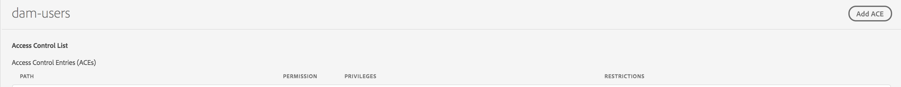

# 權限管理的主體視圖{#principal-view-for-permissions-management}

## 概覽 {#overview}

AEM 6.5推出使用者和群組的權限管理。 主要功能與傳統UI相同，但更方便使用且更有效率。

## 使用方式 {#how-to-use}

### 存取UI {#accessing-the-ui}

新的UI型權限管理可透過「安全性」下的「權限」卡存取，如下所示：

新視圖使得在已明確授予權限的所有路徑上查看給定主體的整個權限和限制集更簡單。 如此，您就無須前往

CRXDE以管理進階權限和限制。 已以相同檢視加以整合。 此檢視預設為「所有人」群組。

有一個篩選器可讓使用者選取要查看的承擔者類型 **使用者**, **群組**，或 **全部**&#x200B;並搜索任何主體&#x200B;**.**

### 查看主體的權限 {#viewing-permissions-for-a-principal}

左側的框架可讓使用者向下捲動，以根據選取的篩選條件尋找任何主體或搜尋群組或使用者，如下所示：

按一下名稱，右側會顯示指派的權限。 權限窗格顯示特定路徑上的訪問控制條目清單以及配置的限制。

### 為主體添加新的訪問控制項 {#adding-new-access-control-entry-for-a-principal}

通過按一下「添加ACE」按鈕添加新的「訪問控制項」，可以添加新權限。

這會顯示下列視窗，下一步是選擇需要設定權限的路徑。

在此處，我們會選取要為 **dam-users**:

選取路徑後，工作流程會回到此畫面，使用者可在此畫面中，從可用的命名空間(例如 `jcr`, `rep` 或 `crx`)，如下所示。

使用文本欄位搜索，然後從清單中選擇，可以添加權限。

>[!NOTE]
>
>有關權限和說明的完整清單，請參見 [本頁](/help/sites-administering/user-group-ac-admin.md#access-right-management).

 

選取權限清單後，使用者可以選擇權限類型：拒絕或允許，如下所示。

 

### 使用限制 {#using-restrictions}

除了指定路徑上的權限清單和權限類型之外，此螢幕還允許添加細粒度訪問控制的限制，如下所示：

>[!NOTE]
>
>欲知每項限制的含義，請參閱 [傑克拉布特橡樹檔案](http://jackrabbit.apache.org/oak/docs/security/authorization/restriction.html).

您可以借由選擇限制類型、輸入值並點擊 **+** 表徵圖。

 

新ACE將反映在「訪問控制清單」中，如下所示。 請注意 `jcr:write` 是包含 `jcr:removeNode` 上方新增，但下方未顯示，因為其涵蓋 `jcr:write`.

### 編輯ACE {#editing-aces}

通過選擇主體並選擇要編輯的ACE，可以編輯訪問控制項。

例如，您可以在此編輯下列項目 **dam-users** 按一下右側的鉛筆圖示：

顯示的編輯螢幕中預選了配置的ACE，可通過按一下它們旁邊的交叉表徵圖來刪除這些ACE，或者可以為給定路徑添加新權限，如下所示。

在此處，我們新增 `addChildNodes` 特權 **dam-users** 在給定的路上。

您可以按一下 **儲存** 按鈕，而變更會反映在**dam-users的新權**中，如下所示：

### 刪除ACE {#deleting-aces}

可以刪除訪問控制項，以刪除指定路徑上承擔者的所有權限。 ACE旁的X圖示可用來刪除它，如下所示：

 

### 傳統UI權限組合 {#classic-ui-privilege-combinations}

請注意，新權限UI會明確使用基本權限集，而非預先定義的組合，而這些組合併未真正反映已授予的確切基礎權限。

這會造成對正在設定的內容的混淆。 下表列出傳統UI中的權限組合與構成它們的實際權限之間的對應：

<table>
 <tbody>
  <tr>
   <th>傳統UI權限組合</th>
   <th>權限UI權限</th>
  </tr>
  <tr>
   <td>讀取</td>
   <td><code>jcr:read</code></td>
  </tr>
  <tr>
   <td>修改</td>
   <td>
<code>jcr:modifyProperties</code>
 
<code>jcr:lockManagement</code>
 
<code>jcr:versionManagement</code>
 </td>
  </tr>
  <tr>
   <td>建立</td>
   <td>
<code>jcr:addChildNodes</code>
 
<code>jcr:nodeTypeManagement</code>
 </td>
  </tr>
  <tr>
   <td>刪除</td>
   <td>
<code>jcr:removeNode</code>
 
<code>jcr:removeChildNodes</code>
 </td>
  </tr>
  <tr>
   <td>讀取 ACL</td>
   <td><code>jcr:readAccessControl</code></td>
  </tr>
  <tr>
   <td>編輯 ACL</td>
   <td><code>jcr:modifyAccessControl</code></td>
  </tr>
  <tr>
   <td>複寫</td>
   <td><code>crx:replicate</code></td>
  </tr>
 </tbody>
</table>
