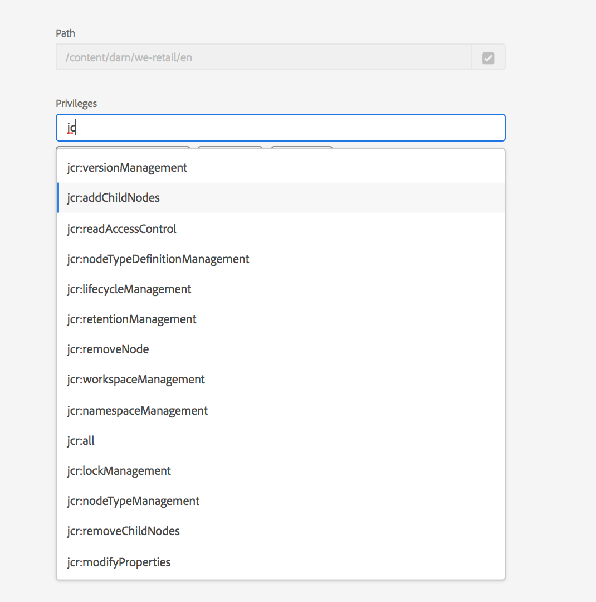

# 權限管理的主體視圖{#principal-view-for-permissions-management}

## 概觀 {#overview}

AEM6.5引入了用戶和組的權限管理。 主要功能與經典UI保持相同，但更方便用戶，更高效。

## 使用方式 {#how-to-use}

### 訪問UI {#accessing-the-ui}

通過「安全」下的「權限」卡訪問新的基於UI的權限管理，如下所示：

通過新視圖，可以更容易地查看已明確授予權限的所有路徑中給定承擔者的整個權限和限制。 這樣，您無需轉到

CRXDE用於管理高級權限和限制。 它已合併為同一觀點。 視圖預設為組「每個人」。

有一個篩選器，允許用戶選擇要查看的承擔者類型 **用戶**。 **組**&#x200B;或 **全部**&#x200B;並搜索任何主體&#x200B;**。**

### 查看承擔者的權限 {#viewing-permissions-for-a-principal}

左側的框架允許用戶向下滾動以查找任何主體，或根據所選篩選器搜索組或用戶，如下所示：

按一下名稱后，右邊會顯示已分配的權限。 權限窗格顯示特定路徑上的訪問控制項清單以及配置的限制。

### 為承擔者添加新訪問控制項 {#adding-new-access-control-entry-for-a-principal}

通過按一下「添加ACE」按鈕，可以添加新的訪問控制項來添加新權限。

這將顯示下面的窗口，下一步是選擇需要配置權限的路徑。

在此，我們選擇要為其配置權限的路徑 **大壩用戶**:

選擇路徑後，工作流將返回到此螢幕，用戶隨後可以從可用命名空間中選擇一個或多個權限(如 `jcr`。 `rep` 或 `crx`)，如下所示。

可以通過使用文本欄位進行搜索，然後從清單中選擇來添加權限。

>[!NOTE]
>
>有關權限和說明的完整清單，請參閱 [此頁](/help/sites-administering/user-group-ac-admin.md#access-right-management)。

 

選擇權限清單後，用戶可以選擇權限類型：拒絕或允許，如下所示。

 

### 使用限制 {#using-restrictions}

除了給定路徑上的權限清單和權限類型之外，此螢幕還允許添加細粒度訪問控制限制，如下所示：

>[!NOTE]
>
>有關每個限制的含義的詳細資訊，請參閱 [《長兔橡樹》](https://jackrabbit.apache.org/oak/docs/security/authorization/restriction.html)。

通過選擇限制類型、輸入值並按 **+** 表徵圖

 

新ACE將反映在「訪問控制清單」中，如下所示。 請注意 `jcr:write` 是包含的聚合權限 `jcr:removeNode` 上面加了，但下面未顯示 `jcr:write`。

### 編輯ACE {#editing-aces}

可以通過選擇主體並選擇要編輯的ACE來編輯訪問控制項。

例如，我們可以在此處編輯以下條目 **大壩用戶** 按一下右側的鉛筆表徵圖：

編輯螢幕顯示了預選配置的ACE，通過按一下它們旁邊的交叉表徵圖可以刪除這些ACE，或者可以為給定路徑添加新權限，如下所示。

此處，我們添加 `addChildNodes` 權限 **大壩用戶** 在給定路徑上。

通過按一下 **保存** 按鈕，更改將反映在**dam-users **的新權限中，如下所示：

### 刪除ACE {#deleting-aces}

可以刪除訪問控制項，以刪除授予特定路徑上承擔者的所有權限。 ACE旁邊的X表徵圖可用於刪除，如下所示：

 

### 經典UI權限組合 {#classic-ui-privilege-combinations}

請注意，新權限UI顯式使用基本權限集，而不是沒有真正反映已授予的確切底層權限的預定義組合。

它導致了對具體配置內容的混淆。 下表列出了從傳統用戶介面到構成這些權限的實際權限之間的映射：

<table>
 <tbody>
  <tr>
   <th>經典UI權限組合</th>
   <th>權限UI權限</th>
  </tr>
  <tr>
   <td>讀取</td>
   <td><code>jcr:read</code></td>
  </tr>
  <tr>
   <td>修改</td>
   <td>
<code>jcr:modifyProperties</code>
 
<code>jcr:lockManagement</code>
 
<code>jcr:versionManagement</code>
 </td>
  </tr>
  <tr>
   <td>建立</td>
   <td>
<code>jcr:addChildNodes</code>
 
<code>jcr:nodeTypeManagement</code>
 </td>
  </tr>
  <tr>
   <td>刪除</td>
   <td>
<code>jcr:removeNode</code>
 
<code>jcr:removeChildNodes</code>
 </td>
  </tr>
  <tr>
   <td>讀取 ACL</td>
   <td><code>jcr:readAccessControl</code></td>
  </tr>
  <tr>
   <td>編輯 ACL</td>
   <td><code>jcr:modifyAccessControl</code></td>
  </tr>
  <tr>
   <td>複寫</td>
   <td><code>crx:replicate</code></td>
  </tr>
 </tbody>
</table>
