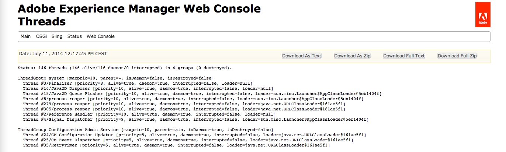

# 疑難排解AEM {#troubleshooting-aem}

下節將說明您使用AEM時可能遇到的一些問題，以及如何疑難排解的建議。

>[!NOTE]
>
>如果您要疑難排解AEM中的編寫問題，請參閱「 [作者疑難排解」。](/help/sites-authoring/troubleshooting.md)

>[!NOTE]
>
>當遇到問題時，也有必要檢查實例( [發行版和服務包](/help/release-notes/known-issues.md) )的已知問題清單。

## 管理員的故障排除方案 {#troubleshooting-scenarios-for-administrators}

下表概述了管理員可能需要進行故障排除的問題：

<table>
 <tbody>
  <tr>
   <td><strong>角色</strong></td>
   <td><strong>問題 </strong></td>
  </tr>
  <tr>
   <td>系統管理員</td>
   <td>
按兩下快速啟動jar沒有任何作用，或者使用其他程式開啟jar檔案（例如，存檔管理器）
 </td>
  </tr>
  <tr>
   <td>
系統管理員
 </td>
   <td>
我在CRX上執行的應用程式會擲出記憶體不足的錯誤
 </td>
  </tr>
  <tr>
   <td>
系統管理員
 </td>
   <td>
連按兩下「AEM CM快速入門」後，瀏覽器中不會顯示「AEM歡迎」畫面
 </td>
  </tr>
  <tr>
   <td>
系統管理員
 
管理員使用者
 </td>
   <td>
建立線程轉儲
 </td>
  </tr>
  <tr>
   <td>
系統管理員
 
管理員使用者
 </td>
   <td>
檢查未關閉的JCR會話
 </td>
  </tr>
 </tbody>
</table>

## 安裝問題 {#installation-issues}

如需下 [列疑難排解案例的相關資訊](/help/sites-deploying/troubleshooting.md#common-installation-issues) ，請參閱常見安裝問題：

* 連按兩下Quickstart jar不起作用，或使用其他程式（如存檔管理器）的JAR檔案。
* 在CRX上運行的應用程式會丟失記憶體錯誤。
* 連按兩下「AEM快速入門」後，「AEM歡迎」畫面不會顯示在瀏覽器中。

## 疑難排解分析的方法 {#methods-for-troubleshooting-analysis}

### 建立線程轉儲 {#making-a-thread-dump}

線程轉儲是當前處於活動狀態的所有Java線程的清單。 如果AEM無法正確回應，線程轉儲可幫助您識別死鎖或其他問題。

### 使用Sling Thread Dumper {#using-sling-thread-dumper}

1. 開啟 **AEM Web Console**;例如，在 `https://localhost:4502/system/console/`。
1. 在「狀態 **」選**&#x200B;項卡下&#x200B;**，選擇「線程** 」。

### 使用jstack（命令行） {#using-jstack-command-line}

1. 尋找AEM java例項的PID（流程ID）。

   例如，您可以使用 `ps -ef` 或 `jps`。

1. 執行:

   `jstack <pid>`

1. 這將顯示線程轉儲。

>[!NOTE]
>
>您可以使用輸出重定向將線程轉儲附加到日誌 `>>` 檔案：
>
>`jstack <pid> >> /path/to/logfile.log`

如需詳 [細資訊，請參閱JVM檔案中的](https://helpx.adobe.com/cq/kb/TakeThreadDump.html) 「如何擷取執行緒轉儲」

### 檢查未關閉的JCR會話 {#checking-for-unclosed-jcr-sessions}

當為AEM WCM開發功能時，可以開啟JCR工作階段（與開啟資料庫連線相當）。 如果開啟的會話從未關閉，則系統可能會出現以下症狀：

* 系統變慢。
* 您可以看到許多CacheManager:resizeLog檔案中的所有項目；以下數字(size=&lt;x>)顯示快取的數量，每個會話開啟多個快取。
* 系統不時記憶體不足（經過幾小時、幾天或幾週後，取決於嚴重性）。

要分析未關閉的會話並確定哪些代碼未關閉會話，請參閱知識庫文章「分析未關閉 [的會話」](https://helpx.adobe.com/crx/kb/AnalyzeUnclosedSessions.html)。

### 使用Adobe Experience Manager Web Console {#using-the-adobe-experience-manager-web-console}

OSGi捆綁包的狀態也可以提前指出可能的問題。

1. 開啟 **AEM Web Console**;例如，在 `https://localhost:4502/system/console/`。
1. 在「 **OSGI** 」(OSGI)選 **項卡下選擇「組合** 」(Bundles)。
1. 檢查:

   * 捆綁的狀態。 如果有「非活動」或「不滿足要求」，請嘗試停止並重新啟動包。 如果問題持續存在，您可能需要使用其他方法進行進一步調查。
   * 是否有任何束缺少從屬關係。 如需詳細資訊，請按一下個別的搭售名稱（此為連結）即可檢視（下列範例不存在任何問題）:

