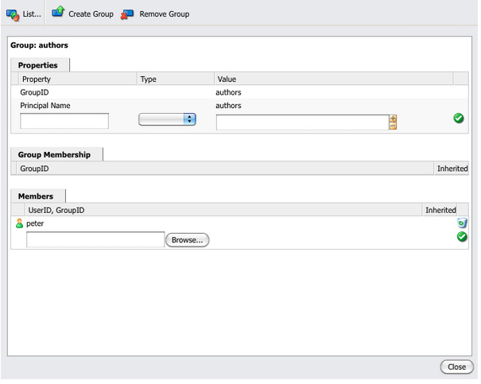

# 使用者、群組和存取權管理{#user-group-and-access-rights-administration}

啟用CRX存放庫的存取權涉及幾個主題：

* [存取許可權](#how-access-rights-are-evaluated) — 如何定義和評估這些許可權的概念
* [使用者管理](#user-administration) — 管理用於存取的個別帳戶
* [群組管理](#group-administration) — 透過組成群組來簡化使用者管理
* [存取許可權管理](#access-right-management) — 定義原則來控制這些使用者和群組存取資源的方式

基本元素包括：

**使用者帳戶** - CRX會根據使用者帳戶中的詳細資料，識別並驗證使用者（由該人員或其他應用程式），以驗證存取權。

在CRX中，每個使用者帳戶都是工作區中的一個節點。 CRX使用者帳戶具有下列屬性：

* 它代表CRX的一名使用者。
* 它包含使用者名稱和密碼。
* 適用於該工作區。
* 它不能有子使用者。 若要使用階層式存取許可權，您應該使用群組。

* 您可以指定使用者帳戶的存取許可權。

  不過，為了簡化管理，Adobe建議（大多數情況下）您指派存取權給群組帳戶。 為每個個別使用者指派存取許可權會迅速變得難以管理（只有一或兩個執行個體存在時，某些系統使用者是例外）。

**群組帳戶** — 群組帳戶是使用者和/或其他群組的集合。 當指派給群組的存取許可權變更自動套用至該群組的所有使用者時，這些可用來簡化管理。 使用者不必屬於任何群組，但通常屬於數個群組。

在CRX中，群組具有以下屬性：

* 它代表一組具有共同存取許可權的使用者。 例如，作者或開發人員。
* 適用於該工作區。
* 它可以有成員；這些成員可以是個別使用者或其他群組。
* 使用成員關係可以實現階層式分組。 您不能將群組直接放在存放庫中另一個群組的下方。
* 您可以定義所有群組成員的存取許可權。

**存取許可權** - CRX會使用存取許可權來控制對存放庫特定區域的存取。

若要這麼做，請將許可權指派給允許或拒絕存取存放庫中的資源（節點或路徑）。 由於可以指派各種許可權，因此必須評估這些許可權，以判斷哪個組合適用於目前的請求。

CRX可讓您設定使用者和群組帳戶的存取權。 然後會將相同的基本評估原則套用至兩者。

## 存取許可權評估方式 {#how-access-rights-are-evaluated}

>[!NOTE]
>
>CRX實作由JSR-283[&#128279;](https://developer.adobe.com/experience-manager/reference-materials/spec/jcr/2.0/16_Access_Control_Management.html)定義的存取控制。
>
>CRX存放庫的標準安裝設定為使用資源型存取控制清單。 這是JSR-283存取控制的一個可能實作，也是Jackrabbit提供的實作之一。

### 主體和主體 {#subjects-and-principals}

CRX在評估存取權時會使用兩個重要概念：

* **主體**&#x200B;是具有存取許可權的實體。 主要專案包括：

   * 使用者帳戶
   * 群組帳戶

     如果使用者帳戶屬於一或多個群組，它也會與每個群組主參與者相關聯。

* **主旨**&#x200B;是用來表示要求的來源。

  它可用來合併適用於該請求的存取權。 這些擷取自：

   * 使用者主體

     您直接指派給使用者帳戶的許可權。

   * 與該使用者相關聯的所有群組主體

     所有許可權都會指派給使用者所屬的任何群組。

  然後會使用結果來允許或拒絕存取要求的資源。

#### 編譯主體的存取權清單 {#compiling-the-list-of-access-rights-for-a-subject}

在CRX中，主題取決於：

* 使用者主體
* 與該使用者相關聯的所有群組主體

適用於主體的存取權清單由以下內容建構：

* 您直接指派給使用者帳戶的許可權
* 加上指派給使用者所屬任何群組的所有權利


>[!NOTE]
>
>* CRX在編譯清單時，不會將任何使用者階層列入考量。
>* CRX只會在您將群組加入為其他群組成員時使用群組階層。 群組許可權沒有自動繼承。
>* 您指定群組的順序不會影響存取權。
>

### 解決請求和存取許可權 {#resolving-request-and-access-rights}

CRX處理要求時，會比較主旨的存取要求與存放庫節點上的存取控制清單：

因此，如果Linda要求更新下列存放庫結構中的`/features`節點：


### 優先順序 {#order-of-precedence}

CRX中的存取權評估如下：

* 使用者主參與者一律優先於群組主參與者，不論：

   * 它們在存取控制清單中的順序
   * 其在節點階層中的位置

* 對於指定的主體，指定節點上最多有一個「拒絕」和「允許」專案。 實作一律會清除多餘的專案，並確保允許和拒絕專案中未列出相同的許可權。

>[!NOTE]
>
>此評估程式適用於標準CRX安裝的資源型存取控制。

舉兩個使用者`aUser`是群組`aGroup`成員的範例：

```xml
   + parentNode
     + acl
       + ace: aUser - deny - write
     + childNode
       + acl
         + ace: aGroup - allow - write
       + grandChildNode
```

在上述案例中：

* 未授予`aUser`對`grandChildNode`的寫入許可權。

```xml
   + parentNode
     + acl
       + ace: aUser - deny - write
     + childNode
       + acl
         + ace: aGroup - allow - write
         + ace: aUser - deny - write
       + grandChildNode
```

在此案例中：

* 未授予`aUser`對`grandChildNode`的寫入許可權。
* `aUser`的第二個ACE是多餘的。

系統會根據多群組主體的順序，在階層內和單一存取控制清單中，評估來自多群組主體的存取權。

### 最佳做法 {#best-practices}

下表列出一些建議和最佳實務：

<table>
 <tbody>
  <tr>
   <td>建議……</td>
   <td>原因……</td>
  </tr>
  <tr>
   <td><i>使用群組</i></td>
   <td><p>避免依個別使用者指派存取許可權。 原因有幾個：</p>
    <ul>
     <li>您擁有的使用者比群組多，因此群組可簡化結構。</li>
     <li>群組有助於提供所有帳戶的概觀。</li>
     <li>使用群組可簡化繼承作業。</li>
     <li>使用者來了又走。 群組是長期的。</li>
    </ul> </td>
  </tr>
  <tr>
   <td><i>正面</i></td>
   <td><p>請一律使用Allow陳述式來指定群組主體的存取許可權（儘可能使用）。 避免使用Deny陳述式。</p> <p>群組主體會以順序評估，包括階層內的和單一存取控制清單內的順序。</p> </td>
  </tr>
  <tr>
   <td><i>保持簡單</i></td>
   <td><p>在設定新安裝時投入一些時間和思考，是很好的回報。</p> <p>套用清晰的結構可簡化持續的維護和管理，確保您目前的同事和/或未來的後續人員都能輕鬆瞭解正在實作的內容。</p> </td>
  </tr>
  <tr>
   <td><i>測試</i></td>
   <td>使用測試安裝來練習並確保您瞭解各種使用者和群組之間的關係。</td>
  </tr>
  <tr>
   <td><i>預設使用者/群組</i></td>
   <td>務必在安裝後立即更新「預設使用者與群組」，以防止任何安全性問題。</td>
  </tr>
 </tbody>
</table>

## 使用者管理 {#user-administration}

標準對話方塊用於&#x200B;**使用者管理**。

您必須登入適當的工作區，才能從以下兩個位置存取對話方塊：

* CRX主控台上的&#x200B;**使用者管理**&#x200B;連結
* CRX Explorer的&#x200B;**安全性**&#x200B;功能表


**屬性**

* **使用者ID**

  存取CRX時會使用帳戶的簡短名稱。

* **主體名稱**

  帳戶的全文名稱。

* **密碼**

  使用此帳戶存取CRX時需要。

* **ntlmhash**

  自動指派給每個新帳戶，並在密碼變更時更新。

* 您可以定義名稱、型別和值，以新增屬性。 按一下每個新屬性的「儲存」（綠色勾號符號）。

**群組成員資格**

這會顯示帳戶所屬的所有群組。 「已繼承」欄表示由於另一個群組的成員資格而繼承的成員資格。

按一下GroupID （可用時）會開啟該群組的[群組管理](#group-administration)。

**模擬者**

透過模擬功能，使用者可以代表其他使用者工作。

這表示使用者帳戶可以指定可以與其帳戶一起操作的其他帳戶（使用者或群組）。 換言之，如果允許使用者B模擬使用者A，則使用者B可以使用使用者A的完整帳戶詳細資訊（包括ID、名稱和存取許可權）來採取行動。

這可讓模擬者帳戶完成工作，就好像他們正使用自己所模擬的帳戶一樣；例如，在缺勤期間，或是在短期共用過多負載。

如果帳戶模擬其他帳戶，就很難檢視。 記錄檔不會保留事件上已發生模擬的資訊。 因此，如果使用者B模擬使用者A，所有事件看起來都像是使用者A個人執行的。

### 建立使用者帳戶 {#creating-a-user-account}

1. 開啟&#x200B;**使用者管理**&#x200B;對話方塊。
1. 按一下&#x200B;**建立使用者**。
1. 然後，您可以輸入「屬性」：

   * **使用者ID**&#x200B;已用作帳戶名稱。
   * 登入時需要&#x200B;**密碼**。
   * **主體名稱**，以提供完整的文字名稱。
   * **中繼路徑**，可用來形成樹狀結構。

1. 按一下「儲存」（綠色勾號符號）。
1. 此對話方塊會展開，以便您執行下列動作：

   1. 設定&#x200B;**屬性**。
   1. 請參閱&#x200B;**群組成員資格**。
   1. 定義&#x200B;**模擬者**。

>[!NOTE]
>
>在同時擁有大量下列專案的安裝中註冊新使用者時，有時會導致效能損失：
>
>* 個使用者
>* 有許多成員的群組
>

### 更新使用者帳戶 {#updating-a-user-account}

1. 透過&#x200B;**使用者管理**&#x200B;對話方塊，開啟所有帳戶的清單檢視。
1. 瀏覽樹狀結構。
1. 按一下所需的帳戶，以便您可以開啟帳戶進行編輯。
1. 進行變更，然後按一下該專案的「儲存」（綠色勾號符號）。
1. 按一下&#x200B;**關閉**&#x200B;完成，或按一下&#x200B;**清單……**&#x200B;返回所有使用者帳戶的清單。

### 移除使用者帳戶 {#removing-a-user-account}

1. 透過&#x200B;**使用者管理**&#x200B;對話方塊，開啟所有帳戶的清單檢視。
1. 瀏覽樹狀結構。
1. 選取所需的帳戶，然後按一下&#x200B;**移除使用者**；帳戶會立即刪除。

>[!NOTE]
>
>這會將這個主體的節點從存放庫中移除。
>
>不會移除存取許可權專案。 這可確保歷史完整性。

### 定義屬性 {#defining-properties}

您可以為新帳戶或現有帳戶定義&#x200B;**屬性**：

1. 開啟適當帳戶的&#x200B;**使用者管理**&#x200B;對話方塊。
1. 定義&#x200B;**屬性**&#x200B;名稱。
1. 從下拉式清單中選取&#x200B;**型別**。
1. 定義&#x200B;**值**。
1. 按一下新屬性的「儲存」(Save) （綠色的按一下符號）。

現有屬性可使用垃圾桶符號刪除。

除了密碼之外，屬性無法編輯，必須刪除並重新建立。

#### 變更密碼 {#changing-the-password}

**密碼**&#x200B;是特殊屬性，按一下&#x200B;**變更密碼**&#x200B;連結即可變更。

您也可以從CRX Explorer的&#x200B;**安全性**&#x200B;功能表，將密碼變更為您自己的使用者帳戶。

### 定義模擬者 {#defining-an-impersonator}

您可以為新帳戶或現有帳戶定義「模擬者」：

1. 開啟適當帳戶的&#x200B;**使用者管理**&#x200B;對話方塊。
1. 指定要允許模擬該帳戶的帳戶。

   您可以使用「瀏覽……」來選取現有帳戶。

1. 按一下新屬性的「儲存」（綠色勾號符號）。

## 群組管理 {#group-administration}

標準對話方塊用於&#x200B;**群組管理**。

您必須登入適當的工作區，才能從以下兩個位置存取對話方塊：

* CRX主控台上的&#x200B;**群組管理**&#x200B;連結
* CRX Explorer的&#x200B;**安全性**&#x200B;功能表



**屬性**

* **群組識別碼**

  群組帳戶的簡短名稱。

* **主體名稱**

  群組帳戶的全文名稱。

* 您可以定義名稱、型別和值，以新增屬性。 按一下每個新屬性的「儲存」（綠色勾號符號）。

* **成員**

  您可以將使用者或其他群組新增為此群組的成員。

**群組成員資格**

這會顯示目前群組帳戶所屬的所有群組。 「已繼承」欄表示由於另一個群組的成員資格而繼承的成員資格。

按一下GroupID可開啟該群組的對話方塊。

**成員**

列出屬於目前群組成員的所有帳戶（使用者和/或群組）。

**Inherited**&#x200B;資料行指出由於其他群組的成員資格而繼承的成員資格。

>[!NOTE]
>
>當所有者、編輯者或檢視者角色指派給任何資產資料夾的使用者時，就會建立新群組。 對於定義角色的每個資料夾，群組名稱的格式為`mac-default-<foldername>`。

### 建立群組帳戶 {#creating-a-group-account}

1. 開啟&#x200B;**群組管理**&#x200B;對話方塊。
1. 按一下&#x200B;**建立群組**。
1. 然後，您可以輸入「屬性」：

   * **主體名稱**，以提供完整的文字名稱。
   * **中繼路徑**，可用來形成樹狀結構。

1. 按一下「儲存」（綠色勾號符號）。
1. 此對話方塊會展開，您可以：

   1. 設定&#x200B;**屬性**。
   1. 請參閱&#x200B;**群組成員資格**。
   1. 管理&#x200B;**成員**。

### 更新群組帳戶 {#updating-a-group-account}

1. 使用&#x200B;**群組管理**&#x200B;對話方塊，開啟所有帳戶的清單檢視。
1. 瀏覽樹狀結構。
1. 按一下所需的帳戶，以便您可以開啟帳戶進行編輯。
1. 進行變更，然後按一下該專案的「儲存」（綠色勾號符號）。
1. 按一下&#x200B;**關閉**&#x200B;完成，或按一下&#x200B;**清單……**&#x200B;返回所有群組帳戶的清單。

### 移除群組帳戶 {#removing-a-group-account}

1. 使用&#x200B;**群組管理**&#x200B;對話方塊，開啟所有帳戶的清單檢視。
1. 瀏覽樹狀結構。
1. 選取所需的帳戶，然後按一下&#x200B;**移除群組**；帳戶會立即刪除。

>[!NOTE]
>
>這會將這個主體的節點從存放庫中移除。
>
>不會移除存取許可權專案。 這可確保歷史完整性。

### 定義屬性 {#defining-properties-1}

您可以為新帳戶或現有帳戶定義屬性：

1. 開啟適當帳戶的&#x200B;**群組管理**&#x200B;對話方塊。
1. 定義&#x200B;**屬性**&#x200B;名稱。
1. 從下拉式清單中選取&#x200B;**型別**。
1. 定義&#x200B;**值**。
1. 按一下新屬性的「儲存」（綠色勾號符號）。

現有屬性可使用垃圾桶符號刪除。

### 成員 {#members}

您可以將成員新增至目前群組：

1. 開啟適當帳戶的&#x200B;**群組管理**&#x200B;對話方塊。
1. 可以：

   * 輸入所需成員的名稱（使用者或群組帳戶）。
   * 或使用&#x200B;**瀏覽……**&#x200B;來搜尋並選取您要新增的主體（使用者或群組帳戶）。

1. 按一下新屬性的「儲存」（綠色勾號符號）。

或刪除具有垃圾桶符號的現有成員。

## 存取許可權管理 {#access-right-management}

使用CRXDE Lite的&#x200B;**存取控制**&#x200B;標籤，您可以定義存取控制原則並指派相關許可權。

例如，對於&#x200B;**目前路徑**，在左窗格中選取所需的資源，在右下窗格中選取[存取控制]索引標籤：


原則會根據下列專案分類：

* **適用的存取控制原則**

  可套用這些原則。

  這些是可建立本機原則的原則。 當您選取並新增適用原則時，它就會變成本機原則。

* **本機存取控制原則**

  這些是您已套用的存取控制原則。 然後，您可以更新、排序或移除這些專案。

  本機原則會覆寫從父項繼承的任何原則。

* **有效的存取控制原則**

  這些存取控制原則現在適用於任何存取請求。 它們會顯示衍生自本機原則以及從父項繼承的任何彙總原則。

### 原則選擇 {#policy-selection}

可以為以下專案選取原則：

* **目前路徑**

  如上述範例所示，在存放庫中選取資源。 此時會顯示此「目前路徑」的原則。

* **存放庫**

  選取存放庫層級存取控制。 例如，設定`jcr:namespaceManagement`許可權時，該許可權只與存放庫有關，與節點無關。

* **主體**

  在存放庫中註冊的主體。

  您可以輸入&#x200B;**主體**&#x200B;名稱，或按一下欄位右側的圖示以開啟&#x200B;**選取主體**&#x200B;對話方塊。

  這可讓您&#x200B;**搜尋**&#x200B;使用者&#x200B;**或**&#x200B;群組&#x200B;**的**。 從結果清單中選取所需的主體，然後按一下[確定] **&#x200B;**，將該值帶回上一個對話方塊。


>[!NOTE]
>
>若要簡化管理Adobe，建議您將存取權指派給群組帳戶，而非個別使用者帳戶。
>
>管理幾個群組比管理許多使用者帳戶更容易。

### 權限 {#privileges}

新增存取控制專案時，可以選取下列許可權（如需完整詳細資訊，請參閱[安全性API](https://developer.adobe.com/experience-manager/reference-materials/spec/javax.jcr/javadocs/jcr-2.0/javax/jcr/security/Privilege.html)）：

<table>
 <tbody>
  <tr>
   <th><strong>許可權名稱</strong></th>
   <th><strong>控制許可權的……</strong></th>
  </tr>
  <tr>
   <td><code>jcr:read</code></td>
   <td>擷取節點並讀取其屬性及其值。</td>
  </tr>
  <tr>
   <td><code>rep:write</code></td>
   <td>這是jcr：write和jcr：nodeTypeManagement的Jackrabbit特定彙總許可權。<br /> </td>
  </tr>
  <tr>
   <td><code>jcr:all</code></td>
   <td>這是包含所有其他預先定義許可權的彙總許可權。</td>
  </tr>
  <tr>
   <td><strong>進階</strong></td>
   <td> </td>
  </tr>
  <tr>
   <td><code>crx:replicate</code></td>
   <td>執行節點的復寫。</td>
  </tr>
  <tr>
   <td><code>jcr:addChildNodes</code></td>
   <td>建立節點的子節點。</td>
  </tr>
  <tr>
   <td><code>jcr:lifecycleManagement</code></td>
   <td>在節點上執行生命週期作業。</td>
  </tr>
  <tr>
   <td><code>jcr:lockManagement</code></td>
   <td>鎖定並解除鎖定節點；請重新整理鎖定。</td>
  </tr>
  <tr>
   <td><code>jcr:modifyAccessControl</code></td>
   <td>修改節點的存取控制原則。</td>
  </tr>
  <tr>
   <td><code>jcr:modifyProperties</code></td>
   <td>建立、修改和移除節點的屬性。</td>
  </tr>
  <tr>
   <td><code>jcr:namespaceManagement</code></td>
   <td>註冊、取消註冊和修改名稱空間定義。</td>
  </tr>
  <tr>
   <td><code>jcr:nodeTypeDefinitionManagement</code></td>
   <td>將節點型別定義匯入存放庫。</td>
  </tr>
  <tr>
   <td><code>jcr:nodeTypeManagement</code></td>
   <td>新增和移除mixin節點型別，並變更節點的主要節點型別。 這也包括對Node.addNode和XML匯入方法的任何呼叫，其中會明確指定新節點的mixin或主要型別。</td>
  </tr>
  <tr>
   <td><code>jcr:readAccessControl</code></td>
   <td>讀取節點的存取控制原則。</td>
  </tr>
  <tr>
   <td><code>jcr:removeChildNodes</code></td>
   <td>移除節點的子節點。</td>
  </tr>
  <tr>
   <td><code>jcr:removeNode</code></td>
   <td>移除節點。</td>
  </tr>
  <tr>
   <td><code>jcr:retentionManagement</code></td>
   <td>在節點上執行保留管理作業。</td>
  </tr>
  <tr>
   <td><code>jcr:versionManagement</code></td>
   <td>在節點上執行版本設定作業。</td>
  </tr>
  <tr>
   <td><code>jcr:workspaceManagement</code></td>
   <td>透過JCR API建立及刪除工作區。</td>
  </tr>
  <tr>
   <td><code>jcr:write</code></td>
   <td>這是包含：<br /> - jcr：modifyProperties<br /> - jcr：addChildNodes<br /> - jcr：removeNode<br /> - jcr：removeChildNodes的彙總許可權</td>
  </tr>
  <tr>
   <td><code>rep:privilegeManagement</code></td>
   <td>註冊新的許可權。</td>
  </tr>
 </tbody>
</table>

### 註冊新許可權 {#registering-new-privileges}

您也可以註冊新許可權：

1. 從工具列中選取&#x200B;**工具**，然後選取&#x200B;**許可權**，以顯示目前登入的許可權。

   

1. 使用&#x200B;**登入許可權**&#x200B;圖示(**+**)以定義許可權：

   

1. 按一下&#x200B;**確定**&#x200B;以儲存。 此許可權現在可供選取。

### 新增存取控制專案 {#adding-an-access-control-entry}

1. 選取您的資源，並開啟&#x200B;**存取控制**&#x200B;標籤。

1. 若要新增新的&#x200B;**本機存取控制原則**，請按一下&#x200B;**適用的存取控制原則**&#x200B;清單右側的&#x200B;**+**&#x200B;圖示：

   

1. 新專案出現在&#x200B;**本機存取控制原則：**&#x200B;下

   

1. 按一下&#x200B;**+**&#x200B;圖示以新增專案：

   

   >[!NOTE]
   >
   >目前需要因應措施，才能指定空字串。
   >
   >為此，您必須使用`""`。

1. 定義您的存取控制原則，然後按一下[確定] **儲存。**&#x200B;您的新原則為：

   * 列在&#x200B;**本機存取控制原則**&#x200B;下
   * 變更會反映在&#x200B;**有效的存取控制原則**&#x200B;中。

CRX會驗證您的選取專案；指定主體上（最多）有一個拒絕專案，以及一個允許專案。 實作一律會清除多餘的專案，並確保允許和拒絕專案中未列出相同的許可權。

### 排序本機存取控制原則 {#ordering-local-access-control-policies}

清單中的順序表示套用原則的順序。

1. 在&#x200B;**本機存取控制原則**&#x200B;的表格中，選取必要的專案，並將其拖曳到表格中的新位置。

   

1. 變更會同時顯示在&#x200B;**Local**&#x200B;和&#x200B;**有效存取控制原則**&#x200B;的表格中。

### 移除存取控制原則 {#removing-an-access-control-policy}

1. 在&#x200B;**本機存取控制原則**&#x200B;的表格中，按一下專案右側的紅色圖示(-)。
1. 此專案會從&#x200B;**Local**&#x200B;和&#x200B;**有效存取控制原則**&#x200B;的資料表中移除。

### 測試存取控制原則 {#testing-an-access-control-policy}

1. 從CRXDE Lite工具列中選取&#x200B;**工具**，然後選取&#x200B;**測試存取控制……**。
1. 新的對話方塊會在右上角窗格中開啟。 選取您要測試的&#x200B;**路徑**&#x200B;和/或&#x200B;**主體**。
1. 按一下&#x200B;**測試**&#x200B;以檢視您選取範圍的結果：

   
