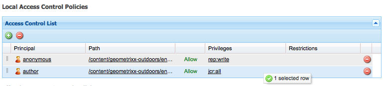

# 用戶、組和訪問權限管理{#user-group-and-access-rights-administration}

啟用對CRX儲存庫的訪問涉及以下幾個主題：

* [Access Rights](#how-access-rights-are-evaluated) —— 定義和評估這些權限的概念
* [使用者管理](#user-administration) -管理用於存取的個別帳戶
* [群組管理](#group-administration) -透過組成群組簡化使用者管理
* [存取權限管理](#access-right-management) -定義可控制這些使用者和群組存取資源的原則

基本要素包括：

**User Accounts** CRX根據使用者帳戶中的詳細資訊，識別並驗證使用者（由該人或其他應用程式），以驗證存取權。

在CRX中，每個使用者帳戶都是工作區中的節點。 CRX使用者帳戶具有下列屬性：

* 它代表CRX的一位使用者。
* 它包含用戶名和密碼。
* 適用於該工作區。
* 它不能有子用戶。 對於分層訪問權限，您應使用組。

* 您可以指定使用者帳戶的存取權限。

   不過，為簡化管理，我們建議您（在大部分情況下）將存取權指派給群組帳戶。 為每個個別使用者指派存取權限變得很難管理（只有一或兩個例項時，某些系統使用者例外）。

**「群組帳戶** 」群組帳戶是使用者和／或其他群組的集合。 當指派給群組的存取權限變更自動套用至該群組中的所有使用者時，這些變更可用來簡化管理。 使用者不必屬於任何群組，但通常屬於數個群組。

在CRX中，組具有以下屬性：

* 它代表一組具有共同存取權限的使用者。 例如，作者或開發人員。
* 適用於該工作區。
* 它可以有成員；這些群組可以是個別使用者或其他群組。
* 通過成員關係可以實現分層分組。 不能將組直接放在儲存庫中的另一個組下方。
* 您可以定義所有群組成員的存取權限。

**訪問權限** CRX使用訪問權限來控制對儲存庫特定區域的訪問。

通過為儲存庫中的資源（節點或路徑）分配允許或拒絕訪問權限來完成此操作。 由於可以指派各種權限，因此必須評估這些權限，以決定哪一種組合適用於目前的請求。

CRX允許您配置用戶和組帳戶的訪問權限。 然後，評估的基本原則也適用於兩者。

## 如何評估訪問權限 {#how-access-rights-are-evaluated}

>[!NOTE]
>
>CRX實現 [JSR-283定義的訪問控制](https://docs.adobe.com/content/docs/en/spec/jcr/2.0/16_Access_Control_Management.html)。
>
>CRX儲存庫的標準安裝配置為使用基於資源的訪問控制清單。 這是JSR-283訪問控制的一個可能實現以及Jackrabbit的一個實現。

### 主體與主體 {#subjects-and-principals}

CRX在評估訪問權限時使用兩個關鍵概念：

* 承 **擔者** ，是指擁有存取權的實體。 承擔者包括：

   * 使用者帳戶
   * 群組帳戶

      如果用戶帳戶屬於一個或多個，則其也與這些組承擔者中的每個組相關聯。

* 主 **體** ，用來代表請求來源。

   它用於合併該請求適用的訪問權限。 這些來自：

   * 用戶主體

      您直接指派給使用者帳戶的權限。

   * 與該用戶關聯的所有承擔者組

      分配給用戶所屬任何組的所有權限。
   然後，結果將用於允許或拒絕對所請求資源的訪問。

#### 編譯主體的訪問權限清單 {#compiling-the-list-of-access-rights-for-a-subject}

在CRX中，主題取決於：

* 用戶主體
* 與該用戶關聯的所有組承擔者

適用於主題的訪問權限清單由以下內容構成：

* 您直接指派給使用者帳戶的權限
* 加上指派給使用者所屬任何群組的所有權限


>[!NOTE]
>
>* CRX編譯清單時，不會考慮任何使用者階層。
>* CRX僅在將群組納入為其他群組的成員時使用群組階層。 群組權限沒有自動繼承。
>* 您指定群組的順序不會影響存取權限。
>


### 解決請求和訪問權限 {#resolving-request-and-access-rights}

當CRX處理請求時，它會將來自主題的訪問請求與儲存庫節點上的訪問控制清單進行比較：

因此，如果Linda請求在以下儲存庫 `/features` 結構中更新節點：


### 優先順序 {#order-of-precedence}

CRX中的訪問權限評估如下：

* 用戶承擔者始終優先於組承擔者，而不考慮：

   * 他們在訪問控制清單中的順序
   * 在節點層次中的位置

* 對於給定的承擔者，在給定節點上最多存在1個拒絕和1個允許條目。 實作一律會清除冗餘項目，並確保允許和拒絕項目中未列出相同的權限。

>[!NOTE]
>
>此評估過程適用於標準CRX安裝的基於資源的訪問控制。

舉兩個使用者為 `aUser` 群組成員的範例 `aGroup`:

```xml
   + parentNode
     + acl
       + ace: aUser - deny - write
     + childNode
       + acl
         + ace: aGroup - allow - write
       + grandChildNode
```

在上述情況下：

* `aUser` 未授予對的寫權限 `grandChildNode`。

```xml
   + parentNode
     + acl
       + ace: aUser - deny - write
     + childNode
       + acl
         + ace: aGroup - allow - write
         + ace: aUser - deny - write
       + grandChildNode
```

在本例中：

* `aUser` 未授予對的寫權限 `grandChildNode`。
* 第二個ACE是 `aUser` 冗餘的。

多個組承擔者的訪問權限將根據其順序進行評估，包括層次內和單個訪問控制清單中的順序。

### Best Practices {#best-practices}

下表列出一些建議和最佳實務：

<table>
 <tbody>
  <tr>
   <td>建議……</td>
   <td>原因...</td>
  </tr>
  <tr>
   <td><i>使用群組</i></td>
   <td><p>避免依使用者指派存取權限。 原因有幾：</p>
    <ul>
     <li>您的使用者比群組多，因此群組可簡化結構。</li>
     <li>群組可協助提供所有帳戶的概觀。</li>
     <li>對於群組，繼承更簡單。</li>
     <li>使用者來來去。 群體是長期的。</li>
    </ul> </td>
  </tr>
  <tr>
   <td><i>積極</i></td>
   <td><p>請始終使用「允許」語句來指定組承擔者的訪問權限（盡可能）。 避免使用Deny語句。</p> <p>評估組承擔者的順序是在層次和單個訪問控制清單中按順序進行的。</p> </td>
  </tr>
  <tr>
   <td><i>保持簡單</i></td>
   <td><p>在配置新安裝時投入一些時間和思考，將獲得很好的回報。</p> <p>套用清楚的結構可簡化持續的維護與管理，確保您目前的同事和／或未來的繼任者都能輕鬆瞭解正在實施的內容。</p> </td>
  </tr>
  <tr>
   <td><i>測試</i></td>
   <td>使用測試安裝來練習並確保您瞭解不同使用者和群組之間的關係。</td>
  </tr>
  <tr>
   <td><i>預設使用者／群組</i></td>
   <td>安裝後請立即更新預設使用者和群組，協助避免任何安全性問題。</td>
  </tr>
 </tbody>
</table>

## 使用者管理 {#user-administration}

「使用者管理」會使用標準 **對話方塊**。

您必須登入適當的工作區，然後您就可以從以下兩者存取對話方塊：

* CRX主 **控台上的** 「用戶管理」連結
* CRX **Explorer的** 「安全性」(Security)菜單


**屬性**

* **UserID**

   帳戶的簡短名稱，用於存取CRX。

* **承擔者名稱**

   帳戶的全文名稱。

* **密碼**

   使用此帳戶存取CRX時需要。

* **ntlmhash**

   自動為每個新帳戶指派，並在密碼變更時更新。

* 您可以定義名稱、類型和值，以新增屬性。 對每個新屬性按一下「儲存（綠色勾選符號）」。

**群組會籍**

這會顯示帳戶所屬的所有群組。 「繼承」(Inherited)清單示已繼承的成員資格是另一個組的成員資格的結果。

按一下GroupID（若有）將會開啟該群 [組的Group](#group-administration) Administration。

**Impersonator**

使用模擬功能，使用者可以代表其他使用者工作。

這表示使用者帳戶可以指定其他帳戶（使用者或群組），以便與其帳戶一起運作。 換言之，如果允許user-B模擬使用者-A，則user-B可使用user-A的完整帳戶詳細資訊（包括ID、名稱和存取權限）採取動作。

這可讓模擬帳戶完成工作，就像使用其模擬的帳戶；例如，在缺勤期間或在短期內共用過多負荷。

如果某個帳戶冒充其他帳戶，就很難看到。 日誌檔案不包含事件上發生冒用的相關資訊。 因此，如果user-B模擬使用者- a所有事件看起來都像是使用者- a個人執行的。

### 建立使用者帳戶 {#creating-a-user-account}

1. 開啟「使 **用者管理** 」對話方塊。
1. 按一 **下「建立使用者**」。
1. 然後，您可以輸入「屬性：

   * **UserID** ，用作帳戶名稱。
   * **登入時** ，需要使用密碼。
   * **承擔者名稱** ，以提供完整的文字名稱。
   * **中間路徑** ，可用於形成樹結構。

1. 按一下「儲存（綠色勾選符號）」。
1. 對話方塊將會展開，您可以：

   1. 設定 **屬性**。
   1. 請參 **閱群組會籍**。
   1. 定義 **模擬**。

>[!NOTE]
>
>在安裝中註冊新用戶時，有時會出現效能下降的情況，這些用戶的數量很多：
>
>* 個使用者
>* 具有多個成員的組
>


### 更新使用者帳戶 {#updating-a-user-account}

1. 使用「用 **戶管理** 」對話框開啟所有帳戶的清單視圖。
1. 瀏覽樹結構。
1. 按一下要開啟以進行編輯的必要帳戶。
1. 進行變更，然後按一下該項目的「儲存（綠色勾號）」。
1. **按一**&#x200B;下「關閉&#x200B;**」以完成，或按**&#x200B;一下「清單……」返回所有用戶帳戶的清單。

### 移除使用者帳戶 {#removing-a-user-account}

1. 使用「用 **戶管理** 」對話框開啟所有帳戶的清單視圖。
1. 瀏覽樹結構。
1. 選取所需帳戶，然後按一下「 **移除使用者**;帳戶將立即刪除。

>[!NOTE]
>
>這會從儲存庫中刪除此承擔者的節點。
>
>未移除存取權限項目。 這確保了歷史的完整性。

### 定義屬性 {#defining-properties}

您可以為新 **帳戶** 或現有帳戶定義屬性：

1. 開啟適 **當帳戶的** 「使用者管理」對話方塊。
1. 定義屬 **性** 名稱。
1. 從下 **拉式清單** 中選取「類型」。
1. 定義 **值**。
1. 按一下新屬性的「儲存（綠色按一下符號）」。

可使用垃圾筒符號刪除現有屬性。

除了「密碼」外，屬性無法編輯，必須刪除並重新建立。

#### 更改密碼 {#changing-the-password}

Password **** 是特殊屬性，可以按一下「變更密碼」連 **結來變更** 。

您也可以從CRX檔案總管的「安全性」功能表，將密碼變 **更為您自己的使用者帳戶** 。

### 定義模擬者 {#defining-an-impersonator}

您可以為新帳戶或現有帳戶定義模擬器：

1. 開啟適 **當帳戶的** 「使用者管理」對話方塊。
1. 指定允許模擬該帳戶的帳戶。

   您可以使用瀏覽……來選擇現有帳戶。

1. 按一下新屬性的「儲存（綠色勾選符號）」。

## 群組管理 {#group-administration}

「群組管理」會使用標準 **對話方塊**。

您必須登入適當的工作區，然後您就可以從以下兩者存取對話方塊：

* CRX主 **控台上的** 「組管理」連結
* CRX **Explorer的** 「安全性」(Security)菜單


**屬性**

* **群組ID**

   群組帳戶的簡短名稱。

* **承擔者名稱**

   群組帳戶的完整文字名稱。

* 您可以定義名稱、類型和值，以新增屬性。 對每個新屬性按一下「儲存（綠色勾選符號）」。

* **成員**

   您可以新增使用者或其他群組作為此群組的成員。

**群組會籍**

這會顯示目前群組帳戶所屬的所有群組。 「繼承」(Inherited)清單示已繼承的成員資格是另一個組的成員資格的結果。

按一下GroupID會開啟該群組的對話方塊。

**成員**

列出屬於當前組成員的所有帳戶（用戶和／或組）。

「繼 **承的** 」清單示由於其他組的成員資格而繼承的成員資格。

>[!NOTE]
>
>在任何「資產」檔案夾中，將「擁有者」、「編輯者」或「檢視器」角色指派給使用者時，會建立新群組。 組名稱的格式為定義角 `mac-default-<foldername>` 色的每個資料夾。

### 建立群組帳戶 {#creating-a-group-account}

1. 開啟「群 **組管理** 」對話方塊。
1. 按一 **下建立群組**。
1. 然後，您可以輸入「屬性：

   * **承擔者名稱** ，以提供完整的文字名稱。
   * **中間路徑** ，可用於形成樹結構。

1. 按一下「儲存（綠色勾選符號）」。
1. 對話方塊將會展開，您可以：

   1. 設定 **屬性**。
   1. 請參 **閱群組會籍**。
   1. 管理 **成員**。

### 更新群組帳戶 {#updating-a-group-account}

1. 使用「 **群組管理** 」對話方塊，開啟所有帳戶的清單檢視。
1. 瀏覽樹結構。
1. 按一下要開啟以進行編輯的必要帳戶。
1. 進行變更，然後按一下該項目的「儲存（綠色勾號）」。
1. **按一**&#x200B;下「關閉&#x200B;**」以完成，或按**&#x200B;一下「清單……」返回所有組帳戶的清單。

### 移除群組帳戶 {#removing-a-group-account}

1. 使用「 **群組管理** 」對話方塊，開啟所有帳戶的清單檢視。
1. 瀏覽樹結構。
1. 選取所需帳戶，然後按一下「 **移除群組」**;帳戶將立即刪除。

>[!NOTE]
>
>這會從儲存庫中刪除此承擔者的節點。
>
>未移除存取權限項目。 這確保了歷史的完整性。

### 定義屬性 {#defining-properties-1}

您可以定義新帳戶或現有帳戶的屬性：

1. 開啟適 **當帳戶的「群組管理** 」對話方塊。
1. 定義屬 **性** 名稱。
1. 從下 **拉式清單** 中選取「類型」。
1. 定義 **值**。
1. 按一下新屬性的「儲存（綠色勾選符號）」。

可使用垃圾筒符號刪除現有屬性。

### 成員 {#members}

您可以將成員添加到當前組：

1. 開啟適 **當帳戶的「群組管理** 」對話方塊。
1. 其中之一：

   * 輸入所需成員（用戶或組帳戶）的名稱。
   * **或者，使**&#x200B;用瀏覽……要搜索並選擇要添加的承擔者（用戶或組帳戶）。

1. 按一下新屬性的「儲存（綠色勾選符號）」。

或者，刪除具有垃圾筒符號的現有成員。

## 存取權限管理 {#access-right-management}

使用CRXDE **Lite的「訪問控制** 」(Access Control)頁籤，您可以定義訪問控制策略並分配相關權限。

例如，對於「當 **前路徑** 」，請在左窗格中選擇所需資源，右下窗格中的「訪問控制」頁籤：


策略按照以下方式分類：

* **適用的訪問控制策略**

   可以應用這些策略。

   這些策略可用於建立本地策略。 一旦您選擇並新增適用的原則後，它就會變成本機原則。

* **本機存取控制政策**

   這些是您已套用的存取控制原則。 然後您就可以更新、訂購或移除這些項目。

   本地策略將覆蓋從父項繼承的所有策略。

* **生效的存取控制政策**

   這些是訪問控制策略，現在對任何訪問請求都有效。 它們顯示從本地策略和從父級繼承的任何策略派生的聚合策略。

### 策略選擇 {#policy-selection}

可以為以下對象選擇策略：

* **目前路徑**

   如上例所示，在儲存庫中選擇資源。 將顯示此「當前路徑」的策略。

* **存放庫**

   選擇儲存庫級別訪問控制。 例如，在設定權限時， `jcr:namespaceManagement` 該權限僅與儲存庫相關，而不與節點相關。

* **主體**

   在儲存庫中註冊的承擔者。

   可鍵入「承擔者名 **稱** 」(Principal **name)，或按一下欄位右側的表徵圖以開啟「選擇承擔者** 」(Select Principal)對話框。

   這可讓您 **搜尋** 「使 **用者** 」 **或「群組**」。 從結果清單中選擇所需的承擔者，然後按一下「 **確定** 」(OK)將值帶回上一個對話框。


>[!NOTE]
>
>為簡化管理，我們建議您將存取權限指派給群組帳戶，而非個別使用者帳戶。
>
>管理幾個群組比管理許多使用者帳戶更容易。

### 權限 {#privileges}

在新增存取控制項目時，可選擇下列權限(如需完整詳細資訊，請 [參閱Security API](https://docs.adobe.com/docs/en/spec/javax.jcr/javadocs/jcr-2.0/javax/jcr/security/Privilege.html) ):

<table>
 <tbody>
  <tr>
   <th><strong>權限名稱</strong></th>
   <th><strong>它控制著……</strong></th>
  </tr>
  <tr>
   <td><code>jcr:read</code></td>
   <td>檢索節點並讀取其屬性及其值。</td>
  </tr>
  <tr>
   <td><code>rep:write</code></td>
   <td>這是jcr:write和jcr:nodeTypeManagement的Jackrabbit特定集合權限。<br /> </td>
  </tr>
  <tr>
   <td><code>jcr:all</code></td>
   <td>這是包含所有其他預先定義權限的匯總權限。</td>
  </tr>
  <tr>
   <td><strong>進階</strong></td>
   <td> </td>
  </tr>
  <tr>
   <td><code>crx:replicate</code></td>
   <td>執行節點複製。</td>
  </tr>
  <tr>
   <td><code>jcr:addChildNodes</code></td>
   <td>建立節點的子節點。</td>
  </tr>
  <tr>
   <td><code>jcr:lifecycleManagement</code></td>
   <td>在節點上執行生命週期操作。</td>
  </tr>
  <tr>
   <td><code>jcr:lockManagement</code></td>
   <td>鎖定和解鎖節點；刷新鎖。</td>
  </tr>
  <tr>
   <td><code>jcr:modifyAccessControl</code></td>
   <td>修改節點的訪問控制策略。</td>
  </tr>
  <tr>
   <td><code>jcr:modifyProperties</code></td>
   <td>建立、修改和刪除節點的屬性。</td>
  </tr>
  <tr>
   <td><code>jcr:namespaceManagement</code></td>
   <td>註冊、註銷和修改命名空間定義。</td>
  </tr>
  <tr>
   <td><code>jcr:nodeTypeDefinitionManagement</code></td>
   <td>將節點類型定義導入儲存庫。</td>
  </tr>
  <tr>
   <td><code>jcr:nodeTypeManagement</code></td>
   <td>添加和刪除混合節點類型，並更改節點的主節點類型。 這也包括對Node.addNode和XML導入方法的任何調用，其中明確指定了新節點的混合或主類型。</td>
  </tr>
  <tr>
   <td><code>jcr:readAccessControl</code></td>
   <td>閱讀節點的訪問控制策略。</td>
  </tr>
  <tr>
   <td><code>jcr:removeChildNodes</code></td>
   <td>刪除節點的子節點。</td>
  </tr>
  <tr>
   <td><code>jcr:removeNode</code></td>
   <td>刪除節點。</td>
  </tr>
  <tr>
   <td><code>jcr:retentionManagement</code></td>
   <td>在節點上執行保留期管理操作。</td>
  </tr>
  <tr>
   <td><code>jcr:versionManagement</code></td>
   <td>在節點上執行版本控制操作。</td>
  </tr>
  <tr>
   <td><code>jcr:workspaceManagement</code></td>
   <td>透過JCR API建立和刪除工作區。</td>
  </tr>
  <tr>
   <td><code>jcr:write</code></td>
   <td><br /> 這是一種聚合權限，包含：- jcr:modifyProperties<br /> - jcr:addChildNodes<br /> - jcr:removeNode<br /> - jcr:removeChildNodes</td>
  </tr>
  <tr>
   <td><code>rep:privilegeManagement</code></td>
   <td>註冊新權限。</td>
  </tr>
 </tbody>
</table>

### 註冊新權限 {#registering-new-privileges}

您也可以註冊新權限：

1. 從工具列中選 **擇工具**，然 **後選擇權限** ，以顯示當前註冊的權限。

   

1. 使用「注 **冊權限** 」表徵圖(**+**)開啟對話框並定義新權限：

   

1. 按一 **下「確定** 」以儲存。 現在可以選擇此權限。

### 添加訪問控制項 {#adding-an-access-control-entry}

1. 選擇您的資源並開啟「訪 **問控制** 」頁籤。

1. 要添加新的本 **地訪問控制策略**，請按一下「適用訪問控制策略」清單右側的+表徵圖 ******** :

   

1. 新條目會出現在「本機存 **取控制原則」下：**

   

1. 按一下 **+圖示** ，新增新項目：

   

   >[!NOTE]
   >
   >目前需要因應措施來指定空字串。
   >
   >為此，您需要使用「」。

1. 定義您的存取控制原則，然後按一下「 **確定** 」以儲存。 您的新政策將：

   * 列在本機存 **取控制政策下**
   * 這些更改將反映在有效的訪 **問控制策略中**。

CRX將驗證您的選擇；對於給定的承擔者，在給定節點上存在（最多）1個拒絕和1個允許條目。 實作一律會清除冗餘項目，並確保允許和拒絕項目中未列出相同的權限。

### Ordering Local Access Control Policies {#ordering-local-access-control-policies}

清單中的順序指示策略的應用順序。

1. 在本地訪問控制 **策略表中** ，選擇所需條目並將其拖動到表中的新位置。

   

1. 這些更改將同時顯示在本地和有效 **訪問控制****策略的表中**。

### 刪除訪問控制策略 {#removing-an-access-control-policy}

1. 在本地訪問控制 **策略表中** ，按一下條目右側的紅色表徵圖(-)。
1. 該條目將從本地和有效訪問控 **制策略****的表中刪除**。

### 測試訪問控制策略 {#testing-an-access-control-policy}

1. **從CRXDE Lite工具列中，選**&#x200B;擇工具&#x200B;**,**&#x200B;然後選擇測試訪問控制…….
1. 右上方窗格會開啟新的對話方塊。 選擇 **要測試的路徑** 和／或 **承擔者** 。
1. 按一 **下「測試** 」，查看您所選取項目的結果：

   