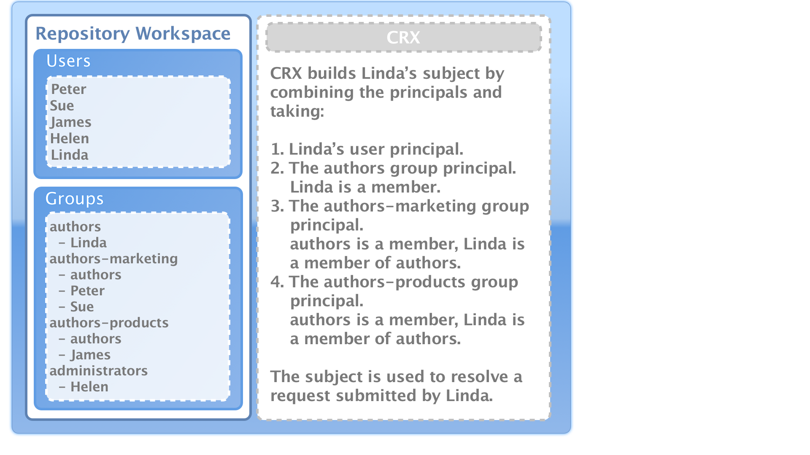
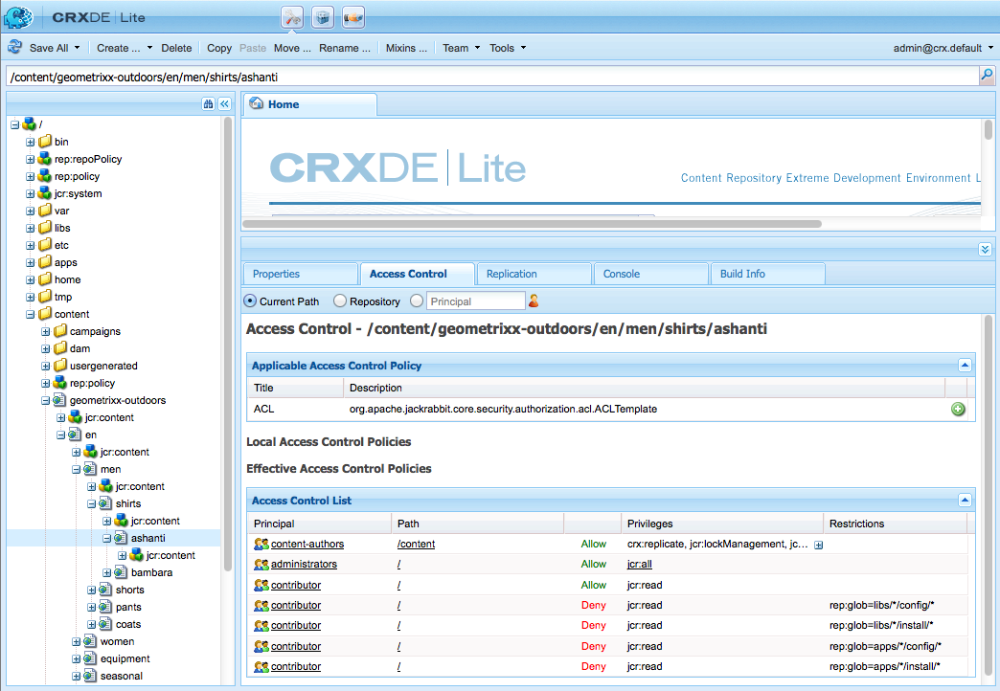
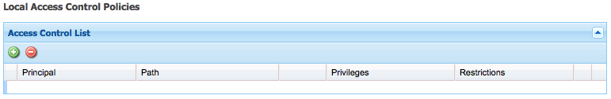

# 使用者、群組和存取權限管理{#user-group-and-access-rights-administration}

啟用對CRX存放庫的存取涉及多個主題：

* [存取權限](#how-access-rights-are-evaluated)  — 定義與評估權限的概念
* [使用者管理](#user-administration)  — 管理用於存取的個別帳戶
* [群組管理](#group-administration)  — 透過組成群組簡化使用者管理
* [存取權限管理](#access-right-management)  — 定義策略，以控制這些使用者和群組存取資源的方式

基本元素包括：

**User** AccountsCRX根據使用者帳戶中保有的詳細資訊，識別並驗證使用者（由個人或其他應用程式），以驗證存取權。

在CRX中，每個使用者帳戶都是工作區中的節點。 CRX使用者帳戶具有下列屬性：

* 它代表CRX的一個使用者。
* 它包含用戶名和密碼。
* 適用於該工作區。
* 不能有子用戶。 對於分層訪問權限，您應使用組。

* 您可以指定使用者帳戶的存取權限。

   不過，為簡化管理，我們建議您（在大多數情況下）將存取權指派給群組帳戶。 為每個個別使用者指派存取權限變得很難管理（只有一或兩個例項時，某些系統使用者會遇到例外）。

**組帳** 戶組帳戶是用戶和/或其他組的集合。當指派給群組的存取權限變更會自動套用至該群組中的所有使用者時，這些變更可用來簡化管理。 使用者不必屬於任何群組，但通常屬於數個群組。

在CRX中，群組具有下列屬性：

* 它代表一組具有共同存取權限的使用者。 例如，作者或開發人員。
* 適用於該工作區。
* 它可以有成員；可以是個別使用者或其他群組。
* 通過成員關係可以實現分層分組。 不能將組直接放在儲存庫中其他組的下方。
* 您可以定義所有群組成員的存取權限。

**存** 取權限CRX使用存取權限來控制存放庫特定區域的存取。

要執行此操作，請將權限指派給允許或拒絕存取儲存庫中的資源（節點或路徑）。 由於可以指派各種權限，因此必須評估這些權限，以判斷哪個組合適用於目前的請求。

CRX可讓您設定使用者和群組帳戶的存取權限。 評估的基本原則隨後適用於這兩者。

## 如何評估存取權限 {#how-access-rights-are-evaluated}

>[!NOTE]
>
>CRX實現了JSR-283](https://www.adobe.io/experience-manager/reference-materials/spec/jcr/2.0/16_Access_Control_Management.html)定義的[訪問控制。
>
>CRX存放庫的標準安裝設定為使用資源型存取控制清單。 此為JSR-283存取控制的可能實作，以及Jackrabbit隨附的其中一項實作。

### 主體與主體 {#subjects-and-principals}

評估存取權限時，CRX使用兩個重要概念：

* **principal**&#x200B;是具有訪問權限的實體。 承擔者包括：

   * 使用者帳戶
   * 群組帳戶

      如果用戶帳戶屬於一個或多個組，則它也與這些組主體中的每個相關聯。

* **subject**&#x200B;用於表示請求的源。

   它可用來合併適用於該請求的存取權限。 這些來自：

   * 用戶主體

      您直接指派給使用者帳戶的權限。

   * 與該用戶關聯的所有組主體

      指派給使用者所屬任何群組的所有權利。
   然後，結果將用於允許或拒絕對所請求資源的訪問。

#### 編製主題的訪問權清單 {#compiling-the-list-of-access-rights-for-a-subject}

在CRX中，主體取決於：

* 用戶主體
* 與該用戶關聯的所有組主體

適用於主題的訪問權限清單由以下內容構成：

* 您直接指派給使用者帳戶的權限
* 加上指派給使用者所屬任何群組的所有權利



>[!NOTE]
>
>* CRX編譯清單時沒有考慮任何使用者階層。
>* 只有在您將群組納入為其他群組的成員時，CRX才會使用群組階層。 沒有組權限的自動繼承。
>* 您指定群組的順序不會影響存取權限。

>


### 解決請求和訪問權限 {#resolving-request-and-access-rights}

CRX處理請求時，會比較來自主旨的存取請求與存放庫節點上的存取控制清單：

因此，如果Linda請求更新以下儲存庫結構中的`/features`節點：


### 優先順序 {#order-of-precedence}

CRX中的存取權限評估如下：

* 用戶主體始終優先於組主體，而不考慮：

   * 訪問控制清單中的順序
   * 在節點階層中的位置

* 對於給定主體，給定節點上存在（最多）1個拒絕和1個允許條目。 實施一律會清除多餘的項目，並確保允許和拒絕項目中不會列出相同的權限。

>[!NOTE]
>
>此評估過程適用於標準CRX安裝的基於資源的訪問控制。

舉兩個用戶`aUser`是組`aGroup`成員的示例：

```xml
   + parentNode
     + acl
       + ace: aUser - deny - write
     + childNode
       + acl
         + ace: aGroup - allow - write
       + grandChildNode
```

在上述情況中：

* `aUser` 未授予對的寫權限 `grandChildNode`。

```xml
   + parentNode
     + acl
       + ace: aUser - deny - write
     + childNode
       + acl
         + ace: aGroup - allow - write
         + ace: aUser - deny - write
       + grandChildNode
```

在此情況下：

* `aUser` 未授予對的寫權限 `grandChildNode`。
* `aUser`的第二個ACE是冗餘的。

系統會根據多個組主體的順序（在層次結構內和在單個訪問控制清單內）評估其訪問權限。

### 最佳作法 {#best-practices}

下表列出一些建議和最佳實務：

<table>
 <tbody>
  <tr>
   <td>建議……</td>
   <td>原因...</td>
  </tr>
  <tr>
   <td><i>使用群組</i></td>
   <td><p>避免按用戶分配訪問權限。 原因有幾：</p>
    <ul>
     <li>您的使用者比群組多，因此群組可簡化結構。</li>
     <li>群組可協助您提供所有帳戶的概觀。</li>
     <li>對於群組，繼承較簡單。</li>
     <li>用戶來來去。 群體是長期的。</li>
    </ul> </td>
  </tr>
  <tr>
   <td><i>積極</i></td>
   <td><p>始終使用Allow語句指定組主體的訪問權限（盡可能）。 避免使用Deny語句。</p> <p>按順序評估組主體，包括在層次結構內和在單個訪問控制清單內的順序。</p> </td>
  </tr>
  <tr>
   <td><i>保持簡單</i></td>
   <td><p>在配置新安裝時花一些時間和時間進行思考將得到很好的回報。</p> <p>應用清晰的結構將簡化持續的維護和管理，確保您的當前同事和/或未來的繼任者都能輕鬆了解正在實施的內容。</p> </td>
  </tr>
  <tr>
   <td><i>測試</i></td>
   <td>使用測試安裝來實踐並確保您了解各種使用者和群組之間的關係。</td>
  </tr>
  <tr>
   <td><i>預設使用者/群組</i></td>
   <td>安裝後請一律立即更新預設使用者和群組，以避免發生任何安全問題。</td>
  </tr>
 </tbody>
</table>

## 使用者管理 {#user-administration}

標準對話框用於&#x200B;**用戶管理**。

您必須登入適當的工作區，然後您就可以從這兩個位置存取對話方塊：

* CRX主控台上的&#x200B;**使用者管理**&#x200B;連結
* CRX資源管理器的&#x200B;**安全性**&#x200B;菜單


**屬性**

* **UserID**

   帳戶的簡短名稱，用於存取CRX。

* **主體名稱**

   帳戶的全文名稱。

* **密碼**

   使用此帳戶存取CRX時需要。

* **ntlmhash**

   為每個新帳戶自動指派，並在密碼變更時更新。

* 您可以定義名稱、類型和值，以新增屬性。 按一下每個新屬性的「儲存」（綠色勾號）。

**群組成員資格**

這會顯示帳戶所屬的所有群組。 「繼承」列指示由於其他組的成員身份而繼承的成員身份。

按一下GroupID（如果可用）將開啟該組的[組管理](#group-administration)。

**Impersonator**

透過模擬功能，使用者可以代表其他使用者運作。

這表示使用者帳戶可以指定其他帳戶（使用者或群組），以便使用其帳戶運作。 換句話說，如果允許使用者B模擬使用者A，則使用者B可使用使用者A的完整帳戶詳細資訊（包括ID、名稱和存取權限）執行動作。

這可讓模擬者帳戶完成工作，就像使用其模擬的帳戶一樣；例如，在缺勤期間或在短期內共用過多負荷。

如果帳戶模擬另一個帳戶，就很難看到。 日誌檔案不包含有關事件上發生了模擬的事實的資訊。 因此，如果使用者B模擬使用者A，則所有事件看起來都像是由使用者A個人執行。

### 建立使用者帳戶 {#creating-a-user-account}

1. 開啟&#x200B;**User Administration**&#x200B;對話框。
1. 按一下「**建立用戶**」。
1. 然後，您可以輸入「屬性」：

   * **** UserID作為帳戶名稱。
   * **** 登入時需要密碼。
   * **Principal** Name（主體名稱），提供全文名稱。
   * **中** 間路徑，可用於形成樹結構。

1. 按一下「保存」（綠色勾號）。
1. 對話方塊將會展開，以便您能：

   1. 配置&#x200B;**屬性**。
   1. 請參閱&#x200B;**群組成員資格**。
   1. 定義&#x200B;**模擬器**。

>[!NOTE]
>
>在安裝中註冊新用戶時，有時會出現效能下降的情況，因為安裝中同時有大量的用戶：
>
>* 個使用者
>* 具有多個成員的組

>


### 更新使用者帳戶 {#updating-a-user-account}

1. 使用&#x200B;**User Administration**&#x200B;對話框開啟所有帳戶的清單視圖。
1. 瀏覽樹結構。
1. 按一下要開啟以進行編輯的必要帳戶。
1. 進行更改，然後按一下該條目的「保存」（綠色勾號）。
1. 按一下&#x200B;**關閉**&#x200B;以完成，或按一下&#x200B;**清單……**&#x200B;以返回所有用戶帳戶的清單。

### 移除使用者帳戶 {#removing-a-user-account}

1. 使用&#x200B;**User Administration**&#x200B;對話框開啟所有帳戶的清單視圖。
1. 瀏覽樹結構。
1. 選擇所需帳戶，然後按一下&#x200B;**刪除用戶**;帳戶將立即刪除。

>[!NOTE]
>
>這會從儲存庫中刪除此主體的節點。
>
>未移除存取權限項目。 這確保了歷史的完整性。

### 定義屬性 {#defining-properties}

您可以為新帳戶或現有帳戶定義&#x200B;**屬性**:

1. 開啟相應帳戶的&#x200B;**用戶管理**&#x200B;對話框。
1. 定義&#x200B;**屬性**&#x200B;名稱。
1. 從下拉清單中選擇&#x200B;**類型**。
1. 定義&#x200B;**值**。
1. 按一下新屬性的「儲存」（綠色按一下符號）。

可以使用垃圾桶符號刪除現有屬性。

除了「密碼」之外，無法編輯屬性，必須刪除並重新建立屬性。

#### 更改密碼 {#changing-the-password}

**Password**&#x200B;是一種特殊屬性，可通過按一下&#x200B;**Change Password**&#x200B;連結進行更改。

您也可以從CRX Explorer的&#x200B;**Security**&#x200B;功能表變更自己使用者帳戶的密碼。

### 定義模擬器 {#defining-an-impersonator}

您可以為新帳戶或現有帳戶定義「模擬」：

1. 開啟相應帳戶的&#x200B;**用戶管理**&#x200B;對話框。
1. 指定要允許模擬該帳戶的帳戶。

   您可以使用Browse...來選取現有帳戶。

1. 按一下新屬性的「保存」（綠色勾號）。

## 群組管理 {#group-administration}

標準對話框用於&#x200B;**組管理**。

您必須登入適當的工作區，然後您就可以從這兩個位置存取對話方塊：

* CRX主控台上的&#x200B;**群組管理**&#x200B;連結
* CRX資源管理器的&#x200B;**安全性**&#x200B;菜單


**屬性**

* **GroupID**

   群組帳戶的簡短名稱。

* **主體名稱**

   群組帳戶的全文名稱。

* 您可以定義名稱、類型和值，以新增屬性。 按一下每個新屬性的「儲存」（綠色勾號）。

* **成員**

   您可以新增使用者或其他群組作為此群組的成員。

**群組成員資格**

這會顯示目前群組帳戶所屬的所有群組。 「繼承」列指示由於其他組的成員身份而繼承的成員身份。

按一下GroupID會開啟該群組的對話方塊。

**成員**

列出屬於當前組的所有帳戶（用戶和/或組）。

**Inherited**&#x200B;列指示由於其他組的成員身份而繼承的成員身份。

>[!NOTE]
>
>將「擁有者」、「編輯者」或「檢視者」角色指派給任何資產資料夾上的使用者時，系統就會建立新群組。 對於定義角色的每個資料夾，組名的格式為`mac-default-<foldername>`。

### 建立群組帳戶 {#creating-a-group-account}

1. 開啟&#x200B;**組管理**&#x200B;對話框。
1. 按一下「**建立組**」。
1. 然後，您可以輸入「屬性」：

   * **Principal** Name（主體名稱），提供全文名稱。
   * **中** 間路徑，可用於形成樹結構。

1. 按一下「保存」（綠色勾號）。
1. 對話方塊將會展開，以便您能：

   1. 配置&#x200B;**屬性**。
   1. 請參閱&#x200B;**群組成員資格**。
   1. 管理&#x200B;**成員**。

### 更新群組帳戶 {#updating-a-group-account}

1. 使用&#x200B;**組管理**&#x200B;對話框開啟所有帳戶的清單視圖。
1. 瀏覽樹結構。
1. 按一下要開啟以進行編輯的必要帳戶。
1. 進行更改，然後按一下該條目的「保存」（綠色勾號）。
1. 按一下&#x200B;**關閉**&#x200B;以完成，或按一下&#x200B;**清單……**&#x200B;以返回所有組帳戶的清單。

### 移除群組帳戶 {#removing-a-group-account}

1. 使用&#x200B;**組管理**&#x200B;對話框開啟所有帳戶的清單視圖。
1. 瀏覽樹結構。
1. 選擇所需帳戶，然後按一下「刪除組&#x200B;**」；帳戶將立即刪除。**

>[!NOTE]
>
>這會從儲存庫中刪除此主體的節點。
>
>未移除存取權限項目。 這確保了歷史的完整性。

### 定義屬性 {#defining-properties-1}

您可以為新帳戶或現有帳戶定義屬性：

1. 開啟相應帳戶的&#x200B;**組管理**&#x200B;對話框。
1. 定義&#x200B;**屬性**&#x200B;名稱。
1. 從下拉清單中選擇&#x200B;**類型**。
1. 定義&#x200B;**值**。
1. 按一下新屬性的「保存」（綠色勾號）。

可以使用垃圾桶符號刪除現有屬性。

### 成員 {#members}

您可以將成員添加到當前組：

1. 開啟相應帳戶的&#x200B;**組管理**&#x200B;對話框。
1. 其中之一：

   * 輸入所需成員（用戶或組帳戶）的名稱。
   * 或使用&#x200B;**瀏覽……**&#x200B;要搜索並選擇要添加的主體（用戶或組帳戶）。

1. 按一下新屬性的「保存」（綠色勾號）。

或刪除具有垃圾桶符號的現有成員。

## 訪問權限管理 {#access-right-management}

使用CRXDE Lite的&#x200B;**訪問控制**&#x200B;頁簽，您可以定義訪問控制策略並分配相關權限。

例如，對於&#x200B;**當前路徑**，請在左窗格中選擇所需資源，在右下窗格中選擇「訪問控制」頁簽：



這些策略按以下方式分類：

* **適用的訪問控制策略**

   可以應用這些策略。

   這些是可用於建立本地策略的策略。 一旦選擇並添加適用的策略，它就會成為本地策略。

* **本機存取控制政策**

   這些是您已套用的存取控制原則。 然後，您就可以更新、訂購或移除這些項目。

   本地策略將覆蓋從父項繼承的任何策略。

* **生效的存取控制政策**

   這些是現在對任何訪問請求生效的訪問控制策略。 它們顯示從本地策略和從父項繼承的任何策略派生的聚合策略。

### 策略選擇 {#policy-selection}

可以為以下項選擇策略：

* **目前路徑**

   如上例所示，在儲存庫內選取資源。 將顯示此「當前路徑」的策略。

* **存放庫**

   選擇儲存庫級別訪問控制。 例如，設定`jcr:namespaceManagement`權限時，該權限僅與儲存庫相關，而不與節點相關。

* **主體**

   在儲存庫中註冊的主體。

   您可以鍵入&#x200B;**主體**&#x200B;名稱，或按一下欄位右側的表徵圖以開啟&#x200B;**選擇主體**&#x200B;對話框。

   這可讓您&#x200B;**搜尋****使用者**&#x200B;或&#x200B;**群組**。 從結果清單中選擇所需的主體，然後按一下&#x200B;**OK**&#x200B;將值帶回上一個對話框。


>[!NOTE]
>
>為簡化管理，建議您將存取權指派給群組帳戶，而非個別使用者帳戶。
>
>管理幾個群組（而非許多使用者帳戶）比較容易。

### 權限 {#privileges}

添加訪問控制項時，可選擇以下權限（有關完整詳細資訊，請參閱[安全API](https://docs.adobe.com/docs/en/spec/javax.jcr/javadocs/jcr-2.0/javax/jcr/security/Privilege.html)）:

<table>
 <tbody>
  <tr>
   <th><strong>權限名稱</strong></th>
   <th><strong>它控制……</strong></th>
  </tr>
  <tr>
   <td><code>jcr:read</code></td>
   <td>檢索節點並讀取其屬性及其值。</td>
  </tr>
  <tr>
   <td><code>rep:write</code></td>
   <td>這是jcr:write和jcr:nodeTypeManagement的Jackrabbit特定匯總權限。<br /> </td>
  </tr>
  <tr>
   <td><code>jcr:all</code></td>
   <td>這是包含所有其他預先定義權限的匯總權限。</td>
  </tr>
  <tr>
   <td><strong>進階</strong></td>
   <td> </td>
  </tr>
  <tr>
   <td><code>crx:replicate</code></td>
   <td>執行節點複製。</td>
  </tr>
  <tr>
   <td><code>jcr:addChildNodes</code></td>
   <td>建立節點的子節點。</td>
  </tr>
  <tr>
   <td><code>jcr:lifecycleManagement</code></td>
   <td>在節點上執行生命週期操作。</td>
  </tr>
  <tr>
   <td><code>jcr:lockManagement</code></td>
   <td>鎖定和解鎖節點；刷新鎖。</td>
  </tr>
  <tr>
   <td><code>jcr:modifyAccessControl</code></td>
   <td>修改節點的訪問控制策略。</td>
  </tr>
  <tr>
   <td><code>jcr:modifyProperties</code></td>
   <td>建立、修改和刪除節點的屬性。</td>
  </tr>
  <tr>
   <td><code>jcr:namespaceManagement</code></td>
   <td>註冊、註銷和修改命名空間定義。</td>
  </tr>
  <tr>
   <td><code>jcr:nodeTypeDefinitionManagement</code></td>
   <td>將節點類型定義導入儲存庫。</td>
  </tr>
  <tr>
   <td><code>jcr:nodeTypeManagement</code></td>
   <td>添加和刪除混合節點類型並更改節點的主節點類型。 這也包括對Node.addNode和XML導入方法的任何調用，其中顯式指定了新節點的mixin或主要類型。</td>
  </tr>
  <tr>
   <td><code>jcr:readAccessControl</code></td>
   <td>閱讀節點的訪問控制策略。</td>
  </tr>
  <tr>
   <td><code>jcr:removeChildNodes</code></td>
   <td>移除節點的子節點。</td>
  </tr>
  <tr>
   <td><code>jcr:removeNode</code></td>
   <td>移除節點。</td>
  </tr>
  <tr>
   <td><code>jcr:retentionManagement</code></td>
   <td>對節點執行保留管理操作。</td>
  </tr>
  <tr>
   <td><code>jcr:versionManagement</code></td>
   <td>對節點執行版本設定操作。</td>
  </tr>
  <tr>
   <td><code>jcr:workspaceManagement</code></td>
   <td>透過JCR API建立和刪除工作區。</td>
  </tr>
  <tr>
   <td><code>jcr:write</code></td>
   <td>這是一個聚合權限，包含：<br /> - jcr:modifyProperties<br /> - jcr:addChildNodes<br /> - jcr:removeNode<br /> - jcr:removeChildNodes</td>
  </tr>
  <tr>
   <td><code>rep:privilegeManagement</code></td>
   <td>註冊新權限。</td>
  </tr>
 </tbody>
</table>

### 註冊新權限 {#registering-new-privileges}

您也可以註冊新權限：

1. 從工具欄中，選擇&#x200B;**工具**，然後選擇&#x200B;**權限**&#x200B;以顯示當前註冊的權限。

   

1. 使用&#x200B;**註冊權限**&#x200B;表徵圖(**+**)開啟對話框並定義新權限：

   

1. 按一下&#x200B;**OK**&#x200B;以儲存。 該權限現在可供選擇。

### 添加訪問控制項 {#adding-an-access-control-entry}

1. 選擇您的資源並開啟&#x200B;**Access Control**&#x200B;頁簽。

1. 要添加新的&#x200B;**本地訪問控制策略**，請按一下&#x200B;**適用訪問控制策略**&#x200B;清單右側的&#x200B;**+**&#x200B;表徵圖：

   

1. 新條目出現在&#x200B;**本地訪問控制策略：**&#x200B;下

   

1. 按一下&#x200B;**+**&#x200B;圖示以新增項目：

   

   >[!NOTE]
   >
   >目前需要因應措施來指定空字串。
   >
   >為此，您需要使用「」。

1. 定義訪問控制策略，然後按一下&#x200B;**OK**&#x200B;以保存。 您的新政策將：

   * 列在&#x200B;**本地訪問控制策略**&#x200B;下
   * 這些更改將反映在&#x200B;**有效訪問控制策略**&#x200B;中。

CRX將驗證您的選擇；對於給定的主體，給定節點上存在（最多）1個拒絕和1個允許進入。 實施一律會清除多餘的項目，並確保允許和拒絕項目中不會列出相同的權限。

### 訂購本地訪問控制策略 {#ordering-local-access-control-policies}

清單中的順序指示應用策略的順序。

1. 在&#x200B;**本地訪問控制策略**&#x200B;的表中，選擇所需條目，並將其拖動到表中的新位置。

   

1. **Local**&#x200B;和&#x200B;**有效訪問控制策略**&#x200B;的表中將顯示更改。

### 刪除訪問控制策略 {#removing-an-access-control-policy}

1. 在&#x200B;**本地訪問控制策略**&#x200B;的表中，按一下條目右側的紅色表徵圖(-)。
1. 該條目將從&#x200B;**Local**&#x200B;和&#x200B;**有效訪問控制策略**&#x200B;的表中刪除。

### 測試訪問控制策略 {#testing-an-access-control-policy}

1. 從CRXDE Lite工具欄中，選擇&#x200B;**工具**，然後選擇&#x200B;**測試訪問控制……**。
1. 右上方窗格中會開啟新的對話方塊。 選擇要測試的&#x200B;**路徑**&#x200B;和/或&#x200B;**主體**。
1. 按一下&#x200B;**Test**&#x200B;以查看您的選擇結果：

   
