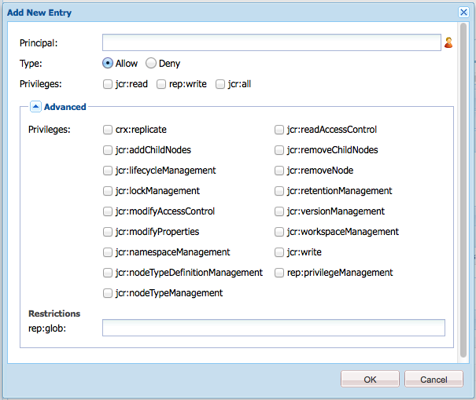

# 用戶、組和訪問權限管理{#user-group-and-access-rights-administration}

啟用對CRX儲存庫的訪問涉及以下幾個主題：

* [訪問權限](#how-access-rights-are-evaluated)  — 定義和評估這些概念
* [用戶管理](#user-administration)  — 管理用於訪問的單個帳戶
* [組管理](#group-administration)  — 通過組合簡化用戶管理
* [訪問權限管理](#access-right-management)  — 定義控制這些用戶和組訪問資源的方式的策略

基本要素是：

**用戶帳戶** CRX根據用戶帳戶中保存的詳細資訊，通過識別和驗證用戶（由用戶或其他應用程式）來驗證訪問。

在CRX中，每個用戶帳戶都是工作區中的節點。 CRX用戶帳戶具有以下屬性：

* 它代表CRX的一個用戶。
* 它包含用戶名和密碼。
* 適用於該工作區。
* 它不能有子用戶。 對於分層訪問權限，您應使用組。

* 您可以為用戶帳戶指定訪問權限。

   但是，為簡化管理，我們建議您（在大多數情況下）為組帳戶分配訪問權限。 為每個用戶分配訪問權限會很快變得非常難以管理（當僅存在一兩個實例時，某些系統用戶是例外）。

**組帳戶** 組帳戶是用戶和/或其他組的集合。 這些功能用於簡化管理，因為分配給組的訪問權限的更改將自動應用於該組中的所有用戶。 用戶不必屬於任何組，但通常屬於多個組。

在CRX中，組具有以下屬性：

* 它表示一組具有共同訪問權限的用戶。 例如，作者或開發者。
* 適用於該工作區。
* 它可以有成員；這些可以是單個用戶或其他組。
* 可以使用成員關係實現分層分組。 不能將組直接放在儲存庫中的另一個組下面。
* 您可以定義所有組成員的訪問權限。

**訪問權限** CRX使用「訪問權限」來控制對儲存庫特定區域的訪問。

為此，將權限分配給儲存庫中的資源（節點或路徑）的允許或拒絕訪問權限。 由於可以分配各種權限，因此必須評估這些權限以確定哪些組合適用於當前請求。

CRX允許您配置用戶和組帳戶的訪問權限。 評估的基本原則也適用於兩者。

## 如何評估訪問權限 {#how-access-rights-are-evaluated}

>[!NOTE]
>
>CRX實現 [JSR-283定義的訪問控制](https://www.adobe.io/experience-manager/reference-materials/spec/jcr/2.0/16_Access_Control_Management.html)。
>
>CRX儲存庫的標準安裝配置為使用基於資源的訪問控制清單。 這是JSR-283訪問控制的一個可能實現，也是Jackrabbit提供的一個實現。

### 主體和主體 {#subjects-and-principals}

CRX在評估訪問權限時使用兩個關鍵概念：

* A **主** 是具有訪問權限的實體。 承擔者包括：

   * 用戶帳戶
   * 組帳戶

      如果用戶帳戶屬於一個或多個組，則它也與這些組主體中的每一個相關聯。

* A **主題** 用於表示請求的源。

   它用於合併適用於該請求的訪問權限。 這些內容取自：

   * 用戶主體

      您直接分配給用戶帳戶的權限。

   * 與該用戶關聯的所有組承擔者

      分配給用戶所屬的任何組的所有權限。
   然後，結果用於允許或拒絕對所請求資源的訪問。

#### 編譯主題的訪問權限清單 {#compiling-the-list-of-access-rights-for-a-subject}

在CRX中，主題取決於：

* 用戶主體
* 與該用戶關聯的所有組主體

適用於主題的訪問權限清單由下列內容構成：

* 您直接分配給用戶帳戶的權限
* 加上分配給用戶所屬的任何組的所有權限


>[!NOTE]
>
>* CRX編譯清單時不考慮任何用戶層次結構。
>* CRX僅在將組作為另一組的成員包括時使用組層次結構。 組權限沒有自動繼承。
>* 指定組的順序不影響訪問權限。
>


### 解決請求和訪問權限 {#resolving-request-and-access-rights}

當CRX處理請求時，它會將來自主題的訪問請求與儲存庫節點上的訪問控制清單進行比較：

如果琳達要求 `/features` 的子目錄：


### 優先順序 {#order-of-precedence}

CRX中的訪問權限評估如下：

* 用戶承擔者始終優先於組承擔者，而不考慮：

   * 他們在訪問控制清單中的順序
   * 他們在節點層次中的位置

* 對於給定主體，給定節點上存在1個拒絕項和1個允許項。 實現始終清除冗餘條目，並確保允許和拒絕條目中未列出相同的權限。

>[!NOTE]
>
>此評估過程適用於標準CRX安裝的基於資源的訪問控制。

舉兩個用戶 `aUser` 是組成員 `aGroup`:

```xml
   + parentNode
     + acl
       + ace: aUser - deny - write
     + childNode
       + acl
         + ace: aGroup - allow - write
       + grandChildNode
```

在上述情況下：

* `aUser` 未授予對的寫入權限 `grandChildNode`。

```xml
   + parentNode
     + acl
       + ace: aUser - deny - write
     + childNode
       + acl
         + ace: aGroup - allow - write
         + ace: aUser - deny - write
       + grandChildNode
```

在本例中：

* `aUser` 未授予對的寫入權限 `grandChildNode`。
* 第二個ACE `aUser` 是多餘的。

根據多個組主體的順序評估來自多個組主體的訪問權限，該順序既在層次結構內，也在單個訪問控制清單內。

### 最佳做法 {#best-practices}

下表列出了一些建議和最佳做法：

<table>
 <tbody>
  <tr>
   <td>建議……</td>
   <td>原因...</td>
  </tr>
  <tr>
   <td><i>使用組</i></td>
   <td><p>避免按用戶分配訪問權限。 原因有幾：</p>
    <ul>
     <li>用戶比組多得多，因此組簡化了結構。</li>
     <li>組幫助提供所有帳戶的概覽。</li>
     <li>對於組，繼承更簡單。</li>
     <li>用戶來去。 群體是長期的。</li>
    </ul> </td>
  </tr>
  <tr>
   <td><i>積極</i></td>
   <td><p>始終使用Allow語句指定組主體的訪問權限（盡可能）。 避免使用Deny語句。</p> <p>按順序評估組主體，在層次和單個訪問控制清單中按順序。</p> </td>
  </tr>
  <tr>
   <td><i>保持簡單</i></td>
   <td><p>在配置新安裝時投入一些時間和思考將得到很好的回報。</p> <p>應用清晰的結構將簡化日常維護和管理，確保您的當前同事和/或未來的後續人員都能夠輕鬆瞭解正在實施的內容。</p> </td>
  </tr>
  <tr>
   <td><i>測試</i></td>
   <td>使用test安裝來練習並確保您瞭解各種用戶和組之間的關係。</td>
  </tr>
  <tr>
   <td><i>預設用戶/組</i></td>
   <td>安裝後始終立即更新預設用戶和組，以幫助防止任何安全問題。</td>
  </tr>
 </tbody>
</table>

## 用戶管理 {#user-administration}

標準對話框用於 **用戶管理**。

您必須登錄到相應的工作區，然後您可以從以下兩個位置訪問對話框：

* 這樣 **用戶管理** CRX主控制台上的連結
* 這樣 **安全** CRX瀏覽器的菜單


**屬性**

* **用戶ID**

   帳戶的短名稱，在訪問CRX時使用。

* **主體名稱**

   帳戶的全文名稱。

* **密碼**

   使用此帳戶訪問CRX時需要。

* **ntlmhash**

   為每個新帳戶自動分配並在更改密碼時更新。

* 可以通過定義名稱、類型和值來添加新屬性。 按一下每個新屬性的「保存」（綠色勾選符號）。

**群組會籍**

這顯示帳戶所屬的所有組。 「繼承的」(Inherited)清單示由於其他組的成員資格而繼承的成員資格。

按一下GroupID（如果可用）將開啟 [組管理](#group-administration) 為那群人。

**Impersonator**

使用模擬功能，用戶可以代表其他用戶工作。

這意味著用戶帳戶可以指定可以使用其帳戶操作的其他帳戶（用戶或組）。 換句話說，如果允許user-B模擬user-A，則user-B可以使用user-A的完整帳戶詳細資訊（包括ID、名稱和訪問權限）執行操作。

這樣，模擬者帳戶就可以完成任務，就像他們使用的是模擬的帳戶一樣；例如，在缺勤期間或在短期內共用過重負荷。

如果某個帳戶冒充另一個帳戶，則很難看到。 日誌檔案不包含有關事件發生模擬的資訊。 因此，如果user-B模擬用戶 — A所有事件看起來都像是用戶 — A親自執行的。

### 建立用戶帳戶 {#creating-a-user-account}

1. 開啟 **用戶管理** 對話框。
1. 按一下 **建立用戶**。
1. 然後，可以輸入「屬性：

   * **用戶ID** 用作帳戶名。
   * **密碼** 登錄時需要的。
   * **主體名稱** 提供完整的文本名稱。
   * **中間路徑** 可以用來形成樹狀結構。

1. 按一下「保存」（綠色刻度符）。
1. 該對話框將展開，以便您可以：

   1. 配置 **屬性**。
   1. 請參閱 **組成員身份**。
   1. 定義 **模擬者**。

>[!NOTE]
>
>在安裝中註冊新用戶時，有時會出現效能下降，這些安裝中同時具有以下兩種功能：
>
>* 個使用者
>* 多個成員的組
>


### 更新用戶帳戶 {#updating-a-user-account}

1. 使用 **用戶管理** 對話框開啟所有帳戶的清單視圖。
1. 瀏覽樹結構。
1. 按一下要開啟以供編輯的必需帳戶。
1. 進行更改，然後按一下該條目的「保存」（綠色勾選符號）。
1. 按一下 **關閉** 完成，或 **清單……** 返回所有用戶帳戶的清單。

### 刪除用戶帳戶 {#removing-a-user-account}

1. 使用 **用戶管理** 對話框開啟所有帳戶的清單視圖。
1. 瀏覽樹結構。
1. 選擇所需帳戶並按一下 **刪除用戶**;帳戶將立即刪除。

>[!NOTE]
>
>此操作將從儲存庫中刪除此主體的節點。
>
>未刪除訪問權限項。 這確保了歷史的完整性。

### 定義屬性 {#defining-properties}

您可以定義 **屬性** 對於新帳戶或現有帳戶：

1. 開啟 **用戶管理** 對話框。
1. 定義 **屬性** 名稱。
1. 選擇 **類型** 從下拉清單中。
1. 定義 **值**。
1. 按一下「保存」（綠色按一下符號）以獲取新屬性。

可以使用資源回收筒符號刪除現有屬性。

除密碼外，無法編輯屬性，必須刪除並重新建立這些屬性。

#### 更改密碼 {#changing-the-password}

的 **密碼** 是可通過按一下 **更改密碼** 的子菜單。

您還可以從 **安全** 的下界。

### 定義模擬器 {#defining-an-impersonator}

您可以為新帳戶或現有帳戶定義模擬器：

1. 開啟 **用戶管理** 對話框。
1. 指定允許模擬該帳戶的帳戶。

   可以使用瀏覽……的子菜單。

1. 按一下「保存」（綠色勾選符號）以獲取新屬性。

## 組管理 {#group-administration}

標準對話框用於 **組管理**。

您必須登錄到相應的工作區，然後您可以從以下兩個位置訪問對話框：

* 這樣 **組管理** CRX主控制台上的連結
* 這樣 **安全** CRX瀏覽器的菜單


**屬性**

* **組ID**

   組帳戶的短名稱。

* **主體名稱**

   組帳戶的全文名稱。

* 可以通過定義名稱、類型和值來添加新屬性。 按一下每個新屬性的「保存」（綠色勾選符號）。

* **成員**

   您可以添加用戶或其他組作為此組的成員。

**群組會籍**

這顯示當前組帳戶所屬的所有組。 「繼承的」(Inherited)清單示由於其他組的成員資格而繼承的成員資格。

按一下GroupID將開啟該組的對話框。

**成員**

列出屬於當前組的所有帳戶（用戶和/或組）。

的 **繼承** 清單示由於其他組的成員身份而繼承的成員身份。

>[!NOTE]
>
>當將「所有者」、「編輯器」或「查看器」角色分配給任何「資產」資料夾上的用戶時，將建立新組。 組名稱的格式為 `mac-default-<foldername>` 定義角色的每個資料夾。

### 建立組帳戶 {#creating-a-group-account}

1. 開啟 **組管理** 對話框。
1. 按一下 **建立組**。
1. 然後，可以輸入「屬性：

   * **主體名稱** 提供完整的文本名稱。
   * **中間路徑** 可以用來形成樹狀結構。

1. 按一下「保存」（綠色刻度符）。
1. 該對話框將展開，以便您可以：

   1. 配置 **屬性**。
   1. 請參閱 **組成員身份**。
   1. 管理 **成員**。

### 更新組帳戶 {#updating-a-group-account}

1. 使用 **組管理** 對話框開啟所有帳戶的清單視圖。
1. 瀏覽樹結構。
1. 按一下要開啟以供編輯的必需帳戶。
1. 進行更改，然後按一下該條目的「保存」（綠色勾選符號）。
1. 按一下 **關閉** 完成，或 **清單……** 返回所有組帳戶的清單。

### 刪除組帳戶 {#removing-a-group-account}

1. 使用 **組管理** 對話框開啟所有帳戶的清單視圖。
1. 瀏覽樹結構。
1. 選擇所需帳戶並按一下 **刪除組**;帳戶將立即刪除。

>[!NOTE]
>
>此操作將從儲存庫中刪除此主體的節點。
>
>未刪除訪問權限項。 這確保了歷史的完整性。

### 定義屬性 {#defining-properties-1}

您可以為新帳戶或現有帳戶定義屬性：

1. 開啟 **組管理** 對話框。
1. 定義 **屬性** 名稱。
1. 選擇 **類型** 從下拉清單中。
1. 定義 **值**。
1. 按一下「保存」（綠色勾選符號）以獲取新屬性。

可以使用資源回收筒符號刪除現有屬性。

### 成員 {#members}

您可以將成員添加到當前組：

1. 開啟 **組管理** 對話框。
1. 可以：

   * 輸入所需成員（用戶或組帳戶）的名稱。
   * 或使用 **瀏覽……** 搜索並選擇要添加的承擔者（用戶或組帳戶）。

1. 按一下「保存」（綠色勾選符號）以獲取新屬性。

或刪除具有資源回收筒符號的現有成員。

## 訪問權限管理 {#access-right-management}

使用 **訪問控制** CRXDE Lite的頁籤，您可以定義訪問控制策略並分配相關權限。

例如， **當前路徑** 在左窗格中選擇所需資源，在右下窗格中選擇「訪問控制」頁籤：


這些策略按以下方式分類：

* **適用的訪問控制策略**

   可以應用這些策略。

   這些策略可用於建立本地策略。 一旦選擇並添加了適用的策略，它就成為本地策略。

* **本機存取控制政策**

   這些是您已應用的訪問控制策略。 然後，您可以更新、訂購或刪除它們。

   本地策略將覆蓋從父級繼承的所有策略。

* **生效的存取控制政策**

   這些是現在對任何訪問請求有效的訪問控制策略。 它們顯示從本地策略和從父級繼承的任何策略派生的聚合策略。

### 策略選擇 {#policy-selection}

可以為以下項目選擇策略：

* **目前路徑**

   如上例所示，在儲存庫中選擇資源。 將顯示此「當前路徑」的策略。

* **存放庫**

   選擇儲存庫級別訪問控制。 例如，在設定 `jcr:namespaceManagement` 權限，僅與儲存庫相關，而不與節點相關。

* **主體**

   在儲存庫中註冊的主體。

   您可以在 **主** 或按一下欄位右側的表徵圖以開啟 **選擇主體** 對話框。

   這樣您就可以 **搜索** 為 **用戶** 或 **組**。 從結果清單中選擇所需的承擔者，然後按一下 **確定** 將值帶回上一對話框。


>[!NOTE]
>
>為簡化管理，我們建議您為組帳戶分配訪問權限，而不是單獨的用戶帳戶。
>
>管理幾個組比管理許多用戶帳戶更容易。

### 權限 {#privileges}

添加訪問控制項時，可選擇以下權限(請參閱 [安全API](https://developer.adobe.com/experience-manager/reference-materials/spec/javax.jcr/javadocs/jcr-2.0/javax/jcr/security/Privilege.html) 如需完整詳細資訊):

<table>
 <tbody>
  <tr>
   <th><strong>權限名稱</strong></th>
   <th><strong>它控制權限……</strong></th>
  </tr>
  <tr>
   <td><code>jcr:read</code></td>
   <td>檢索節點並讀取其屬性及其值。</td>
  </tr>
  <tr>
   <td><code>rep:write</code></td>
   <td>這是jcr:write和jcr:nodeTypeManagement的jackrabbit特定聚合權限。<br /> </td>
  </tr>
  <tr>
   <td><code>jcr:all</code></td>
   <td>這是一個包含所有其他預定義權限的聚合權限。</td>
  </tr>
  <tr>
   <td><strong>進階</strong></td>
   <td> </td>
  </tr>
  <tr>
   <td><code>crx:replicate</code></td>
   <td>執行節點複製。</td>
  </tr>
  <tr>
   <td><code>jcr:addChildNodes</code></td>
   <td>建立節點的子節點。</td>
  </tr>
  <tr>
   <td><code>jcr:lifecycleManagement</code></td>
   <td>對節點執行生命週期操作。</td>
  </tr>
  <tr>
   <td><code>jcr:lockManagement</code></td>
   <td>鎖定和解鎖節點；刷新鎖。</td>
  </tr>
  <tr>
   <td><code>jcr:modifyAccessControl</code></td>
   <td>修改節點的訪問控制策略。</td>
  </tr>
  <tr>
   <td><code>jcr:modifyProperties</code></td>
   <td>建立、修改和刪除節點的屬性。</td>
  </tr>
  <tr>
   <td><code>jcr:namespaceManagement</code></td>
   <td>註冊、註銷和修改命名空間定義。</td>
  </tr>
  <tr>
   <td><code>jcr:nodeTypeDefinitionManagement</code></td>
   <td>將節點類型定義導入儲存庫。</td>
  </tr>
  <tr>
   <td><code>jcr:nodeTypeManagement</code></td>
   <td>添加和刪除混合節點類型並更改節點的主節點類型。 這還包括對Node.addNode和XML導入方法的任何調用，其中顯式指定了新節點的混合類型或主要類型。</td>
  </tr>
  <tr>
   <td><code>jcr:readAccessControl</code></td>
   <td>讀取節點的訪問控制策略。</td>
  </tr>
  <tr>
   <td><code>jcr:removeChildNodes</code></td>
   <td>刪除節點的子節點。</td>
  </tr>
  <tr>
   <td><code>jcr:removeNode</code></td>
   <td>刪除節點。</td>
  </tr>
  <tr>
   <td><code>jcr:retentionManagement</code></td>
   <td>對節點執行保留管理操作。</td>
  </tr>
  <tr>
   <td><code>jcr:versionManagement</code></td>
   <td>對節點執行版本控制操作。</td>
  </tr>
  <tr>
   <td><code>jcr:workspaceManagement</code></td>
   <td>通過JCR API建立和刪除工作區。</td>
  </tr>
  <tr>
   <td><code>jcr:write</code></td>
   <td>這是包含以下內容的聚合權限：<br /> - jcr:modifyProperties<br /> - jcr:addChildNodes<br /> - jcr:removeNode<br /> - jcr:removeChildNodes</td>
  </tr>
  <tr>
   <td><code>rep:privilegeManagement</code></td>
   <td>註冊新權限。</td>
  </tr>
 </tbody>
</table>

### 註冊新權限 {#registering-new-privileges}

您還可以註冊新權限：

1. 從工具欄中選擇 **工具**，則 **權限** 顯示當前註冊的權限。

   

1. 使用 **註冊權限** 表徵圖。**+**)開啟對話框並定義新權限：

   

1. 按一下 **確定** 來保存。 該權限現在可供選擇。

### 添加訪問控制項 {#adding-an-access-control-entry}

1. 選擇資源並開啟 **訪問控制** 頁籤。

1. 添加新 **本地訪問控制策略**，按一下 **+** 表徵圖 **適用的訪問控制策略** 清單：

   

1. 新條目出現在 **本地訪問控制策略：**

   

1. 按一下 **+** 表徵圖：

   

   >[!NOTE]
   >
   >當前需要一種解決方法來指定空字串。
   >
   >為此，您需要使用「」。

1. 定義訪問控制策略，然後按一下 **確定** 來保存。 您的新策略將：

   * 列在 **本地訪問控制策略**
   * 這些變化將反映在 **有效的訪問控制策略**。

CRX將驗證您的選擇；對於給定主體，給定節點上存在1個deny和1個允許條目。 實現始終清除冗餘條目，並確保允許和拒絕條目中未列出相同的權限。

### 訂購本地訪問控制策略 {#ordering-local-access-control-policies}

清單中的順序指示策略的應用順序。

1. 在 **本地訪問控制策略** 選擇所需的條目，並將其拖至表中的新位置。

   

1. 更改將顯示在 **本地** 和 **有效的訪問控制策略**。

### 刪除訪問控制策略 {#removing-an-access-control-policy}

1. 在 **本地訪問控制策略** 按一下條目右側的紅色表徵圖(-)。
1. 該條目將從的兩個表中刪除 **本地** 和 **有效的訪問控制策略**。

### 測試訪問控制策略 {#testing-an-access-control-policy}

1. 從CRXDE Lite工具欄選擇 **工具**，則 **Test訪問控制……**。
1. 右上窗格中將開啟一個新對話框。 選擇 **路徑** 和/或 **主** 你想test。
1. 按一下 **Test** 查看所選內容的結果：

   
