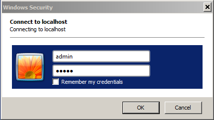

# WebDAV Access{#webdav-access}

若要透過WebDAV與KDE連線至AEM:

AEM提供WebDAV支援，可讓您顯示和編輯儲存庫內容。 通過WebDAV進行連接可讓您通過案頭直接訪問內容儲存庫。 透過WebDAV連線新增至儲存庫的文字和PDF檔案會自動建立全文索引，並可使用標準搜尋介面和標準Java API進行搜尋。

## 一般 {#general}

[本文檔中包含每個作業系統的詳細說明](/help/sites-administering/webdav-access.md#connecting-via-webdav) ，但是，實際上，要使用WebDAV協定連接到儲存庫，請將WebDAV客戶端指向以下位置：

```xml
http://localhost:4502
```


此URL在從作業系統層級連線時，可讓WebDAV存取預設工作區( `crx.default`)。 雖然對使用者而言更簡單，但是它並未提供指定工作區名稱的額外彈性，您可使用其他 [WebDAV URL來完成](/help/sites-administering/webdav-access.md#webdav-urls)。

AEM會依下列方式顯示儲存庫內容：

* 類型的節點將 `nt:folder` 顯示為資料夾。 節點下的節 `nt:folder` 點顯示為資料夾內容。

* 類型的節點 `nt:file` 將顯示為檔案。 節點下方的 `nt:file` 節點不會顯示，但會形成檔案的內容。

當您使用WebDAV來建立和編輯檔案夾和檔案時，AEM會建立和編輯必要的 `nt:folder` 和節 `nt:file` 點。 如果您打算使用WebDAV來匯入和匯出內容，請盡量使 `nt:file` 用 `nt:folder` 和節點類型。

>[!NOTE]
>
>在設定WebDAV之前，請檢查技術 [需求](/help/sites-deploying/technical-requirements.md#webdav-clients)。

## WebDAV URL {#webdav-urls}

WebDAV伺服器的URL具有下列結構：

<table>
 <colgroup>
  <col width="100" />
  <col width="100" />
  <col width="100" />
  <col width="100" />
  <col width="100" />
 </colgroup>
 <tbody>
  <tr>
   <td>
    <code>
     <strong>URL Component</strong>
    </code></td>
   <td><code>https://&lt;host&gt;:&lt;port&gt;</code></td>
   <td><code>/&lt;crx-webapp-path&gt;</code></td>
   <td><code>/repository</code></td>
   <td><code>/&lt;workspace&gt;</code></td>
  </tr>
  <tr>
   <td>
    <code>
     <strong>Example</strong>
    </code></td>
   <td><code>http://localhost:4502</code></td>
   <td><code>/crx</code></td>
   <td><code>/repository</code></td>
   <td><code>/crx.default</code></td>
  </tr>
  <tr>
   <td><strong>說明</strong></td>
   <td>AEM執行的主機和埠</td>
   <td>AEM存放庫網路應用程式的路徑</td>
   <td>WebDAV servlet映射到的路徑</td>
   <td>工作區的名稱</td>
  </tr>
 </tbody>
</table>

變更路徑中的工作區元素，即可映射預設( `crx.default`)以外的工作區。 例如，若要映射名為的工作區， `staging`請使用下列URL:

```xml
http://localhost:4502/crx/repository/staging
```

## 透過WebDAV連線 {#connecting-via-webdav}

[如上所述](/help/sites-administering/webdav-access.md#general)，要使用WebDAV協定連接到儲存庫，請將WebDAV客戶端指向儲存庫位置。 不過，根據您的OS，連接用戶端的相關步驟會有所不同，而且可能需要設定OS。

提供了有關如何連接以下作業系統的說明：

* [Windows](/help/sites-administering/webdav-access.md#windows)
* [macOS](/help/sites-administering/webdav-access.md#macos)
* [Linux](/help/sites-administering/webdav-access.md#linux)

### Windows {#windows}

若要成功將Microsoft Windows 7（及更新版本）系統連接至未使用SSL保護的AEM例項，必須在Windows中明確啟用在不安全網路上建立基本驗證的選項。 這要求在WebClient的Windows註冊表中進行更改。

在更新註冊表後，AEM例項就可以映射為磁碟機。

#### Windows 7和更高版本的配置 {#windows-and-greater-configuration}

要更新註冊表以允許通過不安全網路進行基本身份驗證，請：

1. 找到以下註冊表子項：

   ```xml
   HKEY_LOCAL_MACHINE\SYSTEM\CurrentControlSet\Services\WebClient\Parameters
   ```

1. 將註冊 `BasicAuthLevel` 表條目子鍵設定為或更 `2` 大的值。

   如果不存在，請添加子鍵。

1. 必須重新啟動系統，註冊表更改才能生效。

有關此 [註冊表更改的詳細資訊，請參閱Microsoft支援KB 841215](https://support.microsoft.com/default.aspx/kb/841215) 。

如需 [改善Windows下WebDav用戶端回應性的相關資訊，請參閱Microsoft支援KB 2445570](https://support.microsoft.com/kb/2445570) 。

>[!NOTE]
>
>Adobe建議您使用與儲存庫用戶相同的憑據建立Windows用戶，否則可能會遇到權限衝突。

#### Windows 8配置 {#windows-configuration}

對於Windows 8，您還需要按照Windows 7和更新版 [本的說明更改註冊表條目](/help/sites-administering/webdav-access.md#windows-and-greater-configuration)。 不過，您必須先啟用「案頭體驗」，才能查看註冊表項目。

若要啟用案頭體驗，請依序開 **啟「Server Manager**」、「 **Features**」、「 **Add Features**」和「 **** Desktop Experience」。

重新啟動Windows 7和更高版本的註冊表條目後，即可使用。 按照Windows 7和更新版本的說明進行修改。

#### 在Windows中連接 {#connecting-in-windows}

若要在Windows環境中透過WebDAV連線至AEM:

1. 開啟 **Windows資源管理器****或檔案資源管理器** ，然後按一下「 **Computer** （電腦） ****」或此PC機。

   

1. 按一下 **映射網路驅動器** ，啟動嚮導。
1. 輸入映射詳細資訊：

   * **驅動器**:選擇任何可用的信函
   * **資料夾**: `http://localhost:4502`
   * 檢查使 **用不同憑據進行連接**
   按一下「完成」

   

   >[!NOTE]
   >
   >如果AEM位於其他埠，請使用該埠號，而非4502。 此外，如果您未在本地電腦上運行內容儲存庫，請用相應 `localhost` 的伺服器名或IP地址替換。

1. 輸入用戶 `admin` 名和密碼 `admin`。 Adobe建議您使用預先設定的管理員帳戶進行測試。

   

1. 嚮導將關閉，並在Windows資源管理器或檔案資源管理器窗口中開啟新映射的驅動器。

   

Windows現在已透過WebDAV將AEM對應為磁碟機，而您可將它當成其他磁碟機使用。

### macOS {#macos}

在macOS上透過WebDAV連線時，不需要設定步驟。 您只需要連線至WebDAV伺服器。

1. 導覽至任何 **Finder** 視窗，然後按一下「 **執行****** Connect to Server **」，或按** Command+k鍵。
1. 在「連 **接至伺服器** 」視窗中，輸入AEM位置：

   * `http://localhost:4502`
   >[!NOTE]
   >
   >如果AEM位於其他埠，請使用該埠號，而非4502。 此外，如果您未在本地電腦上運行內容儲存庫，請用相應 `localhost` 的伺服器名或IP地址替換。

1. 當系統提示您進行驗證時，請輸入用戶 `admin` 名和密碼 `admin`。 Adobe建議您使用預先設定的管理員帳戶進行測試。

macOS現在已透過WebDAV連線至AEM，您可將它當成Mac上的任何其他資料夾。

### Linux {#linux}

在Linux上通過WebDAV進行連接不需要任何配置，但需要幾個步驟來建立連接，這些步驟會因您的案頭環境而異。

#### GNOME {#gnome}

若要透過WebDAV與GNOME連線至AEM:

1. 在Nautilus（檔案瀏覽器）中，選擇 **Places** ，然後 **選擇Connect to Server**。
1. 在「連 **接至伺服器** 」視窗中，選取「服務類型」中的「WebDAV(HTTP)」。

1. 在伺 **服器中**，輸入 `http://localhost:4502/crx/repository/crx.default`

   >[!NOTE]
   >
   >如果AEM位於其他埠，請使用該埠號，而非4502。 此外，如果您未在本地電腦上運行內容儲存庫，請用相應 `localhost` 的伺服器名或IP地址替換。

1. 在資 **料夾**，輸入 `/dav`
1. 輸入用戶名 `admin`。 Adobe建議您使用預先設定的管理員帳戶進行測試。
1. 將埠留空，然後輸入連接的任何名稱。
1. 按一下「 **連接**」。 AEM會提示您輸入密碼。
1. 輸入密碼， `admin` 然後單 **擊Connect**。

GNOME現在已將AEM裝載為卷，您可以像使用任何其他卷一樣使用它。

#### KDE {#kde}

1. 開啟「網路資料夾」嚮導。
1. 選擇 **WebFolder**(webdav)，然後按一下「Next（下一步）」。
1. 在「名 **稱**」中，鍵入連接名稱。
1. 在使 **用者**，輸入 `admin.` Adobe建議您使用預先設定的管理員帳戶。
1. 在伺 **服器中**，輸入 `http://localhost:4502/crx/repository/crx.default`

   >[!NOTE]
   >
   >如果AEM位於其他埠，請使用該埠號，而非4502。 此外，如果您未在本地電腦上運行內容儲存庫，請用相應的服 `localhost` 務器名或IP地址替換

1. 在資 **料夾**，輸入 `dav`

1. 按一 **下儲存並連線**。
1. 當提示輸入密碼時，輸入密碼，然 `admin` 後按一下 **Connect**。

KDE現在已將AEM裝入為磁碟區，您可像使用其他磁碟區一樣使用。
