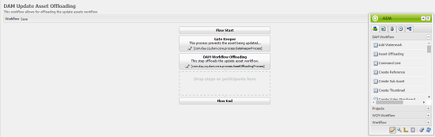
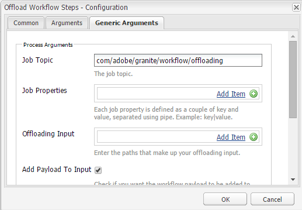

# 資產工作流程卸載程式{#assets-workflow-offloader}

資產工作流程分離程式可讓您啟用多個Adobe Experience Manager(AEM)Assets例項，以降低主要（領導者）例項的處理負載。 處理負載分佈在領導實例和您添加到其中的各種卸載程式（工作器）實例之間。 分配資產的處理負載可提高AEM Assets處理資產的效率和速度。 此外，它還可協助分配專用資源，以處理特定MIME類型的資產。 例如，您可以在拓撲中分配特定節點，以僅處理InDesign資產。

## 配置卸載器拓撲 {#configure-offloader-topology}

使用「配置管理器」(Configuration Manager)為引線實例添加URL，並為引線實例上的連接請求添加卸載程式實例的主機名。

1. 點選／按一下AEM標誌，然後選擇「工 **具** > **作業** > **Web Console** 」以開啟「Configuration Manager」。
1. 從Web主控台中，選取 **Sling** > **拓撲管理**。

   

1. 在「拓撲管理」頁中，點選／按一下「 **配置Discovery.Oak服務** 」連結。

   

1. 在「發現服務配置」頁中，在「拓撲連接器URL」欄位中為引導實例指 **定連接器URL** 。

   

1. 在「拓 **撲連接器白名單** 」欄位中，指定允許與引線實例連接的卸載程式實例的IP地址或主機名。 點選／按一下「 **儲存**」。

   

1. 要查看連接到引線實例的卸載程式實例，請轉至「工 **具** 」>「部署 **」****** >「拓撲」，然後點選／按一下「群集」視圖。

## 停用卸載 {#disable-offloading}

1. 點選／按一下AEM標誌，然後選擇「工 **具** >部 **署** > **卸載**」。 「卸 **載瀏覽器** 」頁顯示主題和可使用主題的伺服器實例。

   

1. 在使用者 *與之互動以上傳或變更AEM資產的領導者例項上，停用com/adobe/granite/workflow/offloading* topic。

   

## 在領導者實例上配置工作流啟動器 {#configure-workflow-launchers-on-the-leader-instance}

設定工作流程啟動程式，以在 **領導者例項上使用「DAM更新資產卸載** 」工作流程，而非 **** 「Dam更新資產」工作流程。

1. 點選／按一下AEM標誌，然後選擇「工具 **>工作流程** > **Workflow** 」(工具>工作流程啟動程 ******** 式)來開啟Workflow HanchilersConsole。

   

1. 分別找到運行「 **DAM Update Asset」(** DAM更新資產)工作流的事件類型為「Node Created **」（已建立節點）和「** Node Modified **** 」（已修改節點）的兩個啟動程式配置。
1. 對於每個配置，選中前面的複選框，然後從工具欄中點選／按一下「查看屬性」( **View Properties** )表徵圖以顯示「啟動器 **屬性」(Launcher Properties** )對話框。

   

1. 從「工 **作流程** 」清單中，選擇「 **DAM更新資產卸載** 」，然後點選／按 **「儲存**」。

   

1. 點選／按一下AEM標誌，然後選擇「工具 **>工作流程** >模型」 **，以開啟「工作流程模********** 型」頁面。
1. 選取「 **DAM更新資產卸載」工作流程** ，並從工具列點選／按一下「 **編輯** 」以顯示其詳細資訊。

   

1. 顯示「 **DAM Workflow Offloading」(** DAM工作流卸載)步驟的上下文菜單 **，然後選擇「**&#x200B;編輯」。 驗證配置對話框 **的「通用參數** 」頁籤 **的「作業主題** 」欄位中的條目。

   

## 在卸載程式實例上禁用工作流啟動程式 {#disable-the-workflow-launchers-on-the-offloader-instances}

禁用在領導實例上運行 **DAM更新資產工作流的工作流啟動程式** 。

1. 點選／按一下AEM標誌，然後選擇「工具 **>工作流程** > **Workflow** 」(工具>工作流程啟動程 ******** 式)來開啟Workflow HanchilersConsole。

   

1. 分別找到運行「 **DAM Update Asset」(** DAM更新資產)工作流的事件類型為「Node Created **」（已建立節點）和「** Node Modified **** 」（已修改節點）的兩個啟動程式配置。
1. 對於每個配置，選中前面的複選框，然後從工具欄中點選／按一下「查看屬性」( **View Properties** )表徵圖以顯示「啟動器 **屬性」(Launcher Properties** )對話框。

   

1. 在「啟 **動** 」區段中，拖曳滑桿以停用工作流程啟動程式，並點選／按一下「 **儲存** 」以停用它。

   

1. 在引線實例上傳任何類型的影像資產。 驗證已卸載實例為資產生成並移植回的縮略圖。

