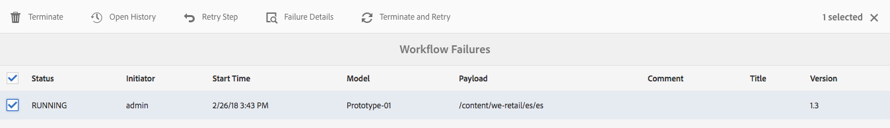
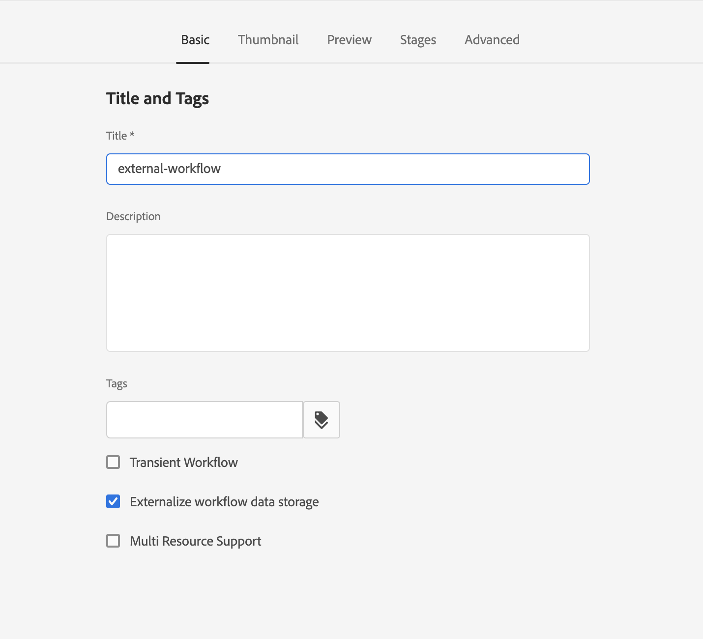

# 管理工作流程例項{#administering-workflow-instances}

工作流控制台提供了幾種用於管理工作流實例的工具，以確保它們按預期執行。

>[!NOTE]
>
>的 [JMX控制台](/help/sites-administering/jmx-console.md#workflow-maintenance) 提供其他工作流維護操作。

一系列控制台可用於管理您的工作流。 使用 [全局導航](/help/sites-authoring/basic-handling.md#global-navigation) 開啟 **工具** ，然後選擇 **工作流**:

* **模型**:管理工作流定義
* **實例**:查看和管理正在運行的工作流實例
* **發射器**:管理工作流的啟動方式
* **存檔**:查看成功完成的工作流的歷史記錄
* **失敗**:查看已完成且出現錯誤的工作流的歷史記錄
* **自動分配**:將工作流自動分配給模板

## 監視工作流實例的狀態 {#monitoring-the-status-of-workflow-instances}

1. 使用導航選擇 **工具**，則 **工作流**。
1. 選擇 **實例** 顯示當前正在進行的工作流實例清單。

   

<!--
## Search Workflow Instances {#search-workflow-instances}

1. Using Navigation select **Tools**, then **Workflow**.
1. Select **Instances** to display the list of workflow instances currently in progress. On the top rail, in the left corner, select **Filters**. Alternatively, you can use the keystrokes alt+1. The following dialog is displayed:

   

1. In the Filter dialog, select the workflow search criteria. You can search based on these inputs:

   * Payload path: Select a specific path
   * Workflow model: Select a workflow model
   * Assignee: Select a workflow Assignee
   * Type: Task, Workflow item, or Workflow Failure
   * Task Status: Active, Complete, or Terminated
   * Where I Am: Owner AND Assignee, Owner only, Assignee only
   * Start Date: Start date before or after a specified date
   * End Date: End date before or after a specified date
   * Due Date: Due date before or after a specified date
   * Updated Date: Updated date before or after a specified date
-->

## 掛起、恢復和終止工作流實例 {#suspending-resuming-and-terminating-a-workflow-instance}

1. 使用導航選擇 **工具**，則 **工作流**。
1. 選擇 **實例** 顯示當前正在進行的工作流實例清單。

   

1. 選擇特定項目，然後使用 **終止**。 **掛起**&#x200B;或 **繼續**，視情況而定。確認和/或更多詳細資訊：

   

## 查看存檔的工作流 {#viewing-archived-workflows}

1. 使用導航選擇 **工具**，則 **工作流**。
1. 選擇 **存檔** 顯示成功完成的工作流實例清單。

   

   >[!NOTE]
   >
   >中止狀態被視為成功終止，因為它是由用戶操作導致的；例如：
   >
   >* 使用 **終止** 動作
   >* 當受工作流約束的頁面被（強制）刪除時，工作流將終止


1. 選擇特定項目，然後 **開啟歷史記錄** 要查看詳細資訊，請執行以下操作：

   

## 修復工作流實例失敗 {#fixing-workflow-instance-failures}

當工作流失敗時，AEM提供 **失敗** 控制台，允許您在處理原始原因後調查並採取相應操作：

* **失敗詳細資訊**
開啟一個窗口以顯示 
**失敗消息**。 **步驟**, **故障堆棧**。

* **開啟歷史記錄**
顯示工作流歷史記錄的詳細資訊。

* **重試步驟** 再次執行指令碼步驟元件實例。 修復原始錯誤的原因後，請使用「重試步驟」命令。 例如，在修復執行「進程步驟」的指令碼中的錯誤後，重試該步驟。
* **終止** 如果錯誤導致工作流出現不可協調的情況，則終止工作流。 例如，工作流可以依賴於環境條件，例如儲存庫中不再對工作流實例有效的資訊。
* **終止並重試** 類似於 **終止** 只是使用原始負載、標題和說明啟動新工作流實例。

要調查故障，然後恢復或終止工作流，請執行以下步驟：

1. 使用導航選擇 **工具**，則 **工作流**。
1. 選擇 **失敗** 顯示未成功完成的工作流實例清單。
1. 選擇特定項目，然後選擇相應的操作：

   

## 定期清除工作流實例 {#regular-purging-of-workflow-instances}

最大限度地減少工作流實例的數量會提高工作流引擎的效能，因此您可以定期從儲存庫中清除已完成或正在運行的工作流實例。

配置 **Adobe花崗岩工作流清除配置** 根據工作流實例的年齡和狀態清除工作流實例。 也可以清除所有模型或特定模型的工作流實例。

您還可以建立服務的多個配置，以清除滿足不同標準的工作流實例。 例如，建立一個配置，當特定工作流模型的實例運行的時間比預期時間長得多時，該配置會清除這些實例。 建立另一個配置，該配置在特定天數後清除所有已完成的工作流，以最小化儲存庫的大小。

要配置服務，可以使用 [Web控制台](/help/sites-deploying/configuring-osgi.md#osgi-configuration-with-the-web-console) 或 [將OSGi配置添加到儲存庫](/help/sites-deploying/configuring-osgi.md#osgi-configuration-in-the-repository)。 下表說明了您對任一方法所需的屬性。

>[!NOTE]
>
>要將配置添加到儲存庫，服務PID為：
>
>`com.adobe.granite.workflow.purge.Scheduler`
>
>由於服務是工廠服務，因此 `sling:OsgiConfig` 節點需要標識符尾碼，例如：
>
>`com.adobe.granite.workflow.purge.Scheduler-myidentifier`

<table>
 <tbody>
  <tr>
   <th>屬性名稱（Web控制台）</th>
   <th>OSGi屬性名稱</th>
   <th>說明</th>
  </tr>
  <tr>
   <td>工作名稱</td>
   <td>scheduledpurge.name</td>
   <td>計劃清除的描述性名稱。</td>
  </tr>
  <tr>
   <td>工作流程狀態</td>
   <td>scheduledpurge.workflowStatus</td>
   <td><p>要清除的工作流實例的狀態。 以下值有效：</p>
    <ul>
     <li>已完成：已完成的工作流實例將被清除。</li>
     <li>正在運行：運行工作流實例將被清除。</li>
    </ul> </td>
  </tr>
  <tr>
   <td>要清除的模型</td>
   <td>scheduledpurge.modelIds</td>
   <td><p>要清除的工作流模型的ID。 ID是指向模型節點的路徑，例如：<br /> /var/workflow/models/dam/update_asset<br /> </p> <p>要指定多個模型，請按一下Web控制台中的+按鈕。 </p> <p>不要指定任何值以清除所有工作流模型的實例。</p> </td>
  </tr>
  <tr>
   <td>工作流時間</td>
   <td>scheduledpurge.daysold</td>
   <td>要清除的工作流實例的時間（天）。</td>
  </tr>
 </tbody>
</table>

## 設定收件箱的最大大小 {#setting-the-maximum-size-of-the-inbox}

通過配置 **Adobe花崗岩工作流服務**，使用 [Web控制台](/help/sites-deploying/configuring-osgi.md#osgi-configuration-with-the-web-console) 或 [將OSGi配置添加到儲存庫](/help/sites-deploying/configuring-osgi.md#osgi-configuration-in-the-repository)。 下表介紹了為任一方法配置的屬性。

>[!NOTE]
>
>要將配置添加到儲存庫，服務PID為：
>
>`com.adobe.granite.workflow.core.WorkflowSessionFactory`。

| 屬性名稱（Web控制台） | OSGi屬性名稱 |
|---|---|
| 最大收件箱查詢大小 | granite.workflow.inboxQuerySize |

## 為客戶擁有的資料儲存庫使用工作流變數 {#using-workflow-variables-customer-datastore}

由工作流處理的資料儲存在Adobe提供的儲存器(JCR)中。 這些資料在本質上是敏感的。 您可能希望將所有用戶定義的元資料/資料保存在您自己的托管儲存中，而不是Adobe提供的儲存中。 以下各節介紹如何為外部儲存設定這些變數。

### 將模型設定為使用元資料的外部儲存 {#set-model-for-external-storage}

在工作流模型的級別，提供一個標誌以指示模型（及其運行時實例）具有元資料的外部儲存。 對於標籤為外部儲存的模型的工作流實例，工作流變數不會永續在JCR中。

屬性 *userMetadataPersistenceEnabled* 將儲存在 *jcr：內容節點* 的子菜單。 此標誌將作為 *cq:userMetaDataCustomPersistenceEnabled*。

下圖顯示如何在工作流上設定標誌。



### 外部儲存中元資料的API {#apis-for-metadata-external-storage}

要將變數儲存到外部，必須實現工作流公開的API。

用戶元資料持久性上下文

以下示例說明如何使用API。

```
@ProviderType
public interface UserMetaDataPersistenceContext {
 
    /**
     * Gets the workflow for persistence
     * @return workflow
     */
    Workflow getWorkflow();
 
    /**
     * Gets the workflow id for persistence
     * @return workflowId
     */
    String getWorkflowId();
 
    /**
     * Gets the user metadata persistence id
     * @return userDataId
     */
    String getUserDataId();
}
```

UserMetaDataPersistenceProvider

```
/**
 * This provider can be implemented to store the user defined workflow-data metadata in a custom storage location
 */
@ConsumerType
public interface UserMetaDataPersistenceProvider {
 
   /**
    * Retrieves the metadata using a unique identifier
    * @param userMetaDataPersistenceContext
    * @param metaDataMap of user defined workflow data metaData
    * @throws WorkflowException
    */
   void get(UserMetaDataPersistenceContext userMetaDataPersistenceContext, MetaDataMap metaDataMap) throws WorkflowException;
 
   /**
    * Stores the given metadata to the custom storage location
    * @param userMetaDataPersistenceContext
    * @param metaDataMap metadata map
    * @return the unique identifier that can be used to retrieve metadata. If null is returned, then workflowId is used.
    * @throws WorkflowException
    */
   String put(UserMetaDataPersistenceContext userMetaDataPersistenceContext, MetaDataMap metaDataMap) throws WorkflowException;
} 
```
