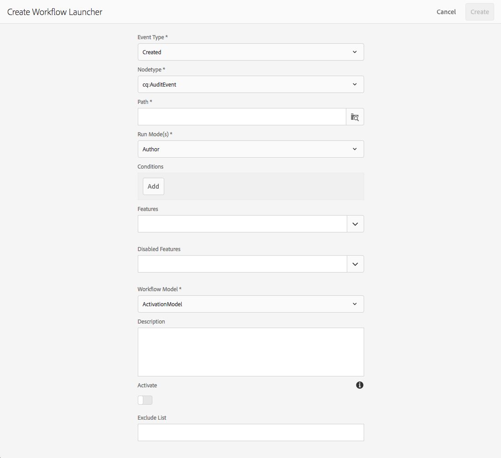

# 啟動工作流程{#starting-workflows}

在管理工作流程時，您可以使用多種方法來啟動工作流程：

* 手動:

   * 從工作流 [模型](#workflow-models)。
   * 使用工作流包進行 [批處理](#workflow-packages-for-batch-processing)。

* 自動：

   * 響應節點變化；使 [用啟動器](#workflows-launchers)。

>[!NOTE]
>
>作者也可使用其他方法；如需完整詳細資訊，請參閱：
>
>* [將工作流程套用至頁面](/help/sites-authoring/workflows-applying.md)
>* [如何將工作流程套用至DAM資產](/help/assets/assets-workflow.md)
>* [AEM Forms](https://helpx.adobe.com/aem-forms/6-2/aem-workflows-submit-process-form.html)
>* [翻譯專案](/help/sites-administering/tc-manage.md)
>

## 工作流程模型 {#workflow-models}

可以根據「工作流 [模型」(Workflow Models)控制台中列出的其中一個模型](/help/sites-administering/workflows.md#workflow-models-and-instances) ，啟動工作流。 唯一的必要資訊是裝載，不過也可以新增標題和／或註解。

## 工作流程啟動器 {#workflows-launchers}

Workflow Launcher會監視內容儲存庫中的更改，以根據更改的節點的位置和資源類型啟動工作流。

使用 **Launcher** ，您可以：

* 請參閱已針對特定節點啟動的工作流程。
* 選擇在建立／修改／刪除特定節點／節點類型時要啟動的工作流。
* 移除現有的工作流程與節點關係。

可以為任何節點建立啟動程式。 不過，對某些節點所做的變更不會啟動工作流程。 變更下列路徑下的節點不會導致工作流程啟動：

* `/var/workflow/instances`
* 任何位於分支中任意位置的工作流收件箱節 `/home/users` 點
* `/tmp`
* `/var/audit`
* `/var/classes`
* `/var/eventing`
* `/var/linkchecker`
* `/var/mobile`
* `/var/statistics`

   * 例外：對下方節點的變 `/var/statistics/tracking` 更 *會導致* 工作流程啟動。

標準安裝中包含各種定義。 這些用於數位資產管理和社交協作工作：

## 批處理的工作流包 {#workflow-packages-for-batch-processing}

工作流程套件是可傳遞至工作流程的套件，做為處理的負載，可處理多個資源。

工作流程套件：

* 包含一組資源（例如頁面、資產）的連結。
* 包含包資訊，如建立日期、建立包的用戶和簡短說明。
* 使用專用頁面範本定義；這些頁面可讓使用者指定套件中的資源。
* 可多次使用。
* 可由使用者（新增或移除資源）在實際執行工作流程例項時進行變更。

## 從「模型控制台」啟動工作流 {#starting-a-workflow-from-the-models-console}

1. 然後使用「工 **具** 」、「工作流 **程」導**&#x200B;航至「模 **型」控******&#x200B;制台。
1. 選擇工作流（根據控制台視圖）;您也可以視需要使用搜尋（左上）:

   

   >[!NOTE]
   >
   >「暫 **[時](/help/sites-developing/workflows.md#transient-workflows)**」指示符顯示不會保存工作流歷史記錄的工作流。

1. 從工 **具列選擇「開始** 」 「工作流」。
1. 將會開啟「執行工作流程」對話方塊，讓您指定：

   * **裝載**

      這可以是頁面、節點、資產、套件，以及其他資源。

   * **標題**

      可選標題，可協助識別此例項。

   * **評論**

      可選注釋，幫助指明此實例的詳細資訊。
   

## 建立啟動器配置 {#creating-a-launcher-configuration}

1. 然後使用工具、工 **作流啟動器** 、Workflow **Sharticles**&#x200B;導覽至Workflow Console ********。
1. 選擇 **建立**，然 **後選擇添加啟動器** ，開啟對話框：

   

   * **事件類型**

      將啟動工作流的事件類型：

      * 建立日期
      * 修改時間
      * 已移除
   * **Notetype**

      工作流啟動程式應用的節點類型。

   * **路徑**

      工作流啟動程式應用的路徑。

   * **執行模式**

      工作流啟動程式應用的伺服器類型。 選取「 **作者**」、「發 **布**」或「作 **者與發佈」**。

   * **條件**

      節點值的條件清單，在評估後，這些條件將確定是否啟動工作流。 例如，當節點具有具有值User的屬性名稱時，以下條件會導致啟動工作流：

      name==User

   * **功能**

      要啟用的功能清單。 使用下拉式選取器選取所需的功能。

   * **停用的功能**
   要停用的功能清單。 使用下拉式選取器選取所需的功能。

   * **工作流程模型**

      當「事件類型」發生在「節點類型」和／或「路徑」上且定義的「條件」下時，要啟動的工作流。

   * **說明**

      您自己的文字，以說明並識別啟動程式設定。

   * **啟動**

      控制是否激活了工作流啟動程式：

      * 選擇「 **啟用** 」(Enable)，在滿足配置屬性時啟動工作流。
      * 選擇 **「在工作流不應執行時禁用** 」（即使在配置屬性滿足時也不能執行）。
   * **排除清單**

      這可指定在決定是否應觸發工作流時要排除的任何JCR事件（即忽略）。

      此啟動程式屬性是以逗號分隔的項目清單：&quot;

      * `property-name` 忽略在 `jcr` 指定屬性名稱上觸發的任何事件。&quot;
      * `event-user-data:<*someValue*>` 忽略任何包含 `*<someValue*`>透過 `user-data` API [`ObservationManager`](https://docs.adobe.com/content/docs/en/spec/jsr170/javadocs/jcr-2.0/javax/jcr/observation/ObservationManager.html#setUserData(java.lang.String)設定的事件。
      例如：

      `jcr:lastModified,dc:modified,dc:format,jcr:lastModifiedBy,imageMap,event-user-data:changedByWorkflowProcess`

      此功能可用來借由新增排除項目，來忽略其他工作流程程式所觸發的任何變更：

      `event-user-data:changedByWorkflowProcess`

1. 選擇 **建立**，建立啟動程式並返回控制台。

   發生適當事件後，啟動程式便會觸發，並啟動工作流程。

## 管理啟動器配置 {#managing-a-launcher-configuration}

建立啟動程式配置後，可以使用相同的控制台來選擇實例，然後選擇「 **View Properties** ( and edit them **)」或「** Delete」。
