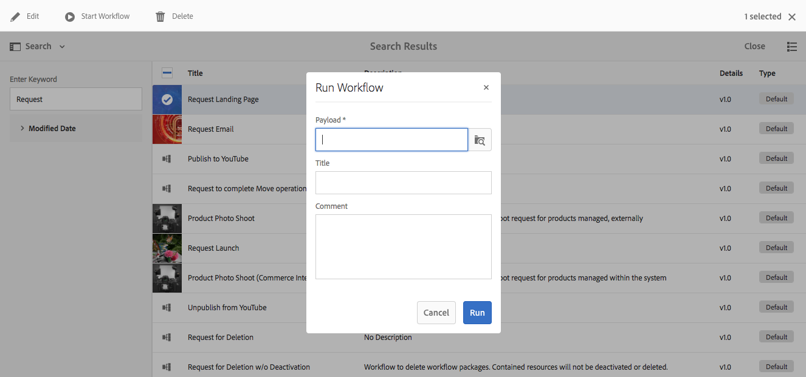

# 開始工作流程{#starting-workflows}

管理工作流程時，您可以使用各種方法來開始：

* 手動:

   * 從 [工作流模型](#workflow-models).
   * 使用工作流程套件 [批次處理](#workflow-packages-for-batch-processing).

* 自動：

   * 響應節點更改； [使用啟動器](#workflows-launchers).

>[!NOTE]
>
>作者也可使用其他方法；如需完整詳細資訊，請參閱：
>
>* [將工作流程套用至頁面](/help/sites-authoring/workflows-applying.md)
>* [如何將工作流程套用至DAM資產](/help/assets/assets-workflow.md)
>* [AEM Forms](https://helpx.adobe.com/aem-forms/6-2/aem-workflows-submit-process-form.html)
>* [翻譯專案](/help/sites-administering/tc-manage.md)
>

## 工作流程模型 {#workflow-models}

您可以啟動工作流程 [基於其中一個模型](/help/sites-administering/workflows.md#workflow-models-and-instances) 列於「工作流模型」控制台中。 唯一的必要資訊是裝載，不過也可以新增標題和/或註解。

## 工作流程啟動器 {#workflows-launchers}

「工作流啟動器」會監視內容儲存庫中的更改，以根據更改的節點的位置和資源類型啟動工作流。

使用 **啟動器** 您可以：

* 請參閱已針對特定節點啟動的工作流程。
* 選取當建立/修改/移除特定節點/節點類型時要啟動的工作流程。
* 移除現有的工作流程對節點關係。

可以為任何節點建立啟動器。 不過，某些節點的變更不會啟動工作流程。 變更下列路徑下的節點，不會導致工作流程啟動：

* `/var/workflow/instances`
* 位於 `/home/users` 分支
* `/tmp`
* `/var/audit`
* `/var/classes`
* `/var/eventing`
* `/var/linkchecker`
* `/var/mobile`
* `/var/statistics`

   * 例外：以下節點的變更 `/var/statistics/tracking` *do* 啟動工作流程。

標準安裝中包含各種定義。 這些用於數位資產管理和社交協作任務：

## 批次處理的工作流程套件 {#workflow-packages-for-batch-processing}

工作流程套件是可傳遞至工作流程作為裝載以進行處理的套件，可處理多個資源。

工作流程套件：

* 包含一組資源（例如頁面、資產）的連結。
* 包含包資訊，如建立日期、建立包的用戶和簡短說明。
* 是使用專用的頁面範本來定義；這些頁面可讓使用者指定套件中的資源。
* 可多次使用。
* 可由使用者變更（新增或移除資源），而實際執行工作流程例項時。

## 從模型控制台啟動工作流 {#starting-a-workflow-from-the-models-console}

1. 導覽至 **模型** 主控台使用 **工具**, **工作流程**，然後 **模型**.
1. 選取工作流程（根據主控台檢視）;如有需要，您也可以使用「搜尋」（左上角）:

   

   >[!NOTE]
   >
   >此 **[暫時](/help/sites-developing/workflows.md#transient-workflows)** 指標顯示不會保存工作流程歷史記錄的工作流程。

1. 選擇 **開始工作流程** 的上界。
1. 將開啟「運行工作流」對話框，允許您指定：

   * **裝載**

      這可以是頁面、節點、資產、套件等資源。

   * **標題**

      可協助識別此例項的選用標題。

   * **評論**

      可選注釋，可協助指出此例項的詳細資訊。
   

## 建立啟動器配置 {#creating-a-launcher-configuration}

1. 導覽至 **工作流程啟動器** 主控台使用 **工具**, **工作流程**，然後 **啟動器**.
1. 選擇 **建立**，然後 **新增啟動器** 要開啟對話框：

   

   * **事件類型**

      將啟動工作流程的事件類型：

      * 建立日期
      * 修改時間
      * 已移除
   * **節點類型**

      工作流啟動器應用的節點類型。

   * **路徑**

      工作流啟動器套用的路徑。

   * **執行模式**

      工作流啟動器應用的伺服器類型。 選擇 **作者**, **發佈**，或 **製作與發佈**.

   * **條件**

      節點值的條件清單，評估後會判斷是否啟動工作流程。 例如，當節點的屬性名稱為「用戶」值時，以下條件會導致工作流啟動：

      name==User

   * **功能**

      要啟用的功能清單。 使用下拉式選取器選取所需的功能。

   * **停用的功能**

   要禁用的功能清單。 使用下拉式選取器選取所需的功能。

   * **工作流程模型**

      在定義的條件下的Nodetype和/或路徑上發生「事件類型」時啟動的工作流程。

   * **說明**

      說明和識別啟動器配置的專屬文字。

   * **啟動**

      控制是否激活工作流啟動器：

      * 選擇 **啟用** 在滿足設定屬性時啟動工作流程。
      * 選擇 **停用** 當工作流程不執行時（即使滿足設定屬性亦然）。
   * **排除清單**

      這會在決定是否應觸發工作流程時，指定要排除的任何JCR事件（即忽略）。

      此啟動器屬性是以逗號分隔的項清單：&quot;

      * `property-name` 忽略 `jcr` 在指定的屬性名稱上觸發的事件。&quot;
      * `event-user-data:<*someValue*>` 會忽略任何包含 `*<someValue*`> `user-data` 透過 [ `ObservationManager` API](https://www.adobe.io/experience-manager/reference-materials/spec/jsr170/javadocs/jcr-2.0/javax/jcr/observation/ObservationManager.html#setUserData(java.lang.String)。

      例如：

      `jcr:lastModified,dc:modified,dc:format,jcr:lastModifiedBy,imageMap,event-user-data:changedByWorkflowProcess`

      此功能可用來透過新增排除項目來忽略其他工作流程程式所觸發的任何變更：

      `event-user-data:changedByWorkflowProcess`

1. 選擇 **建立**，建立啟動器並返回控制台。

   發生適當事件後，啟動器即會觸發，工作流程也會啟動。

## 管理啟動器配置 {#managing-a-launcher-configuration}

建立啟動器配置後，可以使用同一控制台來選擇實例，然後 **檢視屬性** （並加以編輯）或 **刪除**.
