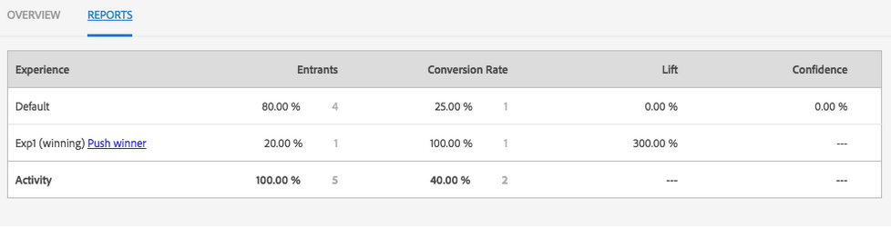

# 管理活動{#managing-activities}

「活動」主控台可讓您建立、組織和管理品牌的行銷[活動](/help/sites-authoring/personalization.md#activities):

* 新增品牌。
* 針對每個品牌新增和設定活動。
* 管理活動。

>[!NOTE]
>
>如果您使用Adobe Target作為定位引擎，您也可以[檢視活動的效能資料](#viewing-performance-and-converting-winning-experiences-a-b-test)。 如果您使用A/B測試，則可以[轉換獲勝者](#viewing-performance-and-converting-winning-experiences-a-b-test)。

在「活動」主控台上，活動會依品牌組織。 您可以使用品牌和資料夾來建構活動的組織。 您可以點選/按一下&#x200B;**個人化**&#x200B;並點選/按一下&#x200B;**活動**，以導覽至「活動」主控台。

活動可在「鎖定目標」模式中，用於[編寫鎖定目標內容](/help/sites-authoring/content-targeting-touch.md)，您也可以在其中建立活動。 您在鎖定目標模式中建立的活動會顯示在「活動」主控台中。

活動會以標籤顯示，說明定義的活動類型：

* XT - Adobe Target體驗鎖定
* A/B - Adobe Target A/B測試
* AEM - Adobe Experience Manager鎖定目標（contexthub或clientcontext driven）

>[!NOTE]
>
>可用的活動類型由下列項目決定：
>
>* 如果在AEM端使用的Adobe Target租用戶(clientcode)上啟用&#x200B;**xt_only**&#x200B;選項以連線至Adobe Target，則您可以在AEM中建立&#x200B;**only** XT活動。
   >
   >
* 如果在Adobe Target租用戶(clientcode)上啟用&#x200B;**xt_only**&#x200B;選項為&#x200B;**not**，則您可以在AEM中建立&#x200B;**兩個** XT和A/B活動。
>
>
**其他附註：** **xt_** onlyoptions是套用於特定Target租用戶(clientcode)的設定，且只能直接在Adobe Target中修改。您無法在AEM中啟用或停用此選項。

>[!CAUTION]
>
>您必須保護發佈執行個體上的活動設定節點&#x200B;**cq:ActivitySettings**，使一般使用者無法存取該節點。 處理活動同步至Adobe Target的服務只應能存取活動設定節點。
>
>如需詳細資訊，請參閱[與Adobe Target整合的必要條件](/help/sites-administering/target-requirements.md#securingtheactivitysettings) 。

## 使用活動控制台{#creating-a-brand-using-the-activities-console}建立品牌

建立您要管理其行銷活動的品牌。

使用活動控制台建立品牌時，該品牌也會顯示在[選件控制台](/help/sites-authoring/offerlib.md)中，您可在其中建立活動體驗的選件。

1. 在導覽主控台中，按一下或點選&#x200B;**個人化**。 按一下或點選「**活動**」。

   

1. 在「活動」主控台中，按一下或點選「**建立**」，然後點選「**建立品牌**」。
1. 選取品牌範本，然後按一下或點選&#x200B;**Next**。
1. 輸入品牌標題，以使其顯示在「活動」和「選件」主控台中。 （可選）鍵入或選擇一個或多個要與品牌關聯的標籤。
1. 按一下或點選&#x200B;**建立**。 您的品牌會顯示在「活動」主控台中。

## 使用活動控制台{#adding-editing-an-activity-using-the-activities-console}新增/編輯活動

新增活動或編輯現有活動，將行銷工作聚焦於特定對象。 建立/編輯活動時，您需指定下列資訊：

* **** 名稱：活動的名稱。
* **** 定位引擎：AEM  或 [Adobe Target](/help/sites-authoring/personalization.md#adobe-target) ，做為目標內容的引擎。

* **** 選擇目標配置： (僅限Adobe Target) 此活動應用來連線至Adobe Target的雲端設定。只有在為「定位引擎」選取Adobe Target時，才會顯示此選項。
* **活動類型：**活動類型 — A/B測試或體驗鎖定目標
* **** 目標：(可選) 活動的說明。
* **** 體驗：對象名稱與您所定位之行銷區段之間的對應。
* **** 流量百分比：如果選取A/B測試，您可以變更每個體驗的流量 (百分比)。
* **** 持續時間：套用活動的時段。
* **** 優先順序：活動的相對優先順序。當活動提供相同使用者區段的內容時，優先順序較高的活動優先。
* **** 目標量度：如果選取Adobe target作為定位引擎，您可以將成功度量新增至活動。需要一個成功度量。

>[!NOTE]
>
>新的Adobe target活動必須在目 ***標內容編輯器中建立*** ，而不是在 **Activity** Console中，因為與Adobe target的同步將會失敗。
>
>不過，您可以在主控台中編輯現有的Adobe Target活動。

若要新增活動：

1. 按一下或點選您要建立活動的品牌，然後按一下或點選「 **建立&#x200B;**然後**&#x200B;建立活動」。 **如果編輯，請在「主版區域」畫面中選取活動，然後按一下或點選「**編輯活動**」。
1. 提供下列資訊，然後按一下或點選&#x200B;**Next**:

   * 活動的名稱。
   * 要使用的定位引擎。 預設會選取ContextHub(AEM)。 如果您需要使用Adobe Target，請在目標內容編輯器中建立活動。
   * 如果您選取Adobe Target作為定位引擎，請選取/編輯要用來連線至Adobe Target的雲端設定。 （請留意勿選取您為雲端設定建立的架構。）
   * （選用）活動的目標或說明。
   * 選取活動類型。

1. 新增一或多個體驗至活動。按一下或點選「 **新增體驗」**。
1. 如果您使用AEM鎖定目標或Adobe Target體驗鎖定目標：

   1. 按一下或點選**選取對象**，然後選取您體驗鎖定的區段。
   1. 按一下或點選「**新增體驗**」，輸入名稱，然後按一下或點選「**確定」**。

   1. 按一下或點選「**Next**」。

   如果您使用Adobe Target A/B測試：

   1. 按一下或點選對象方塊中的鉛筆以選取對象。
   1. 按一下或點選「**新增體驗**」，輸入名稱，然後按一下或點選「**確定」**。

   1. 輸入顯示每個體驗的流量百分比。
   1. 按一下或點選「**Next**」。

1. 若要指定活動何時開始，請使用&#x200B;**Start**&#x200B;下拉式功能表來選取下列其中一個值：

   * **啟動時：** 活動從包含目標內容的頁面啟動時開始。
   * **指定的日期和時間：** 特定時間。選取此選項時，按一下或點選日曆圖示，選取日期，並指定啟動活動的時間。

1. 若要指定活動結束的時間，請使用「結束」下拉式功能表來選取下列其中一個值：

   * **停用時**:活動會在包含目標內容的頁面停用時結束。
   * **指定的日期和時間**:特定時間。選取此選項時，按一下或點選日曆圖示，選取日期，並指定結束活動的時間。

1. 要指定活動的優先順序，請使用滑桿選擇&#x200B;**Low**、**Normal**&#x200B;或&#x200B;**High**。
1. 如果您使用Adobe Target作為定位引擎，請選取您要使用此活動測量的項目。 如需可用成功量度的詳細資訊，請參閱[設定活動和設定目標](/help/sites-authoring/content-targeting-touch.md)。 您必須至少選取一個目標。
1. 按一下或點選「**儲存**」。

   >[!NOTE]
   >
   >建立活動後，您需要發佈它，才能使用。

## 發佈和取消發佈活動{#publishing-and-unpublishing-activities}

您需要發佈活動才能使用。 相反地，您可能會想透過取消發佈來讓活動無法使用。

>[!NOTE]
>
>取消發佈活動時，除非您重新整理頁面，否則活動的狀態不會變更。

若要發佈或取消發佈活動：

1. 按一下或點選品牌，然後是包含您要發佈或取消發佈的活動的區域。
1. 點選或按一下您要發佈或取消發佈之活動旁的圖示。

   

1. 若要發佈，請點選或按一下「**發佈**」。 若要取消發佈，請點選或按一下「**取消發佈**」。 您的活動或活動會發佈或取消發佈，且其狀態會在「活動」主控台中變更（可能需要重新整理）。

## 製作和發佈例項的活動{#activities-on-author-and-publish-instances}

啟用使用Adobe Target目標引擎的活動時，會在發佈例項上建立第二個活動：

* 製作例項上的活動會追蹤製作例項上的活動，對於模擬訪客體驗很實用。 針對此活動記錄的分析只會反映發生在製作例項上的內容。
* 發佈例項上的活動會反映並回應發佈伺服器上的活動。 這是在公開網站上執行的活動。 只有發佈活動與追蹤和分析實際公開網站的使用情況相關。

## 檢視效能和轉換成功體驗（A/B測試）{#viewing-performance-and-converting-winning-experiences-a-b-test}

您可以看到任何Adobe Target活動（XT或A/B）的效能。 如果您使用A/B測試，也可以轉換成功體驗，然後成為預設體驗。

若要檢視活動效能並轉換成功體驗：

1. 在&#x200B;**個人化**&#x200B;中，按一下或點選&#x200B;**活動**&#x200B;以導覽至&#x200B;**活動**&#x200B;主控台。
1. 按一下或點選您要查看其活動的品牌。
1. 選取活動，然後按一下或點選「 **檢視屬性** 」，然後按一下「報表 **** 」標籤，然後選取您要檢視成功體驗之效能/轉換成功體驗的活動。將顯示效能資料。

   

1. 按一下或點選&#x200B;**推播獲勝者**&#x200B;連結，以推送該體驗作為預設體驗。

   轉換獲勝者會執行下列動作：

   * 它會停用目前的活動
   * 修改所有頁面，並以成功體驗的實際內容取代目標內容。 成功體驗的內容會成為正常頁面&#x200B;**中不**&#x200B;定位的一部分。

   

   成功體驗是根據轉換率，在報表中產生更多提升度的體驗。

1. 按一下或點選&#x200B;**是**&#x200B;以確認您要轉換獲勝者、停用目前體驗，並將其取代為獲勝者體驗的內容。

## 與Adobe Target {#synchronizing-activities-with-adobe-target}同步活動

使用Adobe Target定位引擎的活動會與Adobe Target促銷活動同步。 符合下列條件時，活動會自動同步至Adobe Target:

* 活動至少包含一個體驗。
* 至少有一個體驗包含對應的區段和一個選件。
* 活動中的每個體驗都必須有相同數量的選件。

這些條件適用於製作和發佈例項的活動。

同步活動時，會在Adobe Target中建立對應的促銷活動：

* 發佈例項上的活動與對應的Adobe Target促銷活動具有相同名稱。
* 製作例項上的活動與名稱相同且尾碼為`_author`的Target促銷活動對應。

修改活動時，會立即同步作者活動(_A)。 立即同步允許使用Client Context或ContextHub模擬活動。

將活動發佈至AEM發佈例項時，會同步發佈活動。

## 疑難排解活動同步{#troubleshooting-activity-synchronization}

AEM與Adobe Target同步活動時，AEM會包含名為`thirdPartyId`活動的屬性。 此屬性的值以AEM存放庫中活動的路徑為基礎。 Adobe Target中沒有兩個促銷活動可以具有`thirdPartyId`屬性的相同值。 因此，如果Adobe Target中的現有促銷活動（不同類型AB, XT）對`thirdPartyId`使用相同的值，則活動將無法同步。

這種情況可能發生在以下情況下：

1. 活動已建立並與Adobe Target同步。
1. 在另一個AEM例項中，會以相同品牌和使用相同名稱建立活動。 嘗試時，此活動的同步失敗。

這種情況也可能發生在以下情況下：

1. 活動已建立並與Adobe Target同步。 然後在AEM上刪除活動。
1. 活動是在相同品牌下建立，並使用與已刪除活動相同的名稱。 嘗試時，此活動的同步失敗。

為避免同步問題，請一律對活動使用唯一的名稱。 如果活動無法同步，則您可以刪除Adobe Target中的促銷活動（如果未使用該促銷活動，則使用相同名稱）。

>[!NOTE]
>
>在Adobe Target中建立促銷活動時，會為每個促銷活動指派名為`thirdPartyId t`的屬性。 刪除Adobe Target中的促銷活動時，不會刪除`thirdPartyId`。 您無法針對不同類型(AB、XT)的促銷活動重新使用`thirdPartyId`，且無法手動移除。 為避免此問題，請為每個促銷活動命名一個唯一的名稱；因此，無法在不同促銷活動類型中重複使用促銷活動名稱。
>
>如果您在相同的促銷活動類型中使用相同名稱，則會覆寫現有的促銷活動。
>
>如果在同步期間，您會遇到「請求失敗」錯誤。 `thirdPartyId` 已存在，請變更促銷活動名稱並重新同步。
