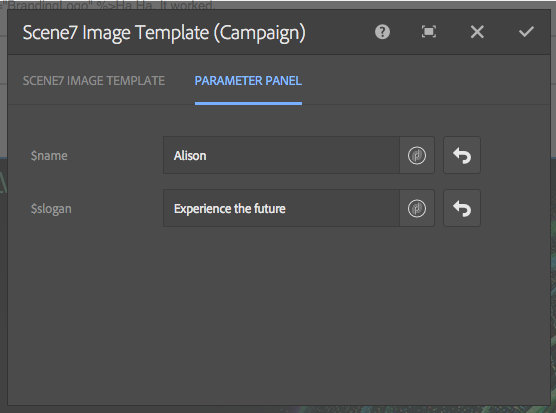
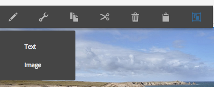
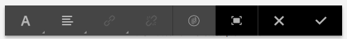
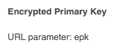
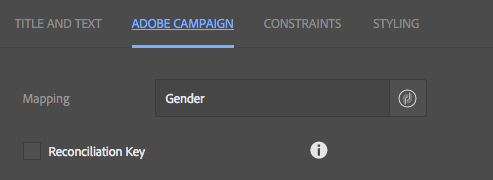

# Adobe Campaign元件{#adobe-campaign-components}

當您與Adobe Campaign整合時，使用電子報和使用表單時，可使用元件。 本檔案將對兩者進行說明。

>[!CAUTION]
>
>已棄用AEM電子郵件元件。 由於電子郵件的性質（可合併內容和樣式）,AEM提供的現成可用電子郵件元件對客戶的重複使用有限，因為需要將自訂樣式實施至專案所需的任何元件中。
>
>您可以在專案層級實作電子郵件元件，而過時的AEM電子郵件元件則說明如何達成此目標。 不過，這些已棄用的元件不應用於專案。

## Adobe Campaign電子報元件 {#adobe-campaign-newsletter-components}

所有Campaign元件都遵循 [電子郵件範本最佳作法](/help/sites-administering/best-practices-for-email-templates.md) 並以Adobe標籤語言為基礎 [HTL](https://helpx.adobe.com/tw/experience-manager/htl/using/overview.html).

當您開啟經設定以與Adobe Campaign整合的電子報/電子郵件時，應會在 **Adobe Campaign電子報** 小節：

* 標題 (行銷活動)
* 影像 (行銷活動)
* 連結 (行銷活動)
* Scene7 影像範本 (行銷活動)
* 目標參考 (行銷活動)
* 文字與影像 (行銷活動)
* 文字與個人化 (行銷活動)

以下章節將介紹這些元件。

元件顯示如下：

### 標題 (行銷活動) {#heading-campaign}

標題元件可以：

* 將 **標題** 欄位空白。
* 顯示您在 **標題** 欄位。

您可以編輯 **標題（促銷活動）** 元件。 留空將使用頁面標題。

您可以設定下列項目：

* **標題**
如果您想使用頁面標題以外的名稱，請在此處輸入。

* **標題級別(1、2、3、4)**
根據HTML標題大小1-4的標題級別。

下列範例顯示要顯示的標題（促銷活動）元件。

### 影像 (行銷活動) {#image-campaign}

影像（促銷活動）元件會根據指定的參數顯示影像和隨附的文字。

您可以上傳影像，然後編輯和操控影像（例如裁切、旋轉、新增連結/標題/文字）。

您可以從 [資產瀏覽器](/help/sites-authoring/author-environment-tools.md#assetsbrowsertouchoptimizedui) 直接放到元件或其上 [配置對話框](/help/sites-authoring/editing-content.md#editconfigurecopycutdeletepastetouchoptimizedui). 您也可以從「設定」對話方塊上傳影像；此對話方塊也會控制影像的所有定義和操作：

>[!NOTE]
>
>您必須在 **替代文字** 欄位，或無法儲存影像。

影像上傳後（而非之前），您可以使用 [置入編輯](/help/sites-authoring/editing-content.md#editcontenttouchoptimizedui) 要根據需要裁切/旋轉影像：

>[!NOTE]
>
>就地編輯器在編輯時使用影像的原始大小和外觀比例。 您也可以指定高度和寬度屬性。 儲存編輯變更時，屬性中定義的任何大小和外觀比例限制都會套用。
>
>根據您的例項，您也可能對 [頁面設計](/help/sites-developing/designer.md);這些項目是在項目實施期間開發的。

全螢幕編輯模式提供其他幾個選項；例如，對應和縮放：

載入影像時，您可以設定下列項目：

* **地圖**
要映射影像，請選擇「映射」。 您可以指定要如何建立影像映射（矩形、多邊形等）以及區域應指向的位置。

* **裁切**
選取「裁切」以裁切影像。 使用滑鼠來裁切影像。

* **旋轉**
要旋轉影像，請選擇「旋轉」。 重複使用，直到影像以您想要的方式旋轉為止。

* **清除**
刪除當前映像。

* 縮放欄（僅限傳統版）若要放大和縮小影像，請使用影像下方的滑動條（位於「確定」和「取消」按鈕上方）
* **標題**
影像的標題。

* **替代文字**
建立可存取的內容時使用的替代文字。

* **連結至**
在您的網站中建立資產或其他頁面的連結。

* **說明**
影像的說明。

* **大小**
設定影像的高度和寬度。

>[!NOTE]
>
>您必須在 **替代文字** 欄位 **進階** 標籤，或影像無法儲存，而您會看到下列錯誤訊息：
>
>`Validation failed. Verify the values of the marked fields.`

下列範例顯示要顯示的影像（促銷活動）元件。

### 連結 (行銷活動) {#link-campaign}

連結（促銷活動）元件可讓您將連結新增至電子報。

您可以在 **顯示**, **URL資訊**，或 **進階** 索引標籤：

* **連結註解**
連結的註解。 這是用戶看到的文本。

* **連結工具提示**
新增如何使用連結的其他資訊。

* **LinkType**
在下拉式清單中，選取 
**自訂URL** 和 **適用性檔案**. 此欄位為必填欄位. 如果您選取自訂URL，則可提供連結URL。 如果選擇「適用性文檔」，則可以提供文檔路徑。

* **其他URL參數**
新增任何其他URL參數。 按一下「新增項目」以新增多個項目。

>[!NOTE]
>
>您必須在 **連結類型** 欄位 **URL資訊** ，或元件無法儲存，而您會看到下列錯誤訊息：
>
>`Validation failed. Verify the values of the marked fields.`

下列範例顯示要顯示的連結（促銷活動）元件。

### Dynamic Media Classic(Scene7)影像範本（行銷活動） {#scene-image-template-campaign}

Dynamic Media Classic(Scene7)影像範本是分層的影像檔案，內容和屬性可根據可變性參數化。 此 **[!UICONTROL 影像範本]** 元件可讓您在電子報中使用Scene7範本，並變更範本參數的值。 此外，您可以在參數內使用Adobe Campaign中繼資料變數，讓每位使用者都能以個人化的方式體驗影像。

按一下 **編輯** 以設定元件。 您可以配置本節所述的設定。 此Scene7影像範本將於 [Scene7影像範本元件](/help/assets/scene7.md#image-template).

此外，參數面板會列出已針對Scene7中的範本定義的所有範本參數。 您可以針對每個參數調整值、插入變數或將它們重設為預設值。

### 目標參考 (行銷活動) {#targeted-reference-campaign}

目標參考（促銷活動）元件可讓您建立目標段落的參考。

在此元件中，導航到目標段落以選擇它。

按一下資料夾圖示以導覽至您要參考的段落。 完成後，按一下複選標籤。

### 文字與影像 (行銷活動) {#text-image-campaign}

文字與影像（促銷活動）元件會新增文字區塊和影像。

按一下以配置元件時，請選擇「文本」或「影像」。

選取 **文字** 顯示內嵌編輯器：

選取 **影像** 顯示影像的就地編輯器：

請參閱 [影像（促銷活動）元件](#image-campaign) ，了解有關使用影像的詳細資訊。 請參閱 [文字與個人化（行銷活動）元件](#text-personalization-campaign) ，了解有關使用文本的詳細資訊。

和文字與個人化（促銷活動）和影像（促銷活動）元件一樣，您可以設定：

* **文字**
輸入文字。 使用工具列來修改格式、建立清單和新增連結。

* **影像**
從內容尋找器拖曳影像，或按一下以瀏覽至影像。 視需要裁切或旋轉。

* **影像屬性** (**進階影像屬性**)可讓您指定下列項目：

   * **標題**
區塊的標題；將以mouseover顯示。

   * **替代文字**
當無法顯示影像時要顯示的替代文字。

   * **連結至**
在您的網站中建立資產或其他頁面的連結。

   * **說明**
影像的說明。

   * **大小**
設定影像的高度和寬度。

>[!NOTE]
>
>此 **替代文字** 欄位 **進階** 索引標籤為必要項目，或元件無法儲存，而您會看到下列錯誤訊息：
>
>`Validation failed. Verify the values of the marked fields.`

下列範例顯示要顯示的文字與影像（促銷活動）元件。

### 文字與個人化 (行銷活動) {#text-personalization-campaign}

文字與個人化（促銷活動）元件可讓您使用WYSIWYG編輯器輸入文字區塊，並搭配 [RTF編輯器](/help/sites-authoring/rich-text-editor.md). 此外，此元件可讓您使用Adobe Campaign提供的內容欄位和個人化區塊；另請參閱 [插入個人化](/help/sites-authoring/campaign.md#inserting-personalization).

通過選擇表徵圖，可以設定文本的格式，包括字型特性、對齊方式、連結、清單和縮進。 功能在 [兩個UI](/help/sites-authoring/editing-content.md)，雖然外觀和風格不同：

在就地編輯器中，您可以新增文字、變更對齊、新增和移除連結、新增內容欄位或個人化區塊，以及進入全螢幕模式。 新增文字/個人化完成後，選取勾號以儲存您的變更（或選取x以取消）。 請參閱 [就地編輯](/help/sites-authoring/editing-content.md#editcontenttouchoptimizedui) 以取得更多資訊。

>[!NOTE]
>
>* 可用的個人化欄位取決於電子報連結的Adobe Campaign範本。
>* 從ContextHub選取角色後，個人化欄位會自動取代為所選設定檔的資料。
>
>請參閱 [插入個人化](/help/sites-authoring/campaign.md#inserting-personalization).

>[!NOTE]
>
>僅限 **nms:seedMember** 架構或其其中一個擴充功能會納入考量。 連結到的表的屬性 **nms:seedMember** 無法使用。

## Adobe Campaign表單元件 {#adobe-campaign-form-components}

您可以使用Adobe Campaign元件建立表單，讓使用者填寫表單以訂閱電子報、取消訂閱電子報，或更新其使用者設定檔。 請參閱 [建立Adobe Campaign Forms](/help/sites-authoring/adobe-campaign-forms.md) 以取得更多資訊。

每個元件欄位都可連結至Adobe Campaign資料庫欄位。 可用欄位會因包含的資料類型而異，如區段所述 [元件和資料類型](#components-and-data-type). 如果您在Adobe Campaign中擴充收件者結構，新欄位將可在資料類型相符的元件中使用。

當您開啟已設定為與Adobe Campaign整合的表單時，您會在 **Adobe Campaign** 小節：

* 核取方塊 (行銷活動)
* 日期欄位（促銷活動）和日期欄位/HTML5（促銷活動）
* 加密的主要金鑰 (行銷活動)
* 錯誤顯示 (行銷活動)
* 隱藏調解金鑰 (行銷活動)
* 數值欄位 (行銷活動)
* 選項欄位 (行銷活動)
* 訂閱檢查清單 (行銷活動)
* 測試欄位 (行銷活動)

元件顯示如下：

本節詳細說明每個元件。

### 元件和資料類型 {#components-and-data-type}

下表說明可用於顯示和修改Adobe Campaign設定檔資料的元件。 每個元件都可對應至Adobe Campaign設定檔欄位，以顯示其值，並在提交表單時更新欄位。 不同的元件只能與適當資料類型的欄位匹配。

<table>
 <tbody>
  <tr>
   <td>
<strong>Component</strong>
 </td>
   <td>
<strong>Adobe Campaign欄位的資料類型</strong>
 </td>
   <td>
<strong>範例欄位</strong>
 </td>
  </tr>
  <tr>
   <td>
核取方塊 (行銷活動)
 </td>
   <td>
布林值
 </td>
   <td>
不再聯絡（透過任何管道）
 </td>
  </tr>
  <tr>
   <td>
日期欄位 (行銷活動)
 
日期欄位/HTML 5 (行銷活動)
 </td>
   <td>
日期
 </td>
   <td>
出生日期
 </td>
  </tr>
  <tr>
   <td>
數值欄位 (行銷活動)
 </td>
   <td>
數值（位元組、短、長、雙）
 </td>
   <td>
年齡
 </td>
  </tr>
  <tr>
   <td>
選項欄位 (行銷活動)
 </td>
   <td>
關聯值的位元組
 </td>
   <td>
性別
 </td>
  </tr>
  <tr>
   <td>
測試欄位 (行銷活動)
 </td>
   <td>
字串
 </td>
   <td>
電子郵件
 </td>
  </tr>
 </tbody>
</table>

### 大多數元件的共同設定 {#settings-common-to-most-components}

Adobe Campaign元件具有所有元件中通用的設定（加密主鍵和隱藏協調鍵元件除外）。

在大部分元件中，您可以設定下列項目：

#### 標題和文字 {#title-and-text}

* **標題**
如果您想使用元素名稱以外的名稱，請在此處輸入。

* **隱藏標題**
如果您不想看到標題，請選取此核取方塊。

* **說明**
新增說明至欄位，以提供使用者的詳細資訊。

* **僅顯示值**
僅顯示值（如果有）

#### Adobe Campaign {#adobe-campaign}

您可以設定下列項目：

* **對應**
視需要選取Adobe Campaign個人化欄位。

* **調解金鑰**
如果此欄位是調解金鑰的一部分，請選取此核取方塊。

#### 限制 {#constraints}

* **必填** 選中此複選框可使此元件成為必需元件；也就是說，使用者必須輸入值。
* **必要訊息** （可選）新增訊息，指出欄位為必要欄位。

#### 樣式 {#styling}

* **CSS**
輸入要用於此元件的CSS類。

### 核取方塊 (行銷活動) {#checkbox-campaign}

核取方塊（促銷活動）元件可讓使用者修改布林值資料類型的Adobe Campaign設定檔欄位。 例如，您可以有核取方塊（促銷活動）元件，讓收件者指定他/她不想透過任何管道聯絡。

您可以 [設定大部分Adobe Campaign元件的共同設定](#settings-common-to-most-components) (在核取方塊（促銷活動）元件中)。

下列範例顯示要顯示的核取方塊（促銷活動）元件。

### 日期欄位（促銷活動）和日期欄位/HTML5（促銷活動） {#date-field-campaign-and-date-field-html-campaign}

使用日期欄位可讓收件者知道日期；例如，您可能希望收件者指定其出生日期。 日期格式符合您的Adobe Campaign例項中使用的格式。

除 [大部分Adobe Campaign元件通用的設定](#settings-common-to-most-components)，您可以設定下列項目：

* **限制 — 限制** 下拉式清單中選取 —  **無** 或 **日期 —** 添加日期的約束或無約束。 如果選擇日期，輸入欄位的答案用戶必須採用日期格式。

* **約束消息** 此外，您可以新增限制訊息，讓使用者了解如何正確設定其答案的格式。
* **樣式 — 寬度** 按一下或點選 **+** 和 **-** 表徵圖或輸入數字。

下列範例顯示日期欄位（促銷活動）元件，並顯示調整寬度的元件。

### 加密的主要金鑰 (行銷活動) {#encrypted-primary-key-campaign}

此元件會定義URL參數的名稱，該參數將包含Adobe Campaign設定檔的識別碼(**主要資源標識符** 或 **加密的主密鑰** 分別在Adobe Campaign Standard和6.1中)。

顯示和修改Adobe Campaign設定檔資料的每個表單 **必須** 包含加密的主鍵元件。

您可以在加密的主要金鑰（促銷活動）元件中設定下列項目：

* **標題和文字 — 元素名稱** 預設為encryptedPK。 只有當元素名稱與表單上其他元素的名稱衝突時，您才需要變更元素名稱。 沒有兩個表單欄位可以有相同的元素名稱。
* **Adobe Campaign - URL參數** 為EPK添加URL參數。 例如，您可以使用 **epk**.

下列範例顯示加密的主要金鑰（促銷活動）元件。

### 錯誤顯示 (行銷活動) {#error-display-campaign}

此元件可讓您顯示後端錯誤。 表單的錯誤處理必須設為「轉送」，才能讓元件正常運作。

下列範例顯示顯示的錯誤顯示（促銷活動）元件。

### 隱藏調解金鑰 (行銷活動) {#hidden-reconciliation-key-campaign}

隱藏調解金鑰（促銷活動）元件可讓您將隱藏欄位新增為表單調解金鑰的一部分。

您可以在隱藏調解金鑰（促銷活動）元件中設定下列項目：

* **標題和文字 — 元素名稱** 預設為reconcilKey。 只有當元素名稱與表單上其他元素的名稱衝突時，您才需要變更元素名稱。 沒有兩個表單欄位可以有相同的元素名稱。
* **Adobe Campaign — 對應** 對應至Adobe Campaign個人化欄位。

下列範例顯示隱藏調解金鑰（促銷活動）元件。

### 數值欄位 (行銷活動) {#numeric-field-campaign}

使用數值欄位可讓收件者輸入數字，例如其年齡。

除 [大部分Adobe Campaign元件通用的設定](#settings-common-to-most-components)，您可以設定下列項目：

* **限制 — 限制** 下拉式清單中選取 —  **無** 或 **數值 —** 添加數字或無約束的約束。 如果選擇數字，則在欄位中輸入的答案必須是數字。

* **約束消息** 此外，您可以新增限制訊息，讓使用者了解如何正確設定其答案的格式。
* **樣式 — 寬度** 按一下或點選 **+** 和 **-** 表徵圖或輸入數字。

下列範例顯示數值欄位（促銷活動）元件，並顯示設定的寬度。

### 選項欄位 (行銷活動) {#option-field-campaign}

此下拉式清單可讓您選取選項；例如，收件者的性別或狀態。

您可以 [設定大部分Adobe Campaign元件的共同設定](#settings-common-to-most-components) (在選項欄位（促銷活動）元件中)。 若要填入下拉式清單，請按一下或點選Adobe Campaign符號，然後導覽至欄位，在Adobe Campaign個人化欄位中選取適當欄位。

下列範例顯示要顯示的選項欄位（促銷活動）元件。

### 訂閱檢查清單 (行銷活動) {#subscriptions-checklist-campaign}

使用 **訂閱檢查清單(Campaign)** 元件，修改與Adobe Campaign設定檔相關聯的訂閱。

新增至表單時，此元件會將所有可用的訂閱顯示為核取方塊，並讓使用者選取所需的訂閱。 當使用者提交表單時，此元件會根據表單動作類型，將使用者訂閱或取消訂閱所選服務(**Adobe Campaign:訂閱服務** 或 **Adobe Campaign:取消訂閱服務**)。

>[!NOTE]
>
>元件不會檢查使用者已訂閱/取消訂閱的服務。

您可以 [設定大部分Adobe Campaign元件的共同設定](#settings-common-to-most-components) (在訂閱檢查清單（促銷活動）元件中)。 (此元件沒有可用的Adobe Campaign設定。)

下列範例顯示訂閱檢查清單（促銷活動）元件。

### 測試欄位 (行銷活動) {#text-field-campaign}

文字欄位（促銷活動）元件可讓您輸入字串類型資料，例如名字、姓氏、地址、電子郵件地址等。

除 [大部分Adobe Campaign元件通用的設定](#settings-common-to-most-components)，您可以設定下列項目：

* **限制 — 限制** 下拉式清單中選取 —  **無，** **電子郵件**，或 **名稱** （無變號） — 新增電子郵件地址、名稱或無限制的限制。 如果您選取電子郵件，使用者在欄位中輸入的答案必須是電子郵件地址。 如果您選取名稱，則必須是名稱（不允許變數）。

* **約束消息** 此外，您可以新增限制訊息，讓使用者了解如何正確設定其答案的格式。
* **樣式 — 寬度** 按一下或點選 **+** 和 **-** 表徵圖或輸入數字。

下列範例顯示顯示的文字欄位（促銷活動）元件。

