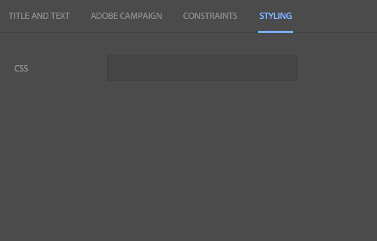
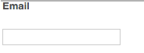

# Adobe Campaign元件{#adobe-campaign-components}

當您與Adobe Campaign整合時，有可用於處理電子報和表單的元件。 本檔案將對兩者進行說明。

>[!CAUTION]
>
>AEM電子郵件元件已過時。 由於電子郵件的性質將內容與樣式合併，AEM提供的現成可用電子郵件元件對客戶的重複使用有限，因為客戶需要將自訂樣式建置在專案所需的任何元件中。
>
>電子郵件元件可在專案層級實作，而過時的AEM電子郵件元件則說明如何實現。 不過，這些已過時的元件不應用於專案。

## Adobe Campaign電子報元件{#adobe-campaign-newsletter-components}

所有促銷活動元件都遵循[電子郵件範本最佳實務](/help/sites-administering/best-practices-for-email-templates.md)中概述的最佳實務，並以Adobe標籤語言[HTL](https://helpx.adobe.com/experience-manager/htl/using/overview.html)為基礎。

當您開啟已設定為與Adobe Campaign整合的電子報／電子郵件時，應在&#x200B;**Adobe Campaign電子報**&#x200B;區段中看到下列元件：

* 標題 (行銷活動)
* 影像 (行銷活動)
* 連結 (行銷活動)
* Scene7 影像範本 (行銷活動)
* 目標參考 (行銷活動)
* 文字與影像 (行銷活動)
* 文字與個人化 (行銷活動)

以下章節將說明這些元件。

這些元件如下所示：

### 標題 (行銷活動) {#heading-campaign}

標題元件可以：

* 將&#x200B;**Title**&#x200B;欄位留空，以顯示目前頁面的名稱。
* 顯示您在&#x200B;**Title**&#x200B;欄位中指定的文字。

您可以直接編輯&#x200B;**標題（促銷活動）**&#x200B;元件。 留空將使用頁面標題。

您可以設定下列項目：

* **標**
題如果您想要使用頁面標題以外的名稱，請在此處輸入。

* **標題層級(1、2、3、4)根**
據HTML標題大小1-4的標題層級。

下列範例顯示所顯示的標題（促銷活動）元件。

### 影像 (行銷活動) {#image-campaign}

影像（促銷活動）元件會根據指定的參數顯示影像和隨附的文字。

您可以上傳影像，然後加以編輯和操控（例如裁切、旋轉、新增連結／標題／文字）。

您可以直接將影像從[資產瀏覽器](/help/sites-authoring/author-environment-tools.md#assetsbrowsertouchoptimizedui)拖放至元件或其[設定對話方塊](/help/sites-authoring/editing-content.md#editconfigurecopycutdeletepastetouchoptimizedui)。 您也可以從「設定」對話方塊上傳影像；此對話方塊也控制影像的所有定義和控制：

>[!NOTE]
>
>您必須在&#x200B;**Alt Text**&#x200B;欄位中輸入資訊，否則無法儲存影像。

上傳影像後（而非之前），您可以視需要使用[就地編輯](/help/sites-authoring/editing-content.md#editcontenttouchoptimizedui)來裁切／旋轉影像：

>[!NOTE]
>
>就地編輯器在編輯時會使用影像的原始大小和外觀比例。 您也可以指定高度和寬度屬性。 儲存編輯變更時，會套用屬性中定義的任何大小和外觀比例限制。
>
>視您的例項而定，頁面的[設計可能也會施加最小和最大限制；這些是在項目實施期間開發的。](/help/sites-developing/designer.md)

在全螢幕編輯模式中，還有幾種其他選項可供選擇；例如，映射和縮放：

載入影像時，您可以設定下列項目：

* **映**
射要映射影像，請選擇映射。您可以指定要如何建立影像地圖（矩形、多邊形等），以及區域應指向的位置。

* **裁**
切選擇裁切可裁切影像。使用滑鼠來裁切影像。

* **旋**
轉若要旋轉影像，請選取「旋轉」。重複使用，直到影像依您想要的方式旋轉為止。

* **清**
除移除目前影像。

* 縮放列（僅限傳統版）
若要放大或縮小影像，請使用影像下方的投影片列（位於「確定」和「取消」按鈕上方）
* **標**
題影像的標題。

* **替代**
文字建立可存取內容時使用的替代文字。

* **連結**
以建立網站內資產或其他頁面的連結。

* **說**
明影像的說明。

* **大**
小設定影像的高度和寬度。

>[!NOTE]
>
>您必須在&#x200B;**Advanced**&#x200B;標籤的&#x200B;**Alt Text**&#x200B;欄位中輸入資訊，否則影像無法儲存，而您會看到下列錯誤訊息：
>
>`Validation failed. Verify the values of the marked fields.`

下列範例顯示顯示的影像（促銷活動）元件。

### 連結 (行銷活動) {#link-campaign}

連結（促銷活動）元件可讓您新增電子報的連結。

您可以在&#x200B;**Display**、**URL資訊**&#x200B;或&#x200B;**Advanced**&#x200B;標籤中設定下列項目：

* **連結**
標題連結的標題。這是使用者看到的文字。

* **連結工**
具提示新增有關如何使用連結的其他資訊。

* **LinkType**
在下拉式清單中，在 
**自訂** URL和 **最適化檔案**。此欄位為必填欄位. 如果您選取「自訂URL」，則可提供「連結URL」。 如果選擇「最適化文檔」，則可以提供文檔路徑。

* **其他URL參**
數新增任何其他URL參數。按一下「新增項目」以新增多個項目。

>[!NOTE]
>
>您必須在&#x200B;**URL資訊**&#x200B;標籤的&#x200B;**連結類型**&#x200B;欄位中輸入資訊，或元件無法儲存，您會看到下列錯誤訊息：
>
>`Validation failed. Verify the values of the marked fields.`

下列範例顯示所顯示的連結（促銷活動）元件。

### Scene7 影像範本 (行銷活動) {#scene-image-template-campaign}

[Scene7 Image ](https://help.adobe.com/en_US/scene7/using/WS60B68844-9054-4099-BF69-3DC998A04D3C.html) Template是分層的影像檔案，其中內容和屬性可以參數化，以利變數。**影像範本**&#x200B;元件可讓您在電子報中使用Scene7範本，並變更範本參數的值。 此外，您可以在參數內使用Adobe Campaign中繼資料變數，讓每位使用者都能以個人化方式體驗影像。

按一下&#x200B;**編輯**&#x200B;配置元件。 您可以設定本節所述的設定。 [Scene7 Image Template元件](/help/assets/scene7.md#image-template)中詳細說明了此Scene7 Image範本。

此外，參數面板會列出已在Scene7中為範本定義的所有範本參數。 對於這些參數，您可以調整值、插入變數或將它們重設為預設值。

### 目標參考 (行銷活動) {#targeted-reference-campaign}

定位參考（促銷活動）元件可讓您建立定位段落的參考。

在此元件中，您導航到要選擇的目標段落。

按一下檔案夾圖示，以導覽至您要參照的段落。 完成後，按一下勾號。

### 文字與影像 (行銷活動) {#text-image-campaign}

文字與影像（促銷活動）元件會新增文字區塊和影像。

按一下以設定元件時，您會選取「文字」或「影像」。

選擇&#x200B;**Text**&#x200B;會顯示行內編輯器：

選擇&#x200B;**Image**&#x200B;會顯示影像的就地編輯器：

如需使用影像的詳細資訊，請參閱[影像（促銷活動）元件](#image-campaign)。 如需使用文字的詳細資訊，請參閱[文字與個人化（促銷活動）元件](#text-personalization-campaign)。

和「文字與個人化」（促銷活動）和「影像」（促銷活動）元件一樣，您可以設定：

* **文**
字輸入文字。使用工具列來修改格式、建立清單和新增連結。

* **影**
像從內容搜尋器拖曳影像，或按一下以瀏覽至影像。視需要裁切或旋轉。

* **影像屬性** (進&#x200B;**階影像屬性**)可讓您指定下列項目：

   * **標**
題區塊標題；將會以mouseover顯示。

   * **Alt**
Text如果無法顯示影像，則顯示替代文字。

   * **連結**
至建立網站內資產或其他頁面的連結。

   * **說**
明影像的說明。

   * **大**
小設定影像的高度和寬度。

>[!NOTE]
>
>**Advanced**&#x200B;標籤中的&#x200B;**Alt Text**&#x200B;欄位是必要項目，或者元件無法儲存，您會看到下列錯誤訊息：
>
>`Validation failed. Verify the values of the marked fields.`

下列範例顯示顯示的文字與影像（促銷活動）元件。

### 文字與個人化 (行銷活動) {#text-personalization-campaign}

「文字與個人化（促銷活動）」元件可讓您使用WYSIWYG編輯器輸入文字區塊，其功能由[Rich Text編輯器](/help/sites-authoring/rich-text-editor.md)提供。 此外，此元件可讓您使用Adobe Campaign提供的內容欄位和個人化區塊；另請參閱[插入個人化](/help/sites-authoring/campaign.md#inserting-personalization)。

選取圖示可讓您設定文字的格式，包括字型特性、對齊方式、連結、清單和縮排。 在[兩個UI中，功能基本相同，但外觀和感覺不同：](/help/sites-authoring/editing-content.md)

在就地編輯器中，您可以新增文字、變更對齊方式、新增和移除連結、新增內容欄位或個人化區塊，以及進入全螢幕模式。 新增文字／個人化後，選取核取標籤以儲存變更（或x以取消）。 如需詳細資訊，請參閱[就地編輯](/help/sites-authoring/editing-content.md#editcontenttouchoptimizedui)。

>[!NOTE]
>
>* 可用的個人化欄位取決於您的電子報所連結的Adobe Campaign範本。
>* 從ContextHub選擇角色後，個人化欄位會自動由選取的描述檔資料取代。

>
>
請參閱[插入個人化](/help/sites-authoring/campaign.md#inserting-personalization)。

>[!NOTE]
>
>只考慮&#x200B;**nms:seedMember**&#x200B;架構中定義的欄位或其中一個副檔名。 連結到&#x200B;**nms:seedMember**&#x200B;的表的屬性不可用。

## Adobe Campaign表單元件{#adobe-campaign-form-components}

您可以使用Adobe Campaign元件來建立表單，讓使用者填寫表單以訂閱電子報、取消訂閱電子報或更新其使用者設定檔。 如需詳細資訊，請參閱[建立Adobe Campaign Forms](/help/sites-authoring/adobe-campaign-forms.md)。

每個元件欄位都可連結至Adobe Campaign資料庫欄位。 可用欄位會依[元件與資料類型](#components-and-data-type)一節所述的資料類型而有所不同。 如果您在Adobe Campaign中擴充收件者結構，新欄位將可用於資料類型相符的元件。

當您開啟已設定為與Adobe Campaign整合的表單時，您會在&#x200B;**Adobe Campaign**&#x200B;區段中看到下列元件：

* 核取方塊 (行銷活動)
* 日期欄位（促銷活動）和日期欄位/HTML5（促銷活動）
* 加密的主要金鑰 (行銷活動)
* 錯誤顯示 (行銷活動)
* 隱藏調解金鑰 (行銷活動)
* 數值欄位 (行銷活動)
* 選項欄位 (行銷活動)
* 訂閱檢查清單 (行銷活動)
* 測試欄位 (行銷活動)

這些元件如下所示：

本節詳細說明每個元件。

### 元件和資料類型{#components-and-data-type}

下表說明可用來顯示和修改Adobe Campaign描述檔資料的元件。 每個元件都可對應至Adobe Campaign描述檔欄位，以顯示其值，並在提交表單時更新欄位。 不同的元件只能與適當資料類型的欄位相符。

<table>
 <tbody>
  <tr>
   <td>
<strong>元件</strong>
 </td>
   <td>
<strong>Adobe Campaign欄位的資料類型</strong>
 </td>
   <td>
<strong>範例欄位</strong>
 </td>
  </tr>
  <tr>
   <td>
核取方塊 (行銷活動)
 </td>
   <td>
布林值
 </td>
   <td>
不再聯絡（透過任何管道）
 </td>
  </tr>
  <tr>
   <td>
日期欄位 (行銷活動)
 
日期欄位/HTML 5 (行銷活動)
 </td>
   <td>
日期
 </td>
   <td>
出生日期
 </td>
  </tr>
  <tr>
   <td>
數值欄位 (行銷活動)
 </td>
   <td>
數字（位元組、短、長、雙）
 </td>
   <td>
年齡
 </td>
  </tr>
  <tr>
   <td>
選項欄位 (行銷活動)
 </td>
   <td>
位元組，關聯值
 </td>
   <td>
性別
 </td>
  </tr>
  <tr>
   <td>
測試欄位 (行銷活動)
 </td>
   <td>
字串
 </td>
   <td>
電子郵件
 </td>
  </tr>
 </tbody>
</table>

### 大多數元件的常用設定{#settings-common-to-most-components}

Adobe Campaign元件具有所有元件（加密的主要金鑰和隱藏的協調金鑰元件除外）中通用的設定。

在大部分元件中，您可以設定下列項目：

#### 標題和文字 {#title-and-text}

* **標**
題如果要使用元素名稱以外的名稱，請在此處輸入。

* **隱藏**
標題如果您不想看到標題，請選取此核取方塊。

* **說**
明將說明新增至欄位，以提供使用者的詳細資訊。

* **僅顯示**
值僅顯示值（如果有）

#### Adobe Campaign {#adobe-campaign}

您可以設定下列項目：

* **對**
應選擇Adobe Campaign個人化欄位（如果適用）。

* **協調**
鍵如果該欄位是協調鍵的一部分，請選中此複選框。

#### 限制 {#constraints}

* **必** 要選中此複選框可使此元件成為必需元件；即，用戶必須輸入值。
* **必要** 訊息（可選）新增訊息，指出欄位為必要欄位。

#### 樣式 {#styling}

* **CSSE輸**
入您要用於此元件的CSS類別。

### 核取方塊 (行銷活動) {#checkbox-campaign}

核取方塊（促銷活動）元件可讓使用者修改布林資料類型的Adobe Campaign描述檔欄位。 例如，您可以有核取方塊（促銷活動）元件，讓收件者指定不想透過任何渠道聯絡。

您可以在核取方塊（促銷活動）元件中，[設定大部分Adobe Campaign元件的共同設定。](#settings-common-to-most-components)

下列範例顯示顯示的核取方塊（促銷活動）元件。

### 日期欄位（促銷活動）和日期欄位/HTML 5（促銷活動）{#date-field-campaign-and-date-field-html-campaign}

使用日期欄位可讓收件者知道日期；例如，您可能希望收件者指定其出生日期。 日期格式與Adobe Campaign例項中使用的格式相符。

除了大部分Adobe Campaign元件常用的[設定外，您也可以設定下列項目：](#settings-common-to-most-components)

* **約束-** 約束下拉式選擇——非 **** 日 **期——可** 以添加日期約束或無約束。如果您選擇日期，輸入欄位的答案使用者必須使用日期格式。

* **約束** 消息此外，還可以添加約束消息，以便用戶瞭解如何正確格式化其答案。
* **樣式-** 寬度按一下或點選+和圖示或輸入數字，調 ****  **** 整欄位的寬度。

下列範例顯示「日期欄位（促銷活動）」元件，並顯示寬度已調整。

### 加密的主要金鑰 (行銷活動) {#encrypted-primary-key-campaign}

此元件定義URL參數的名稱，其中將包含Adobe Campaign設定檔的識別碼（分別位於Adobe Campaign Standard和6.1中的「主要資源識別碼」**或「加密的主金鑰」**）。****

每個顯示和修改Adobe Campaign描述檔資料&#x200B;**的表單都必須**&#x200B;包含加密的主要金鑰元件。

您可以在「加密的主要金鑰（促銷活動）」元件中設定下列項目：

* **標題和文本——元素名** 稱預設為encryptedPK。只有當元素名稱與表單上其他元素的名稱衝突時，您才需要變更元素名稱。 沒有兩個表單欄位可以有相同的元素名稱。
* **Adobe Campaign - URL參** 數新增EPK的URL參數。例如，您可以使用值&#x200B;**epk**。

下列範例顯示所顯示的加密主要金鑰（促銷活動）元件。

### 錯誤顯示 (行銷活動) {#error-display-campaign}

此元件可讓您顯示後端錯誤。 表單的錯誤處理必須設為「轉送」，以讓元件正常運作。

下列範例顯示所顯示的錯誤顯示（促銷活動）元件。

### 隱藏調解金鑰 (行銷活動) {#hidden-reconciliation-key-campaign}

「隱藏的協調鍵（促銷活動）」元件可讓您新增隱藏欄位，作為協調鍵的一部分至表單。

您可以在隱藏的協調金鑰（促銷活動）元件中設定下列項目：

* **標題和文字——元素名稱** 預設為reconcilKey。只有當元素名稱與表單上其他元素的名稱衝突時，您才需要變更元素名稱。 沒有兩個表單欄位可以有相同的元素名稱。
* **Adobe Campaign -** MappingMap至Adobe Campaign個人化欄位。

以下範例顯示顯示的隱藏協調金鑰（促銷活動）元件。

### 數值欄位 (行銷活動) {#numeric-field-campaign}

使用數字欄位可讓收件者輸入數字，例如其年齡。

除了大部分Adobe Campaign元件常用的[設定外，您也可以設定下列項目：](#settings-common-to-most-components)

* **約束-** 約束下拉式選擇——非 **** 或 **數值——可** 以添加數字或無約束的約束。如果選擇數字，則用戶輸入欄位的答案必須是數字。

* **約束** 消息此外，還可以添加約束消息，以便用戶瞭解如何正確格式化其答案。
* **樣式-** 寬度按一下或點選+和圖示或輸入數字，調 ****  **** 整欄位的寬度。

下列範例顯示設定寬度的數值欄位（促銷活動）元件。

### 選項欄位 (行銷活動) {#option-field-campaign}

此下拉式清單可讓您選取選項；例如，收件者的性別或狀態。

您可以在「選項欄位（促銷活動）」元件中，[設定大多數Adobe Campaign元件的共同設定。 ](#settings-common-to-most-components)若要填入下拉式清單，請按一下或點選Adobe Campaign符號並導覽至欄位，以在Adobe Campaign個人化欄位中選取適當的欄位。

下列範例顯示所顯示的選項欄位（促銷活動）元件。

### 訂閱檢查清單 (行銷活動) {#subscriptions-checklist-campaign}

使用&#x200B;**訂閱檢查清單（促銷活動）**&#x200B;元件來修改與Adobe Campaign設定檔相關的訂閱。

新增至表單時，此元件會將所有可用的訂閱顯示為核取方塊，並讓使用者選取所需的訂閱。 當使用者送出表單時，此元件會根據表單動作類型(**Adobe Campaign:訂閱服務**&#x200B;或&#x200B;**Adobe Campaign:取消訂閱服務**)。

>[!NOTE]
>
>該元件不檢查用戶已訂閱／取消訂閱的服務。

您可以在「訂閱檢查清單（促銷活動）」元件中，[設定大部分Adobe Campaign元件的共同設定。 ](#settings-common-to-most-components)（此元件沒有可用的Adobe Campaign設定。）

下列範例顯示所顯示的訂閱檢查清單（促銷活動）元件。

### 測試欄位 (行銷活動) {#text-field-campaign}

文字欄位（促銷活動）元件，可讓您輸入字串類型資料，例如名字、姓氏、位址、電子郵件地址等。

除了大部分Adobe Campaign元件常用的[設定外，您也可以設定下列項目：](#settings-common-to-most-components)

* **約束-** 約束下拉式選擇- **無、電子郵件** **、**&#x200B;名稱 **** （無變母）-可添加電子郵件地址、名稱或無約束的約束。如果您選擇電子郵件，使用者輸入欄位的答案必須是電子郵件地址。 如果您選取名稱，則必須是名稱（不允許變母音）。

* **約束** 消息此外，還可以添加約束消息，以便用戶瞭解如何正確格式化其答案。
* **樣式-** 寬度按一下或點選+和圖示或輸入數字，調 ****  **** 整欄位的寬度。

下列範例顯示顯示的文字欄位（促銷活動）元件。

