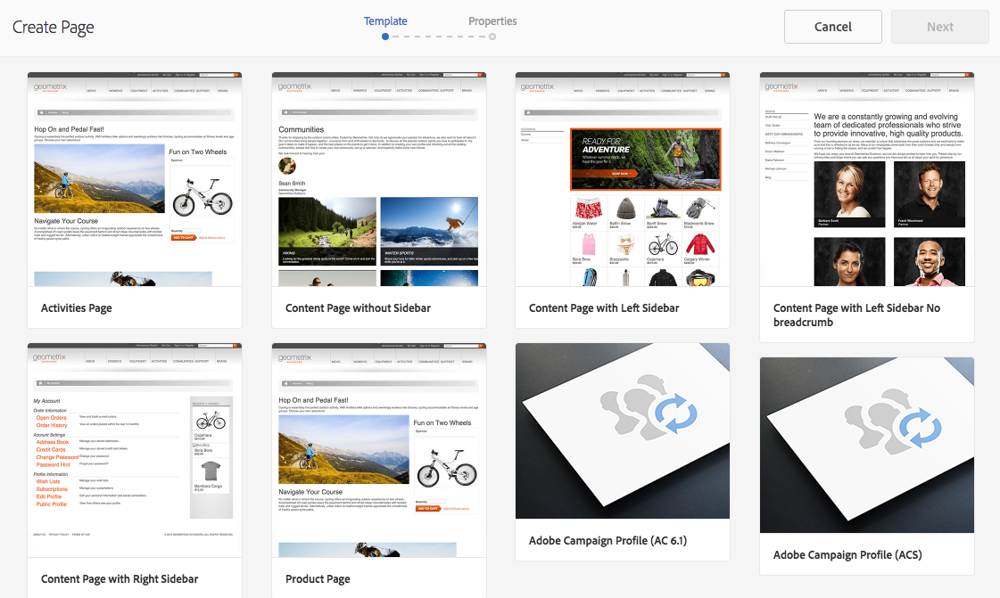
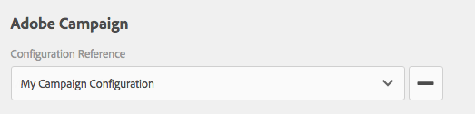

# 在AEM中建立Adobe Campaign表格 {#creating-adobe-campaign-forms-in-aem}

AEM可讓您建立並使用網站上與Adobe Campaign互動的表單。 特定欄位可插入表單中，並對應至Adobe Campaign資料庫。

您可以管理新的連絡人訂閱、取消訂閱和使用者個人檔案資料，同時將其資料整合到您的Adobe Campaign資料庫。

若要在AEM中使用Adobe Campaign表單，您必須依照本檔案所述的步驟進行：

1. 讓範本可供使用。
1. 建立表格。
1. 編輯表單內容。

預設提供三種Adobe Campaign專用的表單：

* 儲存描述檔
* 訂閱服務
* 取消訂閱服務

這些表單會定義接受Adobe Campaign設定檔加密主要金鑰的URL參數。 表單會根據此URL參數更新相關聯Adobe Campaign設定檔的資料。

雖然您是獨立建立這些表單，但在典型的使用案例中，您會在電子報內容中產生表單頁面的個人化連結，讓收件者可以開啟連結並調整其個人資料（不論是取消訂閱、訂閱或更新其個人資料）。

表單會根據使用者自動更新。 如需詳 [細資訊，請參閱編輯表單內容](#editing-form-content) 。

## 讓範本可供使用 {#making-a-template-available}

您必須先在AEM應用程式中提供不同的範本，才能建立Adobe Campaign專屬的表單。

若要這麼做，請參閱范 [本檔案](/help/sites-developing/templates.md#template-availability)。

## 建立表單 {#creating-a-form}

首先，檢查作者和發佈例項之間的連線，Adobe Campaign就能運作。 請參 [閱「與Adobe Campaign Standard整合](/help/sites-administering/campaignstandard.md) 」 [或「與Adobe Campaign Classic整合」](/help/sites-administering/campaignonpremise.md)。

>[!NOTE]
>
>使用Adobe Campaign Classic或Adobe Campaign Standard時，請確 **定頁面的** jcr:content **node上的acMapping** 屬性已分別設為mapRecipient **或****** profileCampaign Standard

1. 在AEM的「網站」中，導覽至您要建立新頁面的位置。
1. 建立頁面並選取「 **Adobe Campaign Classic Profile」**&#x200B;或&#x200B;**「Adobe Campaign Standard Profile** 」，然後按「 **下一步**」。

   

   >[!NOTE]
   >
   >如果所需的範本不可用，請參閱范 [本可用性](/help/sites-developing/templates.md#template-availability)。

1. 在「名 **稱** 」欄位中，新增頁面名稱。 它必須是有效的JCR名稱。
1. 在「標 **題** 」欄位中輸入標題，然後按一下「 **建立」**。
1. 開啟頁面並選取「 **開啟屬性** 」，然後在Cloud services中新增Adobe Campaign設定，並選取核取標籤以儲存變更。

   

1. 在頁面上，在「表單開 **始** 」元件中，選擇其表單類型- 「 **訂閱」、「取消訂**&#x200B;閱」或&#x200B;**「保存配置檔案**」。 每個表單只能有一種類型。 您現在可 [以編輯表單的內容](#editing-form-content)。

## 編輯表單內容 {#editing-form-content}

Adobe Campaign專用的表單具有特定的元件。 這些元件可讓您將表單的每個欄位連結至Adobe Campaign資料庫中的欄位。

>[!NOTE]
>
>如果所要的範本不可用，請參閱 [使範本可用](/help/sites-authoring/adobe-campaign.md)。

本節僅詳細說明Adobe Campaign的特定連結。 如需有關如何在Adobe Experience Manager中使用表單的更一般性概觀的詳細資訊，請參閱「編輯模式 [元件」](/help/sites-authoring/default-components-foundation.md)。

1. 選 **取「開啟屬性** 」，然後在Cloud services中新增Adobe Campaign設定，並選取核取標籤以儲存變更。

   

1. 在頁面上，在「表單開 **始」元件中** ，按一下「設定」圖示。

   

1. 按一下「 **Advanced** （高級）」頁籤，然後選擇其表單類型- 「 **Subscribe（訂閱）」 、 「Unsubscribe（取消訂閱）」** 或「Save Profile（保存配置檔案） **」 ，然後按一下「****OK（確定）」。** 每個表單只能有一種類型。

   * **Adobe Campaign:儲存設定檔**:可讓您在Adobe Campaign中建立或更新收件者（預設值）。
   * **Adobe Campaign:訂閱服務**:可讓您管理Adobe Campaign中收件者的訂閱。
   * **Adobe Campaign:取消訂閱服務**:可讓您取消Adobe Campaign中收件者的訂閱。

1. 每個表單上都必 **須有Encrypted Primary Key** （加密主密鑰）元件。 此元件定義將使用哪個URL參數來接受Adobe Campaign設定檔的加密主要金鑰。 在「元件」中，選取「Adobe Campaign」，只顯示這些元件。
1. 將元件「 **Encrypted Primary Key** 」（加密的主密鑰）拖動到表單（任意位置），然後按一下或點選「 **Configuration** 」（配置）表徵圖。 在「 **Adobe促銷活動** 」標籤中，指定URL參數的任何名稱。 按一下或點選核取標籤以儲存變更。

   產生的此表單連結需要使用此URL參數，並指派Adobe Campaign設定檔的加密主鍵。 加密的主金鑰必須正確進行URL（百分比）編碼。

   

1. 視需要將元件新增至表單，例如文字欄位、日期欄位、核取方塊欄位、選項欄位等。 如需 [各元件的詳細資訊](/help/sites-authoring/adobe-campaign-components.md) ，請參閱Adobe Campaign表單元件。
1. 按一下「配置」表徵圖以開啟元件。 例如，在「文 **字欄位（促銷活動）** 」元件中，變更標題和文字。

   按一 **下Adobe Campaign** ，將表單欄位對應至Adobe Campaign中繼資料變數。 當您送出表單時，Adobe Campaign中會更新對應欄位。 變數選擇器（例如，文字欄位的字串變數）中只有具有相符類型的欄位。

   

   >[!NOTE]
   >
   >您可以依照下列指示新增／移除收件者表格中顯示的欄位： [https://blogs.adobe.com/experiencedelivers/experience-management/aem-campaign-integration/](https://blogs.adobe.com/experiencedelivers/experience-management/aem-campaign-integration/)

1. 按一 **下「發佈頁面**」。 頁面會在您的網站上啟動。 您可以前往AEM出版物例項來檢視它。 您也可以 [測試表格](#testing-a-form)。

   >[!CAUTION]
   >
   >您必須為雲端服務上的匿名使用者提供讀取權限，才能在發佈時使用表單。 不過，請注意向匿名用戶提供讀取權限的潛在安全問題，並確保通過配置調度程式等方法來緩解此問題。

## 測試表單 {#testing-a-form}

在建立表單並編輯表單內容後，您可能想要手動測試表單是否如預期般運作。

>[!NOTE]
>
>每個表單上都必 **須有加密的主密鑰** (Encrypted Primary Key)元件。 在「元件」中，選取「Adobe Campaign」，只顯示這些元件。
>
>雖然在此程式中您手動輸入epk編號，但實際上，使用者會在電子報中取得此頁面的連結（無論要取消訂閱、訂閱或更新您的個人檔案）。 Epk會根據使用者自動更新。
>
>若要建立該連結，請使用變數 **Main資源識別碼**(Adobe Campaign Standard)或 **Encrypted識別碼(Adobe Campaign Classic)(例如，在****** Text &amp; Personalization(Campaign)元件中)，這些識別碼會連結至Adobe Campaign中的開頭。

若要這麼做，您必須手動取得Adobe Campaign描述檔的EPK，然後將它附加至URL:

1. 若要取得Adobe Campaign設定檔的加密主金鑰(EPK):

   * 在Adobe Campaign Standard —— 導覽至「設定檔 **與觀眾** >設定 **檔**」，其中列出現有的設定檔。 請確定表格在欄中顯 **示「主資源識別碼** 」欄位(按一下／點選「設定清單 ****」即可設定此欄位)。 複製所要描述檔的主要資源識別碼。
   * 在Adobe Campaign Classic中，前往「設定檔 **與目標** >收 **件者**」，其中列出現有的設定檔。 請確定表在列中顯示「 **Encrypted identifier** 」(加密的標識符 **)欄位(可通過按一下右鍵某個條目並選擇「** Configure list...)來配置此欄位。 複製所需描述檔的加密識別碼。

1. 在AEM中，開啟發佈例項上的表單頁面，並將步驟1的EPK附加為URL參數：在編寫表單時，請使用先前在EPK元件中定義的相同名稱(例如： `?epk=...`)
1. 現在，該表單可用來修改與連結的Adobe Campaign設定檔相關聯的資料和訂閱。 在您修改部分欄位並送出表單後，您可以在Adobe Campaign中驗證是否已更新適當的資料。

在驗證表單後，Adobe Campaign資料庫中的資料會更新。
