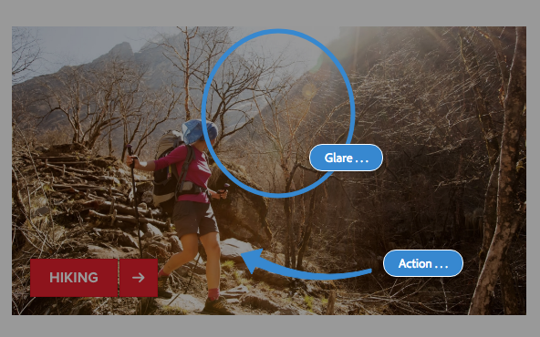

# 編輯頁面時的註解{#annotations-when-editing-a-page}

將內容新增至網站的頁面時，通常會在實際發佈之前先進行討論。 為協助此，許多與內容直接相關的元件（例如，與版面配置相反）可讓您新增註解。

註解會在頁面上放置彩色標籤／便條紙。 註解可讓您（或其他使用者）留下注釋和／或問題給其他作者／審核者。

>[!NOTE]
>
>單個元件類型的定義確定是否可在該元件的實例上添加註釋。

>[!NOTE]
>
>在Classic UI中建立的註解會顯示在觸控式UI中。 不過，素描是UI專用的，只會顯示在建立素描時的UI中。

>[!CAUTION]
>
>刪除資源（如段落）會刪除附加到該資源的所有注釋和草繪，而不管它們在整個頁面上的位置如何。

>[!NOTE]
>
>視您的需求而定，您也可以開發工作流程，在新增、更新或刪除註解時傳送通知。

## 註解 {#annotations}

建立和 [查看注釋時](/help/sites-authoring/author-environment-tools.md#page-modes) ，使用特殊模式。

>[!NOTE]
>
>請記住，您也可 [以在頁面](/help/sites-authoring/basic-handling.md#timeline) 上提供意見回應。

>[!NOTE]
>
>您可以註解各種資源：
>
>* [為資產加上註解](/help/assets/managing-assets-touch-ui.md#annotating)
>* [為視訊資產加上註解](/help/assets/managing-video-assets.md#annotate-video-assets)
>

### 為元件加上註解 {#annotating-a-component}

「註解」模式可讓您在內容上建立、編輯、移動或刪除註解：

1. 編輯頁面時，可使用工具列（右上）中的圖示進入「註解」模式：

   

   您現在可以檢視任何現有的註解。

   >[!NOTE]
   >
   >要退出「注釋」模式，請點選／按一下頂部工具欄右側的「注釋」表徵圖（x符號）。

1. 按一下／點選「新增附註」圖示（工具列左側的加號）以開始新增附註。

   >[!NOTE]
   >
   >要停止添加批注（並返回查看），請點選／按一下頂部工具欄左側的「取消」表徵圖（白色圓圈中的x符號）。

1. 按一下／點選所需元件（可加註的元件將用藍色邊框加亮）以添加註釋並開啟對話框：

   

   您可以在這裡使用適當的欄位和／或圖示：

   * 輸入注釋文本。
   * 建立草繪（線條和形狀）以加亮元件的區域。

      建立草繪時，游標將變為交叉線。 您可以繪製多條不同的線條。 草繪線反映注釋顏色，可以是箭頭、圓形或橢圓形。
   

   * 選擇／變更顏色：
   

   * 刪除注釋。
   

1. 可通過按一下／點選對話框外部的來關閉注釋對話框。 注釋的截斷視圖（第一個字）和任何草繪一起顯示：

   

1. 編輯完特定注釋後，可以：

   * 按一下／點選文字標籤以開啟註解。 開啟後，您就可以檢視全文，進行變更或刪除註解。

      * 草繪不能獨立於注釋而刪除。
   * 重新定位文字標籤。
   * 按一下／點選草繪線以選取該草繪，並將其拖動到所需位置。
   * 移動或複製元件

      * 所有相關注釋及其草圖也將被移動或複製，它們相對於段落的位置將保持不變。

1. 若要退出「注釋」模式並返回先前使用的模式，請點選／按一下頂端工具列右側的「注釋」圖示（x符號）。

>[!NOTE]
>
>註解無法新增至已被其他使用者鎖定的頁面。

### 注釋指示器 {#annotation-indicator}

註解不會顯示在「編輯」模式中，但工具列右上角的標章會顯示目前頁面的註解數。 徽章會取代預設的「註解」圖示，但仍可當成快速連結，切換至「註解」模式：

