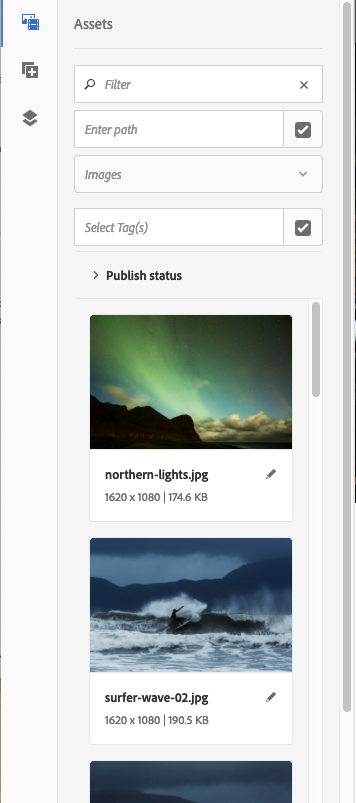

# 創作 — 環境和工具{#authoring-the-environment-and-tools}

的創作環境AEM提供了組織和編輯內容的各種機制。 所提供的工具可從各種控制台和頁面編輯器中訪問。

## 管理您的站點 {#managing-your-site}

的 **站點** 控制台允許您使用標題欄、工具欄、操作表徵圖（適用於選定資源）、麵包屑以及輔助導軌（例如，時間軸和引用）來導航和管理網站。

例如，列視圖：

## 編輯頁面內容 {#editing-page-content}

可以使用頁面編輯器編輯頁面。 例如：

`https://localhost:4502/editor.html/content/we-retail/us/en/equipment.html`

>[!NOTE]
>
>首次開啟頁面進行編輯時，一系列幻燈片將為您提供這些功能的教程。
>
>如果需要，可跳過該教程，並通過從 **頁面資訊** 的子菜單。

## 訪問幫助 {#accessing-help}

編輯頁面時， **幫助** 可從以下位置訪問：

* 這樣 [**頁面資訊**](/help/sites-authoring/editing-page-properties.md#page-properties) 選擇器；這將顯示介紹性幻燈片（如您首次訪問編輯器時所示）。
* 這樣 [配置](/help/sites-authoring/editing-content.md#edit-configure-copy-cut-delete-paste) 對話框(使用？ 表徵圖);這將顯示上下文相關幫助。

進一步 [有關幫助的資源可從控制台獲得](/help/sites-authoring/basic-handling.md#accessing-help)。

## 元件瀏覽器 {#components-browser}

元件瀏覽器顯示所有可在當前頁面上使用的元件。 可將這些內容拖到適當的位置，然後編輯以添加內容。

元件瀏覽器是側面板中的標籤(連同資產 [瀏覽器](/help/sites-authoring/author-environment-tools.md#assets-browser)[和內容樹](/help/sites-authoring/author-environment-tools.md#content-tree))。要開啟 (或關閉) 側面板，請使用工具欄左上角的表徵圖：

開啟側面板時，它將從左側滑動開啟(選擇 **元件** )的正平方根。 開啟時，您可以瀏覽頁面的所有可用元件。

實際外觀和處理取決於所使用的設備類型：

>[!NOTE]
>
>當寬度小於1024px時檢測移動設備。 對於小型案頭窗口，也可以這樣做。

* **移動設備(例如iPad)**

   元件瀏覽器完全覆蓋正在編輯的頁面。

   要將元件添加到頁面中，按住所需的元件並將其向右移動，元件瀏覽器將關閉以再次顯示頁面，您可以在其中定位元件。

   

* **案頭設備**

   元件瀏覽器在窗口的左側開啟。

   要將元件添加到頁面中，請按一下所需的元件並將其拖動到所需位置。

   

   元件由

   * 元件名稱
   * 元件組（灰色）
   * 表徵圖或縮寫

      * 標準元件的表徵圖是單色的。
      * 縮寫始終是元件名稱的前兩個字元。

   從 **元件** 瀏覽器：

   * 按名稱篩選元件。
   * 使用下拉選項將顯示限制為特定組。

   如需元件的詳細說明，您可以在「元件」瀏覽器中按一下或點選元件旁的資訊圖示(如果 **有** )。例如，對於「版面 **容器」**:

   

   有關可用元件的更多資訊，請參閱 [元件控制台](/help/sites-authoring/default-components-console.md)。

## 資產瀏覽器 {#assets-browser}

資產瀏覽器顯示所有 [資產](/help/assets/home.md) 可在當前頁面上直接使用。

資產瀏覽器是側面板中的一個頁籤， [元件瀏覽](/help/sites-authoring/author-environment-tools.md#components-browser)r和 [內容樹](/help/sites-authoring/author-environment-tools.md#content-tree)。 要開啟或關閉側面板，請使用工具欄左上角的表徵圖：

開啟側面板時，它將從左側滑開。 選擇 **資產** 按鈕。

開啟資產瀏覽器後，您可以瀏覽頁面上所有可用資產。 如果需要，將使用無限滾動來展開清單。

要將資產添加到頁面，請選擇並拖動到所需位置。 這可以是：

* 適當類型的現有元件。

   * 例如，可以將影像類型的資產拖到影像元件上。

* A [佔位符](/help/sites-authoring/editing-content.md#component-placeholder) 在段落系統中建立相應類型的新元件。

   * 例如，可以將影像類型的資產拖到段落系統上，以建立影像元件。

>[!NOTE]
>
>這適用於特定資產和元件類型。 請參閱 [使用資產瀏覽器插入元件](/help/sites-authoring/editing-content.md#inserting-a-component-using-the-assets-browser) 的子菜單。

從資產瀏覽器的頂部工具欄中，您可以按以下方式篩選資產：

* 名稱
* 路徑
* 資產類型，如影像、手稿、文檔、視頻、頁面、段落和產品
* 資產特徵，如方向（縱向、橫向、方形）和樣式（彩色、單色、灰度）

   * 僅適用於某些資產類型

實際外觀和處理取決於所使用的設備類型：

>[!NOTE]
>
>當寬度小於1024px時，檢測移動設備；即也在小型案頭窗口上。

* **諸如iPad的移動設備**

   資產瀏覽器完全覆蓋正在編輯的頁面。

   要將資產添加到頁面中，請按住所需資產，然後將其向右移動 — 資產瀏覽器將關閉以再次顯示頁面，您可以在其中將資產添加到所需元件。

   

* **案頭設備**

   資產瀏覽器在窗口的左側開啟。

   要將資產添加到頁面，請按一下所需資產並將其拖動到所需元件或位置。

   

如果需要快速更改資產，可以啟動 [資產編輯器](/help/assets/manage-assets.md) 按一下資產名稱旁邊顯示的編輯表徵圖，即可直接從資產瀏覽器訪問。

## 內容樹 {#content-tree}

的 **內容樹** 概述了層次結構中頁面上的所有元件，以便您可以一眼看到頁面的構成方式。

「內容樹」是側面板（連同元件和資產瀏覽器）中的一個頁籤。 要開啟 (或關閉) 側面板，請使用工具欄左上角的表徵圖：

開啟側面板時，它將滑動開啟（從左側）。 選擇 **內容樹** 按鈕。 開啟時，您可以看到頁面或模板的樹視圖表示形式，以便更容易瞭解其內容是如何按層次結構化的。 另外，在複雜的頁面上，它使在頁面的元件之間跳轉更容易。

頁面可以由許多相同類型的元件輕鬆組成，因此內容（元件）樹在元件類型名稱（黑色）後顯示說明性文本（灰色）。 描述性文本來自元件的常用屬性，如標題或文本。

元件類型將以用戶語言顯示，而元件說明文本則來自頁面語言。

按一下元件旁邊的雪佛龍將折疊或展開該級別。

>[!NOTE]
>
>如果正在編輯移動設備上的頁面（如果瀏覽器寬度小於1024像素），則「內容樹」不可用。

按一下元件將在頁面編輯器中突出顯示該元件。 可用的操作將取決於頁面狀態：

* 例如，基本頁：

   `https://localhost:4502/editor.html/content/we-retail/language-masters/en/equipment.html`

   

   如果在樹中按一下的元件可編輯，則名稱右側將顯示一個扳手錶徵圖。 按一下此表徵圖將直接啟動元件的編輯對話框。

   

* 或者是 [李維庫比](/help/sites-administering/msm.md)，其中元件從另一頁繼承；例如：

   `https://localhost:4502/editor.html/content/we-retail/us/en/equipment.html`

   

## 片段 — 關聯的內容瀏覽器 {#fragments-associated-content-browser}

如果您的頁面包含內容片段，則您還將有權訪問 [關聯內容的瀏覽器](/help/sites-authoring/content-fragments.md#using-associated-content)。

## 引用 {#references}

**引用** 顯示與選定頁面的連接：

* BluePrint
* 啟動
* 即時拷貝
* 語言副本
* 導入連結
* 引用元件的使用：借出內容
* 對產品頁的引用（從Commerce - Products控制台）

開啟所需的控制台，然後導航到所需資源並開啟 **引用** 使用：

[選擇所需資源](/help/sites-authoring/basic-handling.md#viewing-and-selecting-resources) 顯示與該資源相關的參考型別的清單：

選擇相應的參考類型以瞭解詳細資訊。 在某些情況下，當您選擇特定參照時，可以執行進一步的操作，包括：

* **傳入連結**，提供引用頁面的頁面清單以及對 **編輯** 選擇特定連結時的其中一頁

* 借入和借出內容的實例 **引用** 元件，從此處可以導航到引用/引用頁

* [對產品頁的引用](/help/commerce/cif-classic/administering/generic.md#showing-product-references) （可從Commerce-Products控制台獲得）
* [啟動](/help/sites-authoring/launches.md)，提供對相關啟動的訪問
* [即時拷貝](/help/sites-administering/msm.md) 顯示基於所選資源的所有即時副本的路徑。
* [藍圖](/help/sites-administering/msm-best-practices.md)，提供詳細資訊和各種操作
* [語言副本](/help/sites-administering/tc-manage.md#creating-translation-projects-using-the-references-panel)，提供詳細資訊和各種操作

例如，可修復「參照」(Reference)元件中斷開的參照：

## 事件 — 時間軸 {#events-timeline}

適當資源(例如 **站點** 控制台或來自 **資產** 控制台) [時間線可用於顯示任何選定項上的最近活動](/help/sites-authoring/basic-handling.md#timeline)。

開啟所需的控制台，然後導航到所需資源並開啟 **時間軸**，使用：

[選擇所需資源](/help/sites-authoring/basic-handling.md#viewing-and-selecting-resources)或 **全部顯示** 或 **活動** 要列出選定資源上的任何最近操作：

## 頁面資訊 {#page-information}

「頁面資訊」按鈕（均衡器表徵圖）開啟一個菜單，該菜單還提供有關上次編輯和上次發佈的詳細資訊。 視頁面、其網站和您的例項的特性而定，可能有更多或更少的選項可用：

* [開啟屬性](/help/sites-authoring/editing-page-properties.md)
* [轉出頁面](/help/sites-administering/msm.md#msm-from-the-ui)
* [啟動工作流程](/help/sites-authoring/workflows-applying.md#starting-a-workflow-from-the-page-editor)
* [鎖定頁面](/help/sites-authoring/editing-content.md#locking-a-page)
* [發佈頁面](/help/sites-authoring/publishing-pages.md#main-pars-title-10)
* [取消發佈頁面](/help/sites-authoring/publishing-pages.md#main-pars-title-5)
* [編輯模板](/help/sites-authoring/templates.md);當頁面基於 [可編輯模板](/help/sites-authoring/templates.md#editable-and-static-templates)

* [以已發佈狀態檢視](/help/sites-authoring/editing-content.md#view-as-published)
* 在管理員中查看；開啟 [站點控制台](/help/sites-authoring/basic-handling.md#viewing-and-selecting-resources)
* [說明](/help/sites-authoring/basic-handling.md#accessing-help)

例如，在適當時， **頁面資訊** 還有選項：

* [升級啟動](/help/sites-authoring/launches-promoting.md) 頁面啟動。
* [在傳統用戶介面中開啟](/help/sites-authoring/select-ui.md#switching-to-classic-ui-when-editing-a-page) 如果此選項 [由管理員啟用](/help/sites-administering/enable-classic-ui-editor.md)

另外， **頁面資訊** 可以在適當時提供對分析和建議的訪問權限。

## 頁面模式 {#page-modes}

編輯頁面時有多種模式，允許執行不同的操作：

* [編輯](/help/sites-authoring/editing-content.md)  — 編輯頁面內容時使用的模式。
* [佈局](/help/sites-authoring/responsive-layout.md)  — 允許您根據設備建立和編輯響應性佈局（如果頁面基於佈局容器）

* [腳手架](/help/sites-authoring/scaffolding.md)  — 幫助您建立共用相同結構但內容不同的大量頁面。
* [開發人員](/help/sites-developing/developer-mode.md)  — 允許您執行各種操作（需要權限）。 這包括檢查頁面及其元件的技術詳細資訊。

* [設計](/help/sites-authoring/default-components-designmode.md)  — 允許您啟用/禁用要在頁面上使用的元件，並配置元件的設計(如果該頁面基於 [靜態模板](/help/sites-authoring/templates.md#editable-and-static-templates))。

* [目標](/help/sites-authoring/content-targeting-touch.md)  — 通過針對所有渠道並進行衡量來提高內容相關性。
* [Activity Map](/help/sites-authoring/page-analytics-using.md#analyticsvisiblefromthepageeditor)  — 顯示頁面的分析資料。

* [時間曲線](/help/sites-authoring/working-with-page-versions.md#timewarp)  — 允許您查看特定時間點的頁面狀態。
* [即時複製狀態](/help/sites-authoring/editing-content.md#live-copy-status)  — 允許快速概述即時拷貝狀態以及哪些元件是/不是繼承的。
* [預覽](/help/sites-authoring/editing-content.md#previewing-pages)  — 用於查看將在發佈環境中顯示的頁面；或使用內容中的連結導航。

* [注釋](/help/sites-authoring/annotations.md)  — 用於添加或查看頁面上的注釋。

可以使用右上角的表徵圖訪問這些。 實際表徵圖將更改以反映您當前使用的模式：

>[!NOTE]
>
>* 根據頁面的特性，某些模式可能不可用。
>* 訪問某些模式需要相應的權限/權限。
>* 由於空間限制，在移動設備上不能使用開發模式。
>* 有一個鍵 [盤](/help/sites-authoring/page-authoring-keyboard-shortcuts.md) ( `Ctrl-Shift-M`可切換 **)，在「預覽」和目前選取的模式之間切換(例如，「編輯」、「排版**********」等)。
>

## 路徑選擇 {#path-selection}

創作時，通常需要選擇其他資源，例如定義指向另一頁或資源的連結或選擇影像時。 要輕鬆選擇路徑， [路徑欄位](/help/sites-authoring/author-environment-tools.md#path-fields) 提供自動完成功能， [路徑瀏覽器](/help/sites-authoring/author-environment-tools.md#path-browser) 允許更穩健的選擇。

### 路徑欄位 {#path-fields}

此處用於說明的示例是影像元件。 有關使用和編輯元件的詳細資訊，請參閱 [頁面創作元件](/help/sites-authoring/default-components.md)。

路徑欄位現在具有自動完成和前瞻功能，以便更輕鬆地查找資源。

按一下 **開啟選擇對話框** 按鈕開啟 [路徑瀏覽器](/help/sites-authoring/author-environment-tools.md#path-browser) 對話框，允許更詳細的選擇選項。

或者，可以開始在路徑欄位中鍵入，AEM並在鍵入時提供匹配的路徑。

### 路徑瀏覽器 {#path-browser}

路徑瀏覽器的組織方式與 [列視圖](/help/sites-authoring/basic-handling.md#column-view) 站點控制台，允許更詳細地選擇資源。

* 選擇資源後， **選擇** 對話框右上角的按鈕。 按一下或點擊以確認選擇或 **取消** 中止。
* 如果上下文允許選擇多個資源，則選擇資源也會激活「選擇 **** 」按鈕，但也會向窗口的右上角添加選定資源的計數。按一下 **數字旁** 的X，取消選取全部。
* 在樹中導航時，您的位置會反映在對話框頂部的麵包屑中。 這些麵包屑還可用於在資源層次結構內快速跳轉。
* 您可以隨時使用對話框頂部的搜索欄位。 按一下 **X** 的子菜單。
* 要縮小搜索範圍，可以顯示過濾選項並根據特定路徑過濾結果。

   

## 鍵盤快速鍵 {#keyboard-shortcuts}

各種 [鍵盤快捷鍵](/help/sites-authoring/page-authoring-keyboard-shortcuts.md) 的雙曲餘切值。
