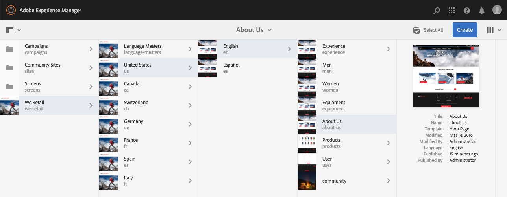
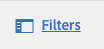

# 製作 — 環境與工具{#authoring-the-environment-and-tools}

AEM的製作環境提供各種機制來組織和編輯您的內容。 提供的工具可從各種主控台和頁面編輯器存取。

## 管理您的網站 {#managing-your-site}

**Sites**&#x200B;主控台可讓您使用標題列、工具列、動作圖示（適用於選取的資源）、導覽路徑標示，以及選取時的輔助導軌（例如時間軸和參考），來導覽和管理您的網站。

例如，欄檢視：

## 編輯頁面內容 {#editing-page-content}

您可以使用頁面編輯器編輯頁面。 例如：

`https://localhost:4502/editor.html/content/we-retail/us/en/equipment.html`

>[!NOTE]
>
>第一次開啟頁面進行編輯時，一連串幻燈片會提供您功能導覽。
>
>您可以視需要略過導覽，並隨時從&#x200B;**頁面資訊**&#x200B;功能表選取，以重複導覽。

## 存取說明 {#accessing-help}

編輯頁面時，可從下列位置存取&#x200B;**說明**：

* [**頁面資訊**](/help/sites-authoring/editing-page-properties.md#page-properties)&#x200B;選取器；這會顯示簡介投影片（在您第一次存取編輯器時顯示）。
* 特定元件的[組態](/help/sites-authoring/editing-content.md#edit-configure-copy-cut-delete-paste)對話方塊(使用問號(？) 圖示)；這會顯示相關內容的「說明」。

可從主控台[&#128279;](/help/sites-authoring/basic-handling.md#accessing-help)取得其他說明相關資源。

## 元件瀏覽器 {#components-browser}

元件瀏覽器會顯示目前頁面上可用的所有元件。 這些檔案可以拖曳至適當位置，然後編輯以新增您的內容。

元件瀏覽器是側面板中的標籤(連同資產 [瀏覽器](/help/sites-authoring/author-environment-tools.md#assets-browser) [和內容樹](/help/sites-authoring/author-environment-tools.md#content-tree))。若要開啟（或關閉）側面板，請使用工具列左上角的圖示：

當您開啟側面板時，它會從左側滑開（必要時選取「**元件**」標籤）。 開啟時，您可以瀏覽頁面可用的所有元件。

實際外觀和處理方式取決於您使用的裝置型別：

>[!NOTE]
>
>當寬度小於1024畫素時會偵測到行動裝置。 小型案頭視窗亦可如此。

* **行動裝置(例如iPad)**

  元件瀏覽器會完整涵蓋正在編輯的頁面。

  若要將元件新增至頁面，請按住所需元件並向右移動，元件瀏覽器會關閉以再次顯示頁面，讓您放置元件。

  

* **案頭裝置**

  元件瀏覽器會在視窗左側開啟。

  若要將元件新增至頁面，請按一下所需元件，然後將其拖曳至您想要的位置。

  

  元件由表示

   * 元件名稱
   * 元件群組（灰色）
   * 圖示或縮寫

      * 標準元件的圖示為單色。
      * 縮寫一律為元件名稱的前兩個字元。

  您可以從&#x200B;**元件**&#x200B;瀏覽器的頂端工具列執行下列動作：

   * 依名稱篩選元件。
   * 使用下拉式選取範圍，將顯示限製為特定群組。

  如需元件的詳細說明，您可以在&#x200B;**元件**&#x200B;瀏覽器（如果有的話）中按一下元件旁的資訊圖示。 例如，對於「版面 **容器」**:

  

  如需有關可用元件的詳細資訊，請參閱[元件主控台](/help/sites-authoring/default-components-console.md)。

## Assets瀏覽器 {#assets-browser}

資產瀏覽器會顯示目前頁面上可直接使用的所有[資產](/help/assets/assets.md)。

資產瀏覽器是側面板中的標籤，以及[元件瀏覽](/help/sites-authoring/author-environment-tools.md#components-browser)r和[內容樹狀結構](/help/sites-authoring/author-environment-tools.md#content-tree)。 若要開啟或關閉側面板，請使用工具列左上角的圖示：

當您開啟側面板時，它會從左側滑開。 選取&#x200B;**Assets**&#x200B;索引標籤（如有必要）。

當資產瀏覽器開啟時，您可以瀏覽頁面可用的所有資產。 如有需要，可使用無限捲動來展開清單。

若要將資產新增至頁面，請選取並拖曳至所需位置。 這可以是：

* 適當型別的現有元件。

   * 例如，您可以將影像型別的資產拖曳至影像元件上。

* 段落系統中用來建立適當型別元件的[預留位置](/help/sites-authoring/editing-content.md#component-placeholder)。

   * 例如，您可以將影像型別的資產拖曳至段落系統，以建立「影像」元件。

>[!NOTE]
>
>這適用於特定資產和元件型別。 如需詳細資訊，請參閱[使用Assets瀏覽器插入元件](/help/sites-authoring/editing-content.md#inserting-a-component-using-the-assets-browser)。

從資產瀏覽器頂端的工具列，您可以依以下方式篩選資產：

* 名稱
* 路徑
* 影像、手稿、檔案、影片、頁面、段落和產品等資產型別
* 資產特性，例如，方向（縱向、橫向、正方形）和樣式（顏色、單色、灰階）

   * 僅適用於特定資產型別

實際外觀和處理方式取決於您使用的裝置型別：

>[!NOTE]
>
>當寬度小於1024畫素時會偵測到行動裝置；也就是在小型案頭視窗中。

* **行動裝置，例如iPad**

  資產瀏覽器會完整涵蓋正在編輯的頁面。

  若要將資產新增至頁面，請觸控並按住所需資產，然後將其向右移動 — 資產瀏覽器會關閉以再次顯示頁面，您可以在其中將資產新增至所需元件。

  

* **案頭裝置**

  資產瀏覽器會在視窗左側開啟。

  若要將資產新增至頁面，請按一下資產，然後將其拖曳至所需的元件或位置。

  

如果您必須快速變更資產，可以按一下資產名稱旁邊顯示的編輯圖示，直接從資產瀏覽器啟動[Asset Editor](/help/assets/manage-assets.md)。

## 內容樹狀結構 {#content-tree}

**內容樹狀結構**&#x200B;提供階層中頁面上所有元件的概觀，讓您一眼就能看到頁面的構成。

內容樹是側面板中的標籤（連同元件和資產瀏覽器）。 若要開啟或關閉側面板，請使用工具列左上角的圖示：

當您開啟側面板時，它會（從左側）滑開。 選取&#x200B;**內容樹狀結構**&#x200B;索引標籤（如有必要）。 開啟時，您可以看到頁面或範本的樹狀檢視表示法，因此更容易瞭解其內容如何階層架構。 此外，在複雜頁面上，它可讓您更輕鬆地在頁面元件之間跳轉。

頁面可以輕鬆地由許多相同型別的元件組成，因此內容（元件）樹狀結構會在元件型別名稱（黑色）後面顯示描述性文字（灰色）。 描述性文字來自元件的常見屬性，例如標題或文字。

元件型別會以使用者語言顯示，而元件說明文字則來自頁面語言。

按一下元件旁的>形箭號可收合或展開該層級。

>[!NOTE]
>
>如果您在行動裝置上編輯頁面（如果瀏覽器寬度小於1024畫素），則無法使用內容樹。

按一下元件即可在頁面編輯器中醒目提示元件。 可用的動作取決於頁面狀態：

* 例如，基本頁面：

  `https://localhost:4502/editor.html/content/we-retail/language-masters/en/equipment.html`

  

  如果按一下樹狀結構中的元件可編輯，則名稱右側會出現扳手圖示。 按一下此圖示會開啟元件的編輯對話方塊。

  

* 或是[livecopy](/help/sites-administering/msm.md)的一部分，其中元件繼承自其他頁面的頁面；例如：

  `https://localhost:4502/editor.html/content/we-retail/us/en/equipment.html`

  

## 片段 — 相關聯的內容瀏覽器 {#fragments-associated-content-browser}

如果您的頁面包含內容片段，則您可存取關聯內容的[瀏覽器](/help/sites-authoring/content-fragments.md#using-associated-content)。

## 參考 {#references}

**參考**&#x200B;顯示與所選頁面的連線：

* BluePrint
* 啟動
* 即時副本
* 語言副本
* 導入連結
* 參考元件的使用：借入和借出的內容
* 產品頁面的參考資料(來自Commerce — 產品主控台)

開啟必要的主控台，然後導覽至必要的資源，並使用下列方式開啟&#x200B;**參考**：

[選取您需要的資源](/help/sites-authoring/basic-handling.md#viewing-and-selecting-resources)會顯示與該資源相關的參考型別清單：

選取適當的參照型別以取得詳細資訊。 在某些情況下，當您選取特定參照時，可使用進一步的動作，包括：

* **傳入連結**&#x200B;提供參考頁面的頁面清單，以及當您選取特定連結時，直接存取這些頁面中的&#x200B;**編輯**。

   * 這只能顯示靜態連結，而不能顯示動態產生的連結；例如，來自清單元件的連結。

* 使用&#x200B;**Reference**&#x200B;元件的借入和借出內容例項，您可以從這裡導覽至參考/參考頁面

* [產品頁面的參考](/help/commerce/cif-classic/administering/generic.md#showing-product-references) (可從Commerce-Products主控台取得)
* [啟動](/help/sites-authoring/launches.md)提供相關啟動的存取權。
* [即時副本](/help/sites-administering/msm.md)會顯示以選取的資源為基礎之所有即時副本的路徑。
* [Blueprint](/help/sites-administering/msm-best-practices.md)提供詳細資訊和各種動作。
* [語言副本](/help/sites-administering/tc-manage.md#creating-translation-projects-using-the-references-panel)提供詳細資訊和各種動作。

例如，您可以修復「參照」元件中的破斷參照：

## 事件 — 時間表 {#events-timeline}

對於適當的資源(例如，**網站**&#x200B;主控台的頁面，或&#x200B;**Assets**&#x200B;主控台的資產)，[時間軸可用於顯示任何選取專案](/help/sites-authoring/basic-handling.md#timeline)的最近活動。

開啟必要的主控台，然後導覽至所需資源，並使用下列方式開啟&#x200B;**時間表**：

[選取您需要的資源](/help/sites-authoring/basic-handling.md#viewing-and-selecting-resources)，然後選取&#x200B;**全部顯示**&#x200B;或&#x200B;**活動**，以列出所選資源上任何最近的動作：

## 頁面資訊 {#page-information}

「頁面資訊」按鈕（均衡器圖示）會開啟一個功能表，其中也提供上次編輯和上次發佈的詳細資訊。 視頁面、其網站和您的例項的特性而定，可能有更多或更少的選項可用：

* [開啟屬性](/help/sites-authoring/editing-page-properties.md)
* [轉出頁面](/help/sites-administering/msm.md#msm-from-the-ui)
* [啟動工作流程](/help/sites-authoring/workflows-applying.md#starting-a-workflow-from-the-page-editor)
* [鎖定頁面](/help/sites-authoring/editing-content.md#locking-a-page)
* [發佈頁面](/help/sites-authoring/publishing-pages.md#main-pars-title-10)
* [取消發佈頁面](/help/sites-authoring/publishing-pages.md#main-pars-title-5)
* [編輯範本](/help/sites-authoring/templates.md)；當頁面是以[可編輯的範本](/help/sites-authoring/templates.md#editable-and-static-templates)為基礎時

* [以已發佈狀態檢視](/help/sites-authoring/editing-content.md#view-as-published)
* 在Admin中檢視；在[網站主控台](/help/sites-authoring/basic-handling.md#viewing-and-selecting-resources)中開啟頁面
* [說明](/help/sites-authoring/basic-handling.md#accessing-help)

例如，適當時，**頁面資訊**&#x200B;也有選項：

* 如果頁面是啟動項，請[提升啟動項](/help/sites-authoring/launches-promoting.md)
* 如果此選項由系統管理員啟用[&#128279;](/help/sites-administering/enable-classic-ui-editor.md)，則[在傳統UI中開啟](/help/sites-authoring/select-ui.md#switching-to-classic-ui-when-editing-a-page)

此外，**頁面資訊**&#x200B;可讓您在適當時存取分析和建議。

## 頁面模式 {#page-modes}

編輯頁面時，有多種模式可允許不同的動作：

* [編輯](/help/sites-authoring/editing-content.md) — 在編輯頁面內容時使用此模式。
* [配置](/help/sites-authoring/responsive-layout.md) — 可讓您建立並編輯相依於裝置的回應式配置（如果頁面是以配置容器為基礎）

* [支架](/help/sites-authoring/scaffolding.md) — 協助您建立共用結構但內容不同的大型頁面集。
* [開發人員](/help/sites-developing/developer-mode.md) — 讓您執行各種動作（需要許可權）。 其中包括檢查頁面及其元件的技術細節。

* [設計](/help/sites-authoring/default-components-designmode.md) — 可讓您啟用/停用頁面上使用的元件，以及設定元件的設計（如果頁面是以[靜態範本](/help/sites-authoring/templates.md#editable-and-static-templates)為基礎的話）。

* [鎖定目標](/help/sites-authoring/content-targeting-touch.md) — 透過所有管道的鎖定目標和測量，增加內容關聯性。
* [Activity Map](/help/sites-authoring/page-analytics-using.md#analyticsvisiblefromthepageeditor) — 顯示頁面的Analytics資料。

* [時間扭曲](/help/sites-authoring/working-with-page-versions.md#timewarp) — 可讓您檢視特定時間點的頁面狀態。
* [即時副本狀態](/help/sites-authoring/editing-content.md#live-copy-status) — 可讓您快速概略瞭解即時副本狀態，以及哪些元件是/不繼承的。
* [預覽](/help/sites-authoring/editing-content.md#previewing-pages) — 用於檢視在發佈環境中顯示的頁面；或使用內容中的連結進行瀏覽。

* [註釋](/help/sites-authoring/annotations.md) — 用於在頁面上新增或檢視註釋。

您可以使用右上角的圖示來存取這些專案。 實際圖示會變更，以反映您目前使用的模式：

>[!NOTE]
>
>* 視頁面的特性而定，某些模式可能無法使用。
>* 存取某些模式需要適當的許可權。
>* 由於空間限制，開發人員模式不適用於行動裝置。
>* 有[鍵盤快速鍵](/help/sites-authoring/page-authoring-keyboard-shortcuts.md) ( `Ctrl-Shift-M`)可在&#x200B;**預覽**&#x200B;和目前選取的模式（例如，**編輯**&#x200B;和&#x200B;**配置**）之間切換。
>

## 路徑選取 {#path-selection}

通常在製作時，必須選取另一個資源，例如定義另一個頁面或資源的連結，或選取影像時。 若要輕鬆選取路徑，[路徑欄位](/help/sites-authoring/author-environment-tools.md#path-fields)提供自動完成功能，而[路徑瀏覽器](/help/sites-authoring/author-environment-tools.md#path-browser)可提供更強大的選取功能。

### 路徑欄位 {#path-fields}

此處用來說明的範例是影像元件。 如需使用和編輯元件的詳細資訊，請參閱[頁面編寫的元件](/help/sites-authoring/default-components.md)。

路徑欄位現在具有自動完成和先行等功能，可更輕鬆找到資源。

按一下路徑欄位中的&#x200B;**開啟選取範圍對話方塊**&#x200B;按鈕可開啟[路徑瀏覽器](/help/sites-authoring/author-environment-tools.md#path-browser)對話方塊，以取得更詳細的選取範圍選項。

或者，您也可以開始在「路徑」欄位中輸入，AEM會在您輸入時提供相符的路徑。

### 路徑瀏覽器 {#path-browser}

路徑瀏覽器的組織方式類似於Sites Console的[欄檢視](/help/sites-authoring/basic-handling.md#column-view)，允許更詳細的資源選擇。

* 選取資源後，對話方塊右上角的&#x200B;**選取**&#x200B;按鈕就會變成使用中狀態。 按一下以確認選取專案，或按一下&#x200B;**取消**&#x200B;以中止。
* 如果上下文允許選擇多個資源，則選擇資源也會激活「選擇 **&#x200B;**&#x200B;」按鈕，但也會向窗口的右上角添加選定資源的計數。按一下數字旁的&#x200B;**X**&#x200B;以取消選取全部。
* 當您瀏覽樹狀結構時，您的位置會反映在對話方塊頂端的階層連結中。 這些階層連結也可用來在資源階層內快速跳轉。
* 您可以隨時使用對話方塊頂端的搜尋欄位。 按一下搜尋欄位中的&#x200B;**X**&#x200B;以清除搜尋。
* 若要縮小搜尋範圍，您可以顯示篩選選項，並根據特定路徑篩選結果。

  

## 鍵盤快速鍵 {#keyboard-shortcuts}

有各種[鍵盤快速鍵](/help/sites-authoring/page-authoring-keyboard-shortcuts.md)可供使用。
