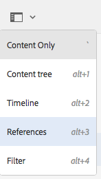

# 製作 — 環境和工具{#authoring-the-environment-and-tools}

AEM的製作環境提供多種組織及編輯內容的機制。 提供的工具可從各種主控台和頁面編輯器存取。

## 管理您的網站 {#managing-your-site}

此 **網站** console可讓您使用標題列、工具列、動作圖示（適用於選取的資源）、導覽路徑標示，以及選取時的輔助導軌（例如時間軸和參考），來導覽和管理您的網站。

例如，欄檢視：

## 編輯頁面內容 {#editing-page-content}

您可以使用頁面編輯器編輯頁面。 例如：

`https://localhost:4502/editor.html/content/we-retail/us/en/equipment.html`

>[!NOTE]
>
>第一次開啟頁面進行編輯時，您會看到一系列投影片，為您介紹這些功能。
>
>您可以視需要略過導覽，並隨時透過選取 **頁面資訊** 功能表。

## 存取說明 {#accessing-help}

編輯頁面時， **說明** 可從以下位置存取：

* the [**頁面資訊**](/help/sites-authoring/editing-page-properties.md#page-properties) 選取器；這將顯示介紹性投影片（如您第一次存取編輯器時所顯示）。
* the [配置](/help/sites-authoring/editing-content.md#edit-configure-copy-cut-delete-paste) 對話方塊(使用？ );這將顯示上下文相關幫助。

進一步 [可從主控台使用說明相關資源](/help/sites-authoring/basic-handling.md#accessing-help).

## 元件瀏覽器 {#components-browser}

元件瀏覽器會顯示目前頁面上可用的所有元件。 可將這些資料拖曳至適當位置，然後加以編輯以新增您的內容。

元件瀏覽器是側面板中的標籤(連同資產 [瀏覽器](/help/sites-authoring/author-environment-tools.md#assets-browser)[和內容樹](/help/sites-authoring/author-environment-tools.md#content-tree))。要開啟 (或關閉) 側面板，請使用工具欄左上角的表徵圖：

當您開啟側面板時，它將從左側滑動開啟(選取 **元件** 標籤。) 開啟後，您可以瀏覽頁面所有可用的元件。

實際外觀和處理取決於您使用的設備類型：

>[!NOTE]
>
>當寬度小於1024px時檢測到移動設備。 小型案頭窗口也可以這樣。

* **行動裝置(例如iPad)**

   元件瀏覽器會完全覆蓋正在編輯的頁面。

   若要新增元件至頁面，並按住所需元件，然後將其移至右側，元件瀏覽器會關閉並再次顯示頁面，您可在此放置元件。

   

* **桌上型裝置**

   元件瀏覽器會在視窗左側開啟。

   若要將元件新增至頁面，請按一下所需元件，並將其拖曳至所需位置。

   

   元件由

   * 元件名稱
   * 元件組（以灰色表示）
   * 表徵圖或縮寫

      * 標準元件的表徵圖為單色。
      * 縮寫一律為元件名稱的前兩個字元。

   從 **元件** 您可以使用的瀏覽器：

   * 依名稱篩選元件。
   * 使用下拉式選取項目，將顯示限制為特定群組。

   如需元件的詳細說明，您可以在「元件」瀏覽器中按一下或點選元件旁的資訊圖示(如果 **有** )。例如，對於「版面 **容器」**:

   

   如需可用元件的詳細資訊，請參閱 [元件主控台](/help/sites-authoring/default-components-console.md).

## 資產瀏覽器 {#assets-browser}

資產瀏覽器會顯示所有 [資產](/help/assets/home.md) 供目前頁面直接使用。

資產瀏覽器是側面板中的標籤，以及 [元件瀏覽](/help/sites-authoring/author-environment-tools.md#components-browser)r和 [內容樹](/help/sites-authoring/author-environment-tools.md#content-tree). 要開啟或關閉側面板，請使用工具欄左上角的表徵圖：

開啟側面板時，它將從左側滑動開啟。 選取 **資產** 標籤。

當資產瀏覽器開啟時，您可以瀏覽頁面上所有可用的資產。 需要時，可使用無限滾動展開清單。

若要將資產新增至頁面，請選取並拖曳至所需位置。 這可以是：

* 適當類型的現有元件。

   * 例如，您可以將影像類型的資產拖曳至影像元件上。

* A [預留位置](/help/sites-authoring/editing-content.md#component-placeholder) 在段落系統中建立相應類型的新元件。

   * 例如，您可以將影像類型的資產拖曳至段落系統以建立影像元件。

>[!NOTE]
>
>這適用於特定資產和元件類型。 請參閱 [使用資產瀏覽器插入元件](/help/sites-authoring/editing-content.md#inserting-a-component-using-the-assets-browser) 以取得更多詳細資訊。

從資產瀏覽器的頂端工具列，您可以依下列方式篩選資產：

* 名稱
* 路徑
* 資產類型，例如影像、手稿、檔案、影片、頁面、段落和產品
* 資產特性，例如方向（縱向、橫向、正方形）和樣式（顏色、單色、灰階）

   * 僅適用於特定資產類型

實際外觀和處理取決於您使用的設備類型：

>[!NOTE]
>
>當寬度小於1024px時，檢測到移動設備；即，也可在小型案頭視窗上。

* **行動裝置，例如iPad**

   資產瀏覽器會完全覆蓋正在編輯的頁面。

   若要新增資產至您的頁面觸控並按住所需資產，然後將其移至右側：資產瀏覽器會關閉，再次顯示頁面，讓您將資產新增至所需元件。

   

* **桌上型裝置**

   資產瀏覽器會在視窗左側開啟。

   若要新增資產至您的頁面，請按一下所需資產，然後將其拖曳至所需元件或位置。

   

如果您需要快速變更資產，可以啟動 [資產編輯器](/help/assets/manage-assets.md) 按一下資產名稱旁顯示的編輯圖示，即可直接從資產瀏覽器存取。

## 內容樹 {#content-tree}

此 **內容樹** 會以階層形式提供頁面上所有元件的概觀，讓您一覽頁面的構成方式。

「內容樹」是側面板中的標籤（連同元件和資產瀏覽器）。 要開啟 (或關閉) 側面板，請使用工具欄左上角的表徵圖：

開啟側面板時，它將滑動開啟（從左側）。 選取 **內容樹** 標籤。 開啟後，您會看到頁面或範本的樹狀檢視表示，以便更輕鬆了解其內容的階層結構。 此外，在複雜的頁面上，可更輕鬆地在頁面的元件之間跳轉。

頁面可以輕鬆地由許多相同類型的元件組成，因此內容（元件）樹會在元件類型的名稱（黑色）後顯示描述性文本（以灰色顯示）。 描述性文字來自元件的一般屬性，例如標題或文字。

元件類型將以使用者語言顯示，而元件說明文字則來自頁面語言。

按一下元件旁的>形箭號會收合或展開該層級。

>[!NOTE]
>
>如果您在行動裝置上編輯頁面（如果瀏覽器寬度小於1024px），則無法使用內容樹。

按一下元件會反白顯示頁面編輯器中的元件。 可用的動作取決於頁面狀態：

* 例如，基本頁面：

   `https://localhost:4502/editor.html/content/we-retail/language-masters/en/equipment.html`

   

   如果您在樹狀結構中按一下的元件可編輯，則名稱右側會顯示扳手圖示。 按一下此圖示會直接啟動元件的編輯對話方塊。

   

* 或屬於 [livecopy](/help/sites-administering/msm.md)，其中元件繼承自其他頁面；例如：

   `https://localhost:4502/editor.html/content/we-retail/us/en/equipment.html`

   

## 片段 — 關聯內容瀏覽器 {#fragments-associated-content-browser}

如果您的頁面包含內容片段，則您也可以存取 [關聯內容的瀏覽器](/help/sites-authoring/content-fragments.md#using-associated-content).

## 引用 {#references}

**參考** 顯示與選定頁面的連接：

* BluePrint
* 啟動
* 即時副本
* 語言副本
* 導入連結
* 參考元件的使用：借入和借出內容
* 產品頁面的參考（從商務 — 產品主控台）

開啟所需的主控台，然後導覽至所需資源並開啟 **參考** 使用：

[選取您的必要資源](/help/sites-authoring/basic-handling.md#viewing-and-selecting-resources) 要顯示與該資源相關的參考型別清單：

選擇適當的參考類型以了解詳細資訊。 在某些情況下，當您選擇特定參照時，可以執行進一步的操作，包括：

* **傳入連結**，提供參考頁面的頁面清單，以及直接存取 **編輯** 當您選取特定連結時，其中一個頁面

* 借閱和借閱內容的例項，使用 **參考** 元件，可從此處導覽至參考/參考頁面

* [產品頁面的參考](/help/commerce/cif-classic/administering/generic.md#showing-product-references) （可從商務產品控制台取得）
* [啟動](/help/sites-authoring/launches.md)，提供相關啟動的存取權
* [Live Copies](/help/sites-administering/msm.md) 顯示所有即時副本的路徑，這些路徑是根據所選資源而定。
* [Blueprint](/help/sites-administering/msm-best-practices.md)，提供詳細資訊和各種動作
* [語言副本](/help/sites-administering/tc-manage.md#creating-translation-projects-using-the-references-panel)，提供詳細資訊和各種動作

例如，可以修正「參照」(Reference)元件中斷的參照：

## 事件 — 時間軸 {#events-timeline}

適當資源(例如 **網站** 主控台，或來自 **資產** 控制台) [時間軸可用來顯示任何所選項目上最近的活動](/help/sites-authoring/basic-handling.md#timeline).

開啟所需的主控台，然後導覽至所需資源並開啟 **時間表**，使用：

[選取您的必要資源](/help/sites-authoring/basic-handling.md#viewing-and-selecting-resources)，然後 **全部顯示** 或 **活動** 要列出選定資源上的任何最近操作，請執行以下操作：

## 頁面資訊 {#page-information}

「頁面資訊」按鈕（均衡器圖示）會開啟一個功能表，其中也提供上次編輯和上次發佈的詳細資訊。 視頁面、其網站和您的例項的特性而定，可能有更多或更少的選項可用：

* [開啟屬性](/help/sites-authoring/editing-page-properties.md)
* [轉出頁面](/help/sites-administering/msm.md#msm-from-the-ui)
* [啟動工作流程](/help/sites-authoring/workflows-applying.md#starting-a-workflow-from-the-page-editor)
* [鎖定頁面](/help/sites-authoring/editing-content.md#locking-a-page)
* [發佈頁面](/help/sites-authoring/publishing-pages.md#main-pars-title-10)
* [取消發佈頁面](/help/sites-authoring/publishing-pages.md#main-pars-title-5)
* [編輯範本](/help/sites-authoring/templates.md);頁面以 [可編輯的範本](/help/sites-authoring/templates.md#editable-and-static-templates)

* [以已發佈狀態檢視](/help/sites-authoring/editing-content.md#view-as-published)
* 在管理中檢視；在 [sites console](/help/sites-authoring/basic-handling.md#viewing-and-selecting-resources)
* [說明](/help/sites-authoring/basic-handling.md#accessing-help)

例如，在適當時， **頁面資訊** 還有選項：

* [促銷啟動](/help/sites-authoring/launches-promoting.md) 如果頁面為啟動。
* [在傳統UI中開啟](/help/sites-authoring/select-ui.md#switching-to-classic-ui-when-editing-a-page) 如果此選項已 [由管理員啟用](/help/sites-administering/enable-classic-ui-editor.md)

此外， **頁面資訊** 可在適當時提供analytics和建議的存取權。

## 頁面模式 {#page-modes}

編輯頁面時有多種模式，可執行不同的動作：

* [編輯](/help/sites-authoring/editing-content.md)  — 編輯頁面內容時要使用的模式。
* [版面](/help/sites-authoring/responsive-layout.md)  — 可讓您根據裝置建立和編輯回應式版面（如果頁面是根據版面容器）

* [支架](/help/sites-authoring/scaffolding.md)  — 可協助您建立一組大型頁面，這些頁面共用相同的結構但內容不同。
* [開發人員](/help/sites-developing/developer-mode.md)  — 可讓您執行各種動作（需要權限）。 這包括檢查頁面及其元件的技術詳細資訊。

* [設計](/help/sites-authoring/default-components-designmode.md)  — 可讓您啟用/停用要在頁面上使用的元件，以及設定元件的設計(如果頁面是以 [靜態範本](/help/sites-authoring/templates.md#editable-and-static-templates))。

* [定位](/help/sites-authoring/content-targeting-touch.md)  — 透過鎖定目標和測量所有管道，提高內容關聯性。
* [Activity Map](/help/sites-authoring/page-analytics-using.md#analyticsvisiblefromthepageeditor)  — 顯示頁面的Analytics資料。

* [時間扭曲](/help/sites-authoring/working-with-page-versions.md#timewarp)  — 可讓您在特定時間檢視頁面狀態。
* [即時副本狀態](/help/sites-authoring/editing-content.md#live-copy-status)  — 允許快速概述即時副本狀態，以及繼承/不繼承哪些元件。
* [預覽](/help/sites-authoring/editing-content.md#previewing-pages)  — 用來檢視頁面在發佈環境中的顯示方式；或在內容中使用連結導覽。

* [注釋](/help/sites-authoring/annotations.md)  — 用於在頁面上新增或檢視註解。

您可以使用右上角的圖示來存取這些項目。 實際圖示會變更，以反映您目前使用的模式：

>[!NOTE]
>
>* 根據頁面的特性，某些模式可能無法使用。
>* 存取某些模式需要適當的權限/權限。
>* 由於空間限制，行動裝置上無法使用開發人員模式。
>* 有一個鍵 [盤](/help/sites-authoring/page-authoring-keyboard-shortcuts.md) ( `Ctrl-Shift-M`可切換 **)，在「預覽」和目前選取的模式之間切換(例如，「編輯」、「排版**********」等)。
>

## 路徑選取 {#path-selection}

編寫時，通常需要選取其他資源，例如定義其他頁面或資源的連結或選取影像時。 要輕鬆選擇路徑， [路徑欄位](/help/sites-authoring/author-environment-tools.md#path-fields) 選件自動完成和 [路徑瀏覽器](/help/sites-authoring/author-environment-tools.md#path-browser) 可提供更強大的選取功能。

### 路徑欄位 {#path-fields}

此處用於說明的範例是影像元件。 如需使用和編輯元件的詳細資訊，請參閱 [頁面製作元件](/help/sites-authoring/default-components.md).

現在，路徑欄位具有自動完成和前瞻功能，可更輕鬆找到資源。

按一下 **開啟選取對話方塊** 「路徑」欄位中的「 」按鈕會開啟 [路徑瀏覽器](/help/sites-authoring/author-environment-tools.md#path-browser) 對話框，以提供更詳細的選擇選項。

或者，您也可以開始在路徑欄位中輸入內容，AEM會在您輸入內容時提供相符的路徑。

### 路徑瀏覽器 {#path-browser}

路徑瀏覽器的組織方式如下 [欄檢視](/help/sites-authoring/basic-handling.md#column-view) ，以便更詳細地選取資源。

* 選取資源後， **選擇** 對話框右上角的按鈕變為活動狀態。 按一下或點選以確認選取項目或 **取消** 中止。
* 如果上下文允許選擇多個資源，則選擇資源也會激活「選擇 **** 」按鈕，但也會向窗口的右上角添加選定資源的計數。按一下 **數字旁** 的X，取消選取全部。
* 瀏覽樹狀結構時，您的位置會反映在對話方塊頂端的階層連結中。 這些階層連結也可用來快速跳入資源階層。
* 您隨時都可以使用對話方塊頂端的搜尋欄位。 按一下 **X** ，以清除搜尋。
* 若要縮小搜尋範圍，您可以顯示篩選選項並根據特定路徑篩選結果。

   

## 鍵盤快速鍵 {#keyboard-shortcuts}

各種 [鍵盤快捷鍵](/help/sites-authoring/page-authoring-keyboard-shortcuts.md) 的URL區段。
