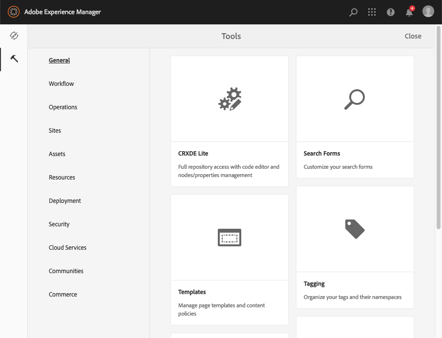
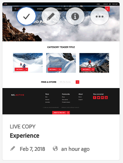
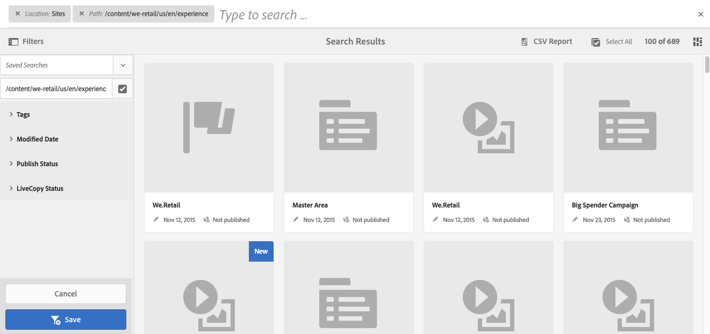

# 基本處理{#basic-handling}

>[!NOTE]
>
>* 本頁面旨在提供使用AEM作者環境時基本處理的概述。 它以 **Sites** Console為基礎。
   >
   >
* 有些功能並非在所有控制台中都可用，有些控制台中可能還提供其他功能。 有關各個控制台及其相關功能的具體資訊將在其他頁面上詳細介紹。
>* AEM提供鍵盤快速鍵。 尤其是使用 [控制台](/help/sites-authoring/keyboard-shortcuts.md) , [編輯頁面時](/help/sites-authoring/page-authoring-keyboard-shortcuts.md)。
>

## 快速入門 {#getting-started}

### 可觸控的UI {#a-touch-enabled-ui}

AEM的使用者介面已啟用觸控功能。 觸控式介面可讓您使用觸控功能，透過點選、觸控和滑動等手勢與軟體互動。 這與傳統案頭介面使用滑鼠動作（例如按一下、按兩下、按滑鼠右鍵和滑鼠滑鼠滑鼠滑鼠滑鼠滑鼠）的運作方式不同。

由於AEM UI已啟用觸控功能，因此您可以在觸控裝置（例如行動裝置或平板電腦）上使用觸控手勢，以及在傳統桌上型裝置上使用滑鼠動作。

### 第一步 {#first-steps}

登入後，您立即進入導 [覽面板](#navigation-panel)。 選取其中一個選項會開啟個別的主控台。

>[!NOTE]
>
>為了充份瞭解AEM的基本使用，本檔案以 **Sites** Console為基礎。
>
>按一下或點選「 **網站** 」以開始使用。

### 產品導覽 {#product-navigation}

每當使用者第一次存取主控台時，就會啟動產品導覽教學課程。 點選或點選只需一分鐘，即可取得AEM基本處理的完整概觀。

按一下或點 **選「下** 一步」，進入概述的下一頁。 按一下或點選「 **關閉** 」，或在概述對話方塊外點選或關閉。

除非您檢視所有投影片，或勾選「不再顯示」選項，否則下次存取主控台時， **概述會重新開始**。

## 全域導覽 {#global-navigation}

您可以使用全域導覽面板，在控制台之間導覽。 當您按一下或點選畫面左上角的Adobe Experience manager連結時，會以全螢幕下拉式清單觸發。

您可以按一下或點選「關閉」以關閉全域導覽面板， **以返回** 先前的位置。

>[!NOTE]
>
>當您第一次登入時，會顯示導 **覽面板** 。

全域導覽有兩個面板，由畫面左邊緣的圖示表示：

* **[導航](/help/sites-authoring/basic-handling.md#navigation-panel)**-由羅盤表示
* **[工具](/help/sites-authoring/basic-handling.md#tools-panel)**-用錘子表示

以下說明這些面板上可用的選項。

### 導覽面板 {#navigation-panel}

導覽面板：

在導航中，可用控制台包括：

<table>
 <tbody>
  <tr>
   <td><strong>主控台</strong></td>
   <td><strong>目的</strong></td>
  </tr>
  <tr>
   <td>資產  </td>
   <td>這些控制台可讓您匯入 <a href="/help/assets/home.md">和管理數位資產</a> ，例如影像、視訊、檔案和音訊檔案。 然後，在相同AEM例項上執行的任何網站都可以使用這些資產。 </td>
  </tr>
  <tr>
   <td>社群</td>
   <td>此主控台可讓您建立和管理社群網 <a href="/help/communities/sites-console.md">站</a> ，以 <a href="/help/communities/overview.md#engagement-community">便參與</a><a href="/help/communities/overview.md#enablement-community">和啟用</a>。</td>
  </tr>
  <tr>
   <td>商務</td>
   <td>這可讓您管理與您的 <a href="/help/sites-administering/ecommerce.md">Commerce網站相關的產品、產品型錄和</a> 訂單。</td>
  </tr>
  <tr>
   <td>體驗片段</td>
   <td>體 <a href="/help/sites-authoring/experience-fragments.md">驗片段</a> ，是可跨通道重複使用且有各種變化的獨立體驗，省去重複複製和貼上體驗或體驗部分的麻煩。</td>
  </tr>
  <tr>
   <td>表單</td>
   <td>此主控台可讓您建立、管理和處理表 <a href="/help/forms/home.md">單和檔案</a>。</td>
  </tr>
  <tr>
   <td>個性化</td>
   <td>此主控台提供一 <a href="/help/sites-authoring/personalization.md">套工具架構，以製作目標內容並呈現個人化體驗</a>。</td>
  </tr>
  <tr>
   <td>專案</td>
   <td>「專 <a href="/help/sites-authoring/touch-ui-managing-projects.md">案」主控台可讓您直接存取專案</a>。 專案是虛擬儀表板。 它們可用來建立團隊，然後讓該團隊存取資源、工作流程和工作，讓人們能夠達成共同目標。   </td>
  </tr>
  <tr>
   <td>畫面</td>
   <td><a href="https://docs.adobe.com/content/help/en/experience-manager-screens/user-guide/authoring/setting-up-projects/creating-a-screens-project.html">螢幕</a> ，可讓您管理任何尺寸和位置的所有客戶對應螢幕。</td>
  </tr>
  <tr>
   <td>網站</td>
   <td>Sites主控台可讓您 <a href="/help/sites-authoring/page-authoring.md">建立、檢視和管理在AEM例項上執行的網站</a> 。 透過這些主控台，您可以建立、編輯、複製、移動和刪除網站頁面、啟動工作流程和發佈頁面。  </td>
  </tr>
 </tbody>
</table>

### 工具面板 {#tools-panel}

在「工具」面板中，側面板中的每個選項都包含一系列子菜單。 此處 [提供的「工具](/help/sites-administering/tools-consoles.md) 」主控台可讓您存取許多專業工具和主控台，以協助您管理網站、數位資產和內容存放庫的其他方面。

## 標題 {#the-header}

頁首一律會顯示在畫面頂端。 雖然標題中的大多數選項無論您在系統中的何處都保持不變，但有些選項是內容特定的。

* [全域導覽](#navigatingconsolesandtools)

   選取 **Adobe Experience Manager** 連結，在控制台之間導覽。

   

* [搜尋](/help/sites-authoring/search.md)

   

   您也可以使用快 [捷鍵](/help/sites-authoring/keyboard-shortcuts.md) ( `/` 正斜線)從任何控制台叫用搜尋。

* [解決方案](https://www.adobe.com/experience-cloud.html)

   

* [說明](#accessinghelptouchoptimizedui)

   

* [通知](/help/sites-authoring/inbox.md)

   

   此圖示將與目前指派的未完成通知數目加上標籤。

   >[!NOTE]
   >
   >現成可用的AEM會預先載入指派給管理員使用者群組的管理工作。 如需 [詳細資訊，請參閱您的收件匣——立即可用的管理工作](/help/sites-authoring/inbox.md#out-of-the-box-administrative-tasks) 。

* [使用者屬性](/help/sites-authoring/user-properties.md)

   

* [軌道選擇器](/help/sites-authoring/basic-handling.md#rail-selector)

   

   顯示的選項取決於您當前的控制台。 例如，在 **Sites** 中，您只能選取內容（預設值）、時間軸、參照或篩選側面板。

   

* 階層連結

   

   導覽路徑標示位於導覽軌的中間，並一律顯示目前選取項目的說明，可讓您在特定主控台中導覽。 在「網站」主控台中，您可以瀏覽網站的各個層級。

   只要按一下階層連結文字，就會顯示下拉式清單，列出目前選取項目的階層層級。 按一下項目可跳至該位置。

   

* 分析時段選擇

   

   這僅在清單檢視中可用。 如需詳 [細資訊](#list-view) ，請參閱清單檢視。

* **「建立** 」按鈕

   

   按一下後，顯示的選項就適合主控台／內容。

* [檢視](/help/sites-authoring/basic-handling.md#viewingandselectingyourresourcescardlistcolumn)

   檢視圖示位於AEM工具列的最右側。 如同它指示當前視圖一樣，它也會更改。 例如，在預設視圖中，列視 **圖顯示** :

   

   可以在欄檢視、卡片檢視和清單檢視之間切換；在清單檢視中，也會顯示檢視設定。

   

## 存取說明 {#accessing-help}

有各種可用的說明資源：

* **控制台工具欄**

   視您的位置而定，「說 **明** 」圖示會開啟適當的資源：

   

* **導覽**

   您第一次導覽系統時，會有一 [系列投影片介紹AEM導覽](/help/sites-authoring/basic-handling.md#product-navigation)。

* **頁面編輯器**

   第一次編輯頁面時，一連串投影片會引入頁面編輯器。

   

   首次存取任何主控台時，請像導 [覽產品導覽概述一樣](/help/sites-authoring/basic-handling.md#product-navigation) ，導覽此概述。

   從「頁 [**面資訊&#x200B;**」功能表，您可以選**&#x200B;取「說明&#x200B;**](/help/sites-authoring/author-environment-tools.md#accessing-help)」，隨時再次顯示此功能。

* **工具控制台**

   您也可以 **從** 「工具」主控台存取外部 **資源**:

   * **檔案**&#x200B;檢視網頁體驗管理檔案

   * **開發人員資源**&#x200B;開發人員資源與下載
   >[!NOTE]
   >
   >在控制台中時，您可以使用熱鍵（問號），隨時 `?` 訪問可用的快捷鍵概述。
   >
   >如需所有鍵盤快速鍵的概觀，請參閱下列檔案：
   >
   >    * [編輯頁面的鍵盤快速鍵](/help/sites-authoring/page-authoring-keyboard-shortcuts.md)
   >    * [控制台的鍵盤快速鍵](/help/sites-authoring/keyboard-shortcuts.md)

## 動作工具列 {#actions-toolbar}

每當選取資源（例如頁面或資產）時，工具列中會以包含說明文字的圖示來指示各種動作。 這些動作取決於：

* 當前控制台。
* 目前的內容。
* 無論您是處於選 [擇模式](#navigatingandselectionmode)。

工具列中可用的動作會變更，以反映您可對選取的特定項目所執行的動作。

選擇資 [源的方式](/help/sites-authoring/basic-handling.md#viewing-and-selecting-resources) ，取決於視圖。

由於某些視窗的空間限制，工具列可能會很快變得比可用的空間長。 發生此情況時，會出現其他選項。 按一下或點選省略號(三個點或…… ****)會開啟一個下拉式選取器，其中包含所有剩餘的動作。 例如，在Sites主控台中選取頁面 **後** :

>[!NOTE]
>
>可用的個別圖示會與適當的主控台／功能／藍本相關。

## 快速動作 {#quick-actions}

在「 [卡片檢視](#cardviewquickactions) 」中，某些動作除了位於工具列上外，還可當成快速動作圖示。 快速動作圖示可同時用於單一項目，讓您不需要預先選取。

當您移動資源卡（案頭裝置）時，可看到快速動作。 可用的快速動作可視主控台和內容而定。 例如，以下是Sites主控台中頁面的快速 **動作** :

## 查看和選擇資源 {#viewing-and-selecting-resources}

檢視、導覽和選取在所有檢視中的概念上都相同，但處理方式的變化很小，視您使用的檢視而定。

您可以使用任何可用的檢視來檢視、瀏覽及選擇（以進一步執行動作）您的資源，每個檢視都可由右上角的圖示選取：

* [欄檢視](#column-view)
* [卡片檢視](#card-view)

* [清單檢視](#list-view)

>[!NOTE]
>
>依預設，AEM Assets不會將UI中資產的原始轉譯顯示為任何檢視的縮圖。 如果您是管理員，您可以使用覆蓋來設定AEM Assets，將原始轉譯顯示為縮圖。

### 選擇資源 {#selecting-resources}

選擇特定資源取決於視圖和設備的組合：

<table>
 <tbody>
  <tr>
   <td> </td>
   <td>選擇</td>
   <td>取消選取</td>
  </tr>
  <tr>
   <td>欄檢視  </td>
   <td>
    <ul>
     <li>  案頭：按一下縮圖</li>
     <li>  行動裝置：點選縮圖</li>
    </ul> </td>
   <td>
    <ul>
     <li>  案頭：按一下縮圖</li>
     <li>  行動裝置：點選縮圖</li>
    </ul> </td>
  </tr>
  <tr>
   <td>卡片檢視  </td>
   <td>
    <ul>
     <li>  案頭：滑鼠移動，然後使用勾號快速動作</li>
     <li>  行動裝置：點選並按住卡片</li>
    </ul> </td>
   <td>
    <ul>
     <li>  案頭：按一下資訊卡</li>
     <li>  行動裝置：點選資訊卡</li>
    </ul> </td>
  </tr>
  <tr>
   <td>清單檢視</td>
   <td>
    <ul>
     <li>  案頭：按一下縮圖</li>
     <li>  行動裝置：點選縮圖</li>
    </ul> </td>
   <td>
    <ul>
     <li>  案頭：按一下縮圖</li>
     <li>  行動裝置：點選縮圖</li>
    </ul> </td>
  </tr>
 </tbody>
</table>

#### 全選 {#select-all}

按一下控制台右上角的「全選 **」** (Select All)選項，即可在任何檢視中選取所有項目。

* 在卡 **片檢視中** ，會選取所有卡片。
* 「列 **表視圖** 」(In List View)會選擇清單中的所有項。
* 在「 **欄檢視** 」中，最左欄中的所有項目都會選取。

#### 取消選擇全部 {#deselecting-all}

在所有情況下，當您選取項目時，所選項目的計數都會顯示在工具列的右上角。

您可以透過下列任一方式取消選取所有項目並退出選擇模式：

* 點選計數旁 **的** X,

* 或者使用 **逃逸**。

在所有檢視中，如果您使用桌上型裝置，則可點選鍵盤上的逸出，以指定所有項目。

#### 選擇示例 {#selecting-example}

1. 例如，在卡片檢視中：

   

1. 在選擇資源後，操作工具欄將覆蓋頂部標題  ，該工具欄提供對當前適用於選定資源的操作的訪問。

   要退出選擇模式，請選 **擇右上角** 的X，或使用轉 **義**。

### 欄檢視 {#column-view}

列視圖允許通過一系列級聯列對內容樹進行可視導航。 此檢視可讓您視覺化並瀏覽網站的樹狀結構。

在最左側列中選擇資源時，右側列中將顯示子資源。 然後，在右欄中選擇資源將在右側的另一欄中顯示子資源，依此類推。

* 通過點選或按一下資源名稱或資源名稱右側的雪佛龍，可以在樹中上下導航。

   * 點選或點選資源名稱和Chevron時，會反白顯示。
   

   * 已點按／點按資源的子系會顯示在已點按／點按資源右側的欄中。
   * 如果您點選或按一下沒有子項的資源名稱，其詳細資訊將顯示在最終欄中。

* 點選或按一下縮圖會選取資源。

   * 選中後，複選標籤將覆蓋在縮圖上，資源名稱也將突出顯示。
   * 選定資源的詳細資訊將顯示在最終列中。
   * 動作工具列將可供使用。
   

   在欄檢視中選取頁面時，選取的頁面會顯示在最終欄中，並包含下列詳細資訊：

   * 頁面標題
   * 頁面名稱（頁面URL的一部分）
   * 頁面的範本基礎
   * 修改詳細資訊
   * 頁面語言
   * 出版物詳細資料

### 卡片檢視 {#card-view}

* 卡片檢視會顯示目前層級上每個項目的資訊卡。 這些提供的資訊包括：

   * 頁面內容的視覺表示。
   * 頁面標題。
   * 重要日期（例如上次編輯、上次發佈）。
   * 如果頁面已鎖定、隱藏或為livecopy的一部分。
   * 如果適當，當您需要在工作流程中採取動作時。

      * 表示必要操作的標籤可能與收件箱中的條目 [相關](/help/sites-authoring/inbox.md)。

* [此檢視中](#quick-actions) ，也提供快速動作，例如選取範圍和常用動作，例如編輯。

   

* 您可以點選／按一下資訊卡（小心以避免快速動作），或使用標題中的網站導覽路徑標示，以向下導 [覽樹狀結構](/help/sites-authoring/basic-handling.md#the-header)。

### 清單檢視 {#list-view}

* 清單視圖列出了當前級別上每個資源的資訊。
* 您可以點選／按一下資源名稱，然後使用標題中的階層連結進行備份，以在樹狀結構 [中向下導覽](/help/sites-authoring/basic-handling.md#the-header)。

* 若要輕鬆選取清單中的所有項目，請使用清單左上角的核取方塊。

   

   * 選中清單中的所有項目後，此複選框將顯示為選中狀態。

      * 按一下或點選核取方塊以取消選取全部。
   * 只選取某些項目時，會以減號顯示。

      * 按一下或點選核取方塊以選取全部。
      * 再按一下或點選核取方塊，以取消選取全部。

* 使用「視圖」(Views)按鈕下的「視 **圖設定** 」(View Settings)選項，選擇要顯示的列。 下列欄可供顯示：

   * **名稱** -頁面名稱，在多語言編寫環境中很有用，因為它是頁面URL的一部分，而且不會變更，不論語言為何
   * **Modified** —— 上次修改日期和上次由用戶修改日期
   * **已發佈** -出版物狀態
   * **範本** -頁面所依據的範本
   * **Workflow** —— 目前套用至頁面的工作流程。 當您滑鼠移過或開啟時間軸時，會提供更多資訊。

   * **頁面分析**
   * **獨特訪客**
   * **頁面逗留時間**
   

   依預設會 **顯示「名稱** 」欄，該欄是頁面URL的一部分。 在某些情況下，作者可能需要存取使用不同語言的頁面，而如果作者不知道頁面的語言，則查看頁面名稱（通常不變）會有很大幫助。

* 使用清單中每個項目最右側的虛線垂直列來變更項目順序。

   >[!NOTE]
   >
   >更改順序只適用於具有值為的有序 `jcr:primaryType` 資料夾 `sling:OrderedFolder`。

   

   按一下或點選垂直選取列，然後將項目拖曳至清單中的新位置。

   

* 您可以使用「檢視設定」對話方塊顯示適當的欄，以顯 **示Analytics** 資料。

   您可以使用標題右側的篩選選項，篩選過去30、90或365天的Analytics資料。

   

## 軌道選擇器 {#rail-selector}

視 **窗左上角** ，提供「邊欄選擇器」，並根據您目前的控制台顯示選項。

例如，在「網站」中，您只能選取內容（預設值）、內容樹狀結構、時間軸、參照或篩選側面板。

如果僅選取內容，則只會顯示邊欄圖示。 當選取任何其他選項時，選項名稱會出現在邊欄圖示旁。

>[!NOTE]
>
>[您可使用鍵盤快速鍵](/help/sites-authoring/keyboard-shortcuts.md) ，快速切換邊欄顯示選項。

### 內容樹 {#content-tree}

內容樹狀結構可用來快速導覽側面板中的網站階層，並檢視目前檔案夾中頁面的相關資訊。

使用內容樹側面板與清單檢視或卡片檢視搭配使用，使用者可輕鬆檢視專案的階層結構，並使用內容樹側面板輕鬆瀏覽內容結構，並在清單檢視中檢視詳細的頁面資訊。

>[!NOTE]
>
>在選取階層檢視中的項目後，可以使用方向鍵快速導覽階層。
>
>請參閱鍵 [盤快速鍵](/help/sites-authoring/keyboard-shortcuts.md) ，以取得詳細資訊。

### 時間軸 {#timeline}

時間軸可用於查看和／或啟動在選定資源上發生的事件。 若要開啟時間軸欄，請使用邊欄選擇器：

時間軸欄可讓您：

* [檢視與選取項目](#timelineviewevents) 相關的各種事件。

   * 可從下拉式清單中選取事件類型：

      * [評論](#timelineaddingandviewingcomments)
      * 註解
      * 活動
      * [啟動](/help/sites-authoring/launches.md)
      * [版本](/help/sites-authoring/working-with-page-versions.md)
      * [工作流程](/help/sites-authoring/workflows-applying.md)

         * 但暫時性工 [作流程除外](/help/sites-developing/workflows.md#transient-workflows) ，因為不會儲存這些
      * 和全部顯示

* [新增／檢視有關選](#timelineaddingandviewingcomments) 定項目的註解。 「注 **釋** 」方塊會顯示在事件清單的底部。 鍵入注釋後跟Return將註冊注釋。 當選取「注 **釋** 」或「 **全部顯示** 」時顯示。

* 特定控制台具有其他功能。 例如，在Sites主控台中，您可以：

   * [儲存版本](/help/sites-authoring/working-with-page-versions.md#creatinganewversiontouchoptimizedui)。
   * [啟動工作流程](/help/sites-authoring/workflows-applying.md#startingaworkflowfromtherail).

這些選項可通過「注釋」欄位旁的 **雪佛龍** 訪問。

### 引用 {#references}

**引用** ，顯示與選定資源的任何連接。 例如，在Sites控制台 **中** ，頁 [面的參](/help/sites-authoring/author-environment-tools.md#showingpagereferences) 考顯示：

* [啟動](/help/sites-authoring/launches.md#launches-in-references-sites-console)
* [即時副本](/help/sites-administering/msm-livecopy-overview.md#openingthelivecopyoverviewfromreferences)
* [語言副本](/help/sites-administering/tc-prep.md#seeing-the-status-of-language-roots)
* 內容參考：

   * 從其他頁面到所選頁面的連結
   * 參考元件借閱和／或借閱至選取頁面的內容

### 篩選 {#filter}

如此會開啟類似搜尋的面 [板](/help/sites-authoring/search.md) ，其中已設定適當的位置篩選條件，讓您進一步篩選想要檢視的內容。

