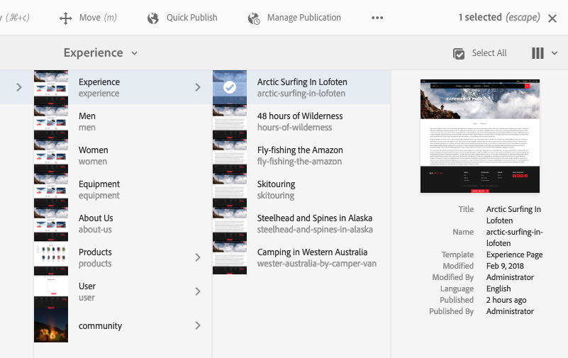

# 基本處理{#basic-handling}

>[!NOTE]
>
>* 此頁面旨在概述使用作者環境時的基AEM本處理。 它使用 **站點** 控制台。
>
>* 某些功能並非在所有控制台中都可用，而其他功能可能在某些控制台中可用。 有關各個控制台及其相關功能的具體資訊將在其他頁面中詳細介紹。
>* 鍵盤快捷鍵在整個區域都AEM可用。 特別是 [使用控制台](/help/sites-authoring/keyboard-shortcuts.md) 和 [編輯頁](/help/sites-authoring/page-authoring-keyboard-shortcuts.md)。
>

## 快速入門 {#getting-started}

### 啟用觸摸的UI {#a-touch-enabled-ui}

已啟AEM用用戶介面進行觸摸。 啟用觸摸的介面允許您使用觸摸通過點擊、觸摸和握持等手勢與軟體交互。 這與傳統案頭介面使用滑鼠操作（如按一下、按兩下、按一下右鍵和滑鼠移動）的操作方式不同。

由於AEMUI是觸摸式的，因此您可以在觸摸設備（例如移動或平板）上使用觸摸手勢，在傳統案頭設備上使用滑鼠操作。

### 第一步 {#first-steps}

登錄後，您立即到達 [導航面板](#navigation-panel)。 選擇其中一個選項將開啟相應的控制台。

>[!NOTE]
>
>為了更好地瞭解基本的使用，AEM本文檔基於 **站點** 控制台。
>
>按一下或點擊 **站點** 的子例行程式。

### 產品導覽 {#product-navigation}

每當用戶首次訪問控制台時，都會啟動產品導航教程。 按一下或點擊一下，只需一分鐘，即可獲得對基本處理的完美概AEM述。

按一下或點擊 **下一個** 以進入概述的下一頁。 按一下或點擊 **關閉** 或按一下或在「概述」(overview)對話框外點擊以關閉。

除非您查看所有幻燈片或選中該選項，否則下次訪問控制台時，概述將重新啟動 **不再顯示此內容**。

## 全局導航 {#global-navigation}

可以使用全局導航面板在控制台之間導航。 當您按一下或點擊螢幕左上角的Adobe Experience Manager連結時，此按鈕將觸發為全屏下拉。

通過按一下或點擊，可關閉全局導航面板 **關閉** 返回您以前的位置。

>[!NOTE]
>
>首次登錄時，將 **導航** 的子菜單。

全局導航有兩個面板，由螢幕左邊緣的表徵圖表示：

* **[導航](/help/sites-authoring/basic-handling.md#navigation-panel)**  — 用羅盤表示
* **[工具](/help/sites-authoring/basic-handling.md#tools-panel)**  — 用錘子代表

下面介紹了這些面板上可用的選項。

### 導覽面板 {#navigation-panel}

「導航」面板提供對控制台的AEM訪問：

瀏覽器頁籤的標題將更新，以反映您在控制台和內容中導航時的位置。

在導航中，可用的控制台包括：

<table>
 <tbody>
  <tr>
   <td><strong>主控台</strong></td>
   <td><strong>用途</strong></td>
  </tr>
  <tr>
   <td>資產  </td>
   <td>這些控制台允許您導入和 <a href="/help/assets/home.md">管理數字資產</a> 如影像、視頻、文檔和音頻檔案。 然後，在同一實例上運行的任何網站都可以使用這些AEM資產。 </td>
  </tr>
  <tr>
   <td>社群</td>
   <td>此控制台允許您建立和管理 <a href="/help/communities/sites-console.md">社區站點</a> 為 <a href="/help/communities/overview.md#engagement-community">參與</a> 和 <a href="/help/communities/overview.md#enablement-community">啟用</a>。</td>
  </tr>
  <tr>
   <td>商務</td>
   <td>這允許您管理與您的 <a href="/help/commerce/cif-classic/administering/ecommerce.md">商業</a> 站點。</td>
  </tr>
  <tr>
   <td>體驗片段</td>
   <td>安 <a href="/help/sites-authoring/experience-fragments.md">體驗片段</a> 是一種獨立體驗，可跨渠道重複使用，並且有各種變化，避免了反複複製和貼上體驗或部分體驗的麻煩。</td>
  </tr>
  <tr>
   <td>Forms</td>
   <td>此控制台允許您建立、管理和處理 <a href="/help/forms/home.md">表格和文檔</a>。</td>
  </tr>
  <tr>
   <td>個人化</td>
   <td>此控制台提供 <a href="/help/sites-authoring/personalization.md">用於創作目標內容和呈現個性化體驗的工具框架</a>。</td>
  </tr>
  <tr>
   <td>專案</td>
   <td>的 <a href="/help/sites-authoring/touch-ui-managing-projects.md">項目控制台可讓您直接訪問項目</a>。 項目是虛擬儀表板。 它們可用於構建團隊，然後讓該團隊訪問資源、工作流和任務，從而允許人們按照共同的目標工作。   </td>
  </tr>
  <tr>
   <td>Screens</td>
   <td><a href="https://experienceleague.adobe.com/docs/experience-manager-screens/user-guide/authoring/setting-up-projects/creating-a-screens-project.html">螢幕</a> 將允許您管理所有面向客戶的螢幕，任何大小和位置。</td>
  </tr>
  <tr>
   <td>Sites</td>
   <td>Sites控制台允許您 <a href="/help/sites-authoring/page-authoring.md">建立、查看和管理網站</a> 運行AEM。 通過這些控制台，您可以建立、編輯、複製、移動和刪除網站頁面、啟動工作流和發佈頁面。  </td>
  </tr>
 </tbody>
</table>

### 工具面板 {#tools-panel}

在「工具」面板中，側面板中的每個選項都包含一系列子菜單。 的 [工具控制台](/help/sites-administering/tools-consoles.md) 此處提供了對多種專用工具和控制台的訪問，這些工具和控制台可幫助您管理網站、數字資產和內容儲存庫的其他方面。

## 標頭 {#the-header}

 標頭會始終顯示在畫面頂端。雖然無論您在系統中的哪個位置，頁眉中的大多數選項都保持不變，但有些選項是特定於上下文的。

* [全局導航](#navigatingconsolesandtools)

   選擇 **Adobe Experience Manager** 連結以在控制台之間導航。

   

* [搜尋](/help/sites-authoring/search.md)

   

   您還可以使用 [快捷鍵](/help/sites-authoring/keyboard-shortcuts.md) `/` （正斜線）從任何控制台調用搜索。

* [解決方案](https://www.adobe.com/experience-cloud.html)

   

* [說明](#accessinghelptouchoptimizedui)

   

* [通知](/help/sites-authoring/inbox.md)

   

   此圖示將標有目前已分配的未完成通知數目。

   >[!NOTE]
   >
   >現成版本預裝AEM有分配給管理員用戶組的管理任務。 請參閱 [收件箱 — 開箱管理任務](/help/sites-authoring/inbox.md#out-of-the-box-administrative-tasks) 的雙曲餘切值。

* [使用者屬性](/help/sites-authoring/user-properties.md)

   

* [軌道選擇器](/help/sites-authoring/basic-handling.md#rail-selector)

   

   提供的選項取決於當前控制台。 例如，在 **站點** 您只能選擇內容（預設）、時間軸、引用或篩選器側面板。

   

* 階層連結

   

   位於滑軌的中間，並始終顯示當前選定項的說明，該麵包屑允許您在特定控制台中導航。 在「站點」控制台中，您可以瀏覽網站的級別。

   只需按一下breadcrumb文本即可顯示一個下拉清單，列出當前選定項的層次結構級別。 按一下一個條目可跳轉到該位置。

   

* 分析時段選擇

   

   這僅在清單視圖中可用。 請參閱 [清單視圖](#list-view) 的子菜單。

* **建立** 按鈕

   

   按一下後，顯示的選項將適用於控制台/上下文。

* [檢視](/help/sites-authoring/basic-handling.md#viewingandselectingyourresourcescardlistcolumn)

   視圖表徵圖位於工具欄的最AEM右側。 由於它還指示當前視圖，因此它會更改。 例如，在預設視圖中， **列視圖** 它顯示：

   

   可以在列視圖、卡視圖和清單視圖之間切換；在清單視圖中，它還顯示視圖設定。

   

* 鍵盤導航

   您只能使用鍵盤導航網站。 它使用的標準瀏覽器功能 **頁籤** 鍵 **選項+頁籤**)在頁面上的元素之間移動 *聚焦*。

   在 **站點** 控制台中有添加的選項  **跳至主內容**。 當您 *頁籤* 通過標題選項，並通過允許您跳過（產品）工具欄中的標準元素並直接將您帶到主要內容來加快導航速度。

   

## 訪問幫助 {#accessing-help}

有各種幫助資源可用：

* **控制台工具欄**

   根據您的位置 **幫助** 表徵圖將開啟相應的資源：

   

* **導覽**

   你第一次在系統裡導航時， [一系列幻燈片介紹導AEM航](/help/sites-authoring/basic-handling.md#product-navigation)。

* **頁面編輯器**

   首次編輯頁面時，您會使用一系列幻燈片介紹頁面編輯器。

   

   像瀏覽 [產品導航概述](/help/sites-authoring/basic-handling.md#product-navigation) 首次訪問任何控制台時。

   從 [**頁面資訊** 菜單 **幫助**](/help/sites-authoring/author-environment-tools.md#accessing-help) 隨時再次顯示。

* **工具控制台**

   從 **工具** 也可以訪問外部 **資源**:

   * **文檔**
查看Web體驗管理文檔

   * **開發人員資源**
開發人員資源和下載
   >[!NOTE]
   >
   >您可以隨時使用熱鍵訪問可用快捷鍵的概述 `?` （問號）。
   >
   >有關所有鍵盤快捷鍵的概述，請參閱以下文檔：
   >
   >    * [用於編輯頁面的鍵盤快捷鍵](/help/sites-authoring/page-authoring-keyboard-shortcuts.md)
   >    * [控制台的鍵盤快捷鍵](/help/sites-authoring/keyboard-shortcuts.md)

## 操作工具欄 {#actions-toolbar}

每當選擇資源（例如頁面或資產）時，各種操作都由工具欄中帶有解釋性文本的表徵圖來指示。 這些操作取決於：

* 當前控制台。
* 當前上下文。
* 無論您是否在 [選擇模式](#navigatingandselectionmode)。

工具欄中可用的操作將發生更改，以反映您可以對選定的特定項目執行的操作。

你好 [選擇資源](/help/sites-authoring/basic-handling.md#viewing-and-selecting-resources) 取決於視圖。

由於某些視窗的空間限制，工具列可能會很快變得比可用的空間長。發生此情況時，會出現其他選項。按一下或點選省略號(三個點或…… ****)會開啟一個下拉式選取器，其中包含所有剩餘的動作。例如，在Sites主控台中選取頁面 **後** :

>[!NOTE]
>
>可用的單個表徵圖與相應的控制台/功能/場景相關。

## 快速動作 {#quick-actions}

在 [卡視圖](#cardviewquickactions) 某些操作既可作為快速操作表徵圖，也可位於工具欄上。 快速操作表徵圖可一次用於單個項目，無需預選。

在安裝資源卡（案頭設備）時，可以看到快速操作。 可用的快速操作可能取決於控制台和上下文。 例如，以下是中某頁的快速操作 **站點** 控制台：

## 檢視和選擇資源 {#viewing-and-selecting-resources}

查看、導航和選擇在所有視圖上在概念上都相同，但處理上的變化很小，取決於您使用的視圖。

您可以使用任何可用視圖查看、瀏覽和選擇資源（以便進一步執行操作），其中每個視圖都可由右上角的表徵圖選擇：

* [欄檢視](#column-view)
* [卡片檢視](#card-view)

* [清單檢視](#list-view)

>[!NOTE]
>
>預設情況下，AEM Assets不會將用戶介面中資產的原始格式副本作為任何視圖中的縮略圖顯示。 如果您是管理員，則可以使用疊加來配置AEM Assets以將原始格式副本顯示為縮略圖。

### 選擇資源 {#selecting-resources}

選擇特定資源取決於視圖和設備的組合：

<table>
 <tbody>
  <tr>
   <td> </td>
   <td>選擇</td>
   <td>取消選取</td>
  </tr>
  <tr>
   <td>欄檢視  </td>
   <td>
    <ul>
     <li>案頭：  按一下縮略圖</li>
     <li>移動設備：  點擊縮略圖</li>
    </ul> </td>
   <td>
    <ul>
     <li>案頭：  按一下縮略圖</li>
     <li>移動設備：  點擊縮略圖</li>
    </ul> </td>
  </tr>
  <tr>
   <td>卡片檢視  </td>
   <td>
    <ul>
     <li>案頭：  滑鼠，然後使用複選標籤快速操作</li>
     <li>移動設備：  點擊並握住卡</li>
    </ul> </td>
   <td>
    <ul>
     <li>案頭：  按一下卡</li>
     <li>移動設備：  點擊卡</li>
    </ul> </td>
  </tr>
  <tr>
   <td>清單檢視</td>
   <td>
    <ul>
     <li>案頭：  按一下縮略圖</li>
     <li>移動設備：  點擊縮略圖</li>
    </ul> </td>
   <td>
    <ul>
     <li>案頭：  按一下縮略圖</li>
     <li>移動設備：  點擊縮略圖</li>
    </ul> </td>
  </tr>
 </tbody>
</table>

#### 全選 {#select-all}

通過按一下 **全選** 的上界。

* 在 **卡視圖** 已選擇所有卡。
* 在 **清單視圖** 選擇清單中的所有項。
* 在 **列視圖** 將選擇最左側列中的所有項。

#### 取消全選 {#deselecting-all}

在所有情況下，在選擇項目時，所選項目的計數都顯示在工具欄的右上角。

您可以通過以下任一方式取消選擇所有項目並退出選擇模式：

* 按一下或輕擊 **X** 在伯爵旁邊，

* 或 **逃脫**。

在所有視圖中，如果您使用的是案頭設備，則可通過點擊鍵盤上的escape來指定所有項目。

#### 選擇示例 {#selecting-example}

1. 例如，在卡視圖中：

   

1. 選擇資源後，頂部標題將由 [動作工具欄](#actionstoolbar) 提供對當前適用於選定資源的操作的訪問權限。

   要退出選擇模式，請選擇 **X** 右上角，或使用 **逃脫**。

### 欄檢視 {#column-view}

列視圖允許通過一系列級聯列對內容樹進行可視導航。 此視圖允許您可視化和遍歷網站的樹結構。

在最左側的列中選擇資源將在右側的列中顯示子資源。 選擇右列中的資源後，將在右側的另一列中顯示子資源，依此類推。

* 通過點擊或按一下資源名稱或資源名稱右側的字形，可以在樹中上下導航。

   * 點擊或按一下時，資源名稱和字元將加亮顯示。

   

   * 已按一下/已抽取資源的子項顯示在已按一下/已抽取資源右側的列中。
   * 如果點擊或按一下沒有子項的資源名稱，其詳細資訊將顯示在最終列中。

* 點擊或按一下縮略圖可選擇資源。

   * 選中後，複選標籤將覆蓋在縮略圖上，並且資源名稱也將加亮。
   * 所選資源的詳細資訊將顯示在最終列中。
   * 操作工具欄將變為可用。

   

   在列視圖中選擇頁面時，所選頁面將與以下詳細資訊一起顯示在最終列中：

   * 頁面標題
   * 頁面名稱（頁面URL的一部分）
   * 該頁面基於的模板
   * 修改詳細資訊
   * 頁面語言
   * 發佈詳細資訊

### 卡片檢視 {#card-view}

* 「卡」視圖顯示當前層每個物料的資訊卡。 這些資訊提供了以下資訊：

   * 頁面內容的可視表示。
   * 頁面標題。
   * 重要日期（如上次編輯、上次發佈）。
   * 如果頁面已鎖定、隱藏或是livecopy的一部分。
   * 如果適用，當需要您作為工作流的一部分採取操作時。

      * 指示所需操作的標籤可能與您的 [收件箱](/help/sites-authoring/inbox.md)。

* [快速操作](#quick-actions) 此視圖中也提供了選項和編輯等常見操作。

   

* 您可以點擊/按一下卡（注意避免快速操作），或使用 [標題中的麵包屑](/help/sites-authoring/basic-handling.md#the-header)。

### 清單檢視 {#list-view}

* 清單視圖列出當前級別上每個資源的資訊。
* 通過點擊/按一下資源名稱，可以在樹中向下導航，然後使用 [標題中的麵包屑](/help/sites-authoring/basic-handling.md#the-header)。

* 要輕鬆選擇清單中的所有項目，請使用清單左上角的複選框。

   

   * 選中清單中的所有項目後，此複選框將出現選中狀態。

      * 按一下或點擊複選框以取消選擇全部。
   * 只選擇某些項目時，它會顯示減號。

      * 按一下或點擊複選框以選擇全部。
      * 再次按一下或點擊複選框以取消選擇全部。

* 選擇要使用 **查看設定** 按鈕。 以下列可供顯示：

   * **名稱**  — 頁面名稱，該名稱在多語言創作環境中非常有用，因為它是頁面URL的一部分，不會更改，而不管語言
   * **已修改**  — 用戶上次修改日期和上次修改日期
   * **已發佈**  — 發佈狀態
   * **模板**  — 頁面所基於的模板
   * **工作流**  — 當前應用於頁面的工作流。 當您滑鼠移開或開啟時間軸時，將提供詳細資訊。

   * **頁面分析**
   * **獨特訪問者**
   * **頁上時間**

   

   預設情況下， **名稱** 列，該列是頁面URL的一部分。 在某些情況下，作者可能需要訪問使用不同語言的頁面，如果作者不知道該頁面的語言，查看該頁面的名稱（通常不變）將會有很大幫助。

* 使用清單中每個項目最右側的虛線垂直條更改項目順序。

   >[!NOTE]
   >
   >更改訂單僅在具有 `jcr:primaryType` 值 `sling:OrderedFolder`。

   

   按一下或點擊垂直選擇欄，將項目拖動到清單中的新位置。

   

* 通過使用 **查看設定** 對話框。

   您可以使用標題右側的篩選器選項篩選過去30、90或365天的分析資料。

   

## 邊欄選擇器 {#rail-selector}

的 **軌道選擇器** 在窗口的左上角可用，並根據當前控制台顯示選項。

例如，在「站點」中，您只能選擇內容（預設）、內容樹、時間軸、引用或篩選器側面板。

如果僅選擇內容，則只顯示滑軌表徵圖。 選中任何其它選項後，選項名稱將出現在滑軌表徵圖旁邊。

>[!NOTE]
>
>[鍵盤快捷鍵](/help/sites-authoring/keyboard-shortcuts.md) 可快速切換軌道顯示選項。

### 內容樹 {#content-tree}

內容樹可用於快速導航側面板中的站點層次結構並查看有關當前資料夾中頁面的許多資訊。

使用內容樹側面板與清單視圖或卡片視圖結合使用，用戶可以容易地看到項目的分層結構，並使用內容樹側面板輕鬆地在內容結構中導航，以及在清單視圖中查看詳細的頁面資訊。

>[!NOTE]
>
>一旦選擇了層次視圖中的條目，可以使用箭頭鍵快速導航層次。
>
>請參閱 [鍵盤快捷鍵](/help/sites-authoring/keyboard-shortcuts.md) 的子菜單。

### 時間軸 {#timeline}

時間線可用於查看和/或啟動在所選資源上發生的事件。 要開啟時間軸列，請使用滑軌選擇器：

時間軸列允許您：

* [查看各種事件](#timelineviewevents) 與所選項目相關。

   * 可以從下拉清單中選擇事件類型：

      * [評論](#timelineaddingandviewingcomments)
      * 註解
      * 活動
      * [Launch](/help/sites-authoring/launches.md)
      * [版本](/help/sites-authoring/working-with-page-versions.md)
      * [工作流程](/help/sites-authoring/workflows-applying.md)

         * 除非 [瞬態工作流](/help/sites-developing/workflows.md#transient-workflows) 因為沒有為這些檔案保存歷史資訊
      * 顯示全部

* [新增/檢視有關所選項目的註解。](#timelineaddingandviewingcomments)「注 **釋** 」方塊會顯示在事件清單的底部。鍵入注釋後跟Return將註冊注釋。當選取「注 **釋** 」或「 **全部顯示** 」時顯示。

* 特定控制台具有其他功能。 例如，在「站點」控制台中，您可以：

   * [保存版本](/help/sites-authoring/working-with-page-versions.md#creatinganewversiontouchoptimizedui)。
   * [啟動工作流程](/help/sites-authoring/workflows-applying.md#startingaworkflowfromtherail).

這些選項可通過位於 **注釋** 的子菜單。

### 引用 {#references}

**引用** 顯示與選定資源的任何連接。 例如，在 **站點** 控制台 [參照](/help/sites-authoring/author-environment-tools.md#showingpagereferences) 對於頁面，顯示：

* [Launch](/help/sites-authoring/launches.md#launches-in-references-sites-console)
* [即時拷貝](/help/sites-administering/msm-livecopy-overview.md#openingthelivecopyoverviewfromreferences)
* [語言副本](/help/sites-administering/tc-prep.md#seeing-the-status-of-language-roots)
* 內容引用：

   * 從其他頁面連結到所選頁面
   * 從「參考」元件借入和/或借出到選定頁面的內容

### 篩選 {#filter}

這將開啟一個類似於 [搜索](/help/sites-authoring/search.md) 已設定適當的位置篩選器，允許您進一步篩選要查看的內容。

