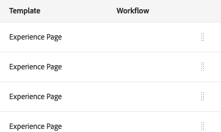

# 基本處理{#basic-handling}

>[!NOTE]
>
>* 此頁面旨在概述使用Adobe Experience Manager (AEM)製作環境時的基本處理方式。 它使用&#x200B;**Sites**&#x200B;主控台作為基礎。
>
>* 部分功能並非在所有主控台中提供，部分主控台可能提供其他功能。 有關個別主控台及其相關功能的特定資訊，請參閱其他頁面上的詳細說明。
>* 在整個AEM環境中都可以使用鍵盤快速鍵。 特別是當[使用主控台](/help/sites-authoring/keyboard-shortcuts.md)和[編輯頁面](/help/sites-authoring/page-authoring-keyboard-shortcuts.md)時。
>

## 快速入門 {#getting-started}

### 觸控式UI {#a-touch-enabled-ui}

AEM的使用者介面已啟用觸控功能。 觸控式介面可讓您使用觸控功能，透過選擇、觸控並按住及撥動等手勢與軟體互動。 這與傳統的案頭介面使用滑鼠動作（例如按一下、連按兩下、按一下滑鼠右鍵和滑鼠懸停滑鼠）的操作方式相反。

由於AEM UI支援觸控功能，因此您可以在觸控裝置（例如行動裝置或平板電腦）上使用觸控手勢，並在傳統桌上型裝置上使用滑鼠動作。

### 首要步驟 {#first-steps}

登入後立即進入[導覽面板](#navigation-panel)。 選取其中一個選項會開啟個別主控台。

>[!NOTE]
>
>為了深入瞭解AEM的基本用法，本檔案是以&#x200B;**網站**&#x200B;主控台為基礎的。
>
>若要開始，請按一下&#x200B;**網站**。

### 產品導覽 {#product-navigation}

每當使用者首次存取主控台時，就會啟動產品導覽教學課程。 按一下以取得AEM基本處理的概述。

按一下&#x200B;**下一步**&#x200B;進入概覽的下一頁。 按一下&#x200B;**關閉**&#x200B;或按一下總覽對話方塊外部以關閉。

除非您檢視所有投影片，或勾選&#x200B;**不要再顯示此專案**&#x200B;選項，否則概觀會在您下次存取主控台時重新啟動。

## 全域導覽 {#global-navigation}

您可以使用全域導覽面板在主控台之間導覽。 當您按一下畫面左上方的Adobe Experience Manager連結時，就會觸發此動作成為全熒幕下拉式清單。

您可以按一下或點選「**關閉**」來關閉全域導覽面板，以返回您之前的位置。

>[!NOTE]
>
>第一次登入時，您會看到&#x200B;**導覽**&#x200B;面板

全域導覽有兩個面板，由畫面左側的圖示表示：

* **[導覽](/help/sites-authoring/basic-handling.md#navigation-panel)** — 以指南針表示
* **[工具](/help/sites-authoring/basic-handling.md#tools-panel)** — 以錘子表示

這些面板上可用的選項說明如下。

### 導覽面板 {#navigation-panel}

「導覽」面板提供對AEM主控台的存取權：

瀏覽器索引標籤的標題會更新，以反映您在瀏覽主控台和內容時的位置。

在「導覽」中，可用的主控台有：

<table>
 <tbody>
  <tr>
   <td><strong>主控台</strong></td>
   <td><strong>用途</strong></td>
  </tr>
  <tr>
   <td>Assets  </td>
   <td>這些主控台可讓您匯入及<a href="/help/assets/assets.md">管理數位資產</a>，例如影像、影片、檔案和音訊檔案。 這些資產隨後便可由同一AEM例項上執行的任何網站使用。 </td>
  </tr>
  <tr>
   <td>Communities</td>
   <td>此主控台可讓您建立和管理<a href="/help/communities/sites-console.md">參與</a>和<a href="/help/communities/overview.md#engagement-community">啟用</a>的<a href="/help/communities/overview.md#enablement-community">社群網站</a>。</td>
  </tr>
  <tr>
   <td>Commerce</td>
   <td>這可讓您管理與您的<a href="/help/commerce/cif-classic/administering/ecommerce.md">Commerce</a>網站相關的產品、產品目錄和訂單。</td>
  </tr>
  <tr>
   <td>體驗片段</td>
   <td><a href="/help/sites-authoring/experience-fragments.md">體驗片段</a>是獨立的體驗，可以跨管道重複使用，也可以有變數，省去重複複製和貼上體驗或體驗片段的麻煩。</td>
  </tr>
  <tr>
   <td>Forms</td>
   <td>此主控台可讓您建立、管理及處理您的<a href="/help/forms/using/introduction-aem-forms.md">表單與檔案</a>。</td>
  </tr>
  <tr>
   <td>個人化</td>
   <td>此主控台提供<a href="/help/sites-authoring/personalization.md">工具架構，用於製作目標內容及呈現個人化體驗</a>。</td>
  </tr>
  <tr>
   <td>專案</td>
   <td><a href="/help/sites-authoring/touch-ui-managing-projects.md">專案主控台可讓您直接存取您的專案</a>。 專案是虛擬儀表板。 它們可用於建立團隊，然後授予該團隊存取資源、工作流程和任務的許可權，並允許人員達成共同目標。  </td>
  </tr>
  <tr>
   <td>Screens</td>
   <td><a href="https://experienceleague.adobe.com/docs/experience-manager-screens/user-guide/authoring/setting-up-projects/creating-a-screens-project.html?lang=zh-Hant">Screens</a>可讓您管理任何地點、任何大小的面向客戶的所有熒幕。</td>
  </tr>
  <tr>
   <td>Sites</td>
   <td>Sites主控台可讓您<a href="/help/sites-authoring/page-authoring.md">建立、檢視及管理在您的AEM執行個體上執行的網站</a>。 透過這些主控台，您可以建立、編輯、複製、移動和刪除網站頁面、啟動工作流程以及發佈頁面。  </td>
  </tr>
 </tbody>
</table>

### 「工具」面板 {#tools-panel}

在「工具」面板中，側面板中的每個選項都包含一系列的子選單。 這裡提供的[工具主控台](/help/sites-administering/tools-consoles.md)可讓您存取數種特殊工具和主控台，協助您管理網站、數位資產和內容存放庫的其他方面。

## 標頭 {#the-header}

標題一律會顯示在畫面頂端。 雖然無論您在系統中的何處，標題中的大部分選項都保持不變，但有些選項是上下文特定的。

* [全域導覽](#navigatingconsolesandtools)

  選取&#x200B;**Adobe Experience Manager**&#x200B;連結，您可以在其中瀏覽主控台。

  

* [搜尋](/help/sites-authoring/search.md)

  

  您也可以使用[捷徑鍵](/help/sites-authoring/keyboard-shortcuts.md) `/` （正斜線）從任何主控台叫用搜尋。

* [解決方案](https://business.adobe.com/)

  

* [說明](#accessinghelptouchoptimizedui)

  

* [通知](/help/sites-authoring/inbox.md)

  

  此圖示會加上目前指派的未完成通知數目。

  >[!NOTE]
  >
  >現成可用的AEM會預先載入指派給管理員使用者群組的管理任務。 如需詳細資訊，請參閱[您的收件匣 — 立即可用的管理工作](/help/sites-authoring/inbox.md#out-of-the-box-administrative-tasks)。

* [使用者屬性](/help/sites-authoring/user-properties.md)

  

* [邊欄選擇器](/help/sites-authoring/basic-handling.md#rail-selector)

  

  顯示的選項取決於您目前的主控台。 例如，在&#x200B;**Sites**&#x200B;中，您可以選取僅限內容（預設）、時間軸、參照或篩選器側面板。

  

* 導覽列

  

  階層連結會顯示在邊欄中間，且一律顯示目前所選專案的說明，讓您可在特定主控台內導覽。 在Sites主控台中，您可以導覽網站的各個層級。

  按一下階層連結文字會開啟一個下拉式清單，列出目前所選專案的階層層次。 若要跳至該位置，請按一下專案。

  

* Analytics時段選擇

  

  這僅在清單檢視中可用。 如需詳細資訊，請參閱[清單檢視](#list-view)。

* **建立**&#x200B;按鈕

  

  按一下後，顯示的選項即適用於主控台/前後關聯。

* [檢視](/help/sites-authoring/basic-handling.md#viewingandselectingyourresourcescardlistcolumn)

  檢檢視示位於AEM工具列的最右側。 它也會指出目前的檢視，因此會變更。 例如，在預設檢視&#x200B;**欄檢視**&#x200B;中顯示：

  

  您可以在欄檢視、卡片檢視和清單檢視之間切換。 清單檢視會顯示檢視設定。

  

* 鍵盤導覽

  您僅能使用鍵盤導覽網站。 這會使用&#x200B;**TAB**&#x200B;索引鍵（或&#x200B;**OPT+TAB**）的標準瀏覽器功能，在頁面上可聚焦的元素&#x200B;*之間*&#x200B;移動您。

  在&#x200B;**網站**&#x200B;主控台中，**跳至主要內容**&#x200B;的選項已新增。 透過header選項&#x200B;*tab*&#x200B;時，這個選項就會顯示出來，而且可以讓您略過（產品）工具列中的標準元素，並直接前往主要內容，加速導覽。

  

## 存取說明 {#accessing-help}

有多種可用的說明資源：

* **主控台工具列**

  根據您的位置，**說明**&#x200B;圖示會開啟適當的資源：

  

* **導覽**

  第一次導覽系統時，[一連串幻燈片會介紹AEM導覽](/help/sites-authoring/basic-handling.md#product-navigation)。

* **頁面編輯器**

  第一次編輯頁面時，系統會以一系列幻燈片來介紹頁面編輯器。

  

  第一次存取任何主控台時，瀏覽這個概觀，就像瀏覽[產品瀏覽概觀](/help/sites-authoring/basic-handling.md#product-navigation)一樣。

  從&#x200B;**頁面資訊**&#x200B;功能表，您可以隨時選取&#x200B;[**說明**](/help/sites-authoring/author-environment-tools.md#accessing-help)&#x200B;以再次顯示。

* **工具主控台**

  從&#x200B;**工具**&#x200B;主控台，您也可以存取外部&#x200B;**資源**：

   * **檔案**
檢視Web Experience Management檔案

   * **開發人員資源**
開發人員資源和下載

  >[!NOTE]
  >
  >在主控台中，您可以隨時使用快速鍵`?` （問號）存取可用的快速鍵概觀。
  >
  >如需所有鍵盤快速鍵的概觀，請參閱下列內容：
  >
  >* [編輯頁面的鍵盤快速鍵](/help/sites-authoring/page-authoring-keyboard-shortcuts.md)
  >* [主控台的鍵盤快速鍵](/help/sites-authoring/keyboard-shortcuts.md)

## 動作工具列 {#actions-toolbar}

每當選取資源（例如頁面或資產）時，工具列中都會有包含說明文字的圖示來指示各種動作。 這些動作相依於：

* 目前的主控台
* 目前內容
* 如果您是否處於[選取模式](#navigatingandselectionmode)

工具列中的可用動作會變更，以反映您可對所選特定專案執行的動作。

您如何[選取資源](/help/sites-authoring/basic-handling.md#viewing-and-selecting-resources)取決於檢視。

由於某些視窗的空間限制，工具列可能會很快變得比可用的空間長。發生此情況時，會出現其他選項。 按一下或點選省略符號（三個點或&#x200B;**...**）會開啟一個下拉式選取器，其中包含所有剩餘的動作。 例如，在Sites主控台中選取頁面 **後** :

>[!NOTE]
>
>可用的個別圖示會根據適當的主控台/功能/案例進行記錄。

## 快速動作 {#quick-actions}

在[卡片檢視](#cardviewquickactions)中，某些動作會以快速動作圖示的形式出現在工具列上。 快速動作圖示一次只適用於一個專案，您不需要預先選取。

當您將滑鼠移至（桌上型裝置）資源卡上時，可以看到快速動作。 可用的快速動作取決於主控台和內容。 例如，以下是&#x200B;**Sites**&#x200B;主控台中頁面的快速動作：

## 檢視和選擇資源 {#viewing-and-selecting-resources}

從概念上講，所有檢視中的檢視、導覽和選取操作都相同，只是處理方式根據您使用的檢視而略有差異。

您可以使用任何可用檢視來檢視、導覽及選取（進行進一步動作）您的資源，您可透過右上角的圖示選取每個檢視：

* [欄檢視](#column-view)
* [卡片檢視](#card-view)

* [清單檢視](#list-view)

>[!NOTE]
>
>依預設，AEM Assets不會在任何檢視中將資產的原始轉譯顯示為縮圖。 如果您是管理員，則可以使用覆蓋圖將AEM Assets設定為將原始轉譯顯示為縮圖。

### 選取資源 {#selecting-resources}

選取特定資源取決於檢視和裝置的組合：

<table>
 <tbody>
  <tr>
   <td> </td>
   <td>選取</td>
   <td>取消選取</td>
  </tr>
  <tr>
   <td>資料行檢視  </td>
   <td>
    <ul>
     <li>案頭： 按一下縮圖</li>
     <li>行動裝置：  選取縮圖</li>
    </ul> </td>
   <td>
    <ul>
     <li>案頭： 按一下縮圖</li>
     <li>行動裝置：  選取縮圖</li>
    </ul> </td>
  </tr>
  <tr>
   <td>卡片檢視  </td>
   <td>
    <ul>
     <li>案頭： 滑鼠滑鼠，然後使用核取記號快速動作</li>
     <li>行動裝置：  選取並按住卡片</li>
    </ul> </td>
   <td>
    <ul>
     <li>案頭： 按一下卡片</li>
     <li>行動裝置：  選取卡片</li>
    </ul> </td>
  </tr>
  <tr>
   <td>清單檢視</td>
   <td>
    <ul>
     <li>案頭： 按一下縮圖</li>
     <li>行動裝置：  選取縮圖</li>
    </ul> </td>
   <td>
    <ul>
     <li>案頭： 按一下縮圖</li>
     <li>行動裝置：  選取縮圖</li>
    </ul> </td>
  </tr>
 </tbody>
</table>

#### 全選 {#select-all}

您可以按一下主控台右上角的&#x200B;**全選**&#x200B;選項，選取任何檢視中的所有專案。

* 在&#x200B;**卡片檢視**&#x200B;中，已選取所有卡片。
* 在&#x200B;**清單檢視**&#x200B;中，已選取清單中的所有專案。
* 在&#x200B;**欄檢視**&#x200B;中，選取最左欄中的所有專案。

#### 取消全選 {#deselecting-all}

在任何情況下，當您選取專案時，所選專案的計數都會顯示在工具列的右上方。

您可以取消選取所有專案並透過下列任一方式結束選取模式：

* 按一下或點選計數旁的&#x200B;**X**，

* 或使用&#x200B;**ESC**。

在所有檢視中，如果您使用案頭裝置，點選鍵盤上的Esc鍵即可取消選取所有專案。

#### 選取範例 {#selecting-example}

1. 例如在卡片檢視中：

   

1. 當您選取資源時，[動作工具列](#actionstoolbar)會覆蓋頂端標頭，提供目前適用於選取資源的動作存取權。

   若要結束選取模式，請選取右上方的&#x200B;**X**，或使用&#x200B;**ESCAPE**。

### 欄檢視 {#column-view}

欄檢視允許透過一系列階層式欄對內容樹進行視覺導覽。 此檢視可讓您視覺化並周遊網站的樹狀結構。

在最左邊的欄中選取資源，會在右邊的欄中顯示子資源。 在右側欄中選取資源，會在右側另一欄中顯示子資源，依此類推。

* 您可以點選或按一下資源名稱或資源名稱右側的>形箭號，在樹狀結構中向上和向下導覽。

   * 點選或按一下時，資源名稱和>形箭號會醒目提示。

     

   * 已點按/已點按資源的子項會顯示在已點按/已點按資源右側的欄中。
   * 如果按一下沒有子系的資源名稱，其詳細資訊會顯示在最後一欄。

* 點選或按一下縮圖可選取資源。

   * 選取時，縮圖上會覆蓋勾號，資源名稱也會反白顯示。
   * 所選資源的詳細資訊會顯示在最後一欄。
   * 動作工具列隨即可用。

     

  在欄檢視中選取頁面時，選取的頁面會連同下列詳細資料顯示在最後一欄：

   * 頁面標題
   * 頁面名稱（頁面URL的一部分）
   * 頁面所依據的範本
   * 修改詳細資料
   * 頁面語言
   * 發佈詳細資料

### 卡片檢視 {#card-view}

* 卡片檢視會顯示目前層級中每個專案的資訊卡片。 這些會提供下列資訊：

   * 頁面內容的視覺化表示法。
   * 頁面標題。
   * 重要日期（例如上次編輯、上次發佈）。
   * 頁面已鎖定、隱藏或屬於即時副本的一部分。
   * 適當時，您需要在工作流程中採取動作的時機。

      * 表示所需動作的標籤可能與[收件匣](/help/sites-authoring/inbox.md)中的專案有關。

* [此檢視中也提供快速動作](#quick-actions)，例如選取範圍以及常見的動作，例如編輯。

  

* 您可以點選/按一下卡片來向下瀏覽樹狀結構（注意避免快速動作），或使用標頭[中的](/help/sites-authoring/basic-handling.md#the-header)階層連結來再次向上瀏覽。

### 清單檢視 {#list-view}

* 清單檢視會列出目前層級中每個資源的資訊。
* 您可以點選/按一下資源名稱，然後使用標頭[中的](/help/sites-authoring/basic-handling.md#the-header)階層連結進行備份，在樹狀結構中向下導覽。

* 若要輕鬆選取清單中的所有專案，請使用清單左上方的核取方塊。

  

   * 當選取清單中的所有專案時，此核取方塊會顯示為已核取。

      * 若要取消選取全部，請按一下核取方塊。

   * 僅選取部分專案時，其顯示會帶有減號。

      * 若要選取全部，請按一下核取方塊。
      * 若要取消選取全部，請再次按一下核取方塊。

* 使用位於[檢視]按鈕下方的&#x200B;**檢視設定**&#x200B;選項來選取要顯示的欄。 下列欄可供顯示：

   * **名稱** — 頁面名稱，在多語言撰寫環境中很有用，因為它是頁面URL的一部分，無論使用何種語言，都不會變更
   * **修改日期** — 上次修改日期和上次修改的使用者
   * **已發佈** — 發佈狀態
   * **範本** — 頁面所依據的範本
   * **工作流程** — 目前已套用至頁面的工作流程。 將滑鼠移至上方或開啟「時間軸」時，可以取得更多資訊。

   * **頁面分析**
   * **不重複訪客**
   * 第&#x200B;**頁上的**&#x200B;時間

  

  預設會顯示&#x200B;**Name**&#x200B;欄，它構成了頁面URL的一部分。 有時作者必須存取不同語言的頁面。 如果作者不知道頁面的語言，檢視頁面名稱（通常不會變更）會很有幫助。

* 使用清單中每個專案最右側的點狀垂直列，變更專案的順序。

  >[!NOTE]
  >
  >變更順序僅適用於具有`jcr:primaryType`值為`sling:OrderedFolder`的已排序資料夾。

  

  按一下垂直選取列並將專案拖曳到清單中的新位置。

  

* 您可以使用&#x200B;**檢視設定**&#x200B;對話方塊來顯示適當的欄，以顯示Analytics資料。

  您可以使用標頭右側的篩選選項來篩選過去30、90或365天的Analytics資料。

  

## 邊欄選擇器 {#rail-selector}

**邊欄選取器**&#x200B;會顯示在視窗左上角，並根據您目前的主控台顯示選項。

例如，在「網站」中，您可以選取「僅限內容」（預設）、「內容樹」、時間軸、參照或篩選器側面板。

如果選取「僅限內容」，則只會出現邊欄圖示。 選取任何其他選項時，選項名稱會出現在邊欄圖示旁。

>[!NOTE]
>
>[鍵盤快速鍵](/help/sites-authoring/keyboard-shortcuts.md)可用來快速切換邊欄顯示選項。

### 內容樹 {#content-tree}

內容樹可用來快速導覽側面板中的網站階層，並檢視目前資料夾中頁面的許多相關資訊。

使用具有清單檢視或卡片檢視的內容樹側面板，使用者可以輕鬆檢視專案的階層結構。 他們可以透過內容樹側面板輕鬆地在內容結構中導覽，並在清單檢視中檢視詳細的頁面資訊。

>[!NOTE]
>
>選取階層檢視中的專案後，可使用方向鍵來快速瀏覽階層。
>
>如需詳細資訊，請參閱[鍵盤快速鍵](/help/sites-authoring/keyboard-shortcuts.md)。

### 時間軸 {#timeline}

時間軸可用於檢視和/或啟動所選資源上已發生的事件。 若要開啟時間軸欄，請使用邊欄選取器：

時間軸欄可讓您：

* [檢視與選取專案相關的各種事件](#timelineviewevents)。

   * 您可從下拉式清單中選取事件型別：

      * [評論](#timelineaddingandviewingcomments)
      * 註解
      * 活動
      * [啟動](/help/sites-authoring/launches.md)
      * [版本](/help/sites-authoring/working-with-page-versions.md)
      * [工作流程](/help/sites-authoring/workflows-applying.md)

         * 除了[暫時性工作流程](/help/sites-developing/workflows.md#transient-workflows)，因為沒有儲存這些工作流程的歷程記錄資訊

      * 並全部顯示

* [新增/檢視所選專案的相關註解](#timelineaddingandviewingcomments)。 「注 **釋** 」方塊會顯示在事件清單的底部。鍵入評論後跟回車可註冊該評論。 當選取「注 **釋** 」或「 **全部顯示** 」時顯示。

* 特定的主控台具有其他功能。 例如，在Sites主控台中，您可以執行以下操作：

   * [儲存版本](/help/sites-authoring/working-with-page-versions.md#creatinganewversiontouchoptimizedui)。
   * [啟動工作流程](/help/sites-authoring/workflows-applying.md#startingaworkflowfromtherail)。

這些選項可透過&#x200B;**註解**&#x200B;欄位旁的>形箭號存取。

### 參照 {#references}

**參考**&#x200B;顯示與所選資源的連線。 例如，在&#x200B;**Sites**&#x200B;主控台中，[頁面的引用](/help/sites-authoring/author-environment-tools.md#showingpagereferences)會顯示：

* [BluePrint](/help/sites-administering/msm.md)
* [啟動](/help/sites-authoring/launches.md#launches-in-references-sites-console)
* [即時副本](/help/sites-administering/msm-livecopy-overview.md#openingthelivecopyoverviewfromreferences)
* [語言副本](/help/sites-administering/tc-prep.md#seeing-the-status-of-language-roots)
* 內容參照：

   * 從其他頁面直接連結至所選頁面
   * 參照元件在所選頁面中借用、借出或兩者皆借用的內容

### 篩選 {#filter}

這會開啟類似於[搜尋](/help/sites-authoring/search.md)的面板，並設定適當的位置篩選器，讓您進一步篩選想要檢視的內容。

