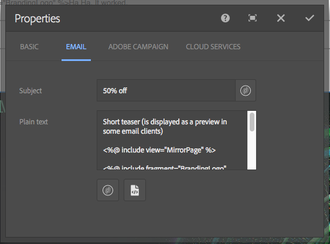
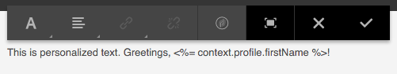

# 協作使用Adobe Campaign Classic和Adobe Campaign Standard{#working-with-adobe-campaign-classic-and-adobe-campaign-standard}

您可以在AEM中建立電子郵件內容，並在Adobe Campaign電子郵件中處理。 要執行此操作，您必須：

1. 從Adobe Campaign專用範本在AEM中建立新電子報。
1. 選擇 [Adobe Campaign服務](#selecting-the-adobe-campaign-cloud-service-and-template) 編輯內容以存取所有功能之前。
1. 編輯內容。
1. 驗證內容。

然後，內容便可在Adobe Campaign中與傳送同步。 本檔案將詳細說明。

另請參閱 [在AEM中建立Adobe Campaign Forms](/help/sites-authoring/adobe-campaign-forms.md).

>[!NOTE]
>
>您必須先設定AEM以與 [Adobe Campaign](/help/sites-administering/campaignonpremise.md) 或 [Adobe Campaign Standard](/help/sites-administering/campaignstandard.md).

## 透過Adobe Campaign傳送電子郵件內容 {#sending-email-content-via-adobe-campaign}

設定AEM和Adobe Campaign後，您可以直接在AEM中建立電子郵件傳送內容，然後在Adobe Campaign中處理。

您在AEM中建立Adobe Campaign內容時，必須先連結至Adobe Campaign服務，才能編輯內容以存取所有功能。

可能有兩種情況：

* 內容可與來自Adobe Campaign的傳送同步。 這可讓您在傳遞中使用AEM內容。
* (僅限Adobe Campaign Classic)內容可直接傳送至Adobe Campaign，而會自動產生新的電子郵件傳送。 此模式有其限制。

本檔案將詳細說明。

### 建立新電子郵件內容 {#creating-new-email-content}

>[!NOTE]
>
>新增電子郵件範本時，請務必在 **/content/campaigns** 才能讓它們可用。

#### 建立新電子郵件內容 {#creating-new-email-content-1}

1. 在AEM中選取 **網站** then **行銷活動**，然後瀏覽至管理電子郵件促銷活動的位置。 在下列範例中，路徑為 **網站** > **行銷活動** > **Geometrixx Outdoors** > **電子郵件行銷活動**.

   >[!NOTE]
   >
   >[電子郵件範例僅適用於Geometrixx](/help/sites-developing/we-retail.md). 請從「封裝共用」下載Geometrixx內容範例。

   

1. 選擇 **建立** then **建立頁面**.
1. 選取您要連線至的Adobe Campaign特定可用範本，然後按一下 **下一個**. 預設提供三個範本：

   * **Adobe Campaign Classic電子郵件**:可讓您先將內容新增至預先定義的範本（兩欄），再將其傳送至Adobe Campaign Classic進行傳送。
   * **Adobe Campaign Standard電子郵件**:可讓您先將內容新增至預先定義的範本（兩欄），再將其傳送至Adobe Campaign Standard進行傳送。

1. 填入 **標題** 和（可選） **說明** 按一下 **建立**. 除非您在編輯電子郵件時覆寫電子報/電子郵件，否則標題會作為電子報/電子郵件的主旨。

### 選取Adobe Campaign雲端服務與範本 {#selecting-the-adobe-campaign-cloud-service-and-template}

若要與Adobe Campaign整合，您必須將Adobe Campaign雲端服務新增至頁面。 這麼做可讓您存取個人化和其他Adobe Campaign資訊。

此外，您可能還需要選取Adobe Campaign範本並變更主旨，並為不會以HTML檢視電子郵件的使用者新增純文字內容。

您可以從 **網站** 標籤，或在您建立電子郵件/電子報後從內取得。

從 **網站** tab是建議的方法。 從電子郵件/電子報選取雲端服務需要因應措施。

從 **網站** 頁面：

1. 在AEM中選取電子郵件頁面，然後按一下 **檢視屬性**.

   

1. 選擇 **編輯** 然後 **雲端服務** 標籤並向下捲動至底部，然後按一下+號以新增設定，然後選取 **Adobe Campaign**.

   

1. 從下拉式清單中選取符合您Adobe Campaign例項的設定，然後按一下以確認 **儲存**.
1. 您可以按一下&#x200B;**Adobe Campaign** 標籤。 如果您想要選取其他範本，可在編輯時從電子郵件中存取該範本。

   如果您想要套用特定電子郵件傳送範本(來自Adobe Campaign)，而非預設郵件範本，位於 **屬性**，請選取 **Adobe Campaign** 標籤。 在相關的Adobe Campaign例項中輸入電子郵件傳送範本的內部名稱。

   您選取的範本決定可從Adobe Campaign使用的個人化欄位。

   

在製作時，您可能無法在電子報/電子郵件中選取Adobe Campaign雲端服務設定，位於 **頁面屬性** 因版面問題。 您可以使用以下說明的因應措施：

1. 在AEM中選取電子郵件頁面，然後按一下 **編輯**. 按一下 **開啟屬性**.

   

1. 選擇 **雲端服務** 按一下 **+** 來新增設定。 選取任何可見的設定（不重要哪個設定）。 按一下或點選 **+** 登入以新增其他設定，然後選取 **Adobe Campaign**.

   >[!NOTE]
   >
   >或者，您也可以選取 **檢視屬性** 在 **網站** 標籤。

1. 從下拉式清單中選取符合您Adobe Campaign例項的設定，刪除您建立的第一個非Adobe Campaign用的設定，然後按一下核取記以確認。
1. 繼續上一步步驟4以選擇模板並添加純文字檔案。

### 編輯電子郵件內容 {#editing-email-content}

若要編輯電子郵件內容：

1. 開啟電子郵件，依預設，您會進入「編輯」模式。

   

1. 如果您想要變更電子郵件的主旨，或為不會以HTML檢視電子郵件的使用者新增純文字，請選取 **電子郵件** 並添加主題和文本。 選擇頁表徵圖以從HTML自動生成純文字檔案版本。 完成後，按一下複選記號。

   您可以使用Adobe Campaign個人化欄位來個人化電子報。 若要新增個人化欄位，請按一下顯示Adobe Campaign標誌的按鈕，以開啟個人化欄位選取器。 然後，您可以從此電子報可用的所有欄位中選擇。

   >[!NOTE]
   >
   >如果編輯器中屬性中的個人化欄位呈現灰色，請重新檢查您的設定。

   

1. 開啟畫面左側的「元件」面板，然後選取 **Adobe Campaign電子報** 從下拉式功能表中尋找這些元件。

   

1. 將元件直接拖曳至頁面上，並據此編輯元件。 例如，您可以拖曳 **文字與個人化（行銷活動）** 元件和新增個人化文字。

   

   請參閱 [Adobe Campaign元件](/help/sites-authoring/adobe-campaign-components.md) 以取得每個元件的詳細說明。

   

### 插入個人化 {#inserting-personalization}

編輯內容時，您可以插入：

* Adobe Campaign內容欄位。 這些欄位可插入在您的文字中，並會根據收件者的資料進行調整（例如名字、姓氏或目標維度的任何資料）。
* Adobe Campaign個人化區塊。 這些是與收件者資料無關的預先定義內容區塊，例如品牌標誌或鏡像頁面連結。

請參閱 [Adobe Campaign元件](/help/sites-authoring/adobe-campaign-components.md) ，以取得Campaign元件的完整說明。

>[!NOTE]
>
>* 只有Adobe Campaign的欄位 **設定檔** 目標維度已納入考量。
>* 從 **網站**，則您無法存取Adobe Campaign內容欄位。 您可以在編輯時直接從電子郵件存取這些內容。

插入個人化：

1. 插入新 **電子報** > **文字與個人化（行銷活動）** 將元件拖曳至頁面上。

   

1. 按一下「鉛筆」圖示以開啟元件。 就地編輯器隨即開啟。

   

   >[!NOTE]
   >
   >**若為Adobe Campaign Standard:**
   >
   >* 可用的上下文欄位對應於 **設定檔** Adobe Campaign中的目標維度。
   >* 請參閱 [將AEM頁面連結至Adobe Campaign電子郵件](#linking-an-aem-page-to-an-adobe-campaign-email-adobe-campaign-standard).

   >
   >**若為Adobe Campaign Classic:**
   >
   >* 可用的內容欄位會從Adobe Campaign中動態復原 **nms:seedMember** 綱要。 Target擴充功能資料會從包含與內容同步之傳送的工作流程中動態復原。 (請參閱 [將AEM中建立的內容與從Adobe Campaign傳送同步](#synchronizing-content-created-in-aem-with-a-delivery-from-adobe-campaign-classic) 區段)。
   >
   >* 若要新增或隱藏個人化元素，請參閱 [管理個人化欄位和區塊](/help/sites-administering/campaignonpremise.md#managing-personalization-fields-and-blocks).
   >* **重要**:所有種子表欄位也必須位於收件人表（或相應的聯繫表）中。

1. 鍵入插入文本。 按一下Adobe Campaign元件並選取元件，插入內容欄位或個人化區塊。 完成後，請選取核取記號。

   

   插入內容欄位或個人化區塊後，您可以預覽電子報並測試欄位。 請參閱 [預覽電子報](#previewing-a-newsletter).

### 預覽電子報 {#previewing-a-newsletter}

您可以預覽電子報的外觀，並預覽個人化。

1. 開啟電子報後，按一下 **預覽** 在AEM的右上角。 AEM顯示使用者收到電子報時的外觀。

   

   >[!NOTE]
   >
   >如果您使用Adobe Campaign Standard並使用範例範本，則兩個個人化區塊會顯示初始內容 —  **&quot;&lt;%@ include view=&quot;MirrorPage&quot; %>&quot;** 和 **&quot;&lt;%@ include view=&quot;UnsubscriptionLink&quot; %>&quot;**  — 在傳送期間匯入內容時會擲回錯誤。 您可以使用個人化區塊選擇器選取對應的區塊，以調整這些區塊。

1. 若要預覽個人化，請按一下/點選工具列中的對應圖示，以開啟ContextHub。 個人化欄位標籤現在會由所選角色的種子資料取代。 了解變數在ContextHub中切換角色時如何調整。

   

1. 您可以檢視來自Adobe Campaign、與目前所選角色相關聯的種子資料。 若要這麼做，請按一下/點選ContextHub列中的Adobe Campaign模組。 這會開啟一個對話框，顯示當前配置檔案的所有種子資料。 同樣地，資料會在切換至不同角色時適應。

   

### 在AEM中核准內容 {#approving-content-in-aem}

內容完成後，您就可以開始核准程式。 前往 **工作流程** 標籤，然後選取 **核准Adobe Campaign** 工作流程。

此現成可用的工作流程包含兩個步驟：修訂然後批准，或修訂然後拒絕。 然而，該工作流可以擴展並適應更複雜的過程。

若要核准Adobe Campaign的內容，請選取 **工作流程** 選取 **核准Adobe Campaign** 按一下 **開始工作流程**. 執行步驟並核准內容。 您也可以透過選取 **拒絕** 而非 **核准** 在最後一個工作流程步驟中。

內容核准後，在Adobe Campaign中會顯示為已核准。 然後即可傳送電子郵件。

在Adobe Campaign Standard:

在Adobe Campaign Classic:

>[!NOTE]
在Adobe Campaign中，未核准的內容可與傳送同步，但無法執行傳送。 只能透過Campaign傳送傳送已核准的內容。

## 將AEM與Adobe Campaign Standard和Adobe Campaign Classic連結 {#linking-aem-with-adobe-campaign-standard-and-adobe-campaign-classic}

您與Adobe Campaign的連結或同步方式取決於您使用的是訂閱型Adobe Campaign Standard或內部部署型Adobe Campaign Classic。

如需以您的Adobe Campaign解決方案為基礎的指示，請參閱下列章節：

* [將AEM頁面連結至Adobe Campaign電子郵件(Adobe Campaign Standard)](#linking-an-aem-page-to-an-adobe-campaign-email-adobe-campaign-standard)
* [將AEM中建立的內容與從Adobe Campaign Classic傳送同步](#synchronizing-content-created-in-aem-with-a-delivery-from-adobe-campaign-classic)

### 將AEM頁面連結至Adobe Campaign電子郵件(Adobe Campaign Standard) {#linking-an-aem-page-to-an-adobe-campaign-email-adobe-campaign-standard}

Adobe Campaign Standard可讓您復原並連結在AEM中建立的內容，其具有：

* 電子郵件。
* 電子郵件範本。

這麼做可讓您傳送內容。 您可以透過頁面上顯示的程式碼，了解電子報是否連結至單一傳送。

>[!NOTE]
如果電子報連結至數個傳送，則連結的傳送數量（但不會顯示每個ID）。

若要將在AEM中建立的頁面與Adobe Campaign的電子郵件連結：

1. 根據AEM專屬的電子郵件範本建立新電子郵件。 請參閱 [在Adobe Campaign Standard中建立電子郵件](https://helpx.adobe.com/campaign/standard/channels/using/creating-an-email.html) 以取得更多資訊。

   

1. 開啟 **內容** 從傳送控制面板封鎖。

   

1. 選擇 **連結Adobe Experience Manager內容** ，存取AEM中可用的內容清單。

   >[!NOTE]
   若 **連結Adobe Experience Manager** 選項未出現在動作列中，請檢查 **內容編輯模式** 已正確設定為 **Adobe Experience Manager** 在電子郵件屬性中。

   

1. 選取您要在電子郵件中使用的內容。

   此清單指定：

   * AEM中內容的標籤。
   * AEM中內容的核准狀態。 如果內容未核准，您可以同步內容，但必須在傳送前核准。 不過，您可以執行某些操作，例如傳送校樣或預覽測試。
   * 上次修改內容的日期。
   * 任何已連結至傳送的內容。

   >[!NOTE]
   依預設，已與傳送同步的內容會隱藏。 不過，您可以顯示並使用它。 例如，如果您想要將內容當作多個傳送的範本。

   當電子郵件連結至AEM內容時，無法在Adobe Campaign中編輯內容。

1. 從其控制面板指定電子郵件的其他參數（對象、執行排程）。
1. 執行電子郵件傳送。 在傳送分析期間，會擷取AEM內容的最新版本。

   >[!NOTE]
   如果內容在連結至電子郵件時在AEM中更新，則會在分析期間在Adobe Campaign中自動更新。 也可以使用 **重新整理Adobe Experience Manager內容** 從內容動作列。
   您可以使用 **刪除與Adobe Experience Manager內容的連結** 從內容動作列。 只有內容已與傳送連結時，此按鈕才可用。 若要將不同內容與傳送連結，您必須先刪除目前的內容連結，才能建立新連結。
   刪除連結時，會保留本機內容，使其在Adobe Campaign中可編輯。 如果您在修改內容後再次連結內容，所有變更都將遺失。

### 將AEM中建立的內容與從Adobe Campaign Classic傳送同步 {#synchronizing-content-created-in-aem-with-a-delivery-from-adobe-campaign-classic}

Adobe Campaign可讓您復原及同步AEM中建立的內容，並具備下列功能：

* 行銷活動傳送
* 行銷活動工作流程中的傳送活動
* 循環傳送
* 持續傳遞
* 訊息中心傳送
* 傳遞範本

在AEM中，如果電子報連結至單一傳送，則傳送代碼會顯示在頁面上。

>[!NOTE]
如果電子報連結至數個傳送，則連結的傳送數量（但不會顯示每個ID）。
[!NOTE]
工作流程步驟 **發佈至Adobe Campaign** 在AEM 6.1中已遭取代。此步驟是AEM 6.0與Adobe Campaign整合的一部分，不再需要。

若要將AEM中建立的內容與Adobe Campaign的傳送同步：

1. 選取 **使用AEM內容傳送電子郵件(mailAEMContent)** 傳遞範本。

   

1. 選擇 **同步** ，存取AEM中可用的內容清單。

   >[!NOTE]
   若 **同步** 選項未出現在傳送的工具列中，請檢查 **內容編輯模式** 欄位在中正確設定 **AEM** 選取 **屬性** > **進階**.

   

1. 選取您要與傳送同步的內容。

   此清單指定：

   * AEM中內容的標籤。
   * AEM中內容的核准狀態。 如果內容未核准，您可以同步內容，但必須在傳送前核准。 但是，您可以執行某些操作，例如發送BAT或預覽測試。
   * 上次修改內容的日期。
   * 任何已連結至傳送的內容。

   >[!NOTE]
   依預設，已與傳送同步的內容會隱藏。 不過，您可以顯示並使用它。 例如，如果您想要將內容當作多個傳送的範本。

   

1. 指定傳送的其他參數（目標等）
1. 如有必要，請在Adobe Campaign中啟動傳送核准程式。 除了Adobe Campaign中設定的核准（預算、目標等）,AEM中的內容核准也是必要的。 只有在AEM中已核准內容，才能在Adobe Campaign中核准內容。
1. 執行傳送。 在傳送分析期間，會復原AEM內容的最新版本。

   >[!NOTE]
   * 傳送和內容同步後，Adobe Campaign中的傳送內容會變成唯讀。 無法再修改電子郵件主旨及其內容。
   * 如果內容在連結至Adobe Campaign中的傳送時在AEM中更新，則會在傳送分析期間在傳送中自動更新。 您也可以使用 **立即重新整理內容** 按鈕。
   * 您可以使用 **取消同步** 按鈕。 唯有內容已與傳送同步時，才能使用此選項。 若要將不同內容與傳送同步，您必須先取消目前的內容同步，才能建立新連結。
   * 如果取消同步的本機內容會保留，並在Adobe Campaign中變成可編輯。 如果修改內容後重新同步內容，將丟失所有更改。
   * 對於循環和持續的傳送，每次執行傳送時，都會停止與AEM內容的同步。

