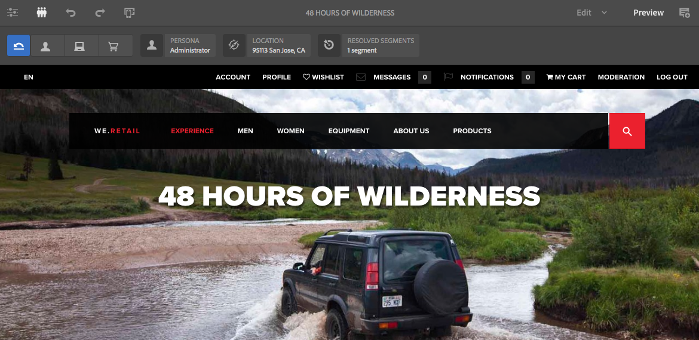

# 使用ContextHub資料預覽頁面{#previewing-pages-using-contexthub-data}

ContextHub工 [具列顯示](/help/sites-developing/contexthub.md) ContextHub儲存區的資料，並讓您變更儲存區資料。 ContextHub工具列對於預覽由ContextHub商店中的資料所決定的內容非常有用。

工具列由一系列包含一或多個UI模組的UI模式組成。

* UI模式是顯示在工具列左側的圖示。 當您按一下或點選圖示時，工具列會顯示其包含的UI模組。
* UI模組顯示來自一個或多個ContextHub儲存的資料。 部分UI模組也可讓您控制儲存資料。

ContextHub會安裝數種UI模式和UI模組。 您的管理員可能已 [設定ContextHub](/help/sites-administering/contexthub-config.md) ，以顯示不同的ContextHub。

## 顯示ContextHub工具列 {#revealing-the-contexthub-toolbar}

ContextHub工具列可在「預覽」模式下使用。 工具列僅適用於作者例項，且僅在管理員啟用時才可用。

1. 當您的頁面開啟以進行編輯時，在工具列上按一下或點選「預覽」。

   

1. 若要顯示工具列，請按一下或點選ContextHub圖示。

   

## UI模組功能 {#ui-module-features}

每個UI模組提供的功能組不同，但是下列功能類型是常見的。 由於UI模組具有可擴充性，因此您的開發人員可視需要建置其他功能。

### 工具列內容 {#toolbar-content}

UI模組可顯示工具列中一或多個ContextHub儲存區的資料。 UI模組使用圖示和標題來識別自己。

### 快顯內容 {#popup-content}

有些UI模組在點按或點選時會整體顯示彈出畫面。 通常，快顯功能表包含的工具列上顯示的其他資訊。

### 彈出式表單 {#popup-forms}

模組的彈出式覆蓋可包含表單元素，可讓您變更ContextHub儲存區中的資料。 如果頁面內容是由儲存資料決定，您可以使用表單並觀察頁面內容的變更。

### 全螢幕模式 {#fullscreen-mode}

快顯覆蓋可包含您按一下或點選以展開快顯內容的圖示，以涵蓋整個瀏覽器視窗或畫面。

