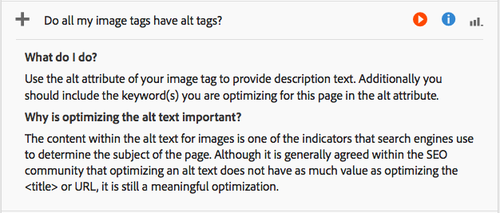

# 分析頁面效能{#analyzing-page-performance}

開啟「 [內容分析](/help/sites-authoring/content-insights.md) 」頁面，以分析您所撰寫之頁面的效能。 設定報告時段以集中分析。

## 開啟頁面的Analytics和Recommendations {#opening-analytics-and-recommendations-for-a-page}

請依照下列程式來查看頁面的Analytics和Recommendations:

1. 導覽至您要分析的頁面。
1. 在工具列中，按一下或點選「 **Analytics與Recommendations」**。

   >[!NOTE]
   >
   >頁面的Analytics和Recommendations只有在您已設定AEM與Adobe Analytics [整合時才會顯示](/help/sites-administering/adobeanalytics-connect.md)。

   

### 變更報告期間 {#changing-the-reporting-period}

變更分析報表的下列時間相關方面：

* 報告的時段。
* 資料的粒度。

變更報表時間相關方面的工具會顯示在「內容分析」頁面的頂端。 

#### 變更報告期間 {#changing-the-reporting-period-1}

變更「內容分析」頁面的報告時段，將頁面活動分析的重點放在特定時段。 當您變更報表期間時，報表會自動重新整理。 時間範圍內的陰影區域代表報告時段。 時間範圍上的日期會從左至右增加。

若要變更「內容分析」頁面的報告期間：

1. 如果時間範圍未顯示在頁面頂端，請按一下或點選「切換時間範圍」圖示。

   

1. 若要變更報告時段的開始日期，請將顯示在陰影區域左側的圓拖曳至所要的開始日期。

   如果看不到著色區域的左側，請使用捲動條將其帶入視圖。

1. 若要變更報告時段的結束日期，請將顯示在陰影區域右側的圓拖曳至所需的結束日期。

#### 變更報告時段的詳細程度 {#changing-the-granularity-of-the-reporting-period}

變更每個資料點在報表中涵蓋的時間量。 例如，選取「周」精細度時，「檢視」報表上的每個資料點代表一週的檢視次數。

詳細程度會影響依時間繪製資料的報表，例如「檢視」和「頁面平均參與分鐘數」報表。 詳細程度也會影響時間範圍的規模。

1. 如果未顯示精細度控制項，請按一下或點選「切換精細度」圖示。

   

1. 按一下或點選所需的詳細程度。 選取後，報表會自動更新以反映詳細程度。

### 指派SEO建議的任務 {#assigning-tasks-for-seo-recommendations}

使用「搜尋引擎最佳化建議」報表來建立工作，以改善搜尋引擎的頁面可見度。 對於報告中沒有複選標籤的每個建議，您可以建立指派給使用者以執行所需工作的任務。

SEO建議的狀態會指出何時建立工作但尚未完成。

建立時，該任務將出現在用戶的「任務」清單中。 有關任務的資訊，請參 [閱使用任務](/help/sites-authoring/task-content.md)。

請按下列步驟為SEO建議建立任務。

1. 按一下或點選SEO建議的資訊圖示。

   

1. 按一下資訊圖示旁邊出現的環繞三角形圖示。

   

1. 填寫顯示的表格欄位，然後點選「建立：

   * 專案：選擇要在其中建立任務的項目。
   * 名稱：標識任務的名稱。 預設名稱是SEO建議的標題。
   * 指派給：選擇要分配任務的用戶。 開始輸入使用者名稱以篩選清單。
   * 說明：完成任務所需活動的說明。 預設說明是SEO建議隨附的資訊。
   * 任務優先順序：任務的優先順序。
   * 到期日：應完成任務的日期。
   **** 注意：所建立的工作也包含套用SEO建議之頁面的路徑。

1. 按一下或點選「完成」以關閉「已建立任務」消息。

