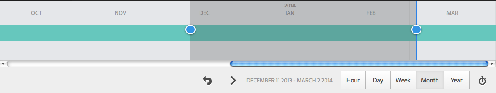

# 分析頁面效能{#analyzing-page-performance}

開啟 [內容透視](/help/sites-authoring/content-insights.md) 頁面以分析您正在創作的頁面的效能。 配置報告期間以集中分析。

## 開啟分析和Recommendations頁 {#opening-analytics-and-recommendations-for-a-page}

請按下列步驟查看頁面的分析和Recommendations:

1. 導航到要分析的頁面。
1. 在工具欄中，按一下或點擊 **分析學和Recommendations**。

   >[!NOTE]
   >
   >只有在配置為 [與Adobe Analytics](/help/sites-administering/adobeanalytics-connect.md)。

   

### 更改報告期 {#changing-the-reporting-period}

更改分析報告的以下時間相關方面：

* 報告的時間段。
* 資料的粒度。

用於更改報告的時間相關方面的工具顯示在「內容透視」頁的頂部。 

#### 更改報告期 {#changing-the-reporting-period-1}

更改Content Insight頁的報告期，以將您對頁面活動的分析集中到特定時間段。 更改報告期間時，報表將自動刷新。 時間範圍內的陰影區域表示報告期。 時間段的日期從左到右都增加。

要更改Content Insight頁的報告期，請執行以下操作：

1. 如果時間幀未顯示在頁面頂部，請按一下或點擊「切換時間幀」表徵圖。

   

1. 要更改報告期的開始日期，請將顯示在著色區域左側的圓拖至所需的開始日期。

   如果看不到著色區域的左側，請使用捲動條將其置於視圖中。

1. 要更改報告期的結束日期，請將顯示在著色區域右側的圓拖到所需的結束日期。

#### 更改報告期的粒度 {#changing-the-granularity-of-the-reporting-period}

更改報表中每個資料點所跨越的時間量。 例如，當選擇「周」粒度時，「視圖」報告上的每個資料點表示一週的視圖數。

粒度影響按時間繪製資料的報告，如「視圖」和「頁平均參與分鐘數」報告。 粒度還影響時間幀的規模。

1. 如果未顯示粒度控制項，請按一下或點擊「切換粒度」表徵圖。

   

1. 按一下或點擊所需的粒度。 一旦選中，報表將自動更新以反映粒度。

### 為SEORecommendations分配任務 {#assigning-tasks-for-seo-recommendations}

使用SEORecommendations報告建立任務，以提高搜索引擎的頁面可見性。 對於報表中沒有複選標籤的每個建議，您可以建立分配給用戶以執行所需工作的任務。

SEO建議的狀態指示何時建立任務但尚未完成。

建立時，該任務將顯示在用戶的「任務」清單中。 有關任務的資訊，請參見 [使用任務](/help/sites-authoring/task-content.md)。

請按下列步驟為SEO建議建立任務。

1. 按一下或點擊SEO建議的資訊表徵圖。

   

1. 按一下資訊表徵圖旁邊顯示的環繞三角形表徵圖。

   

1. 填充顯示的表單域，然後按一下「建立：

   * 項目：選擇要在其中建立任務的項目。
   * 名稱：標識任務的名稱。 預設名稱是SEO建議的標題。
   * 分配給：選擇要分配任務的用戶。 開始鍵入用戶名以篩選清單。
   * 描述：完成任務所需的活動的說明。 預設說明是SEO建議附帶的資訊。
   * 任務優先順序：任務的優先順序。
   * 到期日：應完成任務的日期。

   **注：** 所建立的任務還包括SEO建議所應用的頁面的路徑。

1. 按一下或點擊「完成」關閉「建立的任務」消息。
