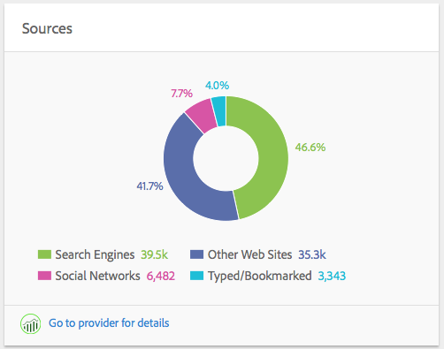

# 內容分析{#content-insight}

Content insight提供有關使用網頁分析和SEO建議之頁面效能的資訊。 使用Content Insight來決定如何修改頁面，或瞭解先前的變更如何改變效能。 您可針對您所製作的每個頁面開啟Content Insight以分析頁面。

「內容分析」頁面的版面配置會隨螢幕尺寸和您所用裝置的方向而變更。

## 報表資料

「內容分析」頁面包含使用Adobe SiteCatalyst、Adobe Target、Adobe Social和BrightEdge資料的報表：

* SiteCatalyst:可使用下列度量的報表：

   * 頁面檢視
   * 頁面平均逗留時間
   * 來源

* 目標：您頁面包含選件之促銷活動的報表。
* BrightEdge:頁面功能報告可改善頁面對搜尋引擎的可見性，並建議應實作的功能。

請參 [閱開啟頁面的Analytics和Recommendations](/help/sites-authoring/ci-analyze.md#opening-analytics-and-recommendations-for-a-page)。

## 報告期

報表顯示您控制之時段的資料。 當您調整報表期間時，報表會自動重新整理該期間的資料。 視覺提示指出頁面版本變更的時間，以便您比較每個版本的效能。

您也可以指定報告資料的詳細程度，例如，您可以查看每日、每週、每月或每年的資料。

請參 [閱更改報告期間](/help/sites-authoring/ci-analyze.md#changing-the-reporting-period)。

>[!NOTE]
>
>「內容分析」報表要求您的管理員必須將AEM與SiteCatalyst、Target和BrightEdge整合。 請參 [閱「與SightCatalyst整合](/help/sites-administering/adobeanalytics.md)、 [與Adobe Target整合](/help/sites-administering/target.md)，以及與 [BrightEdge整合」](/help/sites-administering/brightedge.md)。

## 檢視報表 {#the-views-report}

「檢視」報表包含下列用於評估頁面流量的功能：

* 報告時段內某個頁面的檢視總數。
* 報告時段內檢視次數的圖表：

   * 檢視總數。
   * 獨特的訪客。

## 頁面平均參與率報表 {#the-page-average-engaged-report}

「參與的頁面平均數」報表包含下列用於評估頁面效果的功能：

* 整個報告時段內頁面保持開啟的平均時間。
* 報告時段內頁面檢視的平均長度圖表。

## 來源報表 {#the-sources-report}

「來源」報表會指出使用者如何瀏覽至頁面，例如從搜尋引擎結果或使用已知URL。

## 彈回數報表 {#the-bounces-report}

「彈回數」報表包含一個圖表，顯示在選取之報告期間內某個頁面發生的彈回數。

## 促銷活動報表 {#the-campaign-activity-report}

對於頁面為作用中的每個促銷活動，會顯示名為「促銷活動名 *稱活動* 」的報表。 報表顯示提供選件之每個區段的頁面印象和轉換。

## SEO建議報表 {#the-seo-recommendations-report}

「SEO建議」報表包含頁面的BrightEdge分析結果。 報表是頁面功能的檢查清單，指出頁面使用搜尋引擎可最大化搜尋性且不包含哪些功能。

報表可讓您建立工作，以便進行改良以改善頁面搜尋能力。 Recommendations指出已建立任務以實施建議。 請參 [閱為SEO建議指派任務](/help/sites-authoring/ci-analyze.md#assigning-tasks-for-seo-recommendations)。

