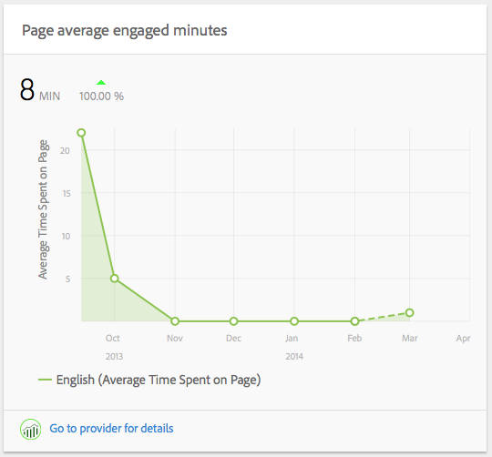
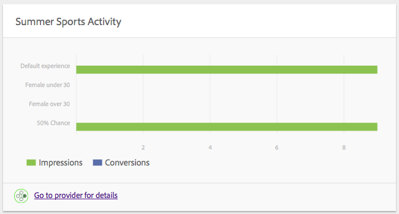

# 內容分析{#content-insight}

「內容分析」使用網頁分析和SEO建議，提供頁面效能的相關資訊。 使用「內容分析」來決定如何修改頁面，或了解先前的變更如何改變效能。 您可以針對您製作的每個頁面開啟「內容分析」以分析頁面。

「內容分析」頁面的版面會隨著螢幕尺寸和您使用裝置的方向而變更。

## 報表資料

「內容分析」頁面包含使用Adobe SiteCatalyst、Adobe Target、Adobe Social和BrightEdge資料的報表：

* SiteCatalyst:可使用下列量度的報表：

   * 頁面檢視
   * 平均頁面逗留時間
   * 來源

* 目標：您的頁面包含選件之促銷活動的報表。
* BrightEdge:頁面功能報告可改善頁面對搜尋引擎的可見性，並建議應實作的功能。

請參閱 [開啟頁面適用的Analytics和Recommendations](/help/sites-authoring/ci-analyze.md#opening-analytics-and-recommendations-for-a-page).

## 報告期

報表會顯示您控制的一段時間的資料。 當您調整報告時段時，報告會自動刷新為該時段的資料。 視覺提示指出頁面版本變更的時間，以便您比較每個版本的效能。

您也可以指定報告資料的粒度，例如，您可以看到每日、每週、每月或每年的資料。

請參閱 [變更報告時段](/help/sites-authoring/ci-analyze.md#changing-the-reporting-period).

>[!NOTE]
>
>「內容分析」報表要求管理員將AEM與SiteCatalyst、Target和BrightEdge整合。 請參閱 [與SightCatalyst整合](/help/sites-administering/adobeanalytics.md), [與Adobe Target整合](/help/sites-administering/target.md)，和 [與BrightEdge整合](/help/sites-administering/brightedge.md).

## 檢視報表 {#the-views-report}

「檢視」報表包含評估頁面流量的下列功能：

* 報告時段內某個頁面的檢視總數。
* 報表期間檢視次數的圖表：

   * 檢視總數。
   * 不重複訪客。

## 頁面平均參與報表 {#the-page-average-engaged-report}

「頁面平均參與」報表包含下列用於評估頁面效益的功能：

* 整個報告時段內頁面保持開啟的平均時間。
* 報告時段內頁面檢視平均長度的圖表。

## 來源報表 {#the-sources-report}

「來源」報表會指出使用者導覽至頁面的方式，例如從搜尋引擎結果或使用已知的URL。

## 跳出報告 {#the-bounces-report}

「跳出數」報表包含一個圖表，顯示在選定報告時段內發生的頁面跳出數。

## 促銷活動報表 {#the-campaign-activity-report}

對於頁面處於作用中狀態的每個促銷活動，會出現一個名為 *促銷活動名稱* 活動。 報表會顯示每個提供優惠方案的區段的頁面曝光次數和轉換次數。

## SEO Recommendations報表 {#the-seo-recommendations-report}

SEO Recommendations報表包含頁面的BrightEdge分析結果。 報表是頁面功能的檢查清單，指出頁面有哪些功能，以及沒有包括以最大化使用搜尋引擎的搜尋效能。

報表可讓您建立工作，以便改善頁面搜尋效能。 Recommendations指出已建立執行建議的任務。 請參閱 [指派SEO Recommendations的工作](/help/sites-authoring/ci-analyze.md#assigning-tasks-for-seo-recommendations).

