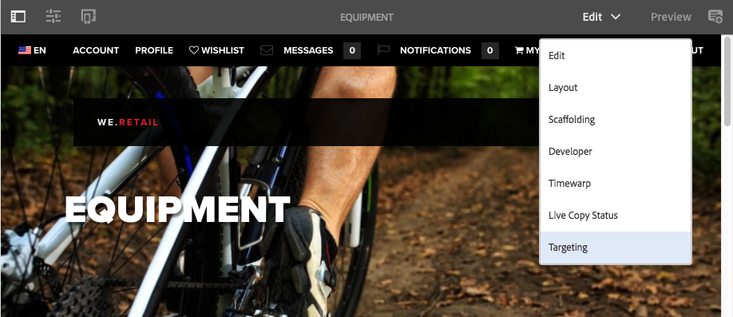
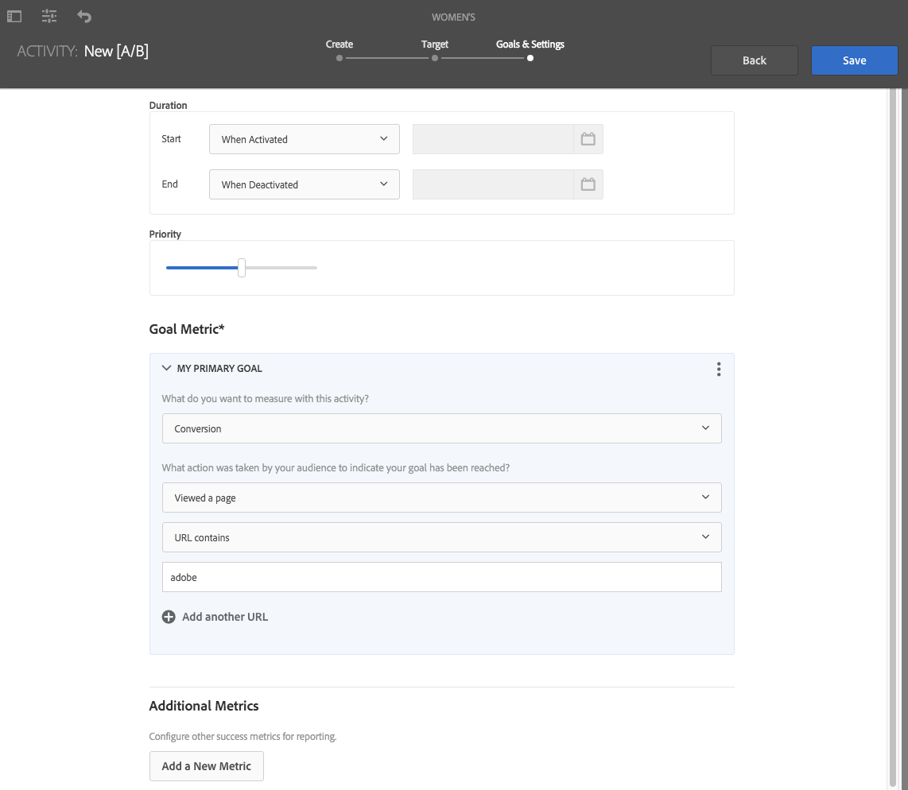
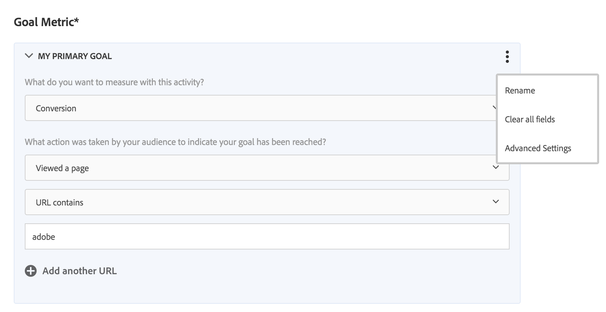
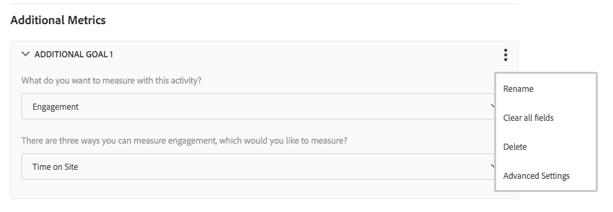
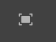

# 使用定位模式製作目標內容{#authoring-targeted-content-using-targeting-mode}

使用AEM的「定位」模式製作目標內容。 鎖定目標模式和Target元件提供工具來建立體驗的內容：

* 輕鬆辨識頁面上的目標內容。 虛線會在所有目標內容周圍形成邊框。
* 選取品牌和活動以查看體驗。
* 新增體驗至活動或移除體驗。
* 執行A/B測試並轉換獲勝者(僅限Adobe Target)。
* 透過建立選件或使用資料庫中的選件來新增選件至體驗。
* 設定目標並監控效能。
* 模擬使用者體驗。
* 如需更多自訂項目，請設定Target元件。

您可以使用AEM或Adobe Target作為定位引擎(您必須具備有效的Adobe Target帳戶才能使用Adobe Target)。 如果您使用Adobe Target，必須先設定整合。 請參閱 [與Adobe Target整合的指示](/help/sites-administering/target.md).

您在Target模式中看到的活動和體驗會反映 [活動主控台](/help/sites-authoring/activitylib.md):

* 您使用定位模式對活動和體驗所做的變更會反映在活動主控台中。
* 在「活動」控制台中所做的變更會反映在「定位」模式中。

>[!NOTE]
>
>您在Adobe Target中建立促銷活動時，會指派一個名為 `thirdPartyId`至每個促銷活動。 刪除Adobe Target中的促銷活動時，不會刪除thirdPartyId。 您無法重新使用 `thirdPartyId` 針對不同類型的促銷活動(AB、XT)，且無法手動移除。 為避免此問題，請為每個促銷活動命名一個唯一的名稱；因此，無法在不同促銷活動類型中重複使用促銷活動名稱。
>
>如果您在相同的促銷活動類型中使用相同名稱，則會覆寫現有的促銷活動。
>
>如果在同步期間，您會遇到「請求失敗」錯誤。 `thirdPartyId` 已存在，請變更促銷活動名稱並重新同步。

>[!NOTE]
>
>鎖定目標時，品牌和活動組合會保留在使用者層級，而非管道層級。

## 切換至定位模式 {#switching-to-targeting-mode}

切換至Target模式，存取製作目標內容的工具。

切換到目標模式：

1. 開啟您要為其製作目標內容的頁面。
1. 在頁面頂端的工具列上，按一下或點選「模式」下拉式選單，以顯示可用的模式類型。

   

1. 按一下或點選 **定位**. 定位選項會顯示在頁面頂端。

   

## 使用定位模式新增活動 {#adding-an-activity-using-targeting-mode}

使用鎖定目標模式將活動新增至品牌。 新增活動時，活動會包含預設體驗。 新增活動後，就會開始活動的內容鎖定目標程式。

您也可以從AEM建立和管理Adobe Target活動，並選擇目標引擎(AEM或Adobe Target)和選取活動類型（體驗鎖定目標或A/B測試）。

此外，您可以管理所有Adobe Target活動的目標和量度，並管理您的Adobe Target對象。 也包含Adobe Target活動報表，包括轉換A/B測試的獲勝者。

新增活動時，它也會顯示在 [活動主控台](/help/sites-authoring/activitylib.md).

若要新增活動：

1. 使用 **品牌** 下拉式功能表，選取您要建立活動的品牌。

   >[!NOTE]
   >
   >建議您 [透過活動主控台建立品牌](/help/sites-authoring/activitylib.md#creating-a-brand-using-the-activities-console).
   >
   >
   >如果您以其他方式建立品牌，請確定節點 `/campaigns/<brand>/master` 存在，或嘗試建立活動時會產生錯誤。

1. 按一下或點選 **活動** 下拉式功能表。
1. 輸入活動的名稱。

   >[!NOTE]
   >
   >當您建立新活動並將Adobe Target雲端設定附加至頁面或其其中一個上層時，AEM會自動假設Adobe Target為引擎。

1. 在 **定位** 引擎下拉式選單中，選取您的定位引擎。

   * 如果您選取 **ContextHub AEM**，其餘欄位則會呈現灰色且無法使用。 按一下或點選 **建立**.

   * 如果您選取 **Adobe Target**，您可以選取設定（預設為您提供的設定） [已設定帳戶](/help/sites-administering/opt-in.md))和活動類型。

   * 如果您使用AEM/Adobe Campaign整合併傳送目標內容（電子報），請選取 **Adobe Campaign**. 請參閱 [與Adobe Campaign整合](/help/sites-administering/campaign.md) 以取得更多資訊。

1. 在「活動」功能表中，選取 **體驗鎖定** 或 **A/B測試**.

   * 體驗鎖定目標 — 從AEM管理Adobe Target活動。
   * A/B測試 — 從AEM在Adobe Target中建立/管理A/B測試活動。

## 定位程式：建立、鎖定目標及目標與設定 {#the-targeting-process-create-target-and-goals-settings}

定位模式可讓您設定活動的數個方面。 使用下列三個步驟程式來建立品牌活動的目標內容：

1. [建立](#create-authoring-the-experiences):新增或移除體驗，以及為每個體驗新增選件。
1. [目標](#diagramtargetconfiguringtheaudiences):指定每個體驗鎖定的對象。 您可以鎖定特定對象，如果使用A/B測試決定要將多少百分比的流量傳至哪個體驗。
1. [目標與設定](#settingsgoalssettingsconfiguringtheactivityandsettinggoals):排程活動並設定優先順序。 您也可以設定成功量度目標。

請依照下列程式，開始活動的內容定位程式。

>[!NOTE]
>
>若要使用定位程式，您必須是Target活動作者使用者群組的成員。

若要新增活動：

1. 在 **品牌** 下拉式功能表中，選取包含您正在使用之活動的品牌。
1. 在 **活動** 下拉式選單中，選取您要為其編寫目標內容的活動。
1. 若要顯示引導您完成定位程式的控制項，請按一下或點選 **開始鎖定目標**.

   

   >[!NOTE]
   >
   >若要變更您正在使用的活動，請按一下或點選 **返回**.

## 建立：編寫體驗 {#create-authoring-the-experiences}

內容鎖定目標的建立步驟涉及建立體驗。 在此步驟中，您可以建立或刪除活動的體驗，並新增選件至每個體驗。

### 在鎖定模式中查看體驗選件 {#seeing-experience-offers-in-targeting-mode}

在 [啟動目標定位程式](/help/sites-authoring/content-targeting-touch.md#the-targeting-process-create-target-and-goals-settings)，請選取體驗以查看為該體驗提供的選件。 當您選取體驗時，頁面上的目標元件會變更，以顯示該體驗的選件。

>[!CAUTION]
>
>停用已在製作例項中定位之元件的定位時請務必小心。 也會自動從發佈例項中刪除個別的活動。

>[!NOTE]
>
>選件是目標元件的內容。

體驗會顯示在「對象」窗格中。在下列範例中，體驗包 **括Default**、 **Femole**、 **Femole 30歲以上，******&#x200B;以及Femole 30歲以下。此範例顯示目標影像元件的「預設 **」選件** 。

選取不同體驗時，影像元件會顯示該體驗的選件。

當選取體驗且目標元件不包含該體驗的選件時，元件會顯示疊加在半透明預設選件上的「新增選件 **** 」。當未建立任何體驗的選件時，會針對對應至 **體驗的區段顯示** 「預設」選件。

當訪客屬性與對應至體驗的任何區段不符時，也會顯示預設體驗。 請參閱 [使用定位模式新增體驗](#adding-and-removing-experiences-using-targeting-mode).

### 自訂選件和資料庫選件 {#custom-offers-and-library-offers}

選件為 [在頁面上撰寫](/help/sites-authoring/content-targeting-touch.md#adding-a-custom-offer) 和用於單一體驗的稱為自訂選件。 下列影像疊加在自訂選件的內容上：

選件為 [從選件資料庫新增](/help/sites-authoring/content-targeting-touch.md#adding-an-offer-from-an-offer-library) 與下列影像疊加：

如果您決定要重複使用自訂選件，可將自訂選件儲存至選件資料庫。 如果您想要修改體驗的內容，也可以將程式庫選件轉換為自訂選件。 編輯後，您可以再次將選件儲存回程式庫。

### 使用定位模式新增和移除體驗 {#adding-and-removing-experiences-using-targeting-mode}

使用的建立步驟 [目標定位過程](/help/sites-authoring/content-targeting-touch.md#the-targeting-process-create-target-and-goals-settings)，您可以新增和移除體驗。 此外，您可以複製體驗並重新命名。

#### 使用定位模式新增體驗 {#adding-experiences-using-targeting-mode}

若要新增體驗：

1. 若要新增體驗，請按一下或點選 **+** **新增體驗鎖定目標** 顯示在 **對象** 框。
1. 選取和對象。 依預設，該名稱為體驗的名稱。 您可以視需要輸入其他名稱。 按一下或點選 **確定**.

#### 使用定位模式移除體驗 {#removing-experiences-using-targeting-mode}

若要刪除體驗：

1. 按一下或點選體驗名稱旁的箭頭。

   

1. 按一下&#x200B;**刪除**。

#### 使用定位模式重新命名體驗 {#renaming-experiences-using-targeting-mode}

若要使用定位模式重新命名體驗：

1. 按一下或點選體驗名稱旁的箭頭。
1. 按一下 **重新命名體驗** 並輸入新名稱。
1. 按一下或點選畫面上的其他位置，以儲存變更。

#### 使用鎖定模式編輯對象 {#editing-audiences-using-targeting-mode}

若要使用鎖定模式編輯對象：

1. 按一下或點選體驗名稱旁的箭頭。
1. 按一下 **編輯對象** 並選取新對象。
1. 按一下&#x200B;**「確定」**。

#### 使用定位模式複製體驗 {#duplicating-experiences-using-targeting-mode}

若要使用定位模式複製體驗：

1. 按一下或點選體驗名稱旁的箭頭。
1. 按一下 **複製** 並選擇對象。
1. 視需要重新命名體驗，然後按一下 **確定**.

### 使用定位模式建立優惠方案 {#creating-offers-using-targeting-mode}

定位元件以建立體驗的選件。 目標元件提供用作體驗選件的內容。

* [定位現有元件](/help/sites-authoring/content-targeting-touch.md#creating-a-default-offer-by-targeting-an-existing-component). 內容會變成預設體驗的選件。
* [新增Target元件](/help/sites-authoring/content-targeting-touch.md#creating-an-offer-by-adding-a-target-component)，然後新增內容至元件。

將元件定位後，您就可以為每個體驗新增選件：

* [新增自訂選件](/help/sites-authoring/content-targeting-touch.md#adding-a-custom-offer).
* [從程式庫新增選件](/help/sites-authoring/content-targeting-touch.md#adding-an-offer-from-an-offer-library).

使用選件時可使用下列工具：

* [將自訂選件新增至選件資料庫](/help/sites-authoring/content-targeting-touch.md#adding-a-custom-offer-to-a-library).
* [將程式庫選件轉換為自訂選件](/help/sites-authoring/content-targeting-touch.md#converting-a-library-offer-to-a-custom-library).
* [開啟程式庫選件並編輯內容](/help/sites-authoring/content-targeting-touch.md#editing-a-library-offer).

#### 定位現有元件以建立預設選件 {#creating-a-default-offer-by-targeting-an-existing-component}

在頁面上定位元件，以用作活動的預設體驗選件。 當您定位元件時，元件會封裝在Target元件中，其內容會變成預設體驗的選件。

當您定位元件時，選件中只能使用該元件。 您無法從選件中移除元件，或將其他元件新增至選件。

在之後執行下列程式 [開始定位程式](/help/sites-authoring/content-targeting-touch.md#the-targeting-process-create-target-and-goals-settings).

1. 按一下或點選要定位的元件。 元件的工具列隨即出現，如下列範例所示。

   

1. 按一下或點選「目標」圖示。

   

   元件內容是預設體驗的選件。 定位元件時，會針對每個體驗複製其預設節點。 在體驗特定製作期間編輯正確的內容節點時，需要用到此功能。 對於這些非預設體驗， [新增自訂選件](/help/sites-authoring/content-targeting-touch.md#adding-a-custom-offer) 或 [新增程式庫選件](/help/sites-authoring/content-targeting-touch.md#adding-an-offer-from-an-offer-library).

#### 新增Target元件以建立選件 {#creating-an-offer-by-adding-a-target-component}

新增Target元件以建立預設體驗的選件。 Target元件是其他元件的容器，放在其中的元件會成為目標。 使用Target元件時，您可以新增數個元件以建立選件。 此外，您也可以在每個體驗中使用不同的元件，以建立不同的選件。

請參閱 [配置Target元件選項](/help/sites-authoring/content-targeting-touch.md#configuring-target-component-options) 以取得自訂此元件的資訊。

>[!NOTE]
>
>您使用 [選件主控台](/help/sites-authoring/offerlib.md) 也可包含數個元件。 這些選件屬於選件資料庫，可用於多個體驗。

由於Target元件是容器，因此會顯示為其他元件的拖放區域。

在「目標」模式中，Target元件有藍色邊框，而下拉目標訊息會指出目標性質。

在「編輯」模式中，Target元件有一個布爾序清單徵圖。

將元件拖曳至Target元件時，元件即為目標元件。

將元件新增至Target元件時，元件會提供特定體驗的內容。 若要指定體驗，請在新增元件之前選取體驗。

您可以在編輯模式或目標模式中將Target元件新增至頁面。 您只能以「目標」模式將元件新增至「目標」元件。 Target元件屬於個人化元件群組。

如果編輯目標內容，您必須按一下或點選 **開始鎖定目標** 之後才可以。

1. 將Target元件拖曳至您要顯示選件的頁面。
1. 預設情況下，未設定任何位置ID。 按一下或點選「設定齒輪」以設定位置。

   >[!NOTE]
   >
   >如果由管理員設定，則可能需要明確設定位置。
   >
   >
   >管理員可以決定是否需要在 **https://&lt;host>:&lt;port>/system/console/configMgr/com.day.cq.personalization.impl.servlets.TargetingConfigurationServlet**
   要要求用戶輸入位置，請選中**強制位置**複選框。

1. 選取您要建立選件的體驗。
1. 建立選件：

   * 針對預設體驗，將元件拖曳至目標放置區，並照常編輯元件屬性，以建立選件的內容。
   * 對於非預設體驗， [新增自訂選件](#adding-a-custom-offer) 或 [新增程式庫選件](/help/sites-authoring/content-targeting-touch.md#adding-an-offer-from-an-offer-library).

#### 新增自訂選件 {#adding-a-custom-offer}

在「鎖定目標」模式中編寫目標元件的內容，以建立選件。 建立自訂選件時，會將其用作單一體驗的選件。

如果您決定可將選件用於其他體驗，您可以建立自訂選件，並 [將其新增至程式庫](/help/sites-authoring/content-targeting-touch.md#adding-a-custom-offer-to-a-library). 如需使用優惠方案控制台來建立可重複使用優惠方案的相關資訊，請參閱 [將選件新增至選件資料庫](/help/sites-authoring/offerlib.md#add-an-offer-to-an-offer-library).

1. 選取您要新增選件的體驗。
1. 若要顯示元件功能表，請按一下或點選您要新增選件的目標元件。

   

1. 按一下或點選+圖示。

   預設選件的內容會作為目前體驗的選件。

1. 按一下或點選選件以顯示選件選單，然後按一下或點選編輯圖示。

   

1. 編輯元件的內容。

#### 從優惠方案庫新增優惠方案 {#adding-an-offer-from-an-offer-library}

從 [優惠方案庫](/help/sites-authoring/offerlib.md) 至體驗。 您可以從您目前鎖定的品牌資料庫新增任何選件。

您無法將程式庫選件新增至預設體驗。

1. 選取您要新增選件的體驗。
1. 若要顯示元件功能表，請按一下或點選您要新增選件的目標元件。

   

1. 按一下或點選資料夾圖示。

   

1. 從資料庫中選取選件，然後按一下或點選核取標籤圖示。

   

   選件選擇器可讓您瀏覽或篩選選件。 瀏覽或篩選時，您也可能想要排序選件，並變更檢視選件的方式。 右上角的數字代表目前程式庫中有多少個可用選件。

   * 按一下或點選 **瀏覽** 導覽至其他資料夾。 導覽窗格隨即開啟，您按一下箭頭即可深入檢視資料夾。 按一下或點選 **瀏覽** 再次，以關閉導覽窗格。

   

   * 按一下或點選 **篩選** 以根據關鍵字或標籤來篩選選件。 您可以輸入關鍵字，並從下拉式選單中選取標籤。 按一下或點選 **篩選** 再次，關閉篩選窗格。

   

   * 按一下或點選旁邊的箭頭，變更選件排序方式 **最新到最舊**. 選件可以按最新到最舊或最舊到最新排序。

   

   按一下或點選旁的圖示 **檢視方式** 以圖磚或清單形式檢視選件。

   

#### 將自訂選件新增至程式庫 {#adding-a-custom-offer-to-a-library}

將自訂選件新增至 [優惠方案庫](/help/sites-authoring/offerlib.md) 當您想要重複使用它作為多個體驗的選件時。 您可以將選件新增至您所定位之目前品牌的資料庫。

如需使用優惠方案控制台來建立可重複使用優惠方案的相關資訊，請參閱 [將選件新增至選件資料庫](/help/sites-authoring/offerlib.md#add-an-offer-to-an-offer-library).

1. 選取要顯示自訂選件的體驗。
1. 按一下或點選自訂選件以顯示選件選單，然後按一下或點選 **將選件儲存至選件資料庫** 表徵圖。

   

1. 輸入選件的名稱，然後選取您要新增選件的資料庫，然後按一下或點選核取標籤圖示。

#### 將程式庫選件轉換為自訂程式庫 {#converting-a-library-offer-to-a-custom-library}

將程式庫選件轉換為自訂選件，以變更目前體驗的選件，而不變更其他體驗中的選件。

1. 選取要顯示程式庫選件的體驗。
1. 按一下或點選程式庫選件以顯示選件功能表，然後按一下或點選「轉換為內嵌選件」圖示。

   

#### 編輯程式庫選件 {#editing-a-library-offer}

在鎖定目標模式中從體驗開啟程式庫選件，以編輯選件。 您所做的變更會顯示在使用選件的所有體驗中。

1. 選取要顯示程式庫選件的體驗。
1. 將程式庫選件轉換為本機/自訂選件。 請參閱 [將程式庫選件轉換為自訂程式庫](#converting-a-library-offer-to-a-custom-library).
1. 編輯選件的內容。

1. 將其儲存回程式庫。 請參閱 [將自訂選件新增至程式庫](#adding-a-custom-offer-to-a-library).

## 目標：設定對象 {#target-configuring-the-audiences}

的目標步驟 [目標定位過程](/help/sites-authoring/content-targeting-touch.md#the-targeting-process-create-target-and-goals-settings) 包括將對象對應至您在建立步驟中處理的體驗。 Target頁面會顯示每個體驗鎖定的對象。 您可以指定或變更每個體驗的對象。 如果您使用Adobe Target，您也可以建立A/B測試，以鎖定特定體驗對象的流量百分比。

### 如果您使用AEM鎖定目標或Adobe Target（體驗鎖定目標）。.. {#if-you-are-using-aem-targeting-or-adobe-target-experience-targeting}

對象會出現在對應圖表的左側，體驗則會出現在右側。

使用區段定義對象。 頁面偵測的雲端設定會決定您可用的區段。 頁面未與Adobe Target雲端設定相關聯時，可使用AEM區段來定義對象。 頁面與Adobe Target雲端設定相關聯時，您會使用Target區段。

如需定位引擎的資訊，請參閱 [定位引擎](/help/sites-authoring/personalization.md#targeting-engine).

一個對象不得用於多個體驗。 當體驗對應至已對應至其他體驗的對象時，該體驗旁會顯示警告符號。

### 將體驗與對象(AEM或Adobe Target)關聯 {#associating-experiences-with-audiences-aem-or-adobe-target}

使用AEM鎖定目標(或Adobe Target體驗鎖定目標)時，請依照下列程式將體驗與對象建立關聯：

1. 按一下或點選對應至體驗之對象方塊中旁邊的下拉式箭頭。
1. （可選）按一下或點選 **編輯** 然後輸入關鍵字以搜尋所需的區段。
1. 在對象清單中，選取對象並按一下或點選 **確定**.

### 如果您使用A/B測試(Adobe Target)。.. {#if-you-are-using-a-b-testing-adobe-target}

如果您有A/B測試活動，對象在您的左側，每個體驗的檢視百分比在中間，而體驗在右側。

只要加總為100%，您就可以變更百分比。 受眾可供A/B測試中的多個體驗使用。

### 將對象和流量百分比與A/B測試關聯 {#associating-audiences-and-traffic-percentages-with-a-b-testing}

1. 按一下或點選對應至體驗之對象旁的下拉式方塊。
1. （選用）按一下 **編輯**，然後輸入關鍵字以搜尋所需的區段。
1. 按一下或點選 **好。**
1. 以百分比輸入，以設定對象流量如何路由至每個體驗。 總數必須等於100。
1. （選用）按一下體驗名稱旁的下拉式功能表，編輯體驗名稱。

## 目標與設定：設定活動和設定目標 {#goals-settings-configuring-the-activity-and-setting-goals}

的「目標與設定」步驟 [目標定位過程](/help/sites-authoring/content-targeting-touch.md#the-targeting-process-create-target-and-goals-settings) 包括設定品牌活動的行為。 指定活動何時開始和結束，以及活動優先順序。 此外，您也可以追蹤目標。 具體來說，您可以決定要以活動測量什麼。

目標量度只有在您使用Adobe Target作為目標引擎時才可用。 您至少必須定義一個目標量度。 如果您已設定Adobe Analytics且有A4T Analytics雲端設定，則可以選取您要讓報表來源為Adobe Target或Adobe Analytics。

目標量度只會針對已發佈的促銷活動進行測量。

如果使用AEM作為定位引擎：

如果使用Adobe Target作為定位引擎：

如果使用Adobe target做為定位引擎，而您已為帳戶設定了A4T Analytics，則您會有其他的「 **Reporting Source** 」下拉式選單：

下列成功量度可供使用（僅用於發佈）:

<table>
 <tbody>
  <tr>
   <td><strong>轉換</strong></td>
   <td>
按一下所測試體驗任何部分的訪客百分比。 每個訪客或任何訪客每次完成轉換時，都可計算一次轉換。 轉換量度會設為下列其中一項：

    <ul>
     <li><strong>已檢視頁面</strong>  — 您可以選取對象所檢視的頁面 <strong>URL是</strong> 然後定義URL或多個URL，或選取 <strong>URL包含</strong> 然後新增路徑或關鍵字。</li>
     <li><strong>已檢視mbox</strong>  — 您可以輸入mbox名稱，以定義對象所檢視的mbox。 您可以按一下 <strong>新增mbox</strong>.</li>
    </ul> </td>
  </tr>
  <tr>
   <td><strong>收入</strong></td>
   <td>
瀏覽產生的收入。 您可以從下列收入量度中選擇：

    <ul>
     <li>每位訪客收入(RPV)</li>
     <li>平均訂購值 (AOV)</li>
     <li>銷售總額 </li>
     <li>訂購</li>
    </ul> 
對於其中任何選項，是否檢視mbox表示已達到目標。 您可以定義mbox或多個mbox。
 </td>
  </tr>
  <tr>
   <td><strong>參與</strong></td>
   <td>
您可以測量三種類型的參與：

    <ul>
     <li>頁面檢視</li>
     <li>自訂得分</li>
     <li>網站逗留時間</li>
    </ul> </td>
  </tr>
 </tbody>
</table>

此外，進階設定可讓您判斷如何計算成功量度。 選項包括計算每次曝光的量度或每位訪客一次，以及選擇是否讓使用者留在活動中或移除這些量度。

使用進階設定來判斷會發生什麼事 **after** 使用者遇到目標量度。 下表顯示可用選項。

<table>
 <tbody>
  <tr>
   <td><strong>使用者達到此目標量度後……</strong></td>
   <td><strong>選擇要進行的以下操作……</strong></td>
  </tr>
  <tr>
   <td><strong>增加計數以及讓使用者留在活動中</strong></td>
   <td>指定計數的增加方式：
    <ul>
     <li>每個加入者一次</li>
     <li>在每次曝光時，排除頁面重新整理</li>
     <li>在每次印象中</li>
    </ul> </td>
  </tr>
  <tr>
   <td><strong>增加計數、釋出使用者以及允許重新進入</strong></td>
   <td>選取訪客如果重新進入活動會看到的體驗：
    <ul>
     <li>相同體驗</li>
     <li>隨機體驗</li>
     <li>看不見的體驗</li>
    </ul> </td>
  </tr>
  <tr>
   <td><strong>增加計數、釋出使用者並禁止重新進入</strong></td>
   <td>決定使用者可看見的內容，而非活動內容：
    <ul>
     <li>相同體驗，不追蹤</li>
     <li>預設內容或其他活動內容</li>
    </ul> </td>
  </tr>
 </tbody>
</table>

請參閱 [Adobe Target檔案](https://experienceleague.adobe.com/docs/target/using/activities/success-metrics/success-metrics.html) 以取得成功量度的詳細資訊。

### 配置設定(AEM定位) {#configuring-settings-aem-targeting}

若要在使用AEM鎖定目標時進行設定：

1. 若要指定活動何時開始，請使用 **開始** 下拉式選單中選取下列其中一個值：

   * **啟動時**:活動從包含目標內容的頁面啟動時開始。
   * **指定的日期和時間**:特定時間。 選取此選項時，按一下或點選日曆圖示，選取日期，並指定啟動活動的時間。

1. 若要指定活動結束時間，請使用 **結束** 下拉式選單中選取下列其中一個值：

   * **停用時**:活動會在包含目標內容的頁面停用時結束。
   * **指定的日期和時間**:特定時間。 選取此選項時，按一下或點選日曆圖示，選取日期，並指定結束活動的時間。

1. 若要指定活動的優先順序，請使用滑桿來選取 **低**, **正常**，或 **高**.

### 設定目標與設定(Adobe Target) {#configuring-goals-settings-adobe-target}

若要在使用Adobe Target時設定目標與設定：

1. 若要指定活動何時開始，請使用 **開始** 下拉式選單中選取下列其中一個值：

   * **啟動時**:活動從包含目標內容的頁面啟動時開始。
   * **指定的日期和時間**:特定時間。 選取此選項時，按一下或點選日曆圖示，選取日期，並指定啟動活動的時間。

1. 若要指定活動結束時間，請使用 **結束** 下拉式選單中選取下列其中一個值：

   * **停用時**:活動會在包含目標內容的頁面停用時結束。
   * **指定的日期和時間**:特定時間。 選取此選項時，按一下或點選日曆圖示，選取日期，並指定結束活動的時間。

1. 若要指定活動的優先順序，請使用滑桿來選取 **低**, **正常**，或 **高**.
1. 如果您已使用Adobe Target帳戶設定Adobe分析，則您會看到 **報表來源** 下拉式功能表。 選取 **Adobe Target****或** Adobe Analytics做為來源。

   如果您選取 **Adobe Analytics**，請選取公司和報表套裝。 如果您選取 **Adobe Target**，則不需要任何動作。

   

1. 在「目 **標量度** 」區域的「我的主要目標 **** 」下方，選取您要追蹤的成功量度——轉換、收入、參與——並輸入量度的測量方式 (或觀眾採取哪些動作來指出已達成目標)。請參閱上表中目標量度的定義，並參閱 [Adobe Target成功量度的相關檔案](https://experienceleague.adobe.com/docs/target/using/activities/success-metrics/success-metrics.html) 。

   您可以按一下右上角的三個點並選取「重新命名」，以重新命名目 **標**。

   如果您需要清除所有欄位，請按一下右上角的三個點，然後選取「清除所 **有欄位」**。

   所有量度也有您可定義的進階設定。 選擇 **進階設定** 來存取那些。 請參閱上表中成功量度計算方式的定義，並參閱 [Adobe Target檔案](https://experienceleague.adobe.com/docs/target/using/activities/success-metrics/success-metrics.html).

   >[!NOTE]
   必須至少定義一個目標。

   

   >[!NOTE]
   如果量度中缺少資訊，量度周圍會出現紅線。

1. 按一下 **新增量度** 設定其他成功量度。

   

   >[!NOTE]
   您可以按一下或點選三個點，然後按一下或點選，以移除其他目標 **刪除**. AEM要求您至少定義一個目標。

1. 如果您想要進一步控製成功量度的計算方式，請按一下或點選 **進階設定** 來存取那些。
1. 按一下「**儲存**」。

設定後，您可以 [檢視活動的效能](/help/sites-authoring/activitylib.md#viewing-performance-and-converting-winning-experiences-a-b-test) 使用Adobe Target（體驗或A/B測試鎖定目標）的訪客。 此外，透過A/B測試鎖定目標，您可以 [轉換獲勝者。](/help/sites-authoring/activitylib.md#viewing-performance-and-converting-winning-experiences-a-b-test)

## 模擬體驗 {#simulating-an-experience}

模擬訪客的體驗，以根據您目標內容的設計，確認頁面內容如預期般顯示。 模擬時，載入不同的使用者設定檔，並查看該使用者的目標內容。

下列條件會決定模擬訪客體驗時顯示的內容：

* 使用者工作階段存放區中的資料（透過Context Hub）。
* 此 [開啟的活動](/help/sites-authoring/activitylib.md).
* 此 [定義區段的規則](/help/sites-administering/campaign-segmentation.md).
* Target元件中的體驗內容。
* 此 [定位引擎的設定](/help/sites-authoring/activitylib.md).

如果載入設定檔時頁面上出現非預期的內容，請檢查此清單中每個項目的設定。

>[!NOTE]
如果您使用A/B測試，則模擬體驗時會根據流量百分比顯示。 這是由Adobe Target控制，可能會導致作者產生非預期的結果。 （_author活動會與特定設定同步，以允許在模擬期間重新評估。） 作者可能需要重新整理，才能根據其流量設定查看其他體驗。

若要模擬訪客的體驗，請使用下列工具：

* 定位模式中的模擬活動：頁面會顯示目前在Context Hub中選取之使用者的選件。 您可以編輯以使用者為目標的選件。
* 預覽模式：使用「內容中樞」來選取符合您的體驗所根據之區段標準的使用者和位置。 當您的「內容中心」選取項目變更時，目標內容會隨之變更。

1. 若要切換至「預覽」模式，請在工具列上按一下或點選 **預覽**.
1. 在工具列上，按一下或點選「內容中樞」圖示。

   

1. 使用Context Hub來變更內容屬性。 例如，按一下或點選「角色」屬性，以選取不同的使用者。

   

   頁面會變更，顯示針對目前內容鎖定的內容。

1. 若要變更顯示的選件，請切換至「定位」模式。 在選取模擬活動後，編輯您在預覽模式中設定之內容的選件。

## 配置目標元件選項 {#configuring-target-component-options}

您可以透過下列兩種方式之一存取元件的選項來自訂Target元件：

1. 將元件定位後，在「目標」元件中，按一下或點選元件，然後按一下設定圖示(cog)。

   

   AEM會顯示「目標元件選項」視窗。

   

1. 或者，若要以全螢幕模式存取這些設定，請在「目標元件選項」視窗中，按一下或點選全螢幕圖示。

   

   AEM會顯示全螢幕Target元件選項視窗。

   

1. 如下表所述，配置Target元件設定。

<table>
 <tbody>
  <tr>
   <td><strong>選項</strong></td>
   <td><strong>說明</strong></td>
  </tr>
  <tr>
   <td><strong>位置</strong></td>
   <td>
位置是字串，為目標內容位置指定名稱，並將選件與應放置這些選件的頁面上的位置（或位置或元件）連接。
 
此欄位是一般值。
 
如果您將選件放入元件中，選件會記住位置ID。 執行頁面時，引擎會評估使用者的區段，並據此解析應顯示之作用中促銷活動的體驗。 接著會檢查頁面上的位置ID，並嘗試將選件與這些位置ID比對。
 </td>
  </tr>
  <tr>
   <td><strong>引擎</strong></td>
   <td>在之間選擇 <strong>用戶端規則（不追蹤）、Adobe Target、ContextHub、 </strong>和<strong> Adobe Campaign </strong>視您要使用的引擎而定。</td>
  </tr>
 </tbody>
</table>

如果您選取Adobe Target作為引擎：

<table>
 <tbody>
  <tr>
   <td><strong>選項</strong></td>
   <td><strong>說明</strong></td>
  </tr>
  <tr>
   <td><strong>準確定位</strong></td>
   <td>
啟用正確定位可告知元件，在將請求傳送至Adobe Target之前，應等待用戶端內容或內容中樞資料可供使用。 這可能會增載入入時間。 在製作時，一律會啟用精確鎖定目標。
 
如果您選取 <strong>準確定位</strong> 核取方塊，mbox會執行 <code>mboxDefine</code> 第一個 <code>mboxUpdate</code> 之後，資料可用時就會產生Ajax要求。
 
如果您未選取 <strong>準確定位</strong> 核取方塊，mbox會執行 <code>mboxCreate</code> 立即產生同步請求（在此案例中，並非所有內容資料都可供使用）。
 
<strong>注意：</strong> 對特定元件啟用或停用精確鎖定不會影響您已全域設定的設定。 您一律可以選取元件中的「精確鎖定目標」 ，以覆寫全域設定。
 </td>
  </tr>
  <tr>
   <td><strong>包括已解析的區段</strong></td>
   <td>
選取此核取方塊會包含mbox呼叫中的所有已解析區段，以及頁面和架構中所設定的任何參數。
 
這隻適用於同步AEM區段的XML API。 如果AEM中有未由Adobe Target處理的區段（如指令碼區段），則此選項可讓您解析AEM中的區段，並將該區段作用中的資訊傳送至Adobe Target。
 </td>
  </tr>
  <tr>
   <td><strong>繼承的內容參數</strong></td>
   <td>列出與選定頁面相關聯的從Adobe Target框架繼承的上下文參數（如果有）。</td>
  </tr>
  <tr>
   <td><strong>內容參數</strong></td>
   <td>按一下或點選 <strong>新增欄位</strong> 設定其他內容參數（與Target架構中可用的參數相同）。 套用新增至元件的內容參數 <i>僅限</i> 直接將上下文參數新增至架構時，會如同情況，新增至元件，而非新增至其他元件。</td>
  </tr>
  <tr>
   <td><strong>靜態參數</strong></td>
   <td>按一下或點選 <strong>新增欄位</strong> 設定其他靜態參數（與Target架構中可用的參數相同）。 套用新增至元件的靜態參數 <i>僅限</i> 直接將靜態參數新增至架構時，會如同的情況，新增至元件，而非新增至其他元件。 靜態參數不來自內容（內容中心的用戶端內容）。</td>
  </tr>
 </tbody>
</table>

>[!NOTE]
選取元件並將其設為可目標時，AEM也會取代元件並插入Adobe Target元件。 (Adobe Target元件不僅會在您手動新增至頁面時使用，也會在您定位現有元件時使用。)

如果您選取「用戶端內容」（用戶端）作為引擎：

<table>
 <tbody>
  <tr>
   <td><strong>選項</strong></td>
   <td><strong>說明</strong></td>
  </tr>
  <tr>
   <td><strong>用戶端選項 — 策略</strong></td>
   <td>
從以下選項之一中選取：

    <ul>
     <li><strong>第一個</strong>:清單中排名最前的體驗，如促銷活動中所排序。</li>
     <li><strong>隨機</strong>:已使用任何體驗。</li>
     <li><strong>點按流分數</strong>:會使用在用戶端內容中追蹤的標籤和相關標籤點擊。 會比較預告頁面上定義之標籤的點擊率。</li>
    </ul> </td>
  </tr>
 </tbody>
</table>

您選取 **Adobe Campaign** 作為引擎。 請參閱 [整合AEM與Adobe Campaign](/help/sites-administering/campaign.md) 以取得更多資訊。

選擇 **ContextHub** 做為引擎。 請參閱 [設定ContextHub。](/help/sites-developing/ch-configuring.md)
