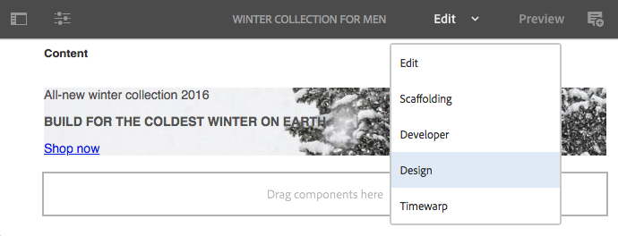
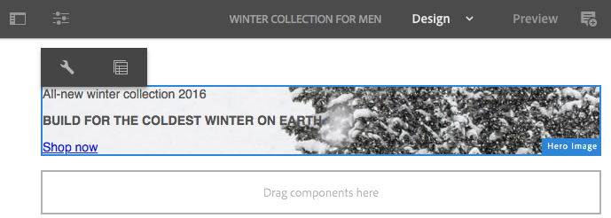

# 在設計模式中配置元件{#configuring-components-in-design-mode}

當AEM執行個體安裝為現成可用時，元件瀏覽器即可立即提供一系列元件。

除此之外，您也可以使用各種其他元件。 您可以使用「設計」模式來 [啟用/停用此類元件](#enable-disable-components). 啟用後，若您的頁面上已找到，則可使用「設計」模式， [配置元件設計的各個方面](#configuring-the-design-of-a-component) 編輯屬性參數。

>[!NOTE]
>
>編輯這些元件時請務必小心。 設計設定通常是整個網站設計的必要部分，因此只有具有適當權限和經驗的人才能變更這些設定，通常是管理員或開發人員。 請參閱 [開發元件](/help/sites-developing/components.md) 以取得更多資訊。

>[!NOTE]
>
>設計模式僅適用於靜態範本。 使用可編輯的範本建立的範本，應使用 [範本編輯器](/help/sites-authoring/templates.md).

>[!NOTE]
>
>設計模式僅適用於儲存為以下內容的設計配置： `/etc`)。
>
>建議從AEM 6.4版開始，將設計儲存為 `/apps` 支援連續部署方案。 儲存於 `/apps` 在執行階段中無法編輯，且非管理員使用者無法使用此類範本的設計模式。

這包括新增或移除頁面的段落系統中允許的元件。 段落制度( `parsys`)是包含所有其他段落元件的複合元件。 段落系統允許作者將不同類型的元件添加到頁面中，因為它包含所有其他段落元件。 每個段落類型都以元件的形式表示。

例如，產品頁面的內容可能包含包含下列內容的段落系統：

* 產品的影像（以影像或文字時段的形式）
* 產品說明（作為文欄位落）
* 具有技術資料的表（作為表段）
* 表單使用者填寫（表單開始、表單元素和表單結束段落）

>[!NOTE]
>
>請參閱 [開發元件](/help/sites-developing/components.md) 和 [使用範本和元件的准則](/help/sites-developing/dev-guidelines-bestpractices.md#guidelines-for-using-templates-and-components) 如需詳細資訊，請參閱 `parsys`.

>[!CAUTION]
>
>使用本文所述的設計模式編輯設計是定義靜態模板設計的建議方法
>
>例如，在CRX DE中修改設計並非最佳作法，且此類設計的應用可能會與預期行為不同。 請參閱開發人員檔案 [頁面範本 — 靜態](/help/sites-developing/page-templates-static.md#how-template-designs-are-applied) 以取得更多資訊。

## 啟用/停用元件 {#enable-disable-components}

要啟用或禁用元件：

1. 選取 **設計** 模式。

   

1. 點選或按一下元件。 選取時，元件會有藍色邊框。

   

1. 按一下或點選 **父級** 表徵圖。

   

   這將選擇包含當前元件的段落系統。

1. 此 **設定** 段落系統的表徵圖將顯示在父級的操作欄中。

   

   選取此選項以顯示對話方塊。

1. 編輯當前頁時，使用對話框定義元件瀏覽器中可用的元件。

   

   對話方塊有兩個標籤：

   * 允許的元件
   * 設定

   **允許的元件**

   在 **允許的元件** 頁簽，定義可用於parsys的元件。

   * 元件會依其元件群組分組，可展開和收合。
   * 可以通過檢查組名稱來選擇整個組，而通過取消檢查可以取消選擇所有組。
   * 減號至少表示已選取一個組中的項目，但並非全部。
   * 可使用搜尋來依名稱篩選元件。
   * 元件組名稱右側列出的計數表示這些組中選定元件的總數（無論篩選器為何）。

   您可以定義每頁元件的設定。 如果子頁使用相同的模板和/或頁面元件（通常對齊），則相同的配置將應用於相應的段落系統。

   >[!NOTE]
   >
   >最適化表單元件專門設計為可在適用性表單容器內運作，以運用Forms生態系統。 因此，這些元件只能在最適化表單編輯器中使用，而無法在Sites頁面編輯器中運作。

   **設定**

   在 **設定** 索引標籤可定義其他選項，例如為每個元件繪製錨點，以及定義每個容器的儲存格邊框間距。

1. 選擇 **完成** 以儲存您的設定。

## 配置元件的設計 {#configuring-the-design-of-a-component}

1. 選取 **設計** 模式。

   

1. 點選或按一下具有藍色邊框的元件。 在此範例中，選取了主圖影像元件。

   

1. 使用 **設定** 圖示以開啟對話方塊。

   

   在「設計」(design)對話框中，可以根據可用的設計參數配置元件。

   

   對話方塊有三個索引標籤：

   * 主要
   * 功能
   * 樣式

   **屬性**

   此 **屬性** 索引標籤可讓您設定元件的重要設計參數。 例如，對於影像元件，您可以定義允許的影像大小上限和最小大小。

   **功能**

   此 **功能** 索引標籤可讓您啟用或停用元件的其他功能。 例如，對於影像元件，您可以定義影像的方向、可用的裁切選項，以及是否可以上傳影像。

   **樣式**

   此 **樣式** 索引標籤可讓您定義要與元件搭配使用的CSS類別和樣式。

   

   使用 **新增** 按鈕，將其他條目添加到多條目對話框清單中。

   

   使用**刪除**表徵圖從多條目對話框清單中刪除條目。

   

   使用 **移動** 表徵圖重新排列多條目對話框清單中的條目順序。

   

1. 按一下或點選 **完成** 圖示來儲存及關閉對話方塊。
