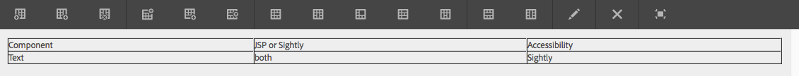

# 基礎元件 {#foundation-components}

>[!CAUTION]
>
>AEM 6.5現已棄用大部分的基礎元件。請參閱 [發行說明](/help/release-notes/deprecated-removed-features.md) 以取得更多資訊。
>
>Adobe建議運用更現代且可擴充的 [核心元件](https://docs.adobe.com/content/help/zh-Hant/experience-manager-core-components/using/introduction.html) 在AEM專案中。 這些是 [We.Retail範例內容](/help/sites-developing/we-retail.md) 也可以 [獨立安裝，用於開發](https://docs.adobe.com/content/help/en/experience-manager-core-components/using/get-started/using.html) 由您的管理員進行。
>
>您可以使用 [AEM現代化工具套裝](https://opensource.adobe.com/aem-modernize-tools/) 以重構您的基礎元件網站，以使用核心元件。

基礎元件是專為在標準網頁編寫內容時使用而設計。 它們構成標準AEM安裝可用的元件子集。

有些可透過元件瀏覽器立即使用，其他則可使用 [設計模式](/help/sites-authoring/default-components-designmode.md) （如果頁面是根據靜態範本）或依據 [編輯範本](/help/sites-authoring/templates.md) （如果頁面是以可編輯的範本為基礎）。

我們支援使用基礎元件，但大部分已淘汰，並由核心元件取代，因而更具擴充性和彈性。

>[!NOTE]
>
>本節僅探討標準AEM安裝中可立即使用的元件。
>
>您可能已根據您的執行個體明確開發自訂元件，以符合您的需求。 這些元件甚至可能與此處討論的某些元件具有相同的名稱。

元件可在 **元件** 頁面編輯器的側面板標籤 [編輯頁面](/help/sites-authoring/editing-content.md).

您可以選取元件，並將其拖曳至頁面上的必要位置。 然後，您可以使用：

* [配置屬性](/help/sites-authoring/editing-page-properties.md)
* [編輯內容](/help/sites-authoring/editing-content.md)

* [編輯內容 — 全螢幕模式](/help/sites-authoring/editing-content.md#edit-content-full-screen-mode)

元件會根據稱為元件群組的各種類別排序，包括：

* [一般](#general):包括基本元件，包括文本、影像、表和圖表。
* [欄](#columns):包括組織內容佈局所需的元件。
* [表單](#formgroup):包含建立表單所需的所有元件。

## 一般 {#general}

一般元件是您用來建立內容的基本元件。

### 帳戶項目 {#account-item}

>[!CAUTION]
>
>此基礎元件已淘汰。 Adobe建議使用 [核心元件](https://docs.adobe.com/content/help/en/experience-manager-core-components/using/introduction.html) 。

您可以定義包含標題和說明的連結。


### 自我調整影像 {#adaptive-image}

>[!CAUTION]
>
>此基礎元件已淘汰。 Adobe建議使用 [影像核心元件](https://docs.adobe.com/content/help/zh-Hant/experience-manager-core-components/using/components/image.translate.html) 。

適用性影像基礎元件會產生大小適合開啟網頁之視窗的影像。 若要使用元件，您可從檔案系統或DAM提供影像資源。 當開啟網頁時，網頁瀏覽器會下載已調整大小的影像副本，以適合目前視窗。

以下特性可確定窗口的大小：

* 設備螢幕：行動裝置通常會顯示網頁，使其在整個畫面中延伸。
* Web瀏覽器窗口大小：筆記型電腦和台式電腦的用戶可以調整Web瀏覽器窗口的大小。

例如，當在手機上開啟網頁時，元件會產生小型影像，而當在平板電腦上開啟中型影像時，元件會產生中型影像。 在筆記型電腦上，當在最大化的Web瀏覽器中開啟頁面時，元件會建立並傳遞大型影像。 當調整Web瀏覽器的大小以適合螢幕的一部分時，元件會透過傳送較小的影像並重新整理檢視來適應。

#### 支援的影像格式 {#supported-image-formats}

您可以搭配適用性影像元件使用下列副檔名的影像檔案：

* .jpg
* .jpeg
* .PNG
* .gif &#42;&#42;

>[!CAUTION]
>
>AEM不支援動畫GIF檔案進行最適化轉譯。

#### 影像大小和品質 {#images-sizes-and-quality}

下表列出為給定視區寬度生成的影像寬度。 計算所生成的影像的高度以保持恆定的長寬比，並且影像邊緣內不出現空白。 裁切可用來避免空格。

當影像為JPEG影像時，檢視區大小也可能影響JPEG品質。 可能的JPEG質量如下：

* 低(0.42)
* 中(0.82)
* 高(1.00)

| **檢視區寬度範圍（像素）** | **影像寬度（像素）** | **JPEG 品質** | **目標裝置類型** |
|---|---|---|---|
| 寬&lt;= 319 | 320 | 低 |  |
| width = 320 | 320 | 中 | 行動電話（縱向） |
| 320 &lt;寬&lt; 481 | 480 | 中 | 行動電話（橫向） |
| 480 &lt;寬&lt; 769 | 476 | 高 | 平板電腦（縱向） |
| 768 &lt;寬&lt; 1025 | 620 | 高 | 平板電腦（橫向） |
| 寬&lt;= 1025 | 完全（原始大小） | 高 | 桌面 |

#### 屬性 {#properties}

對話方塊可讓您編輯適用性影像元件例項的屬性，其中許多與其所依據的影像元件通用。 屬性可在兩個索引標籤中使用：

* **影像**

   * **影像**
從內容尋找器拖曳影像，或按一下以開啟瀏覽視窗，讓您在其中載入影像。 載入影像後，您可以裁切影像、旋轉影像或將其刪除。 要放大或縮小影像，請使用影像下方的幻燈片條（在「確定」和「取消」按鈕上）

   * **裁切**
裁切影像。 拖曳邊框以裁切影像。

   * **旋轉**
重複按一下「旋轉」，直到影像按所需旋轉。

   * **清除**
刪除當前映像。

* **進階**

   * **標題**
適用性影像元件不使用此屬性。

   * **替代文字**
用於影像的替代文字。

   * **連結至**
適用性影像元件不使用此屬性。

   * **說明**
適用性影像元件不使用此屬性。

#### 擴展自適應影像元件 {#extending-the-adaptive-image-component}

如需自訂適用性影像元件的相關資訊，請參閱 [了解自適應影像元件](/help/sites-developing/responsive.md#using-adaptive-images).

### 傳送 {#carousel}

>[!CAUTION]
>
>此基礎元件已淘汰。 Adobe建議使用 [轉盤核心元件](https://docs.adobe.com/content/help/en/experience-manager-core-components/using/components/carousel.html) 。

轉盤元件可讓您顯示與個別頁面相關聯的影像：

* 一次一個
* 很短的時間
* 按您指定的順序
* 具有您指定之

可點按控制項也可讓使用者隨選即時循環瀏覽顯示的頁面。 按一下目前可見的頁面影像，即會前往該頁面。 換句話說，輪播就是導覽控制項。

#### 屬性 {#properties-1}

這兩個標籤提供：

* **輪播**
您可在此指定輪播的運作方式：

   * 播放速度顯示下一張幻燈片之前的時間（毫秒）。
   * 轉換時間兩張幻燈片之間轉換的時間（毫秒）。
   * 控制樣式從下拉菜單中提供各種選項；例如， Prev / Next按鈕，右上角的開關。

* **清單**

   您可以在此處指定如何將頁面納入輪播：

   * **使用**
建立頁面清單有數種方式 — 子頁面、固定清單、搜尋或進階搜尋（以下皆說明）。
請注意，無論您選擇哪種方法，清單中包含的頁面若已有與頁面相關聯的影像，則會顯示在輪播中的影像。 如果該頁面的「頁面屬性」下沒有指定頁面的影像，您應該在開始前將影像與頁面建立關聯，否則輪播會顯示空白（或大部分為空白）頁面。 請參閱 [編輯頁面屬性](/help/sites-authoring/editing-page-properties.md).
將根據您選擇的新面板的項目顯示：

      * **子頁面的選項**

         * **上層頁面**
手動或使用選取器指定路徑。 保留為空白，以使用目前頁面作為上層頁面。
      * **固定清單的選項**

         * **頁面**
選取頁面清單。 使用 
`+` 添加更多條目和上/下按鈕以調整順序。
      * **搜尋選項**

         * **開始於**
手動輸入或使用選取器輸入起始路徑。

         * **搜尋查詢**
您可以輸入純文字檔案搜索查詢。
      * **進階搜尋的選項**

         * **Querybuilder述詞標籤法**
您可以使用查詢建立器述詞標籤法輸入搜尋查詢。 例如，您可以輸入&quot;fulltext=Marketing&quot;，讓其內容中具有&quot;Marketing&quot;的所有頁面都顯示在輪播中。
請參閱 [QueryBuilder API](/help/sites-developing/querybuilder-api.md) 以完整討論查詢運算式和其他範例。
   * **訂購依據**
選擇 
`jcr:title`, `jcr:created`, `cq:lastModified`，或 `cq:template` 從下拉式功能表。

   * **限制**
您要在轉盤中使用的項目數上限；此為選填。


>[!NOTE]
>
>您可以為Adobe Experience Manager建立自訂輪播元件，以顯示位於AEM DAM中的數位資產。 如需詳細資訊，請參閱 [建立適用於Adobe Experience Manager的自訂轉盤元件](https://helpx.adobe.com/experience-manager/using/custom-carousel-components.html).

### 圖表 {#chart}

>[!CAUTION]
>
>此基礎元件已淘汰。 Adobe建議使用 [核心元件](https://docs.adobe.com/content/help/en/experience-manager-core-components/using/introduction.html) 。

圖表元件可讓您新增長條圖、折線圖或圓形圖。 AEM會從您提供的資料建立圖表。 您可以直接在「資料」標籤中輸入內容，或複製並貼上試算表，借此提供資料。

* **資料**

   * **圖表資料**
使用CSV格式輸入圖表資料；逗號分隔值格式使用逗號(&quot;,&quot;)作為欄位分隔符。

* **進階**

   * **圖表類型**
從餅圖、折線圖和條形圖中選擇。

   * **替代文字**
顯示的替代文字而非圖表。

   * **寬度**
圖表的寬度（像素）。

   * **高度**
圖表的高度（像素）。

以下顯示圖表資料的範例，後面接著產生的長條圖：

 

>[!NOTE]
>
>您可以建立自訂AEM圖表控制項，以顯示位於AEM JCR中的資料。 如需詳細資訊，請參閱 [在圖表中顯示Adobe Experience Manager資料](https://helpx.adobe.com/experience-manager/using/displaying-experience-manager-data-chart.html).

### 內容片段 {#content-fragment}

>[!CAUTION]
>
>此基礎元件已淘汰。 Adobe建議使用 [內容片段核心元件](https://docs.adobe.com/content/help/en/experience-manager-core-components/using/components/content-fragment-component.html) 。

[內容片段](/help/sites-authoring/content-fragments.md) 會建立並管理為不受頁面影響的資產。 然後，您可以在編寫內容頁面時使用這些片段及其變體。

### Design Importer {#design-importer}

>[!CAUTION]
>
>此基礎元件已淘汰。 Adobe建議使用 [核心元件](https://docs.adobe.com/content/help/en/experience-manager-core-components/using/introduction.html) 。

這可讓您上傳包含設計套件的zip檔案。

### 下載 {#download}

>[!CAUTION]
>
>此基礎元件已淘汰。 Adobe建議使用 [核心元件](https://docs.adobe.com/content/help/en/experience-manager-core-components/using/introduction.html) 。

下載元件會在選取的網頁上建立連結，以下載特定檔案。 您可以從「內容尋找器」拖曳資產或上傳檔案。

* **下載**

   * **說明**
下載連結所顯示的簡短說明。

   * **檔案**
可在產生的網頁上下載檔案。 從內容尋找器拖曳資產，或按一下區域以上傳可供下載的檔案。

下列範例顯示中的下載元件Geometrixx:


### 外部 {#external}

>[!CAUTION]
>
>此基礎元件已淘汰。 Adobe建議使用 [核心元件](https://docs.adobe.com/content/help/en/experience-manager-core-components/using/introduction.html) 。

外部應用程式整合元件(**外部**)可讓您使用iframe將外部應用程式內嵌至您的AEM頁面。

* **外部**

   * **目標應用程式**
指定要整合的Web應用程式的URL;例如：

      ```
      https://en.wikipedia.org/wiki/Main_Page
      ```

   * **傳遞參數**
勾選方塊，以便視需要將參數傳遞至應用程式。

   * **寬度和高度**定義iframe的大小

外部應用程式整合到AEM頁面的段落系統中；例如，使用 `https://en.wikipedia.org/wiki/Main_Page`:


>[!NOTE]
>
>例如，根據您的使用案例，其他選項可用於整合外部應用程式。 the [整合Portlet](/help/sites-administering/aem-as-portal.md).

### 閃光燈 {#flash}

>[!CAUTION]
>
>此基礎元件已淘汰。 Adobe建議使用 [核心元件](https://docs.adobe.com/content/help/en/experience-manager-core-components/using/introduction.html) 。

>[!CAUTION]
>
>若不進行廣泛的專案層級自訂，此元件將不再可立即運作。

Flash元件可讓您載入Flash影片。 您可以從內容尋找器將Flash資產拖曳至元件，或使用對話方塊：

* **閃光燈**

   * **Flash 影片**

      快閃影片檔案。 從內容尋找器拖曳資產，或按一下以開啟瀏覽視窗。

   * **大小**

      Dimension（以像素表示），顯示影片。

* **替代影像**

   要顯示的替代影像

* **進階**

   * **上下文功能表**

      指示應顯示還是隱藏上下文菜單。

   * **視窗模式**

      窗口的顯示方式，例如不透明、透明或作為不同（實體）窗口顯示。

   * **背景色彩**

      從提供的顏色圖中選擇的背景顏色。

   * **最低版本**

      運行影片所需的最低AdobeFlash Player版本。 預設為9.0.0。

   * **屬性**

      需要任何其他屬性。

### 影像 {#image}

>[!CAUTION]
>
>此基礎元件已淘汰。 Adobe建議使用 [影像核心元件](https://docs.adobe.com/content/help/en/experience-manager-core-components/using/components/image.html) 。

影像元件會根據指定的參數顯示影像和隨附的文字。

您可以上傳影像，然後編輯和操控影像（例如裁切、旋轉、新增連結/標題/文字）。

您可以從 [資產瀏覽器](/help/sites-authoring/author-environment-tools.md#assets-browser) 直接放到元件或其上 [配置對話框](/help/sites-authoring/editing-content.md#component-edit-dialog). 您也可以從「設定」對話方塊上傳影像；此對話方塊也會控制影像的所有定義和操作：


上傳影像後（而非之前），您可以使用 [置入編輯](/help/sites-authoring/editing-content.md#edit-content) 要根據需要裁切/旋轉影像：


>[!NOTE]
>
>就地編輯器在編輯時使用影像的原始大小和外觀比例。 您也可以指定高度和寬度屬性。 儲存編輯變更時，屬性中定義的任何大小和外觀比例限制都會套用。
>
>根據您的例項，您也可能對 [頁面設計](/help/sites-developing/designer.md);這些項目是在項目實施期間開發的。

全螢幕編輯模式提供其他幾個選項；例如，對應和縮放：


>[!NOTE]
>
>無法使用Internet Explorer監控上傳進度。
>
>Internet Explorer使用者需上傳影像，然後按一下 **確定** 然後重新開啟影像，在預覽中查看已上傳的檔案，並能夠執行修改（即裁切）。
>
>請參閱 [認證平台](/help/release-notes/release-notes.md#certifiedplatforms) 區段，以取得AEM所使用HTML5功能的詳細資訊。

載入影像時，您可以設定下列項目：

* **地圖**

   要映射影像，請選擇「映射」。 您可以指定要如何建立影像映射（矩形、多邊形等）以及區域應指向的位置。

* **裁切**

   選取「裁切」以裁切影像。 使用滑鼠來裁切影像。

* **旋轉**

   要旋轉影像，請選擇「旋轉」。 重複使用，直到影像以您想要的方式旋轉為止。

* **清除**

   刪除當前映像。

* **標題**

   影像的標題。

* **替代文字**

   建立可存取的內容時使用的替代文字。

* **連結至**

   在您的網站中建立資產或其他頁面的連結。

* **說明**

   影像的說明。

* **大小**

   設定影像的高度和寬度。

>[!NOTE]
>
>某些選項僅在全螢幕編輯器中可用。

最終影像(包含 **標題** 和 **說明**)可顯示為：


### 配置容器 {#layout-container}

此元件提供網格段落系統，允許您在 [回應式格線](/help/sites-authoring/responsive-layout.md). 這可讓您根據目標裝置的寬度（包括一系列手機、平板電腦和桌上型電腦）定義不同的內容配置。


>[!NOTE]
>
>此元件已透過 [HTML範本語言(HTL)](https://docs.adobe.com/content/help/zh-Hant/experience-manager-htl/using/overview.html).

### 清單 {#list}

>[!CAUTION]
>
>此基礎元件已淘汰。 Adobe建議使用 [清單核心元件](https://docs.adobe.com/content/help/en/experience-manager-core-components/using/components/list.html) 。

「清單」元件可讓您設定顯示清單的搜尋條件：

* **清單**

   * **使用以下方式產生清單**

      您可以在此處指定清單將擷取其內容的位置。 有數種方法：

   * 將根據您選擇的新面板的項目顯示：

      * **子頁面的選項**

         * **兒童** （上層頁面）

            手動或使用選取器指定路徑。 保留為空白，以使用目前頁面作為上層頁面。
      * **固定清單的選項**

         * **頁面**

            選取頁面清單。 使用+添加更多條目以及上/下按鈕來調整順序。
      * **搜尋選項**

         * 開始

            手動輸入或使用選取器輸入起始路徑。

         * 搜尋查詢

            您可以輸入純文字檔案搜索查詢。
      * **進階搜尋的選項**

         * **QueryBuilder 述詞記號**

            您可以使用查詢建立器述詞標籤法輸入搜尋查詢。 例如，您可以輸入&quot;fulltext=Marketing&quot;，讓其內容中具有&quot;Marketing&quot;的所有頁面都顯示在輪播中。

            請參閱 [QueryBuilder API](/help/sites-developing/querybuilder-api.md) 以完整討論查詢運算式和其他範例。
      * **標記**

         指定 **上層頁面**, **標籤/關鍵字** 和您所需的符合條件。
   * **顯示為**

      您希望項目的列出方式；包括連結、預告和新聞。

   * **排序方式**

      清單是否要排序，若要，則用於排序的條件。 您可以輸入條件，或從提供的下拉式清單中選取條件。

   * **限制**

      指定您要在清單中顯示的項目數上限。

   * **啟用資訊源**

      指出是否應為清單啟用RSS饋送。

   * **每頁顯示項目數**

      您可以在此處指定一次顯示的清單項目數。 項目數超過指定的清單會使用分頁功能，以數個部分顯示清單。


下列範例顯示 **清單** 元件顯示子頁面清單的方式（設計由網站設計的自訂CSS定義控制）。


### 登入 {#login}

>[!CAUTION]
>
>此基礎元件已淘汰。 Adobe建議使用 [核心元件](https://docs.adobe.com/content/help/en/experience-manager-core-components/using/introduction.html) 。

>[!CAUTION]
>
>若不進行廣泛的專案層級自訂，此元件將不再可立即運作。

這些欄位提供「使用者名稱」和「密碼」欄位。


您可以設定：

* 登入

   * 區域標籤

      輸入欄位的導入文本。

   * 使用者名稱標籤

      用於標籤用戶名欄位的文本。

   * 密碼標籤

      用於標籤密碼欄位的文本。

   * 登入按鈕標籤

      登入按鈕的文字。

   * 重新導向至

      您可以指定在使用者登入後，應該開啟的網站頁面。

* 已登入

   * 繼續按鈕標籤

      表示使用者已登入的文字。

### 訂單狀態 {#order-status}

>[!CAUTION]
>
>若不進行廣泛的專案層級自訂，此元件將不再可立即運作。

* **標題**

   * **標題**

      指定您要顯示的標題文字。

   * **連結**

      指定應顯示訂單狀態的頁面（產品）。

   * **類型/大小**

      從提供的選項中選擇。


### 引用 {#reference}

>[!CAUTION]
>
>此基礎元件已淘汰。 Adobe建議使用 [內容片段核心元件](https://docs.adobe.com/content/help/en/experience-manager-core-components/using/components/content-fragment-component.html) 。

此 **參考** 元件可讓您參照AEM網站其他頁面（在目前例項內）的文字。 然後，所引用段落的內容就會顯示為位於當前頁面上。 當來源段落變更時，內容將會更新（可能需要重新整理頁面）。

* **段落引用**

   * **引用**

      指定您要參考的頁面和段落（包括內容）的路徑。

要指定段落的路徑，您需要在路徑（到頁面）的尾碼上加上：

`.../jcr:content/par/<paragraph-ID>`

例如：

`/content/geometrixx-outdoors/en/equipment/biking/cajamara/jcr:content/par/similar-products`

除了引用特定段落外，還可以修改路徑以指定整個段落系統。 您可以在路徑尾碼加上：

`/jcr:content/par`

例如：

`/content/geometrixx-outdoors/en/equipment/biking/cajamara/jcr:content/par`

設定後，內容會與來源頁面上的內容完全相同。 它是參照的事實，只有在您開啟要編輯的元件時才會顯示：


### 搜尋 {#searching}

>[!CAUTION]
>
>此基礎元件已淘汰。 Adobe建議使用 [快速搜尋核心元件](https://docs.adobe.com/content/help/en/experience-manager-core-components/using/components/quick-search.html) 。

搜尋元件會將搜尋功能新增至您的頁面。

您可以設定：

* 搜尋

   * **節點類型**

      如果搜索限制為特定節點類型，請在此列出它們；例如， `cq:Page`.

   * **搜尋路徑:**

      指定要搜尋之分支的根頁面。

   * **搜尋按鈕文字**

      實際搜索按鈕上顯示的名稱。

   * **統計文本**

      搜索結果上方顯示的文本。

   * **無結果文字**

      如果沒有結果，則顯示此處輸入的文本。

   * **拼寫檢查文字**

      如果某人輸入了類似的詞語，則此文字會顯示在詞語之前。
例如，如果您輸入geometrixxe，系統會顯示「您是說？」 geometrixx」。

   * **類似頁面文字**

      類似頁面的結果旁顯示的文字。 按一下此連結可查看具有類似內容的頁面。

   * **相關搜索文本**

      出現在搜尋相關詞語和主題旁的文字。

   * **搜尋趨勢文字**

      使用者輸入之搜尋詞上方的標題。

   * **結果頁標籤**

      顯示在此清單底部的文本，其中包含指向其他結果頁的連結。

   * **上一個標籤**

      出現在先前搜索頁面連結上的名稱。

   * **下一個標籤**

      顯示在後續搜尋頁面連結上的名稱。

下列範例顯示搜尋字詞後的搜尋元件 *geometrixx* 從標準安裝的根目錄。 這也說明結果的分頁：


下列範例顯示拼寫錯誤且無法使用的搜尋詞：


### Sitemap {#sitemap}

>[!CAUTION]
>
>此基礎元件已淘汰。 Adobe建議使用 [導覽](https://docs.adobe.com/content/help/en/experience-manager-core-components/using/components/navigation.html), [語言導覽](https://docs.adobe.com/content/help/en/experience-manager-core-components/using/components/language-navigation.html)，和 [階層連結核心元件](https://docs.adobe.com/content/help/en/experience-manager-core-components/using/components/breadcrumb.html) 。

自動Sitemap清單（具有預設設定）會列出目前網站中的所有頁面（作為作用中連結）。 例如，擷取會顯示：


如有需要，您可以設定：

* **Sitemap**

   * **根路徑**

      清單的起始路徑。

### Slideshow {#slideshow}

>[!CAUTION]
>
>此基礎元件已淘汰。 Adobe建議使用 [轉盤核心元件](https://experienceleague.adobe.com/docs/experience-manager-core-components/using/components/carousel.html) 。

>[!CAUTION]
>
>若不進行廣泛的專案層級自訂，此元件將不再可立即運作。

此元件允許您載入一系列要以幻燈片形式顯示在頁面上的影像。您可以添加或刪除影像，並為每個影像分配標題。 在「高級」(Advanced)下，還可以指定顯示區域的大小。

您可以設定：

* **幻燈片**

   * **新增幻燈片**

      您可以使用 **新增** (和 **移除**)按鈕。

   * **標題**

      視需要指定標題。 這個覆蓋在適當的幻燈片上。

* **進階**

   * **大小**

      以像素指定寬度和高度。

然後，幻燈片放映元件會在一段較短的時間內重複顯示每個元件，然後淡出到下一張幻燈片：


### 表格 {#table}

>[!CAUTION]
>
>此基礎元件已淘汰。 Adobe建議使用 [文字核心元件](https://docs.adobe.com/content/help/en/experience-manager-core-components/using/components/text.html) 。

>[!NOTE]
>
>此 **表格** 基礎元件以 [RTF編輯器](/help/sites-authoring/rich-text-editor.md)，亦即 **[文字](#text)** 基礎元件。

此 **表格** 元件已預先設定，可讓您建構、填入表格並設定表格格式。 使用對話框，可以通過以下任一方法配置表並建立內容：

* 從頭開始
* 從外部編輯器（如Excel、OpenOffice、Notepad等）複製並貼上試算表或表格。

您可以使用內嵌編輯器對內容進行基本變更：


在全螢幕模式中，您可以設定表格配置：



以下螢幕截圖顯示了表元件的示例；設計由網站專用的CSS決定：


### 標記雲 {#tag-cloud}

標籤雲端以圖形呈現，顯示套用至網站內容的標籤選取項目：


設定Tag Cloud元件時，您可以指定：

* **要顯示的標記**

   從中收集要顯示的標籤。 從頁面、包含所有子項或所有標籤的頁面中選取。

* **Page**

   選取要參考的頁面。

* **標記上無連結**

   顯示的標籤是否應作為連結。

如需套用標籤的詳細資訊，請造訪 [使用標籤](/help/sites-authoring/tags.md).

### 文字 {#text}

>[!CAUTION]
>
>此基礎元件已淘汰。 Adobe建議使用 [文字核心元件](https://docs.adobe.com/content/help/en/experience-manager-core-components/using/components/text.html) 。

>[!NOTE]
>
>此 **文字** 基礎元件以 [RTF編輯器](/help/sites-authoring/rich-text-editor.md)，亦即 **表格** 基礎元件。

Text元件可讓您使用WYSIWYG編輯器輸入文字區塊，並搭配 [RTF編輯器](/help/sites-authoring/rich-text-editor.md). 通過選擇表徵圖，可以設定文本的格式，包括字型特性、對齊方式、連結、清單和縮進。


當您開啟 **設定** 對話框中，也可以設定：

* **空格字元**
* **文字樣式**

格式化的文字隨即顯示在頁面上；實際設計將取決於網站CSS:


如需Text元件和RTF編輯器提供之功能的詳細資訊，請參閱 [RTF編輯器](/help/sites-authoring/rich-text-editor.md) 頁面。

#### 就地編輯 {#inplace-editing}

除了以對話方塊為基礎的RTF編輯模式，AEM也提供 [就地編輯](/help/sites-authoring/editing-content.md)，可直接編輯顯示在頁面版面中的文字。

### 文字和影像 {#text-image}

>[!CAUTION]
>
>此基礎元件已淘汰。 Adobe建議使用 [影像](https://docs.adobe.com/content/help/en/experience-manager-core-components/using/components/image.html) 和 [文字核心元件](https://docs.adobe.com/content/help/en/experience-manager-core-components/using/components/text.html) 。

文字和影像元件會新增文字區塊和影像。 您也可以個別新增和編輯文字和影像。 請參閱 [文字](#text) 和 [影像](#image) 元件以取得詳細資訊。


您可以設定：

* **元件樣式** (**樣式**)

   您可以在此向左或向右對齊影像。 預設為 **Left** 對齊，與左側的影像對齊。

* **影像屬性** (**進階影像屬性**)

   可讓您指定下列項目：

   * **影像資產**

      上傳所需的影像。

   * **標題**

      區塊的標題；將以mouseover顯示。

   * **替代文字**

      當無法顯示影像時要顯示的替代文字。 如果保留為空白，則會使用標題。

   * **連結到**

      指定目標路徑。

   * **說明**

      影像的說明。

   * **大小**

      設定影像的高度和寬度。

下列範例顯示一個文本影像元件，該元件左對齊影像：


### 標題 {#title}

>[!CAUTION]
>
>此基礎元件已淘汰。 Adobe建議使用 [標題核心元件](https://docs.adobe.com/content/help/en/experience-manager-core-components/using/components/list.html) 。

標題元件可以：

* 顯示目前頁面的名稱；將「標題」欄位留空即可完成此作業
* 顯示在「標題」欄位中指定的文字。

您可以設定：

* **標題**

   如果您想使用頁面標題以外的名稱，請在此處輸入。

* **連結**

   如果標題要作為連結操作，則URI。

* **類型/大小**

   從下拉式清單中選取「小」或「大」。 小即生成為影像。 大是作為文本生成的。

下列範例顯示 **標題** 元件顯示；設計由網站專用的CSS決定。


### 影片 {#video}

>[!CAUTION]
>
>此基礎元件已淘汰。 Adobe建議使用 [核心元件內嵌元件](https://experienceleague.adobe.com/docs/experience-manager-core-components/using/components/embed.html) 。

>[!CAUTION]
>
>若不進行廣泛的專案層級自訂，此元件將不再可立即運作。

此 **影片** 元件可讓您將預先定義且現成可用的視訊元素放置在頁面上。

另請參閱 [設定您的視訊設定檔](/help/sites-administering/config-video.md#configuringvideoprofiles) 用於HTML5元素。

將元件的例項放在頁面上後，您可以設定：

* 影片

   * **視訊資產**

      上傳或放置您的視訊資產。

   * **大小**

      視訊的原生大小(寬x高（以像素為單位）會出現在「大小」旁的方塊中（請參閱上方）。 如果您想要覆寫視訊的原生維度，請在此手動輸入寬度和高度維度。 按一下 **確定** 關閉對話。

>[!NOTE]
>
>支援的格式包括：
>
>* `.mp4`
>* `Ogg`
>* `FLV` (Flash影片)


## 欄 {#columns}

欄是控制AEM中內容版面的機制。 在用於建立兩列和/或三列的標準安裝元件中提供。

下列範例顯示使用中的2欄元件。 您可以為新元件使用預留位置：


### 2 欄 {#columns-1}

預設值為2個等於列的列控制元件。

### 3 欄 {#columns-2}

預設值為3個等於列的列控制元件。

### 欄控制項 {#column-control}

「欄控制」元件可讓使用者選取要將網頁主要面板中的內容分割為多欄的方式。 使用者可以選取所需的欄數（從預先定義的清單），然後在每欄內建立、刪除或移動內容。

* **欄控制項**

   * **欄配置**

      選擇要呈現的列數。 建立後，每個欄都有其專屬的連結，可在新增內容時拖曳元件或資產。

## 表單 {#form}

>[!CAUTION]
>
>來自元件的基礎元件已淘汰。 Adobe建議使用 [核心元件](https://docs.adobe.com/content/help/en/experience-manager-core-components/using/introduction.html) 。

表單元件可用來建立供訪客提交輸入的表單。 Forms和表單元件可用來收集包括用戶反饋（例如，客戶滿意度調查表）和用戶資訊（例如，用戶註冊）在內的資訊。

>[!NOTE]
>
>請參閱 [AEM Forms說明](/help/forms/home.md) 以取得AEM Forms的相關資訊。

Forms是由數個不同元件所建置：

* **表單**

   表單元件會定義頁面上新表單的開頭和結尾。 接著，其他元件便可放在這些元素之間，例如表格、下載等。

* **表單欄位和元素**

   表單欄位和元素可以包含文字方塊、選項按鈕、影像等。 使用者通常會在表單欄位中完成動作，例如輸入文字。 如需詳細資訊，請參閱個別表單元素。

* **設定檔元件**

   設定檔元件與用於社交協作的訪客設定檔，以及需要訪客個人化的其他區域相關。

以下是範例表單。 由 **表單** 元件（開始和結束），有兩個 **表單** **文字** 輸入欄位， **一般** **文字** 用於導入文本的欄位和 **提交** 按鈕。


>[!NOTE]
>
>有關進一步開發和自訂表單的資訊，請參閱 [開發Forms頁面](/help/sites-developing/developing-forms.md). 這包括新增動作、限制、預先載入欄位，以及使用指令碼來呼叫服務以採取動作等。

### 表單元件的常見設定（多個） {#settings-common-to-many-form-components}

雖然每個表單元件的用途不同，但許多元件都包含類似的選項和參數。

配置任何表單元件時，對話框中都提供以下頁簽：

* **標題和文字**

   您需要在此處指定基本資訊，例如表單的標題和任何隨附的文字。 如果適用，它還允許您定義其他關鍵資訊，例如欄位是否為多個可選欄位，以及可供選擇的項目。

* **初始值**

   可讓您指定預設值。

* **限制**

   您可以在此處指定欄位是否為必要欄位，並將限制放在該欄位上（例如，必須是數值，以此類推）。

* **樣式**

   指示欄位的大小和樣式。

>[!NOTE]
>
>您看到的欄位會依個別元件而大不相同。

這些標籤提供您必要的參數；這取決於個別元件類型，但可能包括：

* **標題和文字**

   * **元素名稱**

      表單元素的名稱。 這表示資料儲存在存放庫中的位置。
這是必填欄位，應僅包含下列字元：

      * 英數字元
      * `_ . / : -`
   * **標題**

      與欄位一起顯示的標題。 若保留為空白，則會顯示預設標題。

   * **說明**

      可讓您視需要為使用者提供其他資訊。 在表單中，欄位下方會以比標題小的字型顯示。

   * **顯示/隱藏**

      決定欄位的可見時間。


* **初始值**

   * **預設值**

      表單開啟時顯示在欄位中的值；即使用者進行任何輸入之前。

* **限制**

   * **必要**

      這取決於表單元件類型，但提供一個或多個按一下框，以指明此欄位或此欄位的某些部分是/是必需的。

   * **必要訊息**

      通知使用者此欄位為必填的訊息；必填欄位也會標籤為和星號。

   * **限制**

      可用於選擇的約束取決於表單元件類型。

   * **限制訊息**

      通知使用者需要的訊息。

* **樣式**

   * **大小**

      在行和列中。

   * **寬度**

      以像素顯示。

   * **CSS**

### 表單（元件） {#form-component}

>[!CAUTION]
>
>此基礎元件已淘汰。 Adobe建議使用 [表單容器核心元件](https://docs.adobe.com/content/help/en/experience-manager-core-components/using/components/forms/form-container.html) 。

表單元件會使用 **表單開始** 和 **表單結尾** 元素。 這些一律會配對，以確保表單已正確定義。


在表單的開頭和結尾之間，您可以新增表單元件，以定義使用者的實際輸入欄位。

>[!NOTE]
>
>基礎元件表單元件僅支援使用其他基礎元件表單元件（按鈕、文字、隱藏等）。 使用 [核心元件](https://docs.adobe.com/content/help/en/experience-manager-core-components/using/introduction.html) 不支援基礎元件表單中的表單元件（反之亦然）。

#### 表單開始 {#start-of-form}

需要此元件來定義頁面上新表單的開頭。 您可以設定：

* **表單**

   * **感謝頁面**

      要參考的頁面，感謝訪客提供其輸入。 如果保留為空白，表單會在提交後重新顯示。

   * **啟動工作流程**

      決定提交表單後觸發的工作流程。

* **進階**

   * **動作類型**

      表單需要動作。 動作會定義使用者提交的資料(類似於HTML中的action=)所觸發的執行操作。 有些需要對應 **動作設定**.
標準AEM安裝中包含一系列動作類型：

      * **帳戶請求**
      * **建立內容**
      * **建立銷售機會**
      * **建立和更新帳戶**
      * **電子郵件服務: 建立訂閱者並新增到清單**
      * **電子郵件服務: 傳送自動回應的電子郵件**
      * **電子郵件服務: 將使用者從清單中取消訂閱**
      * **編輯社群**
      * **編輯資源**
      * **編輯工作流程控制的資源**
      * **郵件**
      * **已下單的訂單詳細資訊**
      * **設定檔更新**
      * **重設密碼**
      * **設定密碼**
      * **存放區內容**

         這是預設動作類型。

      * **透過上傳儲存內容**
      * **提交訂單**
      * **取消訂閱者的訂閱**
      * **更新訂單**
   * **表單識別碼**

      表單識別碼可唯一識別表單。 如果單一頁面上有數個表單，請使用表單識別碼；請確定它們有不同的識別碼。

   * **載入路徑**

      用於將預定義值載入到表單欄位中的節點屬性路徑。

      這是一個可選欄位，它指定儲存庫中節點的路徑。 如果此節點的屬性與欄位名稱匹配，則表單上的相應欄位將預載這些屬性的值。 如果不存在匹配項，則欄位包含預設值。

      使用 **載入路徑** 您可以預先載入必填欄位中的值。 請參閱 [預先載入表單值](/help/sites-developing/developing-forms.md#preloading-form-values).

   * **用戶端驗證**

      指示此表單是否需要客戶端驗證（伺服器驗證） *always* 發生。) 這可與 **Forms驗證碼** 元件。

   * **驗證資源類型**

      如果要驗證整個表單（而非個別欄位），則定義表單驗證資源類型。 如果您正在驗證完整的表單，也包括下列其中一項：

      * 用於客戶端驗證的指令碼：

         `/apps/<*myApp*>/form/<*myValidation*>/formclientvalidation.jsp`

      * 伺服器端驗證的指令碼：

         `/apps/<*myApp*>/form/<*myValidation*>/formservervalidation.jsp`
   * **動作設定**

      中可用的選項 **動作設定** 取決於 **動作類型** 已選取：

      * **帳戶請求**

         * **建立帳戶頁面**

            建立新帳戶時使用的頁面。
      * **建立內容**

         * 內容路徑

            表單傾印之任何內容的內容路徑。 輸入以斜線結尾的路徑 `/`. 斜線表示，對於每個表單埠，在指定位置建立新節點；例如：

            `/forms/feedback/`

         * **類型**

            選取所需的類型。

         * **表單**

            指定表單。

         * **轉譯工具**

            從清單中選取所需選項。

         * **資源類型**

            若已設定，這會新增至每個註解，如 `sling:resourceType`

         * **檢視選擇器**
      * **建立銷售機會**

         * **銷售機會將新增到此清單中**

            指定所需的銷售機會清單。
      * **建立和更新帳戶**

         * **初始群組**

            組，將新用戶分配給。

         * **首頁**

            成功登入後顯示的頁面。

         * **路徑**

            建立和儲存新帳戶的路徑（相對）。

         * **檢視資料...**

            按一下此按鈕可在批量編輯器中訪問有關表單結果的資訊。 從這裡，您可以將資訊匯出至 `.tsv` （以Tab分隔）檔案（例如，在Excel試算表中使用）。
      * **郵件**

         * **從**

            輸入電子郵件應來自的電子郵件地址。

         * **Mailto**

            輸入表單要傳送的電子郵件地址。

         * **CC**

            輸入CC電子郵件地址。

         * **BCC**

            輸入密件副本電子郵件地址。

         * **主旨**

            輸入電子郵件的主旨。
      * **重設密碼**

         * **變更密碼頁面**

            更改密碼時使用的頁。
      * **存放區內容**

         * **內容路徑**

            表單傾印之任何內容的內容路徑。 輸入以斜線結尾的路徑 `/`. 斜線表示，對於每個表單埠，在指定位置建立新節點；例如：
            `/forms/feedback/`

         * **檢視資料...**

            按一下此按鈕可在批量編輯器中訪問有關表單結果的資訊。 從這裡，您可以將資訊匯出為.tsv（以Tab分隔）檔案（例如，在Excel試算表中使用）。
      * **透過上傳存放內容**

         此選項與 **儲存內容**.

      * **取消訂閱者的訂閱**

         * **銷售機會將從此清單中刪除**

            指定所需的銷售機會清單。


#### 表單結尾 {#end-of-form}

這表示表單的結尾。 您可以設定：

* **表單結尾**

   * **顯示提交按鈕**

      指出是否應顯示「提交」按鈕。

   * **提交名稱**

      在表單中使用多個提交按鈕時的識別碼。

   * **提交標題**

      按鈕上顯示的名稱，例如「提交」或「發送」。

   * **顯示重設按鈕**

      選中複選框以使「重置」按鈕可見。

   * **重設標題**

      顯示在「重置」按鈕上的名稱。

   * **說明**

      顯示在按鈕下方的資訊。

### 帳戶名稱 {#account-name}

>[!CAUTION]
>
>此基礎元件已淘汰。 Adobe建議使用 [表單文字核心元件](https://docs.adobe.com/content/help/en/experience-manager-core-components/using/components/forms/form-text.html) 。

這可讓使用者輸入帳戶名稱：


### 地址 {#address}

>[!CAUTION]
>
>此基礎元件已淘汰。 Adobe建議使用 [表單文字核心元件](https://docs.adobe.com/content/help/en/experience-manager-core-components/using/components/forms/form-text.html) 。

這可讓您新增具有下列格式的國際地址欄位：


元件已設定為立即使用，但您可以視需要變更設定。 例如，可以為地址的個別元素新增限制。 將欄位保留為空白將使用預設設定。

### Captcha {#captcha}

>[!CAUTION]
>
>此基礎元件已淘汰。 Adobe建議使用 [核心元件](https://docs.adobe.com/content/help/en/experience-manager-core-components/using/introduction.html) 。

>[!CAUTION]
>
>若不進行廣泛的專案層級自訂，此元件將不再可立即運作。

驗證碼元件需要使用者輸入字母數字字串，如畫面上所示。 字串會隨著每次重新整理而變更。


您可以為此元件配置各種參數，包括驗證碼字串無效時將顯示的消息。

### 核取方塊群組 {#checkbox-group}

>[!CAUTION]
>
>此基礎元件已淘汰。 Adobe建議使用 [表單選項核心元件](https://docs.adobe.com/content/help/en/experience-manager-core-components/using/components/forms/form-options.html) 。

核取方塊可讓您建立多個核取方塊之一的清單，其中數個可同時選取。


您可以指定各種參數，包括標題、說明和元素名稱。 使用+和 — 按鈕，您可以添加或刪除項目，然後使用向上和向下箭頭定位它們。

>[!NOTE]
>
>使用 **項目載入路徑** 您可以使用值預載複選框組清單。
>
>請參閱 [預先載入多個值的表單欄位](/help/sites-developing/developing-forms.md#preloading-form-fields-with-multiple-values).

### 信用卡詳細資料 {#credit-card-details}

>[!CAUTION]
>
>此基礎元件已淘汰。 Adobe建議使用 [核心元件](https://docs.adobe.com/content/help/en/experience-manager-core-components/using/introduction.html) 。

這可讓您提供輸入信用卡詳細資訊所需的欄位。 您可以設定它，以指定接受的卡片類型和所需資訊（例如安全代碼）。


### 下拉式清單 {#dropdown-list}

>[!CAUTION]
>
>此基礎元件已淘汰。 Adobe建議使用 [表單選項核心元件](https://docs.adobe.com/content/help/en/experience-manager-core-components/using/components/forms/form-options.html) 。

下拉式清單可經過設定，以提供您的使用範圍供您選取的值：


您可以指定標題和項目以顯示在清單中。 使用+和 — 按鈕，可以添加或刪除清單項，然後使用Up和Down按鈕定位它們。 您可以指定是否允許使用者從清單中選取數個項目，以及在首次開啟清單時應自動選取的任何項目（初始值）。

>[!NOTE]
>
>使用 **項目載入路徑** 您可以使用值預先載入下拉式清單。
>
>請參閱 [預先載入多個值的表單欄位](/help/sites-developing/developing-forms.md#preloading-form-fields-with-multiple-values).

### 檔案上傳 {#file-upload}

>[!CAUTION]
>
>此基礎元件已淘汰。 Adobe建議使用 [核心元件](https://docs.adobe.com/content/help/en/experience-manager-core-components/using/introduction.html) 。

檔案上傳元件為使用者提供選取和上傳檔案的機制。


>[!NOTE]
>
>您可以建立自訂上傳元件，將檔案上傳至Sling Servlet。 如需詳細資訊，請參閱 [上傳檔案至Adobe Experience Manager](https://helpx.adobe.com/experience-manager/using/uploading-files-aem1.html).

### 隱藏欄位 {#hidden-field}

>[!CAUTION]
>
>此基礎元件已淘汰。 Adobe建議使用 [表單隱藏核心元件](https://docs.adobe.com/content/help/en/experience-manager-core-components/using/components/forms/form-hidden.html) 。

此元件可讓您建立隱藏欄位。 這些功能可用於各種用途；例如，提交表單後需要執行動作，或後續處理需要隱藏資料時。


>[!NOTE]
>
>您也可以自訂表單，以根據表單中其他欄位的值顯示或隱藏特定表單元件。 只有在特定條件下才需要欄位時，變更表單欄位的可見性會很實用。
>
>請參閱 [顯示和隱藏表單元件](/help/sites-developing/developing-forms.md#showing-and-hiding-form-components).

### 影像按鈕 {#image-button}

>[!CAUTION]
>
>此基礎元件已淘汰。 Adobe建議使用 [表單按鈕核心元件](https://docs.adobe.com/content/help/en/experience-manager-core-components/using/components/forms/form-button.html) 。

影像按鈕可讓您使用自己的影像和文字建立按鈕：


### 影像上載 {#image-upload}

>[!CAUTION]
>
>此基礎元件已淘汰。 Adobe建議使用 [核心元件](https://docs.adobe.com/content/help/en/experience-manager-core-components/using/introduction.html) 。

影像上傳元件為使用者提供選擇及上傳影像檔案的機制。


### 連結欄位 {#link-field}

>[!CAUTION]
>
>此基礎元件已淘汰。 Adobe建議使用 [核心元件](https://docs.adobe.com/content/help/en/experience-manager-core-components/using/introduction.html) 。

連結欄位可讓使用者指定URL:


最常用於日曆事件表單，用於事件的URL/連結欄位。

### 密碼欄位 {#password-field}

>[!CAUTION]
>
>此基礎元件已淘汰。 Adobe建議使用 [核心元件](https://docs.adobe.com/content/help/en/experience-manager-core-components/using/introduction.html) 。

這可讓使用者輸入其密碼：


### 密碼重設 {#password-reset}

>[!CAUTION]
>
>此基礎元件已淘汰。 Adobe建議使用 [核心元件](https://docs.adobe.com/content/help/en/experience-manager-core-components/using/introduction.html) 。

此元件為使用者提供下列兩個欄位：

* 密碼的輸入
* 重複輸入密碼以檢查輸入是否正確。

使用預設設定時，元件將顯示為：


### 選項按鈕群組 {#radio-group}

>[!CAUTION]
>
>此基礎元件已淘汰。 Adobe建議使用 [表單選項核心元件](https://docs.adobe.com/content/help/en/experience-manager-core-components/using/components/forms/form-options.html) 。

無線電組為您提供了多個無線電複選框之一的清單，其中只有一個可以在任何特定時間選擇。

您可以指定元素名稱以及標題和說明使用+和 — 按鈕，您可以新增或移除項目、使用向上和向下箭頭定位項目，並視需要指定預設值：


>[!NOTE]
>
>使用 **項目載入路徑** 您可以使用值預先載入選項組。
>
>請參閱 [預先載入多個值的表單欄位](/help/sites-developing/developing-forms.md#preloading-form-fields-with-multiple-values).

### 提交按鈕 {#submit-button}

>[!CAUTION]
>
>此基礎元件已淘汰。 Adobe建議使用 [表單按鈕核心元件](https://docs.adobe.com/content/help/en/experience-manager-core-components/using/components/forms/form-button.html) 。

此元件可讓您建立提交按鈕，其中包含預設文字：


或使用您自己的文字：


### 標記欄位 {#tags-field}

>[!CAUTION]
>
>此基礎元件已淘汰。 Adobe建議使用 [核心元件](https://docs.adobe.com/content/help/en/experience-manager-core-components/using/introduction.html) 。

此欄位可讓您選取標籤：


您可以指定各種參數，包括可使用專用索引標籤使用的命名空間：

* **標記欄位**

   * **允許的命名空間**

      * **Geometrixx Outdoors**
      * **工作流程**
      * **論壇**
      * **Stock Photography**
      * **Geometrixx媒體**
      * **標準標記**
      * **行銷**
      * **資產屬性**
      * **寬度 (以像素為單位)**
      * **快顯視窗大小**

### 文字欄位 {#text-field}

>[!CAUTION]
>
>此基礎元件已淘汰。 Adobe建議使用 [表單文字核心元件](https://docs.adobe.com/content/help/en/experience-manager-core-components/using/components/forms/form-text.html) 。

標準文字欄位可設定為您所需的大小，且訊息中會有您自己的提示：


### 工作流程提交按鈕 {#workflow-submit-button-s}

>[!CAUTION]
>
>此基礎元件已淘汰。 Adobe建議使用 [表單按鈕核心元件](https://docs.adobe.com/content/help/en/experience-manager-core-components/using/components/forms/form-button.html) 。

這可讓您建立「提交」按鈕，以用於工作流程。


