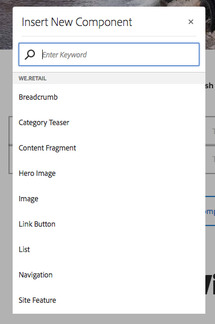

# 編輯頁面內容{#editing-page-content}

建立頁面（新建或作為啟動或即時拷貝的一部分）後，您可以編輯內容以進行所需的更新。

內容是使用 [元件](/help/sites-authoring/default-components-console.md) （適用於內容類型），可以拖到頁面上。 然後可以就地編輯、移動或刪除這些內容。

>[!NOTE]
>
>您的帳戶需要 [適當的訪問權限](/help/sites-administering/security.md) 和 [權限](/help/sites-administering/security.md#permissions) 的子菜單。
>
>如果您遇到任何問題，我們建議您與系統管理員聯繫。

>[!NOTE]
>
>如果您的頁面和/或模板已正確設定，則可以使用 [響應佈局](/help/sites-authoring/responsive-layout.md) 的子菜單。

>[!NOTE]
>
>在 **編輯** 模式，內容中的連結可見，但 **無法訪問**。 使用 [預覽模式](#previewingpagestouchoptimizedui) 的子菜單。

## 頁面工具欄 {#page-toolbar}

頁面工具欄提供對相應功能的訪問，這取決於頁面配置。

工具欄提供對多種選項的訪問。 根據您當前的上下文和配置，某些選項可能不可用。

* **切換側面板**

   此操作將開啟/關閉側面板，該面板將 [資產瀏覽器](/help/sites-authoring/author-environment-tools.md#assets-browser)。 [元件瀏覽器](/help/sites-authoring/author-environment-tools.md#components-browser), [內容樹](/help/sites-authoring/author-environment-tools.md#content-tree)。

   

* **頁面資訊**

   提供對 [頁面資訊](/help/sites-authoring/author-environment-tools.md#page-information) 菜單，包括頁面詳細資訊和可在頁面上執行的操作，包括查看和編輯頁面資訊、查看頁面屬性以及發佈/取消發佈頁面。

   

* **模擬器**

   切換 [模擬工具欄](/help/sites-authoring/responsive-layout.md#selecting-a-device-to-emulate)，用於模擬另一設備上頁面的外觀。 這將在佈局模式下自動切換。

   

* **ContextHub**

   開啟 [上下文中心](/help/sites-authoring/ch-previewing.md)。 僅在「預覽」模式下可用。

   

* **頁面標題**

   這純粹是資訊性的。

   

* **模式選擇器**

   顯示當前 [模式](/help/sites-authoring/author-environment-tools.md#page-modes) 並允許您選擇其他模式，如編輯、佈局、時間曲線或目標。

   

* **預覽**

   啟用 [預覽模式](/help/sites-authoring/editing-content.md#preview-mode)。 這將按發佈時的顯示方式顯示頁面。

   

* **注釋**

   允許您添加 [注釋](/help/sites-authoring/annotations.md) 查看頁面時顯示。 在第一個注釋之後，表徵圖將切換到指示頁面上注釋數的數字。

   

### 狀態通知 {#status-notification}

如果頁面是 [工作流](/help/sites-authoring/workflows.md) 或多個工作流，編輯頁面時，此資訊顯示在螢幕頂部的通知欄中。

>[!NOTE]
>
>狀態欄僅對具有適當權限的用戶帳戶可見。

通知列出針對頁面運行的工作流。 如果用戶參與當前工作流步驟，則選項 [影響工作流狀態](/help/sites-authoring/workflows-participating.md) 並獲取有關工作流的詳細資訊，如：

* **完成**  — 開啟 **完成工作項** 對話

* **委託**  — 開啟 **完成工作項** 對話

* **查看詳細資訊**  — 開啟 **詳細資訊** 窗口

通過通知欄完成和委託工作流步驟與在 [參與工作流](/help/sites-authoring/workflows-participating.md) 從「通知」收件箱。

如果頁面受多個工作流的制約，則通知的右端將顯示工作流數以及箭頭按鈕，以允許您滾動查看工作流。

## 元件佔位符 {#component-placeholder}

元件佔位符是一個指示器，用於顯示在您放置元件時元件的位置 — 位於當前懸停在元件上方。

* 向頁面添加新元件時（從元件瀏覽器拖動）:

   

* 移動現有元件時：

   

## 插入元件 {#inserting-a-component}

### 從元件瀏覽器插入元件 {#inserting-a-component-from-the-components-browser}

可以使用 [元件瀏覽器](/help/sites-authoring/author-environment-tools.md#components-browser)。 的 [元件佔位符](#component-placeholder) 顯示元件的位置：

1. 確保您的頁面位於 [**編輯** 模式](/help/sites-authoring/author-environment-tools.md#page-modes)。
1. 開啟 [元件瀏覽器](/help/sites-authoring/author-environment-tools.md#components-browser)。
1. 將所需元件拖到 [必需職位](#component-placeholder)。

1. [編輯](#editmovecopypastedelete) 元件。

>[!NOTE]
>
>在移動設備上，元件瀏覽器將填充整個螢幕。 一旦開始拖動元件，瀏覽器將關閉以再次顯示頁面，以便您可以放置元件。

### 從段落系統插入元件 {#inserting-a-component-from-the-paragraph-system}

可以使用 **將元件拖動到此處** 框：

1. 確保您的頁面位於 [**編輯** 模式](/help/sites-authoring/author-environment-tools.md#page-modes)。
1. 從段落系統中選擇和添加新元件有兩種方法：

   * 選擇 **插入元件** 選項(+) **將元件拖動到此處** 框。

   

   * 如果您在台式機設備上，可以按兩下 **將元件拖動到此處** 框。

   的 **插入新元件** 對話框將開啟，以允許您選擇所需的元件：

   

1. 所選元件將添加到頁面底部。 [編輯](#editmovecopypastedelete) 元件。

### 使用資產瀏覽器插入元件 {#inserting-a-component-using-the-assets-browser}

也可以通過從 [資產瀏覽器](/help/sites-authoring/author-environment-tools.md#assets-browser)。 這將自動建立相應類型（並包含資產）的新元件。

這對以下資產類型有效（某些類型將依賴於頁/段系統）:

<table>
 <tbody>
  <tr>
   <th><strong>資產類型</strong></th>
   <th><strong>合成元件類型</strong></th>
  </tr>
  <tr>
   <td>影像</td>
   <td>影像</td>
  </tr>
  <tr>
   <td>文件</td>
   <td>下載</td>
  </tr>
  <tr>
   <td>產品</td>
   <td>產品</td>
  </tr>
  <tr>
   <td>影片</td>
   <td>閃光燈</td>
  </tr>
  <tr>
   <td>內容片段</td>
   <td>內容片段  </td>
  </tr>
 </tbody>
</table>

>[!NOTE]
>
>可以為安裝配置此行為。 請參閱 [配置段落系統，以便拖動資產建立元件實例](/help/sites-developing/developing-components.md#configuring-a-paragraph-system-so-that-dragging-an-asset-creates-a-component-instance) 的上界。

要通過拖動上述資產類型之一來建立元件：

1. 確保您的頁面位於 [**編輯** 模式](/help/sites-authoring/author-environment-tools.md#page-modes)。
1. 開啟 [資產瀏覽器](/help/sites-authoring/author-environment-tools.md#assets-browser)。
1. 將所需資產拖到所需位置。 的 [元件佔位符](#component-placeholder) 顯示元件的位置。

   將在所需位置建立與資產類型相適應的元件 — 該元件將包含所選資產。

1. [編輯](#editmovecopypastedelete) 元件（如果需要）。

>[!NOTE]
>
>在移動設備上，資產瀏覽器將填充整個螢幕。 一旦開始拖動資產，瀏覽器將關閉以再次顯示頁面，以便您可以放置資產。

如果在瀏覽資產時發現需要快速更改資產，則可以啟動 [資產編輯器](/help/assets/manage-assets.md) 按一下資產名稱旁邊的編輯表徵圖，即可直接從瀏覽器中找到。

## 編輯/配置/複製/剪切/刪除/貼上 {#edit-configure-copy-cut-delete-paste}

選擇元件將開啟工具欄。 這提供了對可對元件執行的各種操作的訪問權限。

用戶可用的實際操作將顯示為適當的，但此處不能描述所有操作。

* **編輯**

   [取決於元件類型](/help/sites-authoring/default-components.md) 這將允許您 [編輯元件的內容](#edit-content)。 通常會提供工具欄。

   

* **設定**

   [取決於元件類型](/help/sites-authoring/default-components.md) 這將允許您編輯和配置元件的屬性。 通常會開啟對話框。

   

* **複製**

   這將將元件複製到剪貼簿。 貼上操作後，原始元件將保留。

   

* **剪下**

   這將將元件複製到剪貼簿。 貼上操作後，將刪除原始元件。

   

* **刪除**

   這將從頁面中刪除元件並進行確認。

   

* **插入元件**

   這將開啟對話框 [添加新元件](/help/sites-authoring/editing-content.md#inserting-a-component-from-the-paragraph-system)。

   

* **貼上**

   這將將元件從剪貼簿貼上到頁面。 原始檔案是否保留，取決於您是使用複製還是剪切。

   * 可以貼上到同一頁或另一頁。
   * 貼上的項目將貼上到您選擇貼上操作的項目上方。
   * 僅當剪貼簿上存在內容時，才會顯示「預處理」操作。

   

   >[!NOTE]
   >
   >如果貼上到剪切/複製操作之前已開啟的其他頁面，則必須刷新該頁面才能查看貼上的內容。

* **群組**

   這允許您同時選擇多個元件。 在案頭設備上，可通過 **按住Ctrl鍵並按一下** 或 **按住Command鍵並按一下**。

   

* **父級**

   允許您選擇所選元件的父元件。

   

* **配置**

   這允許您修改 [佈局](/help/sites-authoring/editing-content.md#edit-component-layout) 的子菜單。 這僅適用於選定元件，不激活 [佈局模式](/help/sites-authoring/author-environment-tools.md#page-modes) 的下一頁。

   

* **轉換為體驗片段變體**

   這允許您建立新 [體驗片段](/help/sites-authoring/experience-fragments.md) 或將其添加到現有體驗片段。

   

## 編輯（內容） {#edit-content}

在元件中添加和/或編輯內容有兩種方法：

* 開啟 [元件對話框](#component-edit-dialog)。
* [拖放資產](#draganddropintocomponent) 直接添加內容。

### 元件編輯對話框 {#component-edit-dialog}

您可以使用元件工具列的「編輯 (鉛筆) 」圖示， [開啟元件以編輯內容](#edit-configure-copy-cut-delete-paste)。

確切的編輯選項將取決於元件。 對於某些元件 [所有操作將僅在全屏模式下可用](#edit-content-full-screen-mode)。 例如：

* [文字元件](/help/sites-authoring/rich-text-editor.md#main-pars-title-24)

   

* 影像元件

   

   >[!NOTE]
   >
   >編輯在空影像元件上不起作用。
   >
   >
   >你必須 [拖動或上載影像（使用配置）](/help/sites-authoring/default-components-foundation.md#image) 開始編輯。

* 影像元件 — 全屏

   [進入影像元件的全螢幕模式](/help/sites-authoring/editing-content.md#edit-content-full-screen-mode) ，可讓您有更多空間編輯影像，並顯示額外的編輯選項，例如「啟動地圖」和「重設縮放」 ********。此外，全螢幕還允許選取裁切預設集。

   

* 由多個基本元件(如 [文本和影像基礎元件](/help/sites-authoring/default-components-foundation.md#text-image)，首先要求您確認您想要的編輯選項集：

   

### 將資產拖放到元件中 {#drag-and-drop-assets-into-component}

對於特定元件類型，您可以將資產從資產瀏覽器直接拖放到元件中以更新內容：

| **資產類型** | **元件類型** |
|---|---|
| 影像 | 影像 |
| 文件 | 下載 |
| 產品 | 產品 |
| 影片 | 閃光燈 |
| 內容片段 | 內容片段 |

## 編輯（內容）全屏模式 {#edit-content-full-screen-mode}

對於所有元件，可以使用（並退出）訪問全屏模式：

例如， **文本** 元件：

>[!NOTE]
>
>對於某些元件，全屏模式的可用選項將比基本就地編輯器更多。

## 移動元件 {#moving-a-component}

要移動段落元件，請執行以下操作：

1. 選擇要移動的段落，可按一下並按住或按一下並按住。
1. 將段落拖到新位置。 指AEM明可以存放段落的位置。 將其放在您所需的位置。

   

1. 您的段落已移動。

>[!NOTE]
>
>您還可以使用 [剪切和貼上](/help/sites-authoring/editing-content.md#edit-configure-copy-cut-delete-paste) 的子菜單。

## 編輯元件佈局 {#edit-component-layout}

您可以選取元件的 [Layout](/help/sites-authoring/responsive-layout.md)****  (配置) 動作，以變更元件的配置，並節省時間，而不需離開編輯模式，而不需重複從編輯切換到配置模式來調整元件。

1. 在 **編輯** 在站點控制台的模式下，選擇元件將顯示元件的工具欄。

   

   按一下或點擊 **佈局** 操作以調整元件的佈局。

   

1. 選擇「佈局」(Layout)操作後：

   * 顯示元件的大小調整手柄。
   * 模擬器工具欄顯示在螢幕頂部。
   * 佈局操作而不是元件工具欄上顯示的標準編輯操作。

   

   現在，可以修改元件的佈局，如 [佈局模式](/help/sites-authoring/responsive-layout.md#defining-layouts-layout-mode)。

1. 進行必要的佈局更改後，按一下 **關閉** 按鈕停止修改元件的佈局。 元件的工具欄返回其正常編輯狀態。

   

>[!NOTE]
>
>「佈局」(Layout)操作在選定元件的範圍內受限。 例如，如果編輯一個元件的佈局，然後按一下另一個元件，則新選定元件的標準編輯工具欄（而不是佈局工具欄）將顯示，並且重新調整控制滑塊和模擬器工具欄將消失。
>
>如果需要編輯頁面的總體佈局，影響多個元件，請切換到 [佈局模式](/help/sites-authoring/responsive-layout.md)。

## 繼承的元件 {#inherited-components}

繼承的元件可以是各種方案的產物，包括：

* [多站點管理](/help/sites-administering/msm.md)
* [啟動](/help/sites-authoring/launches.md) （基於即時拷貝）。
* 特定元件，如Geometrixx中的繼承段落系統。

可以取消（然後重新啟用）繼承。 根據元件的不同，可從以下站點獲得：

* **Live Copy**

   元件工具欄（如果元件位於作為即時拷貝或啟動一部分的頁面上）（基於即時拷貝）。 例如：

   

   「取消繼承」(Cancel Inheritance)選項可用：

   

   如果已取消，則重新啟用繼承：

   

   「部署」(Splout)操作也可在藍圖或即時拷貝源中使用：

   

* **繼承的段落制度**

   配置對話框。 例如，與繼承的段落系統一樣：

   

## 編輯頁面模板 {#editing-the-page-template}

如果頁面基於 [可編輯模板](/help/sites-authoring/templates.md#editable-and-static-templates)，您可以輕鬆切換到 [模板編輯器](/help/sites-authoring/templates.md#editing-templates-template-authors) 通過 **編輯模板** 的 [頁面資訊菜單](/help/sites-authoring/author-environment-tools.md#page-information)。

如果頁面基於 [靜態模板](/help/sites-authoring/templates.md#editable-and-static-templates)，您可以 [設計模式](/help/sites-authoring/default-components-designmode.md) 使用 [頁面模式選擇器](/help/sites-authoring/author-environment-tools.md#page-modes) 的子菜單。

在「欄檢視」或「清單檢視」中選取頁面時，您可輕鬆查看該頁 [面所依據](/help/sites-authoring/basic-handling.md#column-view)[的範本](/help/sites-authoring/basic-handling.md#list-view)。

## 即時副本狀態 {#live-copy-status}

的 [「即時複製狀態」頁模式](/help/sites-authoring/author-environment-tools.md#page-modes) 允許您快速概述即時拷貝狀態以及哪些元件是/不是繼承的：

* 綠色邊框：繼承
* 粉紅色邊框：已取消繼承

例如：

## 添加註釋 {#adding-annotations}

[注釋](/help/sites-authoring/annotations.md) 允許審閱者和其他作者提供有關您內容的反饋。 它們通常用於審查和驗證目的。

## 預覽頁面 {#previewing-pages}

預覽頁面有兩個選項：

* [預覽模式](#preview-mode)  — 快速就地預覽

* [查看為已發佈](#view-as-published)  — 在新頁籤中開啟頁面的完整預覽

>[!NOTE]
>
>* 內容中的連結是可見的，但在「編輯」模式下無法訪問。
>* 如果要使用連結導航，請使用其中一個預覽選項。
>* 使用 [鍵盤快捷鍵](/help/sites-authoring/keyboard-shortcuts.md) `Ctrl-Shift-M` 以在預覽和上次選定模式之間切換。
>

>[!NOTE]
>
>WCM模式Cookie已設定為兩個選項。

### 預覽模式 {#preview-mode}

編輯內容時，可以使用預覽來預覽頁面 [模式](/help/sites-authoring/author-environment-tools.md#page-modes)。 此模式：

* 隱藏各種編輯機制，以快速查看頁面在發佈時的顯示方式。
* 允許您使用連結進行導航。
* 是 **不** 刷新頁面內容。

創作時，預覽模式可使用頁面編輯器右上角的表徵圖：

### 以已發佈狀態檢視 {#view-as-published}

的 **查看為已發佈** 的 [頁面資訊](/help/sites-authoring/author-environment-tools.md#page-information) 的子菜單。 這將在新頁籤中開啟頁面，刷新內容，並完全按照頁面在發佈環境中的顯示方式顯示頁面。

## 鎖定頁面 {#locking-a-page}

允AEM許您鎖定頁面，以便其他人不能修改內容。 當您對一個特定頁面進行大量編輯或需要將頁面凍結一段時間時，此功能非常有用。

可以從以下任一位置鎖定頁面：

* **站點** 控制台

   1. 選擇頁 [選擇模式](/help/sites-authoring/basic-handling.md#viewing-and-selecting-resources)。
   1. 選擇鎖定表徵圖。

   

* **頁面編輯器**

   1. 選擇 **頁面資訊** 按鈕。
   1. 選擇 **鎖定頁** 的雙曲餘切值。

一旦鎖定，控制台視圖資訊就會更新，編輯鎖定符號時，工具欄中會顯示該資訊。

>[!CAUTION]
>
>鎖定頁面時 [模擬用戶](/help/sites-administering/security.md#impersonating-another-user)。 但是，只有模擬用戶或管理員用戶才能解鎖以這種方式鎖定的頁面。
>
>無法通過模擬鎖定頁面的用戶來解鎖頁面。

## 解鎖頁面 {#unlocking-a-page}

解鎖頁面與 [鎖定頁面](#locking-a-page)。 鎖定頁面後，鎖定選項將被解鎖操作替換。

「頁面資訊」功能表 **會列出** 「解除鎖定」為選項，而網站主控台中的「鎖定」圖示會以「解除鎖定」圖示 **** 取代。

>[!CAUTION]
>
>鎖定頁面時 [模擬用戶](/help/sites-administering/security.md#impersonating-another-user)。 但是，只有模擬用戶或管理員用戶才能解鎖以這種方式鎖定的頁面。
>
>無法通過模擬鎖定頁面的用戶來解鎖頁面。

## 撤消和重做頁面編輯 {#undoing-and-redoing-page-edits}

以下表徵圖允許您撤消或重做操作。 這些內容在適當時顯示在工具欄中：

>[!NOTE]
>
>的 [鍵盤快捷鍵](/help/sites-authoring/page-authoring-keyboard-shortcuts.md) `Ctrl-Z` 也可用於撤消頁面編輯操作。
>
>鍵盤快捷鍵 `Ctrl-Y` 也可用於重做頁面編輯操作。

>[!NOTE]
>
>請參閱 [撤消和重做頁面編輯 — 理論](#undoing-and-redoing-page-edits-the-theory) 的子菜單。

## 撤消和重做頁面編輯 — 理論 {#undoing-and-redoing-page-edits-the-theory}

>[!NOTE]
>
>您的系統管理員可以 [配置「撤消/重做」特徵的各個方面](/help/sites-administering/config-undo.md) 根據你們的情況要求。

AEM儲存所執行操作的歷史記錄以及執行操作的順序，以便您可以按執行操作的順序撤消多個操作，並重做這些操作以在必要時重新應用一個或多個操作。

如果選擇了內容頁面上的元素（如文本元件），則撤消和重做命令將應用於所選項目。

撤消和重做命令的行為與其他軟體程式中的行為類似。 在您對內容做出決策時，使用命令恢復網頁的最近狀態。 例如，如果將文本段落移動到頁面上的其他位置，則可以使用撤消命令將段落移回。 如果隨後確定上一個位置更好，請使用redo命令「撤消」。

>[!NOTE]
>
>您可以：
>
>* 只要自使用撤消後未進行頁面編輯，就重做操作。
>* 撤消最多20個編輯操作（預設設定）。
>* 還使用 [鍵盤快捷鍵](/help/sites-authoring/page-authoring-keyboard-shortcuts.md) 撤消和重做。
>

可以對以下類型的頁面更改使用撤消和重做：

* 添加、編輯、刪除和移動段落
* 原地編輯段落內容
* 在頁面中複製、剪切和貼上項目

表單元件呈現的表單域不意味著在創作頁面時指定值。 因此，撤消和重做命令不會影響對這些類型元件的值所做的更改。 例如，無法撤消在下拉清單中選擇值。

>[!NOTE]
>
>要撤消和重做對檔案和影像的更改，需要特殊權限。

>[!NOTE]
>
>對檔案和影像的更改歷史至少持續10小時。 但是，在此之後，無法保證撤消更改。 管理員可以更改預設時間（10小時）。
