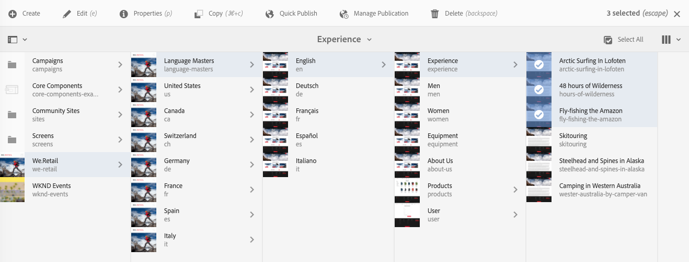

# 編輯頁面屬性{#editing-page-properties}

您可以定義頁面的必要屬性。 這些項目可能會因頁面性質而異。 例如，某些頁面可能連線至即時副本，而其他頁面則未連線，且即時副本資訊將可視情況提供。

## 頁面內容 {#page-properties}

屬性分佈在多個索引標籤之間。

### 基本 {#basic}

* **標題**

   頁面標題會顯示在各種位置中。 例如， **網站** 標籤清單和 **網站** 卡片/清單檢視。

   這是必要欄位。

* **標記**

   您可以在此更新選取方塊中的清單，以從頁面新增或移除標籤：

   * 選取標籤後，標籤會列在選取方塊下方。 您可以使用x從此清單中移除標籤。
   * 您可以在空白的選取方塊中輸入名稱，以輸入全新的標籤。

      * 當您點擊Enter時，將會建立新標籤。
      * 接著，新標籤會在右側以小星號顯示，指出為新標籤。
   * 透過下拉式功能，您可以從現有標籤中選取。
   * 將滑鼠移至選取方塊中的標籤項目上時，會顯示x，可用來移除此頁面的標籤。

   如需標籤的詳細資訊，請參閱 [使用標籤](/help/sites-authoring/tags.md).

* **於導覽中隱藏**

   指出頁面在所產生網站的頁面導覽中是否顯示或隱藏。

* **品牌化**

   在每個頁面標題附加品牌概要資訊，借此在頁面間套用一致的品牌識別。 此功能需要使用2.14.0版或更新版本的頁面元件 [核心元件。](https://experienceleague.adobe.com/docs/experience-manager-core-components/using/introduction.html)

   * **覆寫**  — 核取以定義此頁面上的品牌概要資訊。
      * 值將由任何子頁面繼承，除非它們也有 **覆寫** 值。
   * **覆寫值**  — 要附加至頁面標題的品牌概要文本。
      * 此值會附加在垂直號字元（如「循環托斯卡納」）之後的頁面標題 |始終為WKND做好準備&quot;
* **頁面標題**

   要在頁面上使用的標題。 通常用於標題元件。 如果空白 **標題** 中指定的規則。

* **導覽標題**

   您可以指定個別標題以用於導覽（例如，如果您想要更精簡的標題）。 如果空白，則 **標題** 中指定的規則。

* **子標題**

   用於頁面的副標題。

* **說明**

   您對頁面的說明、其用途，或您要新增的任何其他詳細資訊。

* **開啟時間**

   啟動已發佈頁面的日期和時間。 發佈後，此頁面將保持休眠狀態，直到指定的時間。

   對於您要立即發佈的頁面，請將這些欄位保留空白（一般情況）。

* **關閉時間**

   已發佈頁面停用的時間。

   再次將這些欄位保留為空白以立即執行動作。

* **虛名 URL**

   可讓您輸入此頁面的虛名URL，以便您擁有較短和/或更具表達力的URL。

   例如，如果虛名URL設為 `welcome`到路徑所識別的頁面 `/v1.0/startpage`網站 `http://example.com,` then `http://example.com/welcome`會是 `http://example.com/content/v1.0/startpage`

   >[!CAUTION]
   >
   >虛名 URL:
   >
   >* 必須是唯一的，因此您應注意，值尚未被其他頁面使用。
   >* 不支援規則運算式模式。
   >* 不應設為現有頁面。

   您也需要設定Dispatcher，以啟用虛名URL的存取權。 請參閱 [啟用虛名URL的存取](https://docs.adobe.com/content/help/en/experience-manager-dispatcher/using/configuring/dispatcher-configuration.html#enabling-access-to-vanity-urls-vanity-urls) 以取得更多詳細資訊。

* **重新導向虛名 URL**

   指出您是否希望頁面使用虛名URL。

### 進階 {#advanced}

* **語言**

   頁面語言。

* **語言根目錄**

   如果頁面是語言副本的根，則必須勾選此選項。

* **重新導向**

   指定此頁面應自動重新導向的頁面。

* **Design**

   指出 [設計](/help/sites-developing/designer.md) 以用於此頁面。

* **別名**

   指定要與此頁面一起使用的別名。

   * 例如，如果您定義 `private` 頁面 `/content/wknd/us/en/magazine/members-only`，則此頁面也可透過 `/content/wknd/us/en/magazine/private`
   * 建立別名會設定 `sling:alias` 屬性，這只會影響資源，不影響存放庫路徑。
   * 無法發佈編輯器中由別名存取的頁面。 [發佈選項](/help/sites-authoring/publishing-pages.md) 編輯器中的「 」僅適用於透過其實際路徑存取的頁面。
   * 如需詳細資訊，請參閱 [SEO和URL管理最佳作法下的本地化頁面名稱](/help/managing/seo-and-url-management.md#localized-page-names).

* **繼承自&lt;*路徑*>**

   指出是否繼承頁面。 和從哪裡來。

* **雲端設定**

   配置的路徑。

* **允許的範本**

   [定義可用的範本清單](/help/sites-authoring/templates.md#allowingatemplate) 分支內。

* **啟用** （驗證要求）

   啟用（或停用）驗證的使用以存取頁面。

   >[!NOTE]
   >
   >頁面的封閉使用者群組定義於 **[權限](/help/sites-authoring/editing-page-properties.md#permissions)** 標籤。

   >[!CAUTION]
   >
   >此 **[權限](/help/sites-authoring/editing-page-properties.md#main-pars-procedure-949394300)** 頁簽允許根據 `granite:AuthenticationRequired` 米辛。 如果頁面權限是使用過時的CUG設定來設定，根據是 `cq:cugEnabled` 屬性中顯示警告訊息，位於 **驗證需求** 和選項將無法編輯， [權限](/help/sites-authoring/editing-page-properties.md#permissions) 可編輯。
   >
   >
   >在這種情況下，您必須在 [傳統UI](/help/sites-classic-ui-authoring/classic-page-author-edit-page-properties.md).

* **登入頁面**

   用於登入的頁面。

* **匯出設定**

   指定匯出設定。

### 縮圖 {#thumbnail}

顯示頁面縮圖影像。 您可以：

* **產生預覽**

   產生頁面的預覽以作為縮圖。

* **上傳影像**

   上傳影像以作為縮圖。

* **選取影像**

   選取現有資產作為縮圖。

* **回復**

   對縮圖進行變更後，此選項即可使用。 如果您不想保留變更，可以在儲存前還原該變更。

### 社交媒體 {#social-media}

* **社交媒體分享**

   定義頁面上可用的共用選項。 顯示 [共用核心元件](https://helpx.adobe.com/experience-manager/core-components/using/sharing.html).

   * **啟用Facebook的使用者共用**
   * **啟用Pinterest的使用者共用**
   * **首選XF變化**
定義用於產生頁面中繼資料的體驗片段變數

### 雲端服務 {#cloud-services}

* **雲端服務**

   定義 [雲端服務](/help/sites-developing/extending-cloud-config.md).

### 個人化 {#personalization}

* **ContextHub 組態**

   選取 [ContextHub設定](/help/sites-developing/ch-configuring.md) 和 [區段路徑](/help/sites-administering/segmentation.md).

* **定位組態**

   選取 [要指定目標範圍的品牌](/help/sites-authoring/target-adobe-campaign.md).

   >[!NOTE]
   >此選項要求使用者帳戶位於 `Target Adminstrators`群組。

### 權限 {#permissions}

* **權限**

   在此索引標籤中，您可以：

   * [新增權限](/help/sites-administering/user-group-ac-admin.md)
   * [編輯已關閉的使用者群組](/help/sites-administering/cug.md#applying-your-closed-user-group-to-content-pages)

   * 檢視 [有效權限](/help/sites-administering/user-group-ac-admin.md)
   >[!CAUTION]
   >
   >此 **權限** 頁簽允許根據 `granite:AuthenticationRequired` 米辛。 如果頁面權限是使用過時的CUG設定來設定，根據是 `cq:cugEnabled` 屬性中顯示警告訊息，且CUG權限不可編輯，且上的「驗證需求」亦不可編輯 [進階](/help/sites-authoring/editing-page-properties.md#advanced) 標籤可編輯。
   >
   >
   >在這種情況下，您必須在 [傳統UI](/help/sites-classic-ui-authoring/classic-page-author-edit-page-properties.md).

   >[!NOTE]
   >
   >「權限」索引標籤不允許建立空的CUG群組，這作為拒絕每位使用者存取的簡單方式非常有用。 必須使用CRX Explorer才能執行此操作。 請參閱檔案 [使用者、群組和存取權限管理](/help/sites-administering/user-group-ac-admin.md) 以取得更多資訊。

### Blueprint {#blueprint}

* **Blueprint**

   在中定義Blueprint頁面的屬性 [多網站管理](/help/sites-administering/msm.md). 控制修改將傳播至即時副本的情況。

### 即時副本 {#live-copy}

* **即時副本**

   在中定義即時副本頁面的屬性 [多網站管理](/help/sites-administering/msm.md). 控制從Blueprint傳播修改的情況。

### 網站結構 {#site-structure}

* 提供提供網站範圍功能的頁面連結，例如 **註冊頁面**, **離線頁面**，其中包括。

## 編輯頁面屬性 {#editing-page-properties-1}

您可以定義頁面屬性：

* 從 **網站** 主控台：

   * [建立新頁面](/help/sites-authoring/managing-pages.md#creating-a-new-page) （屬性的子集）

   * 按一下或點選 **屬性**

      * 針對單一頁面
      * 對於多個頁面（只有屬性的子集可供集體編輯）

* 從頁面編輯器：

   * 使用 **頁面資訊** (接著 **開啟屬性**)

### 從Sites Console — 單頁 {#from-the-sites-console-single-page}

按一下或點選 **屬性** 要定義頁面屬性，請執行以下操作：

1. 使用 **網站** 控制台，導覽至您要檢視及編輯屬性之頁面的位置。

1. 選取 **屬性** 選項，使用下列任一項：

   * [快速動作](/help/sites-authoring/basic-handling.md#quick-actions)
   * [選擇模式](/help/sites-authoring/basic-handling.md#selectionmode)

   頁面屬性將會使用適當的標籤來顯示。

1. 視需要檢視或編輯屬性。

1. 然後使用 **儲存** 保存更新，隨後 **關閉** 返回控制台。

### 編輯頁面時 {#when-editing-a-page}

編輯頁面時，您可以使用 **頁面資訊** 要定義頁面屬性，請執行以下操作：

1. 開啟要編輯其屬性的頁面。

1. 選取 **頁面資訊** 表徵圖以開啟選擇菜單：

   

1. 選擇 **開啟屬性** 並會開啟一個對話方塊，讓您按適當索引標籤排序來編輯屬性。 工具列右側也提供下列按鈕：

   * **取消**
   * **儲存並關閉**

1. 使用 **儲存並關閉** 按鈕以儲存變更。

### 從Sites Console — 多個頁面 {#from-the-sites-console-multiple-pages}

從Sites **** Console中，您可以選取數個頁面，然後使用 **View Properties**  (檢視屬性) 來檢視和/或編輯頁面屬性。這稱為頁面屬性的大量編輯。

>[!NOTE]
>
>資產也提供大量屬性編輯功能。 這非常相似，但有幾點不同。 請參閱 [編輯多個資產的屬性](/help/assets/metadata.md) 以取得詳細資訊。
>
>還有 [大量編輯器](/help/sites-administering/bulk-editor.md)，可讓您使用GQL(Google查詢語言)從多個頁面搜尋內容，然後在將變更儲存至原始頁面之前，直接在大量編輯器中編輯內容。

您可以選取多個頁面，以透過各種方法進行大量編輯，包括：

* 瀏覽 **網站** 主控台
* 使用後 **搜尋** 若要找出一組頁面

選取頁面，然後按一下或點選「屬 **性」選項**，就會顯示大量屬性：

您只能批量編輯以下頁面：

* 共用相同的資源類型
* 不屬於LiveCopy

   * 如果任何頁面位於即時副本中，則在開啟屬性時會顯示訊息。

輸入「大量編輯」後，您可以：

* **檢視**

   檢視多個頁面的「頁面屬性」時，您會看到：

   * 受影響頁面的清單

      * 您可以視需要選取/取消選取
   * 索引標籤

      * 如同檢視單一頁面的屬性時，屬性會依索引標籤排序。
   * 屬性的子集

      * 所有選取頁面上皆可使用，且明確定義為可用於大量編輯的屬性，則會顯示。
      * 如果您將頁面選取範圍縮小為一個頁面，則所有屬性都會顯示。
   * 具有公用值的公用屬性

      * 「視圖」模式中只顯示具有公共值的屬性。
      * 當欄位為多值時（例如「標籤」），只有在 *all* 是常見的。 如果只有部分是常見的，則只會在編輯時顯示。

   當不存在具有公用值的屬性時，將顯示一條消息。

* **編輯**

   編輯多個頁面的頁面屬性時：

   * 您可以更新可用欄位中的值。

      * 當您選取 **完成**.
      * 當欄位為多值時（例如「標籤」），您可以附加新值或移除通用值。
   * 在不同頁面上共有但值不同的欄位，將會以特殊值（例如文字）指出 `<Mixed Entries>`.

>[!NOTE]
>
>頁面元件可設定為指定可用於大量編輯的欄位。 請參閱 [設定頁面以大量編輯頁面屬性](/help/sites-developing/bulk-editing.md).
