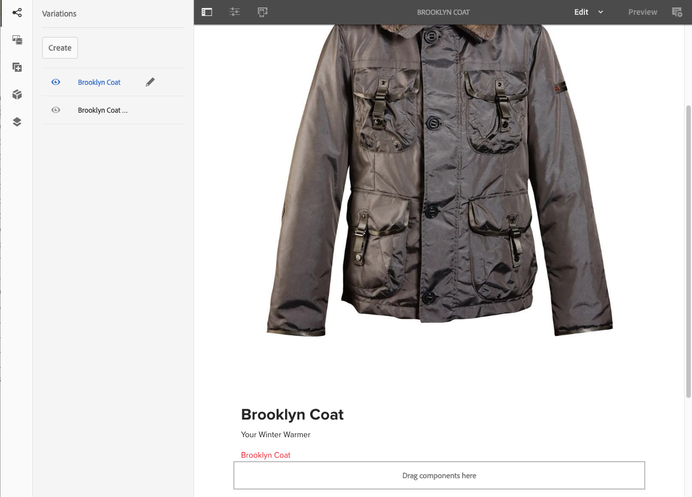

# 體驗片段{#experience-fragments}

體驗片段是一組一或多個元件，包括可在頁面中參考的內容和版面。 它們可以包含任何元件。

體驗片段：

* 是體驗（頁面）的一部分。
* 可以跨多個頁面使用。
* 以範本為基礎（僅可編輯）以定義結構和元件。
* 此範本用於建立 *根頁面* 體驗片段的URL。
* 由段落系統中一或多個元件組成，具有版面。
* 可以包含其他體驗片段。
* 可與其他元件（包括其他體驗片段）結合以形成完整頁面（體驗）。
* 您可以根據根頁面建立一或多個變數。
* 這些變化可能會共用內容和/或元件。
* 可以劃分為可在片段的多個變體中使用的建置區塊。

您可以使用體驗片段：

* 如果作者想要重複使用頁面的部分（體驗的片段），他們需要複製並貼上該片段。 建立及維護這些複製/貼上體驗非常耗時，而且容易發生使用者錯誤。 體驗片段不需要複製/貼上。
* 支援Headless CMS使用案例。 作者只想將AEM用於製作，而不是用於提供給客戶。 協力廠商系統/接觸點會取用該體驗，然後傳送給一般使用者。

>[!NOTE]
>
>體驗片段的寫入許可權需要在群組中註冊使用者帳戶：
>
>    `experience-fragments-editors`
>
如果您遇到任何問題，請聯絡您的系統管理員。

## 何時應使用體驗片段？ {#when-should-you-use-experience-fragments}

該使用「體驗片段」的情況：

* 每當您想要重複使用體驗時。

   * 將與相同或類似內容重複使用的體驗

* 當您使用AEM做為協力廠商的內容傳遞平台時。

   * 任何想要使用AEM作為內容傳遞平台的解決方案
   * 將內容內嵌於第三方接觸點

* 如果您有具有不同變數或轉譯的體驗。

   * 管道或內容特定變數
   * 適合群組的體驗（例如跨頻道具有不同體驗的行銷活動）

* 當您使用全通路商務時。

   * 共用商務相關內容於 [社群媒體](/help/sites-developing/experience-fragments.md#social-variations) 大規模色版
   * 讓接觸點成為異動

## 組織您的體驗片段 {#organizing-your-experience-fragments}

建議您：
* 使用資料夾來組織您的體驗片段，

* [在這些資料夾中設定允許的範本](#configure-allowed-templates-folder).

建立資料夾可讓您：

* 為您的體驗片段建立有意義的結構；例如，根據分類

  >[!NOTE]
  >
  您不需要將體驗片段的結構與網站的頁面結構對齊。

* [在檔案夾層級配置允許的範本](#configure-allowed-templates-folder)

  >[!NOTE]
  >
  您可以使用 [範本編輯器](/help/sites-authoring/templates.md) 以建立您自己的範本。

WKND專案會根據以下規則建構一些體驗片段 `Contributors`. 使用的結構也說明了如何使用其他功能，例如「多網站管理」（包括語言副本）。

請參閱：

`http://localhost:4502/aem/experience-fragments.html/content/experience-fragments/wknd/language-masters/en/contributors/kumar-selveraj/master`

## 為您的體驗片段建立和設定資料夾 {#creating-and-configuring-a-folder-for-your-experience-fragments}

若要為體驗片段建立及設定資料夾，建議您：

1. [建立資料夾](/help/sites-authoring/managing-pages.md#creating-a-new-folder).

1. [為該資料夾設定允許的體驗片段範本](#configure-allowed-templates-folder).

>[!NOTE]
>
您也可以設定 [執行個體允許的範本](#configure-allowed-templates-instance)，但此方法為 **非** 建議使用，因為升級時可覆寫這些值。

### 設定資料夾的允許範本 {#configure-allowed-templates-folder}

>[!NOTE]
>
建議使用此方式指定 **允許的範本**，因為值在升級時不會被覆寫。

1. 導覽至所需的 **體驗片段** 資料夾。

1. 選取資料夾，然後 **屬性**.

1. 指定規則運算式，以擷取 **允許的範本** 欄位。

   例如：
   `/conf/(.*)/settings/wcm/templates/experience-fragment(.*)?`

   請參閱：
   `http://localhost:4502/mnt/overlay/cq/experience-fragments/content/experience-fragments/folderproperties.html/content/experience-fragments/wknd`

   

   >[!NOTE]
   >
   另請參閱 [體驗片段的範本](/help/sites-developing/experience-fragments.md#templates-for-experience-fragments) 以取得更多詳細資料。

1. 選取 **儲存並關閉**.

### 為您的執行個體設定允許的範本 {#configure-allowed-templates-instance}

>[!CAUTION]
>
不建議變更 **允許的範本** 此方法可在升級時覆寫指定的範本。
>
請使用此對話方塊僅供參考。

1. 導覽至所需的 **體驗片段** 主控台。

1. 選取 **設定選項**：

   

1. 在中指定所需的範本 **設定體驗片段** 對話方塊：

   

   >[!NOTE]
   >
   另請參閱 [體驗片段的範本](/help/sites-developing/experience-fragments.md#templates-for-experience-fragments) 以取得更多詳細資料。

1. 選取&#x200B;**儲存**。

## 建立體驗片段 {#creating-an-experience-fragment}

若要建立體驗片段：

1. 從全域導覽中選取體驗片段。

   

1. 導覽至所需的資料夾，然後選取「 」 **建立**.

   

1. 選取 **體驗片段** 以開啟 **建立體驗片段** 精靈。

   依次選擇所需 **的範本**、下 **一步**:

   

1. 輸入 **體驗****片段的屬性**。

   A **標題** 為必填欄位。 如果 **名稱** 保留為空白，其衍生自 **標題**.

   

   >[!NOTE]
   >
   體驗片段範本中的標籤不會與此體驗片段根頁面上的標籤合併。
   >
   它們是完全獨立的。

1. 按一下&#x200B;**建立**。

   畫面會顯示訊息。 選取:

   * **完成** 以返回主控台

   * **開啟** 以開啟片段編輯器

## 編輯您的體驗片段 {#editing-your-experience-fragment}

體驗片段編輯器提供與一般頁面編輯器類似的功能。

>[!NOTE]
>
另請參閱 [編輯頁面內容](/help/sites-authoring/editing-content.md) 以取得有關如何使用頁面編輯器的詳細資訊。

下列範例程式說明如何建立產品的Teaser：

1. 拖放 **Teaser** 從 [元件瀏覽器](/help/sites-authoring/author-environment-tools.md#components-browser).

   

1. 選取 **[設定](/help/sites-authoring/editing-content.md#edit-configure-copy-cut-delete-paste)** 元件工具列中的。
1. 新增資 **產** ，並視需要 **定義屬性** 。
1. 透過以下方式確認定義 **完成** （勾選圖示）。
1. 視需要新增更多元件。

## 建立體驗片段變數 {#creating-an-experience-fragment-variation}

您可以根據自己的需求，建立體驗片段的變數：

1. 開啟您的片段用於 [編輯](/help/sites-authoring/experience-fragments.md#editing-your-experience-fragment).
1. 開啟 **變數** 標籤。

   

1. **建立** 可讓您建立：

   * **變異**
   * **[變數為 live-copy](/help/sites-administering/msm.md#live-copies)**.

1. 定義必要的屬性：

   * **範本**
   * **標題**
   * **名稱**；如果留空，將從「標題」衍生它
   * **說明**
   * **變數標記**

   

1. 確認 **完成** （勾選圖示），新的變數將顯示在面板中：

   

## 使用您的體驗片段 {#using-your-experience-fragment}

您現在可以在編寫頁面時使用您的體驗片段：

1. 開啟任何頁面進行編輯。

   例如： [https://localhost:4502/editor.html/content/we-retail/language-masters/en/products/men.html](https://localhost:4502/editor.html/content/we-retail/language-masters/en/products/men.html)

1. 從元件瀏覽器將元件拖曳至頁面段落系統，建立體驗片段元件的例項：

   

1. 將實際的體驗片段新增到元件例項；可以：

   * 從資產瀏覽器拖曳所需的片段，並放置到元件上
   * 選取 **設定** 從元件工具列並指定要使用的片段，確認使用 **完成** （勾選）

   

   >[!NOTE]
   >
   元件工具列中的「編輯」可作為在片段編輯器中開啟片段的捷徑。

## 建置區塊 {#building-blocks}

您可以選取一或多個元件，以建立要在片段中回收的建置區塊：

### 建立建置區塊 {#creating-a-building-block}

若要建立新的建置區塊：

1. 在體驗片段編輯器中，選取您要重複使用的元件：

   

1. 從元件工具列中，選取 **轉換為建置區塊**：

   

1. 輸入建置塊的名 **稱**，並使用 **Convert確認**:

   

1. 建 **立區塊** (Building Block)將顯示在頁籤中，並可在段落系統中選擇：

   

#### 管理建置區塊 {#managing-a-building-block}

您的建置區塊會顯示在 **建置區塊** 標籤。 對於每個區塊，都可使用下列動作：

* 前往主版：在新標籤中開啟根頁面變數
* 重新命名
* 刪除

#### 使用建置區塊 {#using-a-building-block}

您可以將建置區塊拖曳至任何片段的段落系統，就像對任何元件一樣。

## 您的體驗片段的詳細資料 {#details-of-your-experience-fragment}

您可以檢視片段的詳細資訊：

1. 詳細資訊會顯示在 **體驗片段** 主控台，使用 **清單檢視** 包含詳細資訊 [匯出至Target](/help/sites-administering/experience-fragments-target.md)：

   

1. 當您開啟 **屬性** 體驗片段的：

   

   屬性位於各種標籤中：

   >[!CAUTION]
   >
   這些標籤會在您開啟時顯示 **屬性** 體驗片段主控台中的。
   >
   >
   如果您 **在編輯體驗片段時開啟屬性** ，則會顯示適當 [的頁面屬性](/help/sites-authoring/editing-page-properties.md) 。

   

   * **基本**

      * **標題**  — 必要

      * **說明**
      * **標記**
      * **變數總數**  — 僅供參考

      * **網路變數的數量**  — 僅供參考
      * **非網路變數的數量** - inf **僅格式**

      * **使用此片段的頁數**  — 僅供參考

   * **雲端服務**

      * **雲端設定**
      * **雲端服務設定**
      * **Facebook 頁面 ID**
      * **Pinterest Board**

   * **參考**

      * 參考清單。

   * **社交媒體狀態**

      * 社群媒體變數的詳細資訊。

## 純HTML轉譯 {#the-plain-html-rendition}

使用 `.plain.` 選取「 」後，您便可從瀏覽器存取純HTML轉譯。

>[!NOTE]
>
雖然這可以直接從瀏覽器取得， [主要用途是允許其他應用程式（例如協力廠商網頁應用程式、自訂行動實施）僅使用URL直接存取體驗片段的內容](/help/sites-developing/experience-fragments.md#the-plain-html-rendition).

## 匯出體驗片段 {#exporting-experience-fragments}

依預設，體驗片段會以HTML格式傳送。 AEM和協力廠商管道均可使用此函式。

若要匯出至Adobe Target，也可以使用JSON。 另請參閱 [Target與體驗片段的整合](/help/sites-administering/experience-fragments-target.md) 以取得完整資訊。
