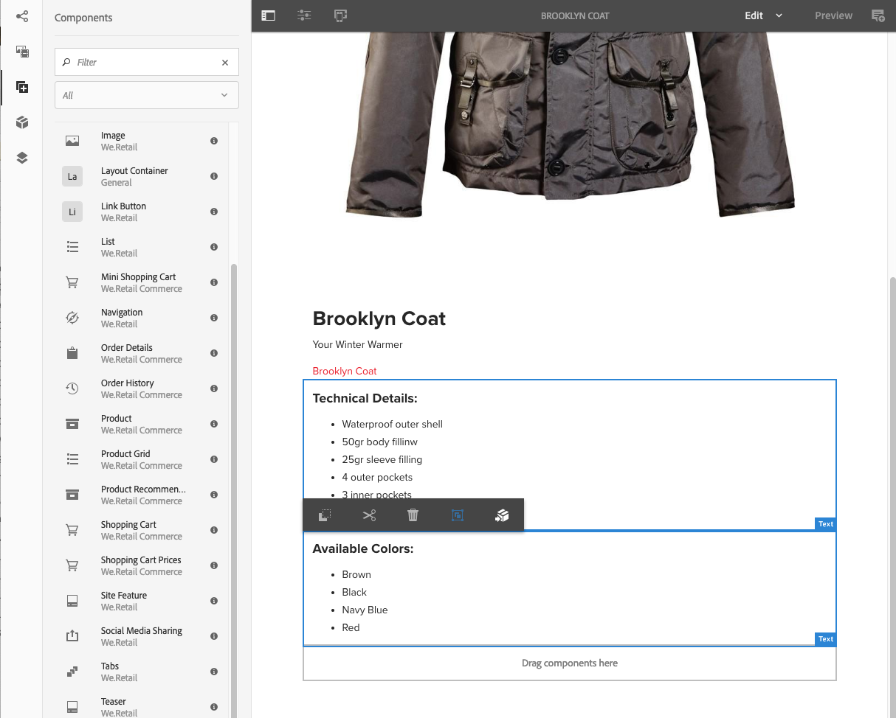
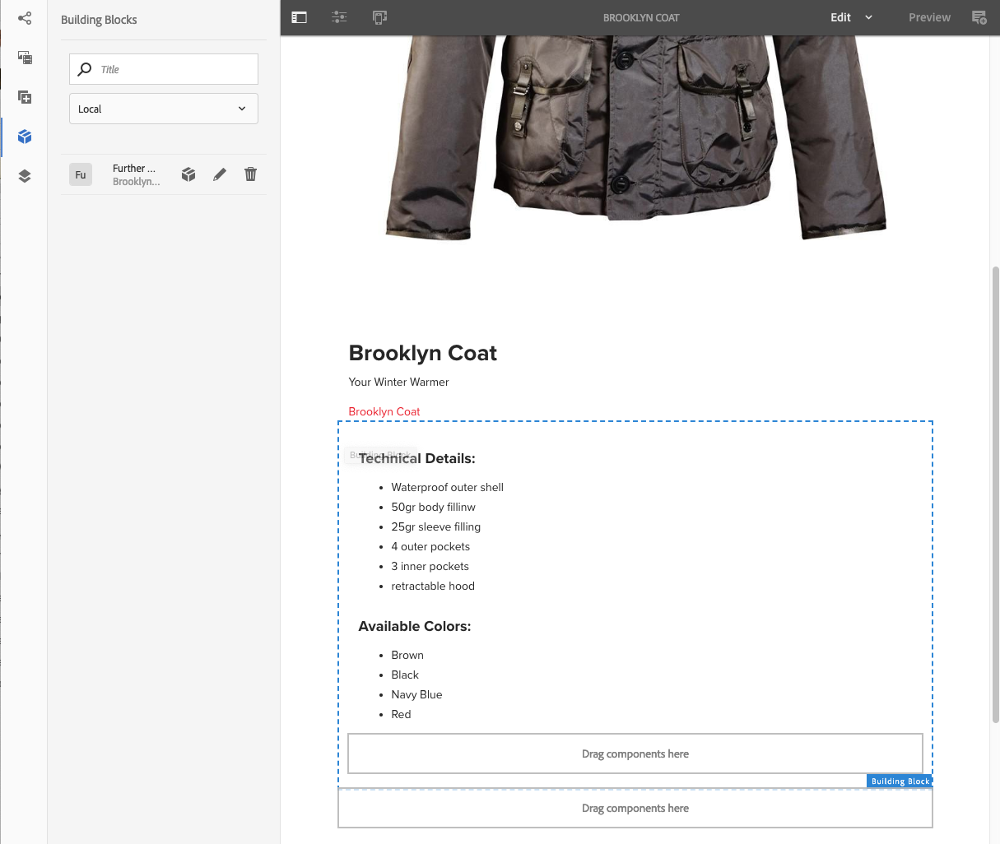
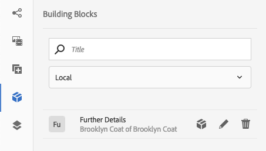

# 體驗片段{#experience-fragments}

體驗片段是由一個或多個元件組成的組，這些元件包括可在頁面中引用的內容和佈局。 它們可以包含任何元件。

體驗片段：

* 是體驗（頁）的一部分。
* 可跨多頁使用。
* 基於模板（僅可編輯）來定義結構和元件。
* 此模板用於建立 *根頁* 體驗片段。
* 由段落系統中具有佈局的一個或多個元件組成。
* 可以包含其他體驗片段。
* 可以與其他元件（包括其他體驗片段）組合以形成完整的頁面（體驗）。
* 可基於根頁建立一個或多個變體。
* 這些變體可以共用內容和/或元件。
* 可以分解為可跨片段的多個變體使用的構造塊。

可以使用體驗片段：

* 如果作者希望重新使用頁面的部分（體驗的片段），他們需要複製並貼上該片段。 建立和維護這些複製/貼上體驗非常耗時且容易出現用戶錯誤。 體驗片段消除了複製/貼上的需要。
* 支援無頭CMS使用案例。 作者只想AEM用於創作，而不想交付給客戶。 第三方系統/觸點將消耗該體驗，然後交付給最終用戶。

>[!NOTE]
>
>對體驗片段的寫入訪問要求在組中註冊用戶帳戶：
>
>    `experience-fragments-editors`
如果遇到任何問題，請與系統管理員聯繫。

## 您何時應使用體驗片段？ {#when-should-you-use-experience-fragments}

應使用經驗片段：

* 無論何時您想要重用體驗。

   * 將與相同或相似內容重用的體驗

* 當您用作AEM第三方的內容交付平台時。

   * 任何希望用作內容AEM交付平台的解決方案
   * 在第三方觸點中嵌入內容

* 如果您有「體驗」，但有不同的變體或格式副本。

   * 渠道或上下文特定變體
   * 對分組有意義的經驗（例如，跨渠道具有不同經驗的活動）

* 使用Omnichannel Commerce時。

   * 共用與商務相關的內容 [社交媒體](/help/sites-developing/experience-fragments.md#social-variations) 規模
   * 使觸點成為事務

## 組織您的體驗片段 {#organizing-your-experience-fragments}

建議：
* 使用資料夾來組織您的體驗片段，

* [在這些資料夾上配置允許的模板](#configure-allowed-templates-folder)。

建立資料夾允許您：

* 為「體驗片段」建立有意義的結構；例如，根據分類

   >[!NOTE]
   無需將「體驗片段」的結構與站點的頁面結構對齊。

* [在資料夾級別分配允許的模板](#configure-allowed-templates-folder)

   >[!NOTE]
   您可以使用 [模板編輯器](/help/sites-authoring/templates.md) 建立自己的模板。

WKND工程根據經驗分段 `Contributors`。 使用的結構還說明了如何使用其他功能，如多站點管理（包括語言副本）。

請參閱：

`http://localhost:4502/aem/experience-fragments.html/content/experience-fragments/wknd/language-masters/en/contributors/kumar-selveraj/master`

## 為您的體驗片段建立和配置資料夾 {#creating-and-configuring-a-folder-for-your-experience-fragments}

要為「體驗片段」建立和配置資料夾，建議：

1. [建立資料夾](/help/sites-authoring/managing-pages.md#creating-a-new-folder)。

1. [配置該資料夾允許的體驗片段模板](#configure-allowed-templates-folder)。

>[!NOTE]
還可以配置 [實例允許的模板](#configure-allowed-templates-instance)，但這種方法 **不** 建議，因為這些值可以在升級時被覆蓋。

### 配置資料夾的允許模板 {#configure-allowed-templates-folder}

>[!NOTE]
這是用於指定 **允許的模板**，因為升級時不會覆蓋這些值。

1. 導航到所需 **體驗片段** 的子菜單。

1. 選擇資料夾，然後 **屬性**。

1. 指定用於檢索中所需模板的規則運算式 **允許的模板** 的子菜單。

   例如：
   `/conf/(.*)/settings/wcm/templates/experience-fragment(.*)?`

   請參閱：
   `http://localhost:4502/mnt/overlay/cq/experience-fragments/content/experience-fragments/folderproperties.html/content/experience-fragments/wknd`

   

   >[!NOTE]
   請參閱 [體驗片段模板](/help/sites-developing/experience-fragments.md#templates-for-experience-fragments) 的上界。

1. 選擇 **保存並關閉**。

### 配置實例的允許模板 {#configure-allowed-templates-instance}

>[!CAUTION]
不建議更改 **允許的模板** 通過此方法，因為在升級時可以覆蓋指定的模板。
請使用此對話框僅供參考。

1. 導航到所需 **體驗片段** 控制台。

1. 選擇 **配置選項**:

   

1. 在 **配置體驗片段** 對話框：

   

   >[!NOTE]
   請參閱 [體驗片段模板](/help/sites-developing/experience-fragments.md#templates-for-experience-fragments) 的上界。

1. 選擇 **保存**。

## 建立體驗片段 {#creating-an-experience-fragment}

建立體驗片段：

1. 從全局導航中選擇體驗片段。

   

1. 導航到所需資料夾並選擇 **建立**。

   

1. 選擇 **體驗片段** 開啟 **建立體驗片段** 的子菜單。

   依次選擇所需 **的範本**、下 **一步**:

   

1. 輸入 **體驗****片段的屬性**。

   A **標題** 的子菜單。 如果 **名稱** 留空，它將從 **標題**。

   

   >[!NOTE]
   「體驗片段」模板中的標籤將不會與此「體驗片段」根頁上的標籤合併。
   這些是完全分開的。

1. 按一下&#x200B;**建立**。

   將顯示一條消息。 選取:

   * **完成** 返回到控制台

   * **開啟** 開啟片段編輯器

## 編輯您的體驗片段 {#editing-your-experience-fragment}

「體驗片段編輯器」提供與普通頁面編輯器類似的功能。

>[!NOTE]
請參閱 [編輯頁面內容](/help/sites-authoring/editing-content.md) 的子菜單。

以下示例過程說明了如何為產品建立預告：

1. 拖放 **預告** 從 [元件瀏覽器](/help/sites-authoring/author-environment-tools.md#components-browser)。

   

1. 選擇 **[配置](/help/sites-authoring/editing-content.md#edit-configure-copy-cut-delete-paste)** 的子菜單。
1. 新增資 **產** ，並視需要 **定義屬性** 。
1. 確認定義 **完成** 表徵圖)。
1. 根據需要添加更多元件。

## 建立體驗片段變體 {#creating-an-experience-fragment-variation}

您可以根據您的需要建立體驗片段的變體：

1. 開啟您的碎片 [編輯](/help/sites-authoring/experience-fragments.md#editing-your-experience-fragment)。
1. 開啟 **變體** 頁籤。

   

1. **建立** 允許您建立：

   * **變異**
   * **變數為 live-copy**.

1. 定義所需的屬性：

   * **範本**
   * **標題**
   * **名稱**;如果留空，則從「標題」派生
   * **說明**
   * **變數標記**

   

1. 確認 **完成** （滴答表徵圖），新變體將顯示在面板中：

   

## 使用您的體驗片段 {#using-your-experience-fragment}

您現在可以在創作頁面時使用您的體驗片段：

1. 開啟任何頁面進行編輯。

   例如： [https://localhost:4502/editor.html/content/we-retail/language-masters/en/products/men.html](https://localhost:4502/editor.html/content/we-retail/language-masters/en/products/men.html)

1. 通過將元件從「元件」瀏覽器拖到頁面段系統，建立「體驗片段」元件的實例：

   

1. 將實際體驗片段添加到元件實例；其中之一：

   * 將所需片段從資產瀏覽器中拖放到元件上
   * 選擇 **配置** 從元件工具欄中指定要使用的片段，確認 **完成** （滴答）

   

   >[!NOTE]
   在元件工具欄中，編輯作為在片段編輯器中開啟片段的快捷方式。

## 建置區塊 {#building-blocks}

您可以選擇一個或多個元件以建立用於回收片段中的構建塊：

### 建立構件塊 {#creating-a-building-block}

要建立新構建基塊：

1. 在「體驗片段」編輯器中，選擇要重新使用的元件：

   

1. 從元件工具欄中，選擇 **轉換為構建基塊**:

   

1. 輸入建置塊的名 **稱**，並使用 **Convert確認**:

   

1. 建 **立區塊** (Building Block)將顯示在頁籤中，並可在段落系統中選擇：

   

#### 管理構建塊 {#managing-a-building-block}

您的構建基塊在 **構造塊** 頁籤。 對於每個塊，可執行以下操作：

* 轉到首頁：在新頁籤中開啟根頁變體
* 重新命名
* 刪除

#### 使用構建基塊 {#using-a-building-block}

您可以將構建塊拖到任何片段的段落系統，就像與任何元件一樣。

## 您的體驗片段的詳細資訊 {#details-of-your-experience-fragment}

可以查看您的碎片的詳細資訊：

1. 詳細資訊顯示在 **體驗片段** 控制台， **清單視圖** 包括 [導出到目標](/help/sites-administering/experience-fragments-target.md):

   

1. 開啟 **屬性** 體驗片段：

   

   這些屬性可在以下各個頁籤中使用：

   >[!CAUTION]
   開啟時會顯示這些頁籤 **屬性** 從「體驗片段」控制台。
   如果您 **在編輯體驗片段時開啟屬性** ，則會顯示適當 [的頁面屬性](/help/sites-authoring/editing-page-properties.md) 。

   

   * **基本**

      * **標題**  — 強制

      * **說明**
      * **標記**
      * **變型總數**  — 僅資訊

      * **Web變型數**  — 僅資訊
      * **非Web變型數** -inf **僅資訊**

      * **使用此片段的頁數**  — 僅資訊
   * **雲端服務**

      * **雲端設定**
      * **雲端服務設定**
      * **Facebook 頁面 ID**
      * **Pinterest Board**
   * **引用**

      * 引用清單。
   * **社交媒體狀態**

      * 社交媒體變化的細節。

## 純HTML格式副本 {#the-plain-html-rendition}

使用 `.plain.` selector中，您可以從瀏覽器訪問純HTML格式副本。

>[!NOTE]
雖然這可以直接從瀏覽器獲得， [主要目的是允許其他應用程式（例如，第三方Web應用程式、自定義移動實現）直接使用URL訪問體驗片段的內容](/help/sites-developing/experience-fragments.md#the-plain-html-rendition)。

## 導出體驗片段 {#exporting-experience-fragments}

預設情況下，「體驗片段」以HTML格式傳遞。 這可供第三方AEM渠道使用。

對於導出到Adobe Target，還可以使用JSON。 請參閱 [與經驗片段的目標整合](/help/sites-administering/experience-fragments-target.md) 的雙曲餘切值。
