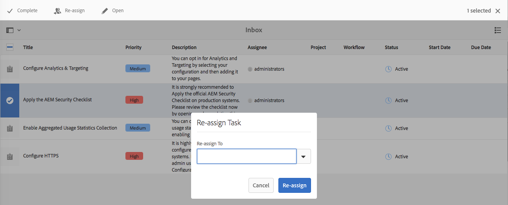
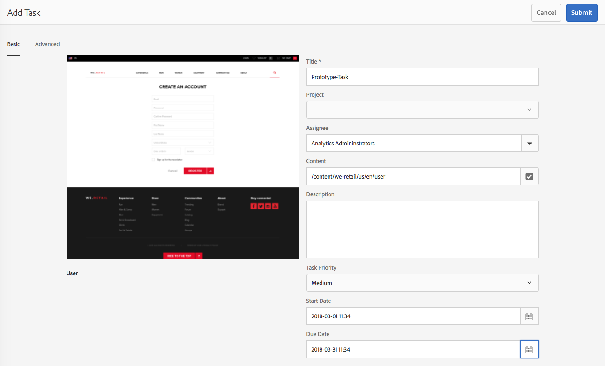

# 您的收件匣{#your-inbox}

您可以從AEM的不同區域收到通知，包括工作流程和專案；例如，關於：

* 任務：

   * 您也可以在AEM UI中的不同點建立這些項目，例如，在 **Projects下**,
   * these can be the product of a workflow **Create Task** or **Create Project Task** step.

* 工作流程:

   * 代表您在頁面內容上所需執行動作的工作項目；

      * 這些是工作流參與者步 **驟的產** 品
   * 失敗項目，以允許管理員重試失敗的步驟。

您會在自己的收件箱中收到這些通知，您可以在其中查看通知並採取措施。

>[!NOTE]
>
>現成可用的AEM會預先載入指派給管理員使用者群組的管理工作。 如需 [詳細資訊，請參閱現成可用的管理工作](#out-of-the-box-administrative-tasks) 。

>[!NOTE]
>
>有關項目類型的詳細資訊，另請參閱：
>
>* [專案](/help/sites-authoring/touch-ui-managing-projects.md)
>* [項目——使用任務](/help/sites-authoring/task-content.md)
>* [工作流程](/help/sites-authoring/workflows.md)
>* [表單](/help/forms/home.md)
>

## 頁首中的收件箱 {#inbox-in-the-header}

在任何控制台中，收件匣中的目前項目數會顯示在標題中。 也可以開啟指示器，以提供對需要執行操作的頁面的快速訪問或對收件箱的訪問：

>[!NOTE]
>
>某些動作也會顯示在適 [當資源的卡片檢視中](/help/sites-authoring/basic-handling.md#card-view)。

## 立即可用的管理任務 {#out-of-the-box-administrative-tasks}

現成可用的AEM會預先載入4個指派給管理員使用者群組的工作。

* [設定分析和定位](/help/sites-administering/opt-in.md)
* [套用 AEM 安全檢查清單](/help/sites-administering/security-checklist.md)
* 啟用彙總使用狀況統計資料的收集
* [設定 HTTPS](/help/sites-administering/ssl-by-default.md)

## 開啟收件箱 {#opening-the-inbox}

若要開啟AEM通知收件匣：

1. 按一下／點選工具列中的指標。

1. 選擇「 **全部查看**」。「 **AEM收件匣** 」將會開啟。收件匣會顯示工作流程、專案和工作中的項目。
1. 預設視圖是「列 [表視圖](#inbox-list-view)」，但您也可以切換到「日 [歷視圖」](#inbox-calendar-view)。這是使用檢視選取器 (工具列，右上方) 完成。

   對於這兩種視圖，您也可以定義「視 [圖設定」](#inbox-view-settings);可用的選項取決於當前視圖。

   

>[!NOTE]
>
>收件箱作為控制台運行，因此，在您完成 [後，使用全局導航](/help/sites-authoring/basic-handling.md#global-navigation) 或搜索導航到其他位置。

### 收件箱——清單視圖 {#inbox-list-view}

此視圖列出所有項目，以及關鍵相關資訊：

### Inbox - Calendar View {#inbox-calendar-view}

此視圖根據項目在日曆中的位置和您選擇的精確視圖顯示項目：

您可以：

* 選擇特定視圖；時 **間軸**、 **欄**、清 **單**

* specify the tasks to display according to **Schedule**; **All**, **Planned**, **In Progress**, **Due Soon**, **Past Due**

* 向下鑽取以獲取有關物料的詳細資訊
* 選擇日期範圍以集中檢視：

### Inbox - Settings {#inbox-view-settings}

您可以針對兩種檢視（清單和日曆）定義設定：

* **日曆檢視**

   對於 **日曆視圖** ，您可以配置：

   * **分組依據**
   * **排程** 或無 ****
   * **卡片大小**
   

* **清單檢視**

   對於 **清單視圖** ，您可以配置排序機制：

   * **排序欄位**
   * **排序順序**
   

### 收件匣——管理控制 {#inbox-admin-control}

管理控制選項可讓管理員：

* 自訂標題文字和標誌

* 控制頁首中可用導覽連結的顯示

「管理控制」選項僅對管理員或工作流程管理員群組的成員顯示。

* **品牌自訂**

   * **自訂標題文字：** 指定要在頁首中顯示的文字，以取代預設 **的Adobe Experience Manager** 文字。

   * **自訂標誌：** 指定要在頁首中顯示為標誌的影像。 在「數位資產管理」(DAM)中上傳影像，並在欄位中參考該影像。

* **使用者導覽**
   * **隱藏導覽選項：** 選取此選項可隱藏頁首中可用的導覽選項。 導覽選項包括其他解決方案的連結、說明連結，以及點選Adobe Experience Manager標誌或文字時可用的製作選項。
* **儲存：** 點選／按一下此選項以儲存設定。

## 對項目採取操作 {#taking-action-on-an-item}

1. 若要對項目採取動作，請選取適當項目的縮圖。 適用於該項目的動作圖示會顯示在工具列中：

   

   這些操作適合項目，包括：

   * **完整動作** ;例如，任務或工作流項。
   * **重新指派**/委&#x200B;**派項目** 。
   * **開啟** ;根據項目類型，此操作可以：

      * 顯示項目屬性
      * 開啟適當的控制面板或精靈，以進一步執行
      * 開放相關檔案
   * **退回** 到上一步。
   * 檢視工作流程的裝載。
   * 從項目建立專案。
   >[!NOTE]
   >
   >如需詳細資訊，請參閱：
   >
   >* 工作流程項目- [參與工作流程](/help/sites-authoring/workflows-participating.md)

1. 根據所選項目，將啟動一個操作；例如：

   * 將開啟與操作相適應的對話框。
   * 將啟動操作嚮導。
   * 檔案頁面隨即開啟。
   例如，重新 **指派** 將開啟對話方塊：

   

   視對話方塊、精靈和檔案頁面是否已開啟而定，您可以：

   * 確認適當的行動；例如重新指派。
   * 取消動作。
   * 後箭；例如，如果操作嚮導或文檔頁面已開啟，則可以返回收件箱。

## 建立任務 {#creating-a-task}

您可以從收件箱建立任務：

1. 依次選擇 **建立**、 **任務**。
1. Complete the necessary fields in the **Basic** and **Advanced** tabs; only the **Title** is mandatory, all others are optional:

   * **基本**:

      * **標題**
      * **專案**
      * **被指定者**
      * **內容**;類似於裝載，這是從任務到儲存庫中某個位置的引用
      * **說明**
      * **任務優先順序**
      * **開始日期**
      * **到期日期**
   

   * **進階**

      * **名稱**:這將用於形成URL;如果空白，則會以標題為 **基礎**。
   

1. 選擇 **提交**。

## 建立專案 {#creating-a-project}

對於某些任務，您可以基 [於該任務](/help/sites-authoring/projects.md) 建立項目：

1. 點選／按一下縮圖，以選取適當的工作。

   >[!NOTE]
   >
   >只有使用「收件匣」 **的「建立** 」選項建立的 **任務** ，才能用於建立專案。
   >
   >工作項目（來自工作流）不能用於建立項目。

1. 從工 **具列選擇** 「建立專案」以開啟精靈。
1. Select the appropriate template, then **Next**.
1. 指定所需的屬性：

   * **基本**

      * **標題**
      * **說明**
      * **開始日期**
      * **到期日期**
      * **使用者** 和角色
   * **進階**

      * **名稱**
   >[!NOTE]
   >
   >如需 [完整資訊，請參閱](/help/sites-authoring/touch-ui-managing-projects.md#creating-a-project) 「建立專案」。

1. 選擇 **建立** ，確認操作。

## 篩選AEM收件匣中的項目 {#filtering-items-in-the-aem-inbox}

您可以篩選列出的項目：

1. 開啟 **AEM收件匣**。

1. 開啟篩選選擇器：

   

1. 您可以根據一系列標準來篩選列出的項目，其中許多標準可以加以改進；例如：

   

   >[!NOTE]
   >
   >使用 [「檢視設定](#inbox-view-settings) 」 [，您也可以在使用「清單檢視」時設定排序](#inbox-list-view)順序。

