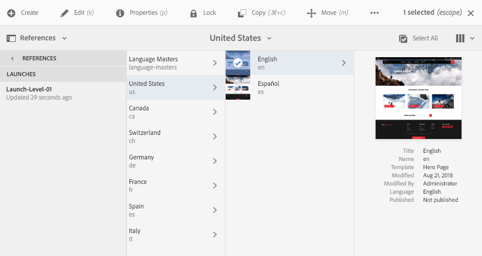

# 編輯啟動{#editing-launches}

## 編輯啟動頁面 {#editing-launch-pages}

為頁面（或一組頁面）建立啟動後，您可以編輯頁面啟動副本中的內容。

1. 存取「 [從參考啟動（網站主控台）](/help/sites-authoring/launches.md#launches-in-references-sites-console) 」以顯示可用動作。
1. 選 **擇「跳至頁面** 」以開啟頁面進行編輯。

### 依即時副本編輯啟動頁面 {#editing-launch-pages-subject-to-a-live-copy}

如果您的啟動是以即時副本 [為基礎](/help/sites-administering/msm.md) ，則您將：

* 當您編輯元件（內容和／或屬性）時，請參閱鎖定符號（小掛鎖）。
* 請參閱「頁 **面屬性」中** 的「即時 **副本」標籤**

livecopy可用來將來源 *分支的內容*** 同步到啟動分支（以便讓啟動與來源中所做的變更保持最新）。

您可以編輯標準即時副本的方式進行變更；例如：

* 按一下已關閉的掛鎖將中斷此同步，並允許您在啟動中對內容進行新更新。 解鎖（開啟掛鎖）後，源分支中同一位置所做的任何更改將不會覆蓋您的更改。
* **暫停** (和 **繼續**)特定頁面的繼承。

如需詳 [細資訊，請參閱變更即時副本內容](/help/sites-administering/msm-livecopy.md#changing-live-copy-content) 。

## 比較啟動頁面與其來源頁面 {#comparing-a-launch-page-to-its-source-page}

若要追蹤您所做的變更，您可以在「參考」中檢視啟動 **** ，並比較啟動頁面與其來源頁面：

1. 在Sites控 **制台** ，瀏 [覽至啟動的來源頁面並選取它](/help/sites-authoring/basic-handling.md#viewingandselectingyourresources)。
1. 開啟「參 **[照](/help/sites-authoring/basic-handling.md#references)**」面板並選&#x200B;**取「啟動」**。
1. 選擇您的特定啟動，然 **後比較來源**:

   

1. 兩個頁面（啟動和來源）將並排開啟。

   有關使用此功能的完整資訊，請參 [閱頁面差異](/help/sites-authoring/page-diff.md)。

## 變更使用的來源頁面 {#changing-the-source-pages-used}

您隨時可以在啟動的來源頁面範圍中新增或移除頁面：

1. 存取並選取啟動：

   * 啟動 [控制台](/help/sites-authoring/launches.md#the-launches-console):

      * 選擇 **編輯**。
   * [參考（Sites控制台）](/help/sites-authoring/launches.md#launches-in-references-sites-console) ，以顯示可用動作：

      * 選擇「 **編輯啟動**」。
   將顯示源頁面。

1. 進行必要的變更，然後使用「儲存」 **確認**。

   >[!NOTE]
   >
   >若要將頁面新增至啟動，頁面必須位於通用語言根目錄下；即在單一網站中。

## 編輯啟動設定 {#editing-a-launch-configuration}

您可以隨時編輯啟動的屬性：

1. 存取並選取啟動：

   * 啟動 [控制台](/help/sites-authoring/launches.md#the-launches-console):

      * 選擇 **屬性**。
   * [參考（Sites控制台）](/help/sites-authoring/launches.md#launches-in-references-sites-console) ，以顯示可用動作：

      * 選擇 **編輯屬性**。
   將顯示詳細資訊。

1. 進行必要的變更，然後使用「儲存」 **確認**。

   如需 [「啟動日期」和「生產就緒」欄位的用途和互動相關資訊，請參閱「啟動——事件順序」](/help/sites-authoring/launches.md#launches-the-order-of-events) (Launches - Order of Events ******** )。

## 發現頁面的啟動狀態 {#discovering-the-launch-status-of-a-page}

當您從參考標籤中選取特定啟動時，會顯示狀態(請參閱參 [考中的啟動(Sites Console)](/help/sites-authoring/launches.md#launches-in-references-sites-console))。

