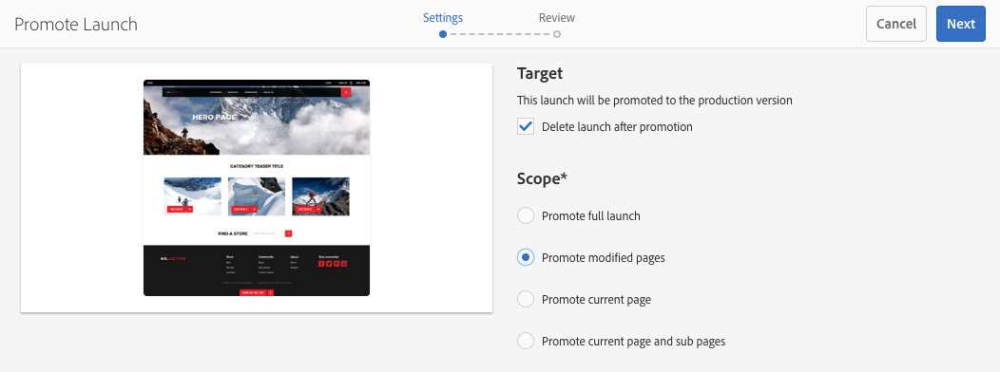
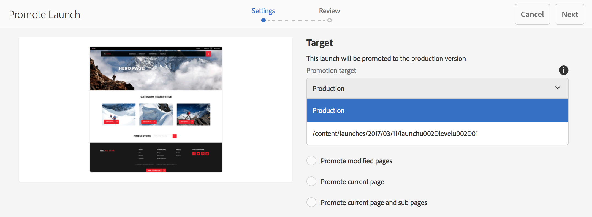

# 提升 Launch{#promoting-launches}

發佈前，您必須促銷啟動頁面，才能將內容移回來源（生產）。 啟動頁面升級時，來源頁面的對應頁面會取代為升級頁面的內容。 提升啟動頁面時，可使用下列選項：

* 僅促銷目前頁面還是整個啟動。
* 是否促銷目前頁面的子頁面。
* 是要促銷完整啟動，還是只促銷已變更的頁面。
* 升級後是否刪除啟動。

>[!NOTE]
>
>將啟動頁面提升至目標後(**生產**)，您可以 **生產** 頁面做為實體（以加快處理程式）。 將頁面新增至工作流程套件，並將其用作啟用頁面套件之工作流程的裝載。 您必須先建立工作流程套件，才能提升啟動。 請參閱 [使用AEM工作流程處理提升頁面](#processing-promoted-pages-using-aem-workflow).

>[!CAUTION]
>
>無法同時促銷單一啟動。 這表示同一次啟動上的兩個促銷動作可能會導致錯誤 —  `Launch could not be promoted` （連同日誌中的衝突錯誤）。

>[!CAUTION]
>
>升級啟動時 *修改* 頁面時，會考量來源和launch分支中的修改。

## 提升啟動頁面 {#promoting-launch-pages}

>[!NOTE]
>
>這涵蓋只有一個啟動層級時，提升啟動頁面的手動動作。 請參閱：
>
>* [提升巢狀啟動](#promoting-a-nested-launch) 結構中有多個啟動時。
>* [啟動 — 事件順序](/help/sites-authoring/launches.md#launches-the-order-of-events) 以取得自動促銷和發佈的詳細資訊。
>

您可以從 **網站** 主控台或 **啟動** 主控台：

1. 開啟:

   * the **網站** 主控台：

      1. 開啟 [參考邊欄](/help/sites-authoring/author-environment-tools.md#showingpagereferences) ，然後使用 [選擇模式](/help/sites-authoring/basic-handling.md) （或選取並開啟「參考」邊欄，順序不重要）。 將顯示所有引用。

      1. 選擇 **啟動** (例如啟動(1))以顯示特定啟動的清單。
      1. 選取特定啟動以顯示可用的動作。
      1. 選擇 **促銷啟動** 來開啟嚮導。
   * the **啟動** 主控台：

      1. 選取您的啟動（點選/按一下縮圖）。
      1. 選擇 **提升**.

1. 在第一個步驟中，您可以指定：

   * **目標**

      * **刪除促銷活動後啟動**
   * **範圍**

      * **提升完整啟動項**
      * **提升已修改頁面**
      * **升級目前頁面**
      * **升級目前頁面與子頁面**

   例如，選取「僅促銷修改的頁面」時：

   

   >[!NOTE]
   >
   >這會涵蓋單次啟動，如果您有巢狀啟動，請參閱 [提升巢狀啟動](#promoting-a-nested-launch).

1. 選擇 **下一個** 繼續。
1. 您可以檢閱要升級的頁面，這些將取決於您選取的頁面範圍：

   

1. 選擇 **提升**.

## 編輯時提升啟動頁面 {#promoting-launch-pages-when-editing}

編輯啟動頁面時， **促銷啟動** 動作也可從 **頁面資訊**. 這會開啟精靈以收集所需資訊。

>[!NOTE]
>
>這適用於單一和 [巢狀啟動](#promoting-a-nested-launch).

## 提升巢狀啟動 {#promoting-a-nested-launch}

建立巢狀啟動後，您可將其升級回任何來源，包括根來源（生產）。

1. 與 [建立巢狀啟動](#creatinganestedlaunchlaunchwithinalaunch)，導覽至並選取 **啟動** 主控台或 **參考** 欄。
1. 選擇 **促銷啟動** 來開啟嚮導。

1. 輸入所需詳細資訊：

   * **目標**

      * **促銷活動目標**
您可以提升至任何來源。

      * **促銷後刪除啟動**
升級後，會刪除選取的啟動及其中巢狀的任何啟動。
   * **範圍**
您可以在此選取是否促銷整個啟動，或僅促銷實際已編輯的頁面。 若是後者，您可以選取「包含/排除」子頁面。 預設設定為僅提升目前頁面的頁面變更：

      * **提升完整啟動項**
      * **提升已修改頁面**
      * **升級目前頁面**
      * **升級目前頁面與子頁面**

   

1. 選擇 **下一個**.
1. 在選取 **提升**:

   

   >[!NOTE]
   >
   >列出的頁面取決於 **範圍** 已定義，可能是已實際編輯的頁面。

1. 您的變更將會升級並反映在 **啟動** 主控台：

   

## 使用 AEM 工作流程處理提升頁面 {#processing-promoted-pages-using-aem-workflow}

使用工作流程模型來執行大量處理提升的啟動頁面：

1. 建立工作流程套件。
1. 作者促銷Launch頁面時，會將其儲存在工作流程套件中。
1. 以套件作為裝載，啟動工作流程模型。

若要在頁面升級時自動啟動工作流程， [設定工作流程啟動器](/help/sites-administering/workflows-starting.md#workflows-launchers) （針對包節點）。

例如，當作者促銷啟動頁面時，您可以自動產生頁面啟動請求。 設定工作流程啟動器，以在修改套件節點時啟動「請求啟動」工作流程。

