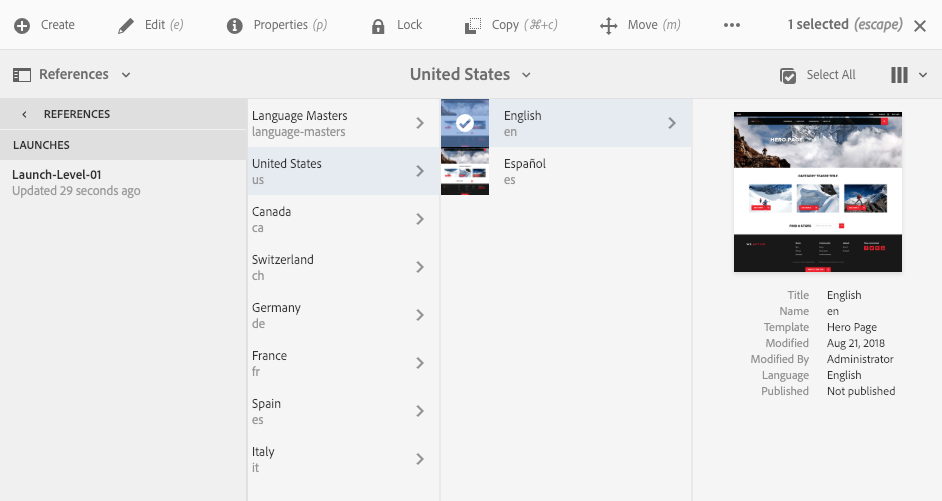

# 啟動{#launches}

啟動可讓您有效開發未來版本的內容。

系統會建立啟動，讓您可針對未來的發佈進行變更（同時維護您目前的頁面）。 編輯和更新啟動頁面後，您可將其升級回來源頁面，然後啟動來源頁面（頂層）。 提升會將啟動內容複製回來源頁面，且可手動或自動完成（取決於建立和編輯啟動時設定的欄位）。

例如，您線上商店的季節性產品頁面會每季更新，以便精選產品與目前季節一致。 若要準備下一季的更新，您可以建立適當網頁的啟動。 整個季度中，啟動副本中累積了下列變更：

* 對因正常維護任務而發生的源頁面的更改。 這些變更會自動在啟動頁面中複製。
* 直接在啟動頁面上執行的編輯，以準備下一季。

下一季到來時，您可以促銷啟動頁面，以便發佈來源頁面（包含更新的內容）。 您可以促銷所有頁面，或僅促銷已修改的頁面。

啟動也可以是：

* 為多個根分支建立。 雖然您可以為整個網站建立啟動（並在那裡進行變更），但由於需要複製整個網站，這可能不切實際。 當涉及數百頁甚至數千頁時，複製操作以及升級任務所需的稍後比較都會影響系統要求和效能。
* 巢狀內嵌（啟動內的啟動），可讓您從現有啟動建立啟動，讓作者可以利用已進行的變更，而不必對每次啟動執行多次相同的變更。

本節說明如何建立、編輯和促銷（如有需要，還有） [刪除](/help/sites-authoring/launches-creating.md#deleting-a-launch))從Sites Console中啟動頁面，或 [啟動主控台](#the-launches-console):

* [建立啟動 ](/help/sites-authoring/launches-creating.md)
* [編輯啟動](/help/sites-authoring/launches-editing.md)
* [提升啟動](/help/sites-authoring/launches-promoting.md)

## 啟動 — 事件順序 {#launches-the-order-of-events}

啟動可讓您為未來發行的一或多個已啟動的網頁，有效開發內容。

啟動可讓您：

* 建立來源頁面的復本：

   * 復本是您的啟動。
   * 頂層來源頁面稱為「生 **產」**。

      * 來源頁面可從多個（個別）分支取用。

   

* 編輯啟動設定：

   * 從啟動新增或移除頁面和/或分支。
   * 編輯啟動屬性；例如 **Title**、Launch Date **、Production Ready****** 旗標。

* 您可以手動或自動促銷和發佈內容：

   * 手動:

      * 將您的啟動內容提升回 **目標** （來源頁面）。
      * 從來源頁面發佈內容（向後推廣後）。
      * 提升所有頁面，或僅提升已修改的頁面。
   * 自動 — 這包括下列項目：

      * 此 **Launch**(**即時**) **日期** 欄位：這可在建立或編輯啟動時設定。

      * 此 **生產就緒** 標幟：這只能在編輯啟動時設定。
      * 若 **生產就緒** 標幟時，啟動會自動升級至指定之 **Launch**(**即時**) **日期**. 促銷後，生產頁面會自動發佈。\
         如果尚未設定日期，標幟將無效。

* 同時更新來源頁面和啟動頁面：

   * 來源頁面的變更會自動實作在啟動副本中(如果設定為繼承；即作為即時副本)。
   * 您無需中斷這些自動更新或來源頁面即可變更啟動副本。

   

* [建立巢狀啟動](/help/sites-authoring/launches-creating.md#creating-a-nested-launch) - launch中的啟動：

   * 來源是現有的啟動。
   * 您可以 [提升巢狀啟動](/help/sites-authoring/launches-promoting.md#promoting-a-nested-launch) 對任何目標；這可以是上層啟動或頂層來源頁面（生產）。

   

   >[!CAUTION]
   >
   >刪除啟動會移除啟動本身和所有子系巢狀啟動。

>[!NOTE]
>
>建立和編輯啟動需要存取權限 `/content/launches`  — 與預設組一樣 `content-authors`.
>
>如果您遇到任何問題，請與系統管理員聯繫。

>[!CAUTION]
>
>不支援在Launch頁面上重新排序元件。
>
>頁面升級時，會反映任何內容變更，但元件位置不會變更。

### 啟動主控台 {#the-launches-console}

啟動控制台會提供啟動的概觀，並可讓您對列出的動作執行。 此主控台可透過下列方式存取：

* 此 **工具** 主控台： **工具**, **網站**, **啟動**.

* 或直接搭配 [https://localhost:4502/libs/launches/content/launches.html](https://localhost:4502/libs/launches/content/launches.html)

## 參考中的啟動（網站主控台） {#launches-in-references-sites-console}

1. 在 **網站** 主控台，導覽至launch的來源。
1. 開啟 **參考** 邊欄並選取來源頁面。
1. 選擇 **啟動**，則會列出現有的launch:

   

1. 點選/按一下適當的啟動，便會顯示可能動作的清單：

   
