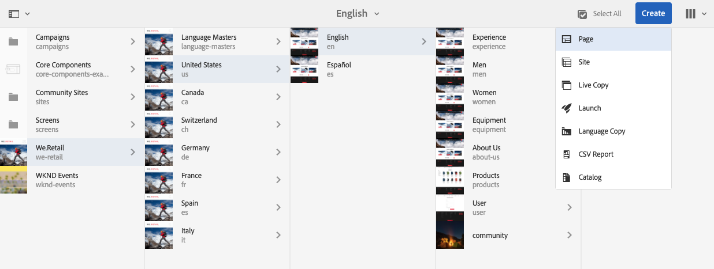
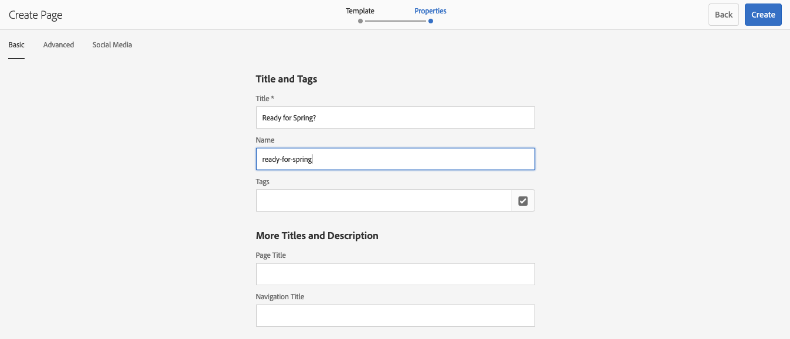

# 建立和組織頁面{#creating-and-organizing-pages}

本節說明如何使用Adobe Experience Manager(AEM)建立和管理頁面，以便您在這些頁 [面上建立](/help/sites-authoring/editing-content.md) 內容。

>[!NOTE]
>
>您的帳戶需 [要適當的存取權](/help/sites-administering/security.md)[](/help/sites-administering/security.md#permissions) 限和權限，才能對頁面採取動作，例如建立、複製、移動、編輯和刪除。
>
>如果您遇到任何問題，我們建議您與系統管理員聯繫。

>[!NOTE]
>
>您可從網站主控台 [使用許多鍵盤快速鍵](/help/sites-authoring/keyboard-shortcuts.md) ，讓組織頁面更有效率。

## 組織您的網站 {#organizing-your-website}

身為作者，您將需要在AEM中組織您的網站。 這包括建立和命名您的內容頁面，以便：

* 您可在作者環境中輕鬆找到它們
* 瀏覽您網站的訪客可在發佈環境中輕鬆瀏覽他們

您也可以使用資 [料夾](#creating-a-new-folder) ，協助組織您的內容。

網站的結構可視為包含您內容頁面的樹狀結構。 這些內容頁面的名稱用於形成URL，而標題則會在檢視頁面內容時顯示。

下列顯示We.Retail網站的範例，可存取遠足短褲頁面( `desert-sky-shorts`):

* 作者環境
   `https://localhost:4502/editor.html/content/we-retail/us/en/products/equipment/hiking/desert-sky-shorts.html`

* 發佈環境
   `https://localhost:4503/content/we-retail/us/en/products/equipment/hiking/desert-sky-shorts.html`

根據您例項的設定，在發佈環境 `/content` 中使用可能是選擇性的。

```xml
 /content
 /we-retail
  /us
   /en
    /products
     /equipment
      /hiking
       /desert-sky-shorts
       /hiking-poles
       /...
      /running...
      /surfing...
      /...
     /seasonal...
     /...
    /about-us
    /experience
    /...
   /es...
  /de...
  /fr...
  /...
 /...
```

此結構可從 **Sites** Console檢視，您可 [在其中瀏覽網站頁面](/help/sites-authoring/basic-handling.md#navigating) ，並在頁面上執行動作。 您也可以建立新網站和 [新頁面](#creating-a-new-page)。

從任何點上，您都可從標題列的階層連結中看到向上的分支：


### 頁面命名慣例 {#page-naming-conventions}

建立新頁面時，有兩個鍵字欄位：

* **[標題](#title)**:

   * 這會在主控台中向使用者顯示，並在編輯時顯示在頁面內容的頂端。
   * 此欄位為必填.

* **[名稱](#name)**:

   * 這用於生成URI。
   * 此欄位的使用者輸入為選擇性。 如果未指定，則名稱是從標題衍生而來。 如需詳細資訊，請 [參閱下列頁面名稱限制與最佳實務](/help/sites-authoring/managing-pages.md#page-name-restrictions-and-best-practices) 。

#### 頁面名稱限制與最佳實務 {#page-name-restrictions-and-best-practices}

頁面 **標題****和名稱可以單獨建立** ，但是是相關的：

* 建立頁面時，只需 **填入** 「標題」欄位。 如果在 **建立頁面時未提供Name** ,AEM將會從標題的前64個字元產生名稱（遵循下列的驗證）。 僅使用前64個字元，以支援簡短頁面名稱的最佳實務。

* 如果作者手動指定頁面名稱，則64個字元的限制不適用，但頁面名稱長度的其他技術限制可能不適用。

>[!NOTE]
>
>定義頁面名稱時，最佳的經驗法則是保持頁面名稱簡短，但盡可能具表現力和記憶力，讓讀者更容易理解。 如需詳細 [資訊，請參閱元素的W3C樣](https://www.w3.org/Provider/Style/TITLE.html)`title` 式指南。

>同時請記住，有些瀏覽器（例如舊版IE）只能接受一定長度的URL，因此也有技術理由保留頁面名稱簡短。
>
建立新頁面時，AEM會根 [據AEM和JCR所傳入的慣例](/help/sites-developing/naming-conventions.md) ，驗證頁面名稱。

允許的字元數量下限為：

* &#39;a&#39;到&#39;z&#39;
* A到Z
* &#39;0&#39;到&#39;9&#39;
* `_` （底線）
* `-` （連字型大小／減號）

所有允許字元的完整詳細資訊都可在命名 [慣例中找到](/help/sites-developing/naming-conventions.md)。

>[!NOTE]
如果AEM是在 [MongoMK永續性管理器部署上執行](/help/sites-deploying/recommended-deploys.md)，則頁面名稱的限制為150個字元。

#### 標題 {#title}

如果您在建立新頁面時只提供頁面 **Title** ,AEM會從此字串衍生頁面 **Name** ，並 [](/help/sites-developing/naming-conventions.md) 根據AEM和JCR所強加的慣例驗證名稱。 將接 **受包含無效字元的Title** （標題）欄位，但派生的名稱會取代無效字元。 例如：

| 標題 | 衍生名稱 |
|---|---|
| 捨恩 | schoen.html |
| SC%&amp;*ç+ | sc—c-.html |

#### 名稱 {#name}

當您建立新頁面時 **提供頁面名稱** ,AEM會根 [據AEM和JCR強加的慣例來驗證名稱](/help/sites-developing/naming-conventions.md) 。 您不能在「名稱」欄位中提交無 **效字元** 。 當AEM偵測到無效字元時，欄位會以說明性訊息反白顯示。


>[!NOTE]
您應避免使用由ISO-639-1定義的雙字母代碼作為頁面名稱，除非它是語言根目錄。
如需詳 [細資訊，請參閱準備翻譯內容](/help/sites-administering/tc-prep.md) 。

### 範本 {#templates}

在AEM中，範本會指定專用的頁面類型。 範本將用作建立任何新頁面的基礎。

範本會定義包含縮圖影像和其他屬性的頁面結構。 例如，您可能有個別的產品頁面、網站地圖和連絡資訊範本。 範本由元件 [組成](#components)。

AEM隨附數個現成可用的範本。 可用的範本取決於個別網站。 主要欄位包括：

* **Title**（標題）產生的網頁上顯示的標題。

* **名稱**&#x200B;命名頁面時使用。

* **範本**：產生新頁面時可用的範本清單。

>[!NOTE]
如果在實例上配置，則模 [板作者可以使用模板編輯器建立模板](/help/sites-authoring/templates.md)。

### 元件 {#components}

元件是AEM提供的元素，讓您可以新增特定類型的內容。 AEM隨附一系列現 [成可用的元件](/help/sites-authoring/default-components-console.md) ，提供完整的功能。 其中包括：

* 文字
* 影像
* Slideshow
* 視訊
* 還有更多

建立並開啟頁面後，您就可以使 [用元件瀏覽器提供的元件](/help/sites-authoring/editing-content.md#insertinganewparagraph)，來新增 [內容](/help/sites-authoring/author-environment-tools.md#componentbrowser)。

>[!NOTE]
「元 [件控制台](/help/sites-authoring/default-components-console.md) 」(Components Console)概述您實例上的元件。

## 管理頁面 {#managing-pages}

### 建立新頁面 {#creating-a-new-page}

除非所有頁面都事先已為您建立，否則您必須先建立頁面，才能開始建立內容：

1. 開啟Sites主控台(例如 [https://localhost:4502/sites.html/content](https://localhost:4502/sites.html/content))。
1. 導覽至您要建立新頁面的位置。
1. 使用工具列中的「建立」 **** ，開啟下拉式選取器，然後從清單中選 **取「頁面** 」:

   

1. 從精靈的第一階段，您可以：

   * 選取您要用來建立新頁面的範本，然後按一下／點選「下 **一步** 」繼續。

   * **取消** ，中止進程。
   

1. 從精靈的最後階段，您可以：

   * 使用三個標籤輸入要指 [派給新頁面的頁面屬性](/help/sites-authoring/editing-page-properties.md) ，然後按一下／點選「 **Create** 」（建立）以實際建立頁面。

   * 使用 **「上** 一步」返回範本選擇。
   主要欄位包括：

   * **標題**:

      * 這會顯示給使用者，而且是必備的。
   * **名稱**:

      * 這用於生成URI。 如果未指定，則名稱是從標題衍生而來。
      * 如果您在建立新頁面時 **提供頁面名稱** ,AEM會 [根據AEM和JCR所設定的慣例來驗證名稱](/help/sites-developing/naming-conventions.md) 。

      * 您無 **法在「名稱** 」欄位中提 **交無效字元** 。 當AEM偵測到無效字元時，欄位會反白顯示，並顯示說明訊息，指出需要移除／取代的字元。
   >[!NOTE]
   請參 [閱頁面命名慣例](#page-naming-conventions)。

   建立新頁面所需的最低資訊為 **Title**。

   

1. 使用 **「建立** 」完成程式並建立新頁面。 確認對話框將詢問您是要立即 **開啟** ，還是返回控制台(**完成**):

   

   >[!NOTE]
   如果您使用該位置已存在的名稱建立頁面，系統將通過附加數字自動生成名稱的變化。 例如，如果 `winter` 已存在，則新頁面將變為 `winter0`。

1. 如果您返回主控台，您會看到新頁面：

   

>[!CAUTION]
建立頁面後，其範本便無法變更——除非您使用 [新範本建立啟動](/help/sites-authoring/launches-creating.md#create-launch-with-new-template)，但這會遺失任何已存在的內容。

### 開啟頁面進行編輯 {#opening-a-page-for-editing}

建立頁面或導覽至現有頁面（在主控台中）後，您可以開啟它以進行編輯：

1. 開啟 **Sites** Console。
1. 導覽，直到您找到要編輯的頁面。
1. 使用下列任一項來選取您的頁面：

   * [快速動作](/help/sites-authoring/basic-handling.md#quick-actions)
   * [選擇模式](/help/sites-authoring/basic-handling.md#navigatingandselectionmode) 和工具欄
   然後選取「編 **輯** 」圖示：

   

1. 頁面將會開啟，您可 [以視需要編輯](/help/sites-authoring/editing-content.md#touchoptimizedui) 。

>[!NOTE]
只有在「預覽」模式下，才能從頁面編輯器導航到其他頁面，因為連結在「編輯」模式下不處於活動狀態。

### 複製和貼上頁面 {#copying-and-pasting-a-page}

您可以將頁面及其所有子頁面複製到新位置：

1. 在 **Sites** Console中，導覽，直到您找到要複製的頁面。
1. 使用下列任一項選擇您的頁面：

   * [快速動作](/help/sites-authoring/basic-handling.md#quick-actions)
   * [選擇模式](/help/sites-authoring/basic-handling.md#navigatingandselectionmode) 和工具欄
   接著是「復 **制** 」頁面圖示：

   

   >[!NOTE]
   如果您處於選擇模式，則複製頁面時，系統會立即自動退出。

1. 導覽至頁面新復本的位置。
1. 使用「 **貼上** 」頁面圖示：

   

   原始頁面和任何子頁面的副本將會在此位置建立。

   >[!NOTE]
   如果將頁面複製到與原始頁面同名的頁面已存在的位置，系統會通過附加數字自動生成名稱的變化。 例如，如果已 `winter` 經存在， `winter` 將變為 `winter1`。

### 移動或重新命名頁面 {#moving-or-renaming-a-page}

>[!NOTE]
指定新頁面名稱時，重新命名頁 [面也受「頁面命名慣例](#page-naming-conventions) 」的規範。

>[!NOTE]
頁面只能移動到允許基於該頁面的模板的位置。 如需詳 [細資訊](/help/sites-developing/templates.md#template-availability) ，請參閱範本可用性。

移動或更名頁面的過程基本相同，由同一嚮導處理。 使用此嚮導，您可以：

* 重新命名頁面，而不移動它。
* 移動頁面而不重新命名。
* 同時移動和重新命名。

AEM提供您更新任何參照重新命名／移動之頁面的內部連結的功能。 這可逐頁執行，以提供完整的彈性。

1. 導覽，直到您找到要移動的頁面。
1. 使用下列任一項選擇您的頁面：

   * [快速動作](/help/sites-authoring/basic-handling.md#quick-actions)
   * [選擇模式](/help/sites-authoring/basic-handling.md#navigatingandselectionmode) 和工具欄
   然後選取「移 **動頁** 」圖示：

   

   這將開啟移動頁嚮導。

1. 在嚮導 **的** 「更名」階段中，您可以執行下列任一操作：

   * Specify the name you want the page to have after it is moved, then click/tap **Next** to proceed.

   * **取消** ，中止進程。
   

   如果您只移動頁面，頁面名稱可維持不變。

   >[!NOTE]
   如果您將頁面移至已有相同名稱之頁面的位置，系統會附加數字以自動產生名稱的變更。 例如，如果已 `winter` 經存在， `winter` 將變為 `winter1`。

1. 在嚮導的「 **選擇目標** 」階段中，您可以執行以下任一操作：

   * 使用列 [視圖](/help/sites-authoring/basic-handling.md#column-view) ，導航至頁的新位置：

      * 按一下目標的縮略圖，選擇目標。
      * 按一 **下** 「下一步」繼續。
   * 使用 **上一步** ，返回頁面名稱規範。
   >[!NOTE]
   依預設，您要移動／重新命名的頁面的父項會被選取為目標。

   

   >[!NOTE]
   如果您將頁面移至已有相同名稱之頁面的位置，系統會附加數字以自動產生名稱的變更。 例如，如果已 `winter` 經存在， `winter` 將變為 `winter1`。

1. 如果頁面已連結或參考，或已發佈，則詳細資訊會列在「調整／重新發 **布** 」步驟中。

   您可以指出應視需要調整和／或重新發佈哪些內容。

   >[!NOTE]
   如果頁面既未連結也未參考，則此步驟將無法使用。

   

1. 選擇「 **移動** 」將完成該過程，並根據需要移動／更名頁面。

>[!NOTE]
如果頁面已發佈，移動頁面會自動解除發佈。 依預設，移動完成時會重新發佈，但是可以取消勾選「調整／重新發佈」步驟中的「重新發佈 **」欄位，** 以變更此設定 **** 。

>[!NOTE]
如果頁面未以任何方式參考，則會跳 **過「調整／重新發佈** 」步驟。

### 刪除頁面 {#deleting-a-page}

1. 導覽，直到您看到要刪除的頁面。
1. 使用 [選擇模式](/help/sites-authoring/basic-handling.md#viewing-and-selecting-resources) ，選擇所需頁面，然後使用工具 **欄中的** 「刪除」:

   

   >[!NOTE]
   為了安全起見，「刪 **** 除」頁面圖示不能作為快速動作使用。

1. 有對話方塊會要求您確認，請使用:

   * **取消**&#x200B;來中止動作
   * **刪除**&#x200B;來確認動作：

      * 如果頁面沒有任何參考，則會刪除頁面。
      * If the page has references, a message box will inform you that **One or more pages are referenced.**&#x200B;您可以選取&#x200B;**強制刪除**&#x200B;或&#x200B;**取消**。

>[!NOTE]
如果頁面已發佈，則會在刪除前自動取消發佈。

### 鎖定頁面 {#locking-a-page}

您可以 [從控制台或編輯個別頁面](/help/sites-authoring/editing-content.md#locking-a-page) ，鎖定／解除鎖定頁面。 有關頁面是否被鎖定的資訊也會顯示在這兩個位置。


### 建立新資料夾 {#creating-a-new-folder}

您可以建立檔案夾，協助組織您的檔案和頁面。

>[!NOTE]
指定新資料夾名稱時， [資料夾也受「頁面命名約定](#page-naming-conventions) 」的約束。

>[!CAUTION]
* 資料夾只能直接建立在 **Sites** 下或其他資料夾下。 無法在頁面下建立。
* 標準動作可在資料夾上執行移動、複製、貼上、刪除、發佈、取消發佈和檢視／編輯屬性。
* 資料夾不可用於即時拷貝中的選擇。


1. 開啟 **Sites** 主控台並導覽至所需位置。
1. 若要開啟選項清單，請從工具 **列選取** 「建立」
1. 選擇「 **資料夾** 」(Folder)以開啟對話框。 您可以在此處輸入 **名稱** 和 **標題**:

   

1. 選擇「 **建立** 」以建立資料夾。
