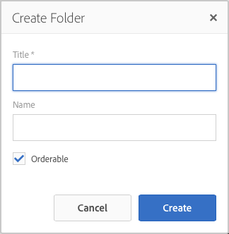

# 建立及組織頁面 {#creating-and-organizing-pages}

本節說明如何使用Adobe Experience Manager(AEM)建立和管理頁面，以便您 [建立內容](/help/sites-authoring/editing-content.md) 在那幾頁。

>[!NOTE]
>
>您的帳戶需要 [適當的訪問權限](/help/sites-administering/security.md) 和 [權限](/help/sites-administering/security.md#permissions) ，在建立、複製、移動、編輯和刪除等頁面上執行操作。
>
>如果您遇到任何問題，建議您與系統管理員聯繫。

>[!NOTE]
>
>有 [鍵盤快捷鍵](/help/sites-authoring/keyboard-shortcuts.md) 可從網站主控台使用，讓組織頁面更有效率。

## 組織您的網站 {#organizing-your-website}

身為作者，您需要在AEM中組織網站。 這包括建立和命名您的內容頁面，以便：

* 您可在製作環境中輕鬆找到這些標籤
* 您網站的訪客可在發佈環境中輕鬆瀏覽網站

您也可以使用 [資料夾](#creating-a-new-folder) 協助組織內容。

網站的結構可視為存放您內容頁面的樹狀結構。 這些內容頁面的名稱會用來形成URL，而標題會在檢視頁面內容時顯示。

下列是We.Retail網站的範例，其中有遠足短褲頁面( `desert-sky-shorts`):

* 製作環境
   `https://localhost:4502/editor.html/content/we-retail/us/en/products/equipment/hiking/desert-sky-shorts.html`

* 發佈環境
   `https://localhost:4503/content/we-retail/us/en/products/equipment/hiking/desert-sky-shorts.html`

視您執行個體的設定而定，請使用 `/content` 在發佈環境中可能是選用項目。

```xml
 /content
 /we-retail
  /us
   /en
    /products
     /equipment
      /hiking
       /desert-sky-shorts
       /hiking-poles
       /...
      /running...
      /surfing...
      /...
     /seasonal...
     /...
    /about-us
    /experience
    /...
   /es...
  /de...
  /fr...
  /...
 /...
```

此結構可從 **網站** 主控台，您可 [瀏覽您網站的頁面](/help/sites-authoring/basic-handling.md#navigating) 和在頁面上執行動作。 您也可以建立新網站和 [新頁面](#creating-a-new-page).

您可以從標題列的階層連結看到向上的分支：


### 頁面命名慣例 {#page-naming-conventions}

建立新頁面時，有兩個索引鍵欄位：

* **[標題](#title)**:

   * 這會在主控台中向使用者顯示，並在編輯時顯示在頁面內容頂端。
   * 此欄位為必填.

* **[名稱](#name)**:

   * 這用於生成URI。
   * 此欄位的用戶輸入為可選。 如果未指定，則從標題派生名稱。 請參閱下節 [頁面名稱限制和最佳作法](/help/sites-authoring/managing-pages.md#page-name-restrictions-and-best-practices) 以取得詳細資訊。

#### 頁面名稱限制和最佳作法 {#page-name-restrictions-and-best-practices}

頁面 **標題****和名稱可以單獨建立** ，但是是相關的：

* 建立頁面時，僅 **標題** 欄位為必填。 若否 **名稱** 會在建立頁面時提供，AEM會從標題的前64個字元產生名稱（遵循下列驗證）。 僅使用前64個字元，以支援短頁面名稱的最佳作法。

* 如果作者手動指定頁面名稱，64個字元的限制不適用，但頁面名稱長度的其他技術限制可能會適用。

>[!NOTE]
>
>定義頁面名稱時，最佳的經驗法則是盡可能保持頁面名稱簡短，但盡可能表達力和令人難忘，讓讀者更容易理解。 請參閱 [W3C樣式指南](https://www.w3.org/Provider/Style/TITLE.html) 針對 `title` 元素以取得詳細資訊。
>
>另請記住，有些瀏覽器（例如舊版IE）只能接受長度達特定的URL，因此也有技術原因需要縮短頁面名稱。

建立新頁面時，AEM將 [根據慣例驗證頁面名稱](/help/sites-developing/naming-conventions.md) 由AEM和JCR強加。

允許的字元數下限為：

* &#39;a&#39;到&#39;z&#39;
* &#39;A&#39;到&#39;Z&#39;
* &#39;0&#39;到&#39;9&#39;
* `_` （底線）
* `-` （連字型大小/減號）

所有允許字元的完整詳細資訊，請參閱 [命名慣例](/help/sites-developing/naming-conventions.md).

>[!NOTE]
>
>如果AEM在 [MongoMK持久性管理器部署](/help/sites-deploying/recommended-deploys.md)，頁面名稱上限為150個字元。

#### 標題 {#title}

如果您在建立新頁面時只提供頁面 **Title** ,AEM會從此字串衍生頁面 **Name**[ ，並根據AEM和JCR所強加的慣例來驗證名稱。](/help/sites-developing/naming-conventions.md)A **標題** 包含無效字元的欄位將被接受，但派生的名稱將替換無效字元。 例如：

| 標題 | 衍生名稱 |
|---|---|
| 捨恩 | schoen.html |
| SC%&amp;&#42;ç+ | sc---c-.html |

#### 名稱 {#name}

提供頁面時 **名稱** 建立新頁面時，AEM將 [根據慣例驗證名稱](/help/sites-developing/naming-conventions.md) 由AEM和JCR強加。 您無法提交 **名稱** 欄位。 當AEM偵測到無效字元時，欄位將會強調顯示並顯示說明訊息。


>[!NOTE]
>
>除非是語言根，否則應避免使用ISO-639-1所定義的雙字母代碼作為頁面名稱。
>
>請參閱 [準備翻譯內容](/help/sites-administering/tc-prep.md) 以取得更多資訊。

### 範本 {#templates}

在AEM中，範本會指定專用的頁面類型。 模板將用作建立任何新頁面的基礎。

範本定義包含縮圖影像和其他屬性的頁面結構。 例如，您可能有不同的產品頁面、網站地圖和聯絡資訊範本。 模板由 [元件](#components).

AEM隨附數個現成可用的範本。 可用的範本取決於個別網站。 關鍵欄位為：

* **標題**
產生的網頁上顯示的標題。

* **名稱**
為頁面命名時使用。

* **範本**
可在生成新頁面時使用的模板清單。

>[!NOTE]
>
>若已在您的執行個體上設定， [範本作者可使用範本編輯器建立範本](/help/sites-authoring/templates.md).

### 元件 {#components}

元件是AEM提供的元素，可讓您新增特定類型的內容。 AEM隨附一系列 [現成可用的元件](/help/sites-authoring/default-components-console.md) 提供全面功能。 這些類別包括：

* 文字
* 影像
* Slideshow
* 影片
* 還有更多

建立並開啟頁面後，您可以 [使用元件新增內容](/help/sites-authoring/editing-content.md#insertinganewparagraph)，可從 [元件瀏覽器](/help/sites-authoring/author-environment-tools.md#componentbrowser).

>[!NOTE]
>
>此 [元件主控台](/help/sites-authoring/default-components-console.md) 提供執行個體上元件的概觀。

## 管理頁面 {#managing-pages}

### 建立新頁面 {#creating-a-new-page}

除非您事先已為您建立所有頁面，否則您必須先建立頁面，才能開始建立內容：

1. 開啟Sites主控台(例如 [https://localhost:4502/sites.html/content](https://localhost:4502/sites.html/content))。
1. 導覽至您要建立新頁面的位置。
1. 使用工具列中的「建立」 **** ，開啟下拉式選取器，然後從清單中選 **取「頁面** 」:

   

1. 從精靈的第一階段，您可以執行下列任一動作：

   * 選取您要用來建立新頁面的範本，然後按一下/點選 **下一個** 繼續。

   * **取消** 中止程式。

   

1. 從精靈的最後一個階段，您可以執行下列任一操作：

   * 使用三個標籤輸入 [頁面屬性](/help/sites-authoring/editing-page-properties.md) 您要指派給新頁面，然後按一下/點選 **建立** 來實際建立頁面。

   * 使用 **返回** 返回到模板選擇。

   關鍵欄位包括：

   * **標題**:

      * 這會向使用者顯示，且為必要項目。
   * **名稱**:

      * 這用於生成URI。 如果未指定，則從標題派生名稱。
      * 如果您提供頁面 **名稱** 建立新頁面時，AEM將 [根據慣例驗證名稱](/help/sites-developing/naming-conventions.md) 由AEM和JCR強加。

      * 您 **無法提交無效字元** 在 **名稱** 欄位。 當AEM偵測到無效字元時，欄位會反白顯示，並顯示說明訊息，指出需要移除/取代的字元。
   >[!NOTE]
   >
   >請參閱 [頁面命名慣例](#page-naming-conventions).

   建立新頁面所需的最低資訊為 **標題**.

   

1. 使用 **建立** 以完成程式並建立新頁面。 確認對話方塊會詢問您是否要 **開啟** 頁面立即顯示，或返回主控台(**完成**):

   

   >[!NOTE]
   >
   >如果您使用該位置已存在的名稱建立頁面，系統將通過附加數字自動生成該名稱的變化。 例如，若 `winter` 已存在新頁面將變成 `winter0`.

1. 如果您返回主控台，則會看到您的新頁面：

   

>[!CAUTION]
>
>建立頁面後，就無法變更其範本，除非您 [使用新範本建立啟動](/help/sites-authoring/launches-creating.md#create-launch-with-new-template)，不過這會遺失任何已存在的內容。

### 開啟頁面進行編輯 {#opening-a-page-for-editing}

建立頁面或導覽至現有頁面（在主控台中）後，您可以開啟它進行編輯：

1. 開啟 **網站** 控制台。
1. 導覽，直到找到您要編輯的頁面為止。
1. 使用下列任一項來選取您的頁面：

   * [快速動作](/help/sites-authoring/basic-handling.md#quick-actions)
   * [選擇模式](/help/sites-authoring/basic-handling.md#navigatingandselectionmode) 和工具欄

   然後選取 **編輯** 圖示：

   

1. 頁面將會開啟，您可以 [編輯頁面](/help/sites-authoring/editing-content.md#touchoptimizedui) 視需要。

>[!NOTE]
>
>從頁面編輯器導覽至其他頁面只能在「預覽」模式中，因為連結在「編輯」模式中未處於作用中狀態。

### 複製和貼上頁面 {#copying-and-pasting-a-page}

您可以將頁面及其所有子頁面複製到新位置：

1. 在 **網站** 主控台，導覽，直到找到您要複製的頁面為止。
1. 使用下列任一項選取您的頁面：

   * [快速動作](/help/sites-authoring/basic-handling.md#quick-actions)
   * [選擇模式](/help/sites-authoring/basic-handling.md#navigatingandselectionmode) 和工具欄

   然後 **複製** 頁面圖示：

   

   >[!NOTE]
   >
   >如果您處於選取模式，則複製頁面時，就會自動退出。

1. 導覽至頁面新復本的位置。
1. 此 **貼上** 圖示右側有下拉箭頭：

   

   您可以:
   * 選取 **貼上** 頁面圖示本身：將在此位置建立原始頁面和任何子頁面的副本。
   * 選取下拉箭頭以顯示 **貼上時不帶子項** 選項。 將在此位置建立原始頁面的副本；不會複製子頁面。

   >[!NOTE]
   >
   >如果將頁面複製到與原始頁面同名的頁面已存在的位置，系統將通過附加數字自動生成名稱的變化。 例如，若 `winter` 已存在 `winter` 將 `winter1`.

### 移動或重新命名頁面 {#moving-or-renaming-a-page}

>[!NOTE]
>
>重新命名頁面也受 [頁面命名慣例](#page-naming-conventions) 指定新頁面名稱時。

>[!NOTE]
>
>頁面只能移至允許頁面所依據之範本的位置。 請參閱 [範本可用性](/help/sites-developing/templates.md#template-availability) 以取得更多資訊。

移動或重新命名頁面的程式基本相同，由相同精靈處理。 使用此嚮導，您可以：

* 重新命名頁面而不移動它。
* 移動頁面而不重新命名。
* 同時移動並重新命名。

AEM提供您更新任何內部連結的功能，這些連結會參照被重新命名/移動的頁面。 您可以逐頁完成這項作業，以提供完全的彈性。

1. 導覽，直到找到您要移動的頁面為止。
1. 使用下列任一項選取您的頁面：

   * [快速動作](/help/sites-authoring/basic-handling.md#quick-actions)
   * [選擇模式](/help/sites-authoring/basic-handling.md#navigatingandselectionmode) 和工具欄

   然後選取 **移動** 頁面圖示：

   

   這會開啟移動頁面精靈。

1. 從 **重新命名** 您可以執行以下任一操作：

   * 指定移動頁面後要擁有的名稱，然後按一下/點選 **下一個** 繼續。

   * **取消** 中止程式。

   

   如果您只要移動頁面，頁面名稱可以維持不變。

   >[!NOTE]
   >
   >如果將頁面移至已存在同名頁面的位置，系統會透過附加數字來自動產生名稱的變異。 例如，若 `winter` 已存在 `winter` 將 `winter1`.

1. 從 **選擇目標** 您可以執行以下任一操作：

   * 使用 [欄檢視](/help/sites-authoring/basic-handling.md#column-view) 要導覽至頁面的新位置，請執行以下操作：

      * 按一下目的地的縮圖，以選取目的地。
      * 按一下 **下一個** 繼續。
   * 使用 **返回** 返回頁名規範。

   >[!NOTE]
   >
   >依預設，您要移動/重新命名的頁面的上層會選取作為目的地。

   

   >[!NOTE]
   >
   >如果將頁面移至已存在同名頁面的位置，系統會透過附加數字來自動產生名稱的變異。 例如，若 `winter` 已存在 `winter` 將 `winter1`.

1. 如果頁面已連結或參考，或已發佈，則詳細資料將列在 **調整/重新發佈** 步驟。

   您可以指出哪些項目應視情況調整及/或重新發佈。

   >[!NOTE]
   >
   >如果頁面既未連結亦未參照，則此步驟將無法使用。

   

1. 選取 **移動** 會完成程式，並視需要移動/重新命名頁面。

>[!NOTE]
>
>如果頁面已發佈，移動頁面會自動解除發佈。依預設，移動完成時會重新發佈它，但您可以取消勾選 **重新發佈** 欄位 **調整/重新發佈** 步驟。

>[!NOTE]
>
>如果頁面未以任何方式參照，則 **調整/重新發佈** 步驟。

#### 非同步動作 {#asynchronous-actions}

通常會立即執行頁面移動或重新命名動作。 這會視為同步處理，而UI中的進一步動作會遭到封鎖，直到動作完成為止。

不過，如果受影響的頁面數量超過定義的限制，系統會以非同步方式處理動作，讓使用者能繼續在UI中編寫，不受頁面移動或重新命名動作的阻礙。

* 按一下 **移動** 在上述的最後一個步驟中，AEM會檢查已設定的限制。
* 如果受影響的頁數低於限制，則會執行同步操作。
* 如果受影響的頁數超過上限，則會執行非同步操作。
   * 使用者必須定義應執行非同步操作的時間
      * **現在** 立即開始執行非同步作業。
      * **稍後** 可讓使用者定義非同步作業的開始時間。

         

您可以在 [**非同步作業狀態** 儀表板](/help/sites-administering/asynchronous-jobs.md#monitor-the-status-of-asynchronous-operations) at **全域導覽** -> **工具** -> **操作** -> **工作**

>[!NOTE]
>
>如需非同步作業處理以及如何設定頁面移動/重新命名動作限制的詳細資訊，請參閱 [非同步作業](/help/sites-administering/asynchronous-jobs.md) 管理使用手冊中的檔案。

>[!NOTE]
>
>非同步頁面移動處理需要AEM 6.5.3.0或更新版本。

### 刪除頁面 {#deleting-a-page}

1. 導覽，直到您看到要刪除的頁面為止。
1. 使用 [選擇模式](/help/sites-authoring/basic-handling.md#viewing-and-selecting-resources) 若要選取所需頁面，請使用 **刪除** 從工具列：

   

   >[!NOTE]
   >
   >為了安全起見，「刪 **** 除」頁面圖示不能作為快速動作使用。

1. 有對話方塊會要求您確認，請使用:

   * **取消**&#x200B;來中止動作
   * **刪除**&#x200B;來確認動作：

      * 如果頁面沒有任何參考，則會刪除頁面。
      * 如果頁面有參考，則訊息方塊會通知您 **參考一或多個頁面。**&#x200B;您可以選取&#x200B;**強制刪除**&#x200B;或&#x200B;**取消**。

>[!NOTE]
>
>如果頁面已發佈，則會在刪除前自動取消發佈。

### 鎖定頁面 {#locking-a-page}

您可以 [鎖定/解除鎖定頁面](/help/sites-authoring/editing-content.md#locking-a-page) 或編輯個別頁面時傳送。 關於頁面是否已鎖定的資訊也會顯示在兩個位置中。

 

### 建立新資料夾 {#creating-a-new-folder}

您可以建立資料夾，以協助組織您的檔案和頁面。

>[!NOTE]
>
>資料夾也受 [頁面命名慣例](#page-naming-conventions) 指定新資料夾名稱時。

>[!CAUTION]
>
>* 資料夾只能直接在 **網站** 或在其他資料夾下。 無法在頁面下建立。
>* 標準動作移動、複製、貼上、刪除、發佈、取消發佈，以及檢視/編輯屬性可在資料夾上執行。
>* 資料夾無法用於即時副本中的選擇。
>


1. 開啟 **網站** 控制台並導覽至所需位置。
1. 若要開啟選項清單，請選取 **建立** 從工具列
1. 選擇 **資料夾** 來開啟對話框。 您可以在此輸入 **名稱** 和 **標題**:

   

1. 選擇 **建立** 來建立資料夾。
