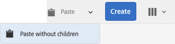

# 建立及組織頁面 {#creating-and-organizing-pages}

本節說明如何使用Adobe Experience Manager (AEM)建立和管理頁面，以便您之後可以 [建立內容](/help/sites-authoring/editing-content.md) 這些頁面上。

>[!NOTE]
>
>您的帳戶需要 [適當的存取許可權](/help/sites-administering/security.md) 和 [許可權](/help/sites-administering/security.md#permissions) ，以在頁面上執行建立、複製、移動、編輯和刪除等動作。
>
>如果您遇到任何問題，我們建議您連絡系統管理員。

>[!NOTE]
>
>有許多種 [鍵盤快速鍵](/help/sites-authoring/keyboard-shortcuts.md) 您可從網站主控台使用以更有效率地組織頁面。

## 組織您的網站 {#organizing-your-website}

身為作者，您需要在AEM中組織您的網站。 這涉及建立和命名內容頁面，以便：

* 您可以在作者環境中輕鬆找到這些檔案
* 您網站的訪客可在發佈環境中輕鬆瀏覽這些內容

您也可以使用 [資料夾](#creating-a-new-folder) 以協助組織您的內容。

網站的結構可視為存放內容頁面的樹狀結構。 這些內容頁面的名稱會用來組成URL，而檢視頁面內容時會顯示標題。

以下顯示We.Retail網站的範例，其中健行短褲頁面( `desert-sky-shorts`)已存取：

* 作者環境
   `https://localhost:4502/editor.html/content/we-retail/us/en/products/equipment/hiking/desert-sky-shorts.html`

* 發佈環境
   `https://localhost:4503/content/we-retail/us/en/products/equipment/hiking/desert-sky-shorts.html`

根據您執行個體的設定，使用 `/content` 在發佈環境中可能是選用的。

```xml
 /content
 /we-retail
  /us
   /en
    /products
     /equipment
      /hiking
       /desert-sky-shorts
       /hiking-poles
       /...
      /running...
      /surfing...
      /...
     /seasonal...
     /...
    /about-us
    /experience
    /...
   /es...
  /de...
  /fr...
  /...
 /...
```

此結構可從下列位置檢視： **網站** 主控台，您可以 [瀏覽您網站的各個頁面](/help/sites-authoring/basic-handling.md#navigating) 並在頁面上執行動作。 您也可以建立新網站和 [新頁面](#creating-a-new-page).

從任何點開始，您都可以從標頭列中的階層連結看到向上分支：


### 頁面命名慣例 {#page-naming-conventions}

建立新頁面時，有兩個索引鍵欄位：

* **[標題](#title)**:

   * 此功能會在主控台中向使用者顯示，並在編輯時顯示在頁面內容的頂端。
   * 此欄位為必填.

* **[名稱](#name)**:

   * 這可用來產生URI。
   * 此欄位的使用者輸入為選用。 如果未指定，則會從標題衍生名稱。 請參閱下列章節 [頁面名稱限制和最佳實務](/help/sites-authoring/managing-pages.md#page-name-restrictions-and-best-practices) 以取得詳細資訊。

#### 頁面名稱限制和最佳實務 {#page-name-restrictions-and-best-practices}

頁面 **標題****和名稱可以單獨建立** ，但是是相關的：

* 建立頁面時，僅 **標題** 欄位為必填。 若否 **名稱** 會在建立頁面時提供，AEM會從標題的前64個字元產生名稱（觀察下列驗證）。 僅使用前64個字元是為了支援短頁面名稱的最佳實務。

* 如果作者手動指定頁面名稱，64字元限制不適用，但頁面名稱長度的其他技術限制可能適用。

>[!NOTE]
>
>定義頁面名稱時，一個好的經驗法則是保持頁面名稱簡短，但儘可能表現力且容易記憶，讓讀者容易理解。 請參閱 [W3C風格指南](https://www.w3.org/Provider/Style/TITLE.html) 的 `title` 元素以取得詳細資訊。
>
>另請注意，有些瀏覽器（例如舊版的IE）只能接受一定長度的URL，因此還有技術原因需縮短頁面名稱。

建立新頁面時，AEM會 [根據慣例驗證頁面名稱](/help/sites-developing/naming-conventions.md) 由AEM和JCR所強制。

允許的最小字元為：

* &#39;a&#39;到&#39;z&#39;
* &#39;A&#39;到&#39;Z&#39;
* &#39;0&#39;到&#39;9&#39;
* `_` （底線）
* `-` （連字型大小/減號）

允許的所有字元的完整詳細資訊可在以下網址找到： [命名慣例](/help/sites-developing/naming-conventions.md).

>[!NOTE]
>
>如果AEM執行於 [MongoMK持續性管理員部署](/help/sites-deploying/recommended-deploys.md)，頁面名稱上限為150個字元。

#### 標題 {#title}

如果您在建立新頁面時只提供頁面 **Title** ,AEM會從此字串衍生頁面 **Name**[ ，並根據AEM和JCR所強加的慣例來驗證名稱。](/help/sites-developing/naming-conventions.md)A **標題** 將接受包含無效字元的欄位，但派生的名稱會將無效的字元替換掉。 例如：

| 標題 | 衍生名稱 |
|---|---|
| Schon | schoen.html |
| SC%&amp;&#42;c+ | sc---c-.html |

#### 名稱 {#name}

當您提供頁面時 **名稱** 建立新頁面時，AEM會 [根據慣例驗證名稱](/help/sites-developing/naming-conventions.md) 由AEM和JCR所強制。 您無法在中提交無效的字元 **名稱** 欄位。 當AEM偵測到無效字元時，該欄位將會反白顯示一則說明訊息。


>[!NOTE]
>
>除非是語言根，否則應避免使用ISO-639-1所定義的兩字母代碼作為頁面名稱。
>
>另請參閱 [準備翻譯內容](/help/sites-administering/tc-prep.md) 以取得詳細資訊。

### 範本 {#templates}

在AEM中，範本會指定特殊型別的頁面。 範本將用作任何正在建立的新頁面的基礎。

範本會定義包含縮圖影像和其他屬性的頁面結構。 例如，您可以為產品頁面、網站地圖和聯絡資訊使用不同的範本。 範本由下列專案組成 [元件](#components).

AEM隨附多種現成可用的範本。 可用的範本視個別網站而定。 主要欄位包括：

* **標題**
在產生的網頁上顯示的標題。

* **名稱**
用於命名頁面。

* **範本**
可在產生新頁面時使用的範本清單。

>[!NOTE]
>
>如果您的執行個體已設定， [範本作者可以使用範本編輯器建立範本](/help/sites-authoring/templates.md).

### 元件 {#components}

元件是AEM提供的元素，可供您新增特定型別的內容。 AEM隨附一系列 [現成可用的元件](/help/sites-authoring/default-components-console.md) 提供完整功能的機種。 這些類別包括：

* 文字
* 影像
* Slideshow
* 影片
* 以及更多功能

建立並開啟頁面後，您可以 [使用元件新增內容](/help/sites-authoring/editing-content.md#insertinganewparagraph)，可從以下網址取得： [元件瀏覽器](/help/sites-authoring/author-environment-tools.md#componentbrowser).

>[!NOTE]
>
>此 [元件主控台](/help/sites-authoring/default-components-console.md) 提供執行個體上元件的概觀。

## 管理頁面 {#managing-pages}

### 建立新頁面 {#creating-a-new-page}

除非所有頁面都已預先為您建立，否則您必須先建立頁面，然後才能開始建立內容：

1. 開啟Sites主控台(例如 [https://localhost:4502/sites.html/content](https://localhost:4502/sites.html/content))。
1. 導覽至您要建立新頁面的位置。
1. 使用工具列中的「建立」 **** ，開啟下拉式選取器，然後從清單中選 **取「頁面** 」:

   

1. 從精靈的第一階段，您可以：

   * 選取您要用來建立新頁面的範本，然後按一下/點選 **下一個** 以繼續進行。

   * **取消** 以中止程式。

   

1. 在精靈的最後階段，您可以：

   * 使用三個標籤來輸入 [頁面屬性](/help/sites-authoring/editing-page-properties.md) 您想要指派給新頁面，然後按一下/點選 **建立** 以實際建立頁面。

   * 使用 **返回** 以返回範本選取範圍。

   主要欄位包括：

   * **標題**:

      * 這會向使用者顯示，且是強制性的。
   * **名稱**:

      * 這可用來產生URI。 如果未指定，則會從標題衍生名稱。
      * 如果您提供頁面 **名稱** 建立新頁面時，AEM會 [根據慣例驗證名稱](/help/sites-developing/naming-conventions.md) 由AEM和JCR所強制。

      * 您 **無法提交無效的字元** 在 **名稱** 欄位。 當AEM偵測到無效字元時，將會反白顯示欄位，並顯示說明訊息，指出需要移除/取代的字元。
   >[!NOTE]
   >
   >另請參閱 [頁面命名慣例](#page-naming-conventions).

   建立新頁面所需的最少資訊是 **標題**.

   

1. 使用 **建立** 以完成程式並建立您的新頁面。 確認對話方塊會詢問您是否要 **開啟** 立即頁面或返回主控台(**完成**)：

   

   >[!NOTE]
   >
   >如果您使用該位置已存在的名稱來建立頁面，系統將透過附加一個編號來自動產生名稱的變體。 例如，如果 `winter` 已存在，則新頁面將變成 `winter0`.

1. 如果您返回主控台，則會看到新頁面：

   

>[!CAUTION]
>
>建立頁面後，無法變更其範本，除非您 [使用新範本建立啟動項](/help/sites-authoring/launches-creating.md#create-launch-with-new-template)，但會遺失任何已存在的內容。

### 開啟頁面進行編輯 {#opening-a-page-for-editing}

建立頁面或導覽至現有頁面（在主控台中）後，您可以開啟該頁面進行編輯：

1. 開啟 **網站** 主控台。
1. 瀏覽至找到您要編輯的頁面為止。
1. 使用以下任一方式選取您的頁面：

   * [快速動作](/help/sites-authoring/basic-handling.md#quick-actions)
   * [選擇模式](/help/sites-authoring/basic-handling.md#navigatingandselectionmode) 和工具列

   然後選取 **編輯** 圖示：

   

1. 此頁面將會開啟，而且您可以 [編輯頁面](/help/sites-authoring/editing-content.md#touchoptimizedui) 視需要。

>[!NOTE]
>
>只有在「預覽」模式中才能從頁面編輯器導覽至其他頁面，因為連結在「編輯」模式中無效。

### 複製和貼上頁面 {#copying-and-pasting-a-page}

您可以將頁面及其所有子頁面複製到新位置：

1. 在 **網站** 主控台，導覽至找到您要複製的頁面為止。
1. 使用以下任一方式選取您的頁面：

   * [快速動作](/help/sites-authoring/basic-handling.md#quick-actions)
   * [選擇模式](/help/sites-authoring/basic-handling.md#navigatingandselectionmode) 和工具列

   然後 **複製** 頁面圖示：

   

   >[!NOTE]
   >
   >如果您處於選取模式，這會在頁面複製後立即自動退出。

1. 導覽至頁面新復本的位置。
1. 此 **貼上** 圖示可使用直接右側的下拉式箭頭顯示：

   

   您可以執行下列兩個動作中的一個:
   * 選取 **貼上** 頁面圖示本身：將在此位置建立原始頁面及任何子頁面的復本。
   * 選取下拉箭頭以顯示 **貼上（不含子系）** 選項。 將在此位置建立原始頁面的復本；不會複製子頁面。

   >[!NOTE]
   >
   >如果您將頁面複製到某個位置，而該位置已經存在名稱與原始頁面相同的頁面，則系統會附加一個數字，自動產生名稱的變體。 例如，如果 `winter` 已存在 `winter` 將成為 `winter1`.

### 移動或重新命名頁面 {#moving-or-renaming-a-page}

>[!NOTE]
>
>重新命名頁面也必須遵循 [頁面命名慣例](#page-naming-conventions) 指定新頁面名稱時。

>[!NOTE]
>
>頁面只能移至允許頁面所依據的範本位置。 另請參閱 [範本可用性](/help/sites-developing/templates.md#template-availability) 以取得詳細資訊。

移動或重新命名頁面的程式基本相同，並由相同的精靈處理。 使用此精靈，您可以：

* 重新命名頁面而不移動頁面。
* 移動頁面而不重新命名。
* 同時移動和重新命名。

AEM提供可更新任何內部連結的功能，這些連結會參照正在重新命名/移動的頁面。 您可以逐頁進行，以提供完整的彈性。

1. 瀏覽至找到您要移動的頁面為止。
1. 使用以下任一方式選取您的頁面：

   * [快速動作](/help/sites-authoring/basic-handling.md#quick-actions)
   * [選擇模式](/help/sites-authoring/basic-handling.md#navigatingandselectionmode) 和工具列

   然後選取 **移動** 頁面圖示：

   

   這將會開啟移動頁面精靈。

1. 從 **重新命名** 精靈的階段您可以：

   * 指定移動頁面後您要讓頁面使用的名稱，然後按一下/點選 **下一個** 以繼續進行。

   * **取消** 以中止程式。

   

   如果您只移動頁面，頁面名稱可以維持不變。

   >[!NOTE]
   >
   >如果您將頁面移至已存在同名頁面的位置，系統會藉由附加編號來自動產生名稱的變體。 例如，如果 `winter` 已存在 `winter` 將成為 `winter1`.

1. 從 **選取目的地** 精靈的階段您可以：

   * 使用 [欄檢視](/help/sites-authoring/basic-handling.md#column-view) 若要導覽至頁面的新位置：

      * 按一下目的地的縮圖，以選取目的地。
      * 按一下 **下一個** 以繼續。
   * 使用 **返回** 以返回頁面名稱規格。

   >[!NOTE]
   >
   >依預設，將會選取您要移動/重新命名的頁面的父頁面作為目的地。

   

   >[!NOTE]
   >
   >如果您將頁面移至已存在同名頁面的位置，系統會藉由附加編號來自動產生名稱的變體。 例如，如果 `winter` 已存在 `winter` 將成為 `winter1`.

1. 如果頁面已連結至或參考，或已發佈，則詳細資訊將會列在 **調整/重新發佈** 步驟。

   您可以指出哪些頁面應適當地調整和/或重新發佈。

   >[!NOTE]
   >
   >如果頁面既未連結也未參考，則無法使用此步驟。

   

1. 選取 **移動** 將會完成程式，並根據需要移動/重新命名頁面。

>[!NOTE]
>
>如果頁面已發佈，移動頁面會自動解除發佈。依預設，移動完成時會重新發佈它，但您可以取消核取 **重新發佈** 中的欄位 **調整/重新發佈** 步驟。

>[!NOTE]
>
>如果頁面未以任何方式參照，則 **調整/重新發佈** 步驟將被跳過。

#### 非同步動作 {#asynchronous-actions}

通常，頁面移動或重新命名動作會立即執行。 這將視為同步處理，在動作完成之前，會封鎖UI中的進一步動作。

但是，如果受影響的頁數超過定義的限制，系統將以非同步方式處理動作，讓使用者能夠不受頁面移動或重新命名動作的阻礙，繼續在UI中編寫。

* 按一下 **移動** 在上面的最後一個步驟中，AEM會檢查設定的限制。
* 如果受影響的頁數低於限制，會執行同步作業。
* 如果受影響的頁數超過限制，系統會執行非同步操作。
   * 使用者必須定義何時應執行非同步操作
      * **現在** 立即開始執行非同步作業。
      * **稍後** 可讓使用者定義非同步作業何時開始。

         

非同步作業的狀態可在以下位置檢視： [**非同步工作狀態** 儀表板](/help/sites-administering/asynchronous-jobs.md#monitor-the-status-of-asynchronous-operations) 於 **全域導覽** -> **工具** -> **作業** -> **工作**

>[!NOTE]
>
>如需有關非同步作業處理以及如何設定頁面移動/重新命名動作限制的進一步資訊，請參閱 [非同步作業](/help/sites-administering/asynchronous-jobs.md) 管理使用手冊的檔案。

>[!NOTE]
>
>非同步頁面移動處理需要AEM 6.5.3.0或更新版本。

### 刪除頁面 {#deleting-a-page}

1. 導覽，直到您可以看見要刪除的頁面為止。
1. 使用 [選擇模式](/help/sites-authoring/basic-handling.md#viewing-and-selecting-resources) 以選取所需頁面，然後使用 **刪除** 從工具列：

   

   >[!NOTE]
   >
   >為了安全起見，「刪 **** 除」頁面圖示不能作為快速動作使用。

1. 對話方塊將會要求確認，使用：

   * **取消** 中止動作
   * **刪除** 若要確認動作：

      * 如果頁面沒有引用，則會刪除該頁面。
      * 如果頁面有參照，則會出現訊息方塊通知您 **一個或多個頁面被引用。** 您可以選取 **強制刪除** 或 **取消**.

>[!NOTE]
>
>如果頁面已發佈，則在刪除前會自動取消發佈。

### 鎖定頁面 {#locking-a-page}

您可以 [鎖定/解鎖頁面](/help/sites-authoring/editing-content.md#locking-a-page) 從主控台或編輯個別頁面時。 有關頁面是否已鎖定的資訊也會顯示在這兩個位置。

 

### 建立新資料夾 {#creating-a-new-folder}

您可以建立資料夾來幫助組織您的檔案和頁面。

>[!NOTE]
>
>資料夾也必須遵守 [頁面命名慣例](#page-naming-conventions) 指定新資料夾名稱時。

>[!CAUTION]
>
>* 資料夾只能直接在下建立 **網站** 或位於其他資料夾下。 無法在頁面下建立縮圖。
>* 您可以在資料夾上執行移動、複製、貼上、刪除、發佈、取消發佈和檢視/編輯屬性的標準動作。
>* 資料夾無法供即時副本中選取。
>


1. 開啟 **網站** 主控台並導覽至所需位置。
1. 若要開啟選項清單，請選取 **建立** （從工具列）
1. 選取 **資料夾** 以開啟對話方塊。 您可以在這裡輸入 **名稱** 和 **標題**：

   

1. 選取 **建立** 以建立資料夾。
