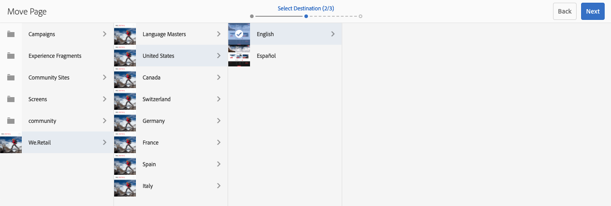

# 建立及組織頁面 {#creating-and-organizing-pages}

本節介紹如何使用Adobe Experience Manager()建立和管AEM理頁面，以便 [建立內容](/help/sites-authoring/editing-content.md) 那幾頁。

>[!NOTE]
>
>您的帳戶需要 [適當的訪問權限](/help/sites-administering/security.md) 和 [權限](/help/sites-administering/security.md#permissions) 對頁面執行操作，如建立、複製、移動、編輯和刪除。
>
>如果您遇到任何問題，我們建議您與系統管理員聯繫。

>[!NOTE]
>
>有 [鍵盤快捷鍵](/help/sites-authoring/keyboard-shortcuts.md) 可以從網站控制台使用。

## 組織您的網站 {#organizing-your-website}

作為作者，您需要在中組織您的網AEM站。 這包括建立和命名內容頁，以便：

* 在作者環境中可以輕鬆找到它們
* 訪問您的網站的訪問者可以在發佈環境中輕鬆瀏覽這些網站

您還可以使用 [資料夾](#creating-a-new-folder) 來組織內容。

網站的結構可以視為保存內容頁面的樹結構。 這些內容頁的名稱用於形成URL，而標題在查看頁面內容時顯示。

以下是We.Retail網站中的一個示例，其中是徒步短褲頁( `desert-sky-shorts`)。

* 作者環境
   `https://localhost:4502/editor.html/content/we-retail/us/en/products/equipment/hiking/desert-sky-shorts.html`

* 發佈環境
   `https://localhost:4503/content/we-retail/us/en/products/equipment/hiking/desert-sky-shorts.html`

根據實例的配置，使用 `/content` 在發佈環境中可能是可選的。

```xml
 /content
 /we-retail
  /us
   /en
    /products
     /equipment
      /hiking
       /desert-sky-shorts
       /hiking-poles
       /...
      /running...
      /surfing...
      /...
     /seasonal...
     /...
    /about-us
    /experience
    /...
   /es...
  /de...
  /fr...
  /...
 /...
```

此結構可從 **站點** 控制台，您可以 [瀏覽網站的頁面](/help/sites-authoring/basic-handling.md#navigating) 並在頁面上執行操作。 您還可以建立新站點和 [新頁](#creating-a-new-page)。

從任何點上，您都可以在標題欄中看到麵包屑向上的分支：


### 頁面命名約定 {#page-naming-conventions}

建立新頁面時，有兩個鍵欄位：

* **[標題](#title)**:

   * 這將在控制台中顯示給用戶，並在編輯時顯示在頁面內容的頂部。
   * 此欄位為必填.

* **[名稱](#name)**:

   * 這用於生成URI。
   * 此欄位的用戶輸入是可選的。 如果未指定，則從標題派生名稱。 請參閱以下部分 [頁名限制和最佳做法](/help/sites-authoring/managing-pages.md#page-name-restrictions-and-best-practices) 的雙曲餘切值。

#### 頁名限制和最佳做法 {#page-name-restrictions-and-best-practices}

頁面 **標題****和名稱可以單獨建立** ，但是是相關的：

* 建立頁面時，僅 **標題** 欄位。 否 **名稱** 在建立頁面時提供，AEM將根據標題的前64個字元生成名稱（按照下面設定的驗證）。 僅使用前64個字元來支援短頁名稱的最佳做法。

* 如果作者手動指定了頁名，則64個字元的限制不適用，但頁名長度上的其他技術限制可能不適用。

>[!NOTE]
>
>在定義頁面名稱時，一個很好的經驗法則是保持頁面名稱簡短但盡可能具有表達力和記憶力，以便讓讀者更容易理解。 查看 [W3C樣式指南](https://www.w3.org/Provider/Style/TITLE.html) 為 `title` 的子菜單。
>
>還要記住，某些瀏覽器（如舊版IE）只能接受長度不超過一定的URL，因此，還有技術原因需要縮短頁名。

建立新頁面時AEM, [根據約定驗證頁名](/help/sites-developing/naming-conventions.md) 由AEMJCR強加。

允許的最小字元數為：

* 「a」到「z」
* 「A」到「Z」
* 「0」到「9」
* `_` （下划線）
* `-` （連字元/減號）

所有允許字元的完整詳細資訊，請參閱 [命名約定](/help/sites-developing/naming-conventions.md)。

>[!NOTE]
>
>如AEM果在 [MongoMK持久性管理器部署](/help/sites-deploying/recommended-deploys.md)，頁名限制為150個字元。

#### 標題 {#title}

如果您在建立新頁面時只提供頁面 **Title** ,AEM會從此字串衍生頁面 **Name**[ ，並根據AEM和JCR所強加的慣例來驗證名稱。](/help/sites-developing/naming-conventions.md)A **標題** 將接受包含無效字元的欄位，但派生的名稱將替換無效字元。 例如：

| 標題 | 派生名稱 |
|---|---|
| 捨恩 | schoen.html |
| SC%和&#42;Ç+ | sc---c-.html |

#### 名稱 {#name}

提供頁面時 **名稱** 建立新頁面時，AEM將 [根據約定驗證名稱](/help/sites-developing/naming-conventions.md) 和JCRAEM強加的。 無法提交 **名稱** 的子菜單。 當檢AEM測到無效字元時，該欄位將用解釋性消息突出顯示。


>[!NOTE]
>
>您應避免使用ISO-639-1定義的雙字母代碼作為頁名，除非它是語言根。
>
>請參閱 [準備翻譯內容](/help/sites-administering/tc-prep.md) 的子菜單。

### 範本 {#templates}

在AEM中，模板指定專用的頁面類型。 模板將用作建立任何新頁面的基礎。

該模板定義包含縮略圖和其它屬性的頁面的結構。 例如，您可能有單獨的產品頁面、模板和聯繫資訊模板。 模板由 [元件](#components)。

附AEM帶了幾個現成的模板。 可用的模板取決於單個網站。 關鍵欄位為：

* **標題**
結果網頁上顯示的標題。

* **名稱**
在命名頁面時使用。

* **模板**
生成新頁時可用的模板清單。

>[!NOTE]
>
>如果在實例上配置， [模板作者可以使用模板編輯器建立模板](/help/sites-authoring/templates.md)。

### 元件 {#components}

元件是提供的元AEM素，以便您可以添加特定類型的內容。 AEM帶有 [現成元件](/help/sites-authoring/default-components-console.md) 提供全面功能。 這些類別包括：

* 文字
* 影像
* Slideshow
* 影片
* 還有更多

建立並開啟頁面後，您可以 [使用元件添加內容](/help/sites-authoring/editing-content.md#insertinganewparagraph)，可從 [元件瀏覽器](/help/sites-authoring/author-environment-tools.md#componentbrowser)。

>[!NOTE]
>
>的 [元件控制台](/help/sites-authoring/default-components-console.md) 概述實例上的元件。

## 管理頁面 {#managing-pages}

### 建立新頁面 {#creating-a-new-page}

除非所有頁面都已預先為您建立，否則在開始建立內容之前，您必須建立一個頁面：

1. 開啟「站點」控制台(例如， [https://localhost:4502/sites.html/content](https://localhost:4502/sites.html/content))。
1. 導航到要建立新頁面的位置。
1. 使用工具列中的「建立」 **** ，開啟下拉式選取器，然後從清單中選 **取「頁面** 」:

   

1. 在嚮導的第一階段，您可以執行以下任一操作：

   * 選擇要用於建立新頁面的模板，然後按一下/點擊 **下一個** 繼續。

   * **取消** 中止進程。

   

1. 在嚮導的最後階段，您可以執行以下任一操作：

   * 使用三個頁籤輸入 [頁屬性](/help/sites-authoring/editing-page-properties.md) 要分配給新頁面，請按一下/點擊 **建立** 的子菜單。

   * 使用 **後退** 返回到模板選擇。

   關鍵欄位為：

   * **標題**:

      * 這將顯示給用戶，並且是強制的。
   * **名稱**:

      * 這用於生成URI。 如果未指定，則從標題派生名稱。
      * 如果您提供頁面 **名稱** 建立新頁面時，AEM將 [根據約定驗證名稱](/help/sites-developing/naming-conventions.md) 和JCRAEM強加的。

      * 你 **無法提交無效字元** 的 **名稱** 的子菜單。 檢測AEM到無效字元時，該欄位將突出顯示，並顯示一條說明性消息，指示需要刪除/替換的字元。
   >[!NOTE]
   >
   >請參閱 [頁面命名約定](#page-naming-conventions)。

   建立新頁面所需的最低資訊是 **標題**。

   

1. 使用 **建立** 完成該流程並建立新頁面。 確認對話框將詢問您是否要 **開啟** 立即或返回控制台(**完成**):

   

   >[!NOTE]
   >
   >如果使用該位置已存在的名稱建立頁面，系統將通過附加數字自動生成名稱的變體。 例如， `winter` 已存在新頁面 `winter0`。

1. 如果返回到控制台，您將看到新頁面：

   

>[!CAUTION]
>
>建立頁面後，其模板將無法更改 — 除非 [使用新模板建立啟動](/help/sites-authoring/launches-creating.md#create-launch-with-new-template)，但此操作將丟失任何已存在的內容。

### 開啟頁面進行編輯 {#opening-a-page-for-editing}

在建立頁面或導航到現有頁面（在控制台中）後，可以開啟該頁面進行編輯：

1. 開啟 **站點** 控制台。
1. 導航，直到找到要編輯的頁面。
1. 使用以下任一選項選擇頁面：

   * [快速操作](/help/sites-authoring/basic-handling.md#quick-actions)
   * [選擇模式](/help/sites-authoring/basic-handling.md#navigatingandselectionmode) 工具欄

   然後選擇 **編輯** 表徵圖：

   

1. 該頁面將開啟，您可以 [編輯頁面](/help/sites-authoring/editing-content.md#touchoptimizedui) 按需要。

>[!NOTE]
>
>只有在「預覽」模式下，才能從頁面編輯器導航到其他頁面，因為連結在「編輯」模式下不處於活動狀態。

### 複製和貼上頁面 {#copying-and-pasting-a-page}

您可以將頁面及其所有子頁面複製到新位置：

1. 在 **站點** 控制台，導航直到找到要複製的頁。
1. 使用以下任一選項選擇頁面：

   * [快速操作](/help/sites-authoring/basic-handling.md#quick-actions)
   * [選擇模式](/help/sites-authoring/basic-handling.md#navigatingandselectionmode) 工具欄

   然後 **複製** 表徵圖：

   

   >[!NOTE]
   >
   >如果您處於選擇模式，則複製頁面後會立即自動退出。

1. 導航到頁面新副本的位置。
1. 的 **貼上** 表徵圖與右下拉箭頭一起使用：

   

   您可以執行下列兩個動作中的一個:
   * 選擇 **貼上** 頁面表徵圖。將在此位置建立原始頁面和任何子頁面的副本。
   * 選擇下拉箭頭以顯示 **貼上而不帶子項** 的雙曲餘切值。 將在此位置建立原始頁面的副本；不會複製子頁。

   >[!NOTE]
   >
   >如果將頁面複製到與原始頁面具有相同名稱的頁面已存在的位置，則系統將通過附加數字自動生成名稱的變體。 例如， `winter` 已存在 `winter` 將 `winter1`。

### 移動或更名頁面 {#moving-or-renaming-a-page}

>[!NOTE]
>
>更名頁面也受 [頁面命名約定](#page-naming-conventions) 指定新頁名時。

>[!NOTE]
>
>只能將頁面移動到允許基於頁面的模板的位置。 請參閱 [模板可用性](/help/sites-developing/templates.md#template-availability) 的子菜單。

移動或更名頁面的過程基本相同，由同一嚮導處理。 使用此嚮導，您可以：

* 更名頁面而不移動它。
* 移動頁面而不更名它。
* 同時移動和更名。

提AEM供了更新任何引用要更名/移動的頁面的內部連結的功能。 這可以逐頁完成，以提供完全的靈活性。

1. 導航，直到找到要移動的頁面。
1. 使用以下任一選項選擇頁面：

   * [快速操作](/help/sites-authoring/basic-handling.md#quick-actions)
   * [選擇模式](/help/sites-authoring/basic-handling.md#navigatingandselectionmode) 工具欄

   然後選擇 **移動** 表徵圖：

   

   這將開啟移動頁面嚮導。

1. 從 **更名** 嚮導的階段，您可以：

   * 指定移動頁面後希望其具有的名稱，然後按一下/點擊 **下一個** 繼續。

   * **取消** 中止進程。

   

   如果僅移動頁面，則頁面名稱可保持不變。

   >[!NOTE]
   >
   >如果將頁面移動到已存在同名頁面的位置，系統將通過附加一個數字自動生成名稱的變體。 例如， `winter` 已存在 `winter` 將 `winter1`。

1. 從 **選擇目標** 嚮導的階段，您可以：

   * 使用 [列視圖](/help/sites-authoring/basic-handling.md#column-view) 要導航至頁面的新位置，請執行以下操作：

      * 通過按一下目標的縮略圖來選擇目標。
      * 按一下 **下一個** 繼續。
   * 使用 **後退** 返回頁名規範。

   >[!NOTE]
   >
   >預設情況下，您移動/更名的頁面的父級將被選擇為目標。

   

   >[!NOTE]
   >
   >如果將頁面移動到已存在同名頁面的位置，系統將通過附加一個數字自動生成名稱的變體。 例如， `winter` 已存在 `winter` 將 `winter1`。

1. 如果該頁面已連結或引用，或已發佈，則詳細資訊將列在 **調整/重新發佈** 的子菜單。

   您可以指明應根據需要調整和/或重新發佈哪些內容。

   >[!NOTE]
   >
   >如果頁面既未連結也未引用，則此步驟將不可用。

   

1. 選擇 **移動** 將完成該過程，並根據需要移動/更名頁面。

>[!NOTE]
>
>如果頁面已發佈，移動頁面會自動解除發佈。預設情況下，移動完成時將重新發佈，但可以通過取消選中 **重新發佈** 的 **調整/重新發佈** 的子菜單。

>[!NOTE]
>
>如果頁面未以任何方式引用，則 **調整/重新發佈** 將跳過步驟。

#### 非同步操作 {#asynchronous-actions}

通常，頁面移動或更名操作會立即執行。 這被視為同步處理，在操作完成之前，UI中的進一步操作將被阻止。

但是，如果受影響的頁數超過定義的限制，則非同步處理該操作，允許用戶在UI中繼續創作，不受頁面移動或更名操作的阻礙。

* 按一下 **移動** 在上面的最後一步中，檢AEM查配置的限制。
* 如果受影響的頁數低於限制，則執行同步操作。
* 如果受影響的頁數超過限制，則執行非同步操作。
   * 用戶必須定義何時應執行非同步操作
      * **現在** 立即開始執行非同步作業。
      * **稍後** 允許用戶定義非同步作業何時啟動。

         

可以在中檢查非同步作業的狀態 [**非同步作業狀態** 儀表板](/help/sites-administering/asynchronous-jobs.md#monitor-the-status-of-asynchronous-operations) 在 **全局導航** -> **工具** -> **操作** -> **作業**

>[!NOTE]
>
>有關非同步作業處理以及如何配置頁面移動/更名操作限制的詳細資訊，請參閱 [非同步作業](/help/sites-administering/asynchronous-jobs.md) 的子文檔。

>[!NOTE]
>
>非同步頁面移動處理AEM需要6.5.3.0或更高版本。

### 刪除頁面 {#deleting-a-page}

1. 導航，直到您看到要刪除的頁面。
1. 使用 [選擇模式](/help/sites-authoring/basic-handling.md#viewing-and-selecting-resources) 選擇所需頁，然後使用 **刪除** 的下界：

   

   >[!NOTE]
   >
   >為了安全起見，「刪 **** 除」頁面圖示不能作為快速動作使用。

1. 對話框將要求確認，使用：

   * **取消** 中止操作
   * **刪除** 要確認操作，請執行以下操作：

      * 如果頁面沒有引用，則會刪除該頁面。
      * 如果頁面有引用，則消息框將通知您 **引用一個或多個頁面。** 可以選擇 **強制刪除** 或 **取消**。

>[!NOTE]
>
>如果已發佈頁面，則在刪除前將自動取消發佈該頁面。

### 鎖定頁面 {#locking-a-page}

你可以 [鎖定/解鎖頁面](/help/sites-authoring/editing-content.md#locking-a-page) 從控制台或編輯單個頁面時。 有關頁面是否已鎖定的資訊也顯示在這兩個位置。

 

### 建立新資料夾 {#creating-a-new-folder}

您可以建立資料夾以幫助組織檔案和頁面。

>[!NOTE]
>
>資料夾也受 [頁面命名約定](#page-naming-conventions) 指定新資料夾名稱時。

>[!CAUTION]
>
>* 只能直接在 **站點** 或其他資料夾下。 無法在頁面下建立它們。
>* 可以對資料夾執行標準操作移動、複製、貼上、刪除、發佈、取消發佈和檢視/編輯屬性。
>* 資料夾在即時副本中無法選擇。
>


1. 開啟 **站點** 控制台並導航到所需位置。
1. 要開啟選項清單，請選擇 **建立** 的子菜單。
1. 選擇 **資料夾** 的子菜單。 在此，您可以輸入 **名稱** 和 **標題**:

   

1. 選擇 **建立** 的子菜單。
