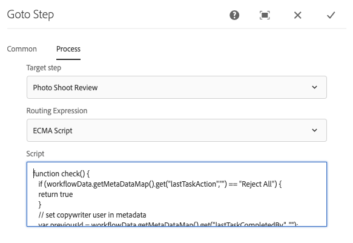

# 創意專案與PIM整合 {#creative-project-and-pim-integration}

如果您是行銷人員或創意專業人員，可以使用Adobe Experience Manager(AEM)中的創意專案工具，管理組織內與電子商務相關的產品攝影和相關的創意流程。

您可以使用Creative Project簡化像片拍攝工作流程中的下列工作：

* 產生像片拍攝請求
* 上傳像片
* 協作拍攝照片
* 封裝已核准的資產

>[!NOTE]
>
>請參閱 [專案使用者角色以取得資訊](/help/sites-authoring/projects.md#user-roles-in-a-project) 將使用者角色和工作流程指派給特定類型的使用者時，以執行此工作。

## 產品像片拍攝工作流程  {#exploring-product-photo-shoot-workflows}

創意專案提供各種專案範本，以符合不同的專案需求。 此 **產品像片拍攝專案** 範本可立即使用。 此範本包含像片拍攝工作流程，可讓您起始和管理產品像片拍攝請求。 它還包含一系列任務，使您能夠通過適當的審核和批准流程獲得產品的數字影像。

## 建立產品像片拍攝專案 {#create-a-product-photo-shoot-project}

1. 在 **專案** 主控台，點選或按一下 **建立** 然後選擇 **建立專案** 從清單中。

   

1. 在 **建立專案** 頁面，選擇 **產品像片拍攝專案** 範本，點選或按一下 **下一個**.

   

1. 輸入項目詳細資訊，包括標題、說明和到期日。 新增使用者並為其指派各種角色。 您也可以為專案新增縮圖。

   

1. 點選或按一下&#x200B;**建立**。確認訊息會通知專案已建立。
1. 點選或按一下 **完成** 返回 **專案** 控制台。 或者，點選或按一下 **開啟** 檢視專案內的資產。

## 在產品像片拍攝專案中開始工作 {#starting-work-in-a-product-photo-shoot-project}

若要起始像片拍攝請求，請點選或按一下專案，然後點選或按一下 **添加工作** 在「專案詳細資訊」頁面中，以啟動工作流程。


A **產品像片拍攝專案** 包含下列現成可用的工作流程：

* **產品像片拍攝（商務整合）工作流程**:此工作流利用與產品資訊管理(PIM)系統的商務整合，自動為所選產品（層次）生成快照清單。 工作流程完成後，您可以在資產中繼資料中檢視產品資料。
* **產品像片拍攝工作流程**:此工作流程可讓您提供快照清單，而非視商務整合而定。 它會將上傳的影像對應至專案資產資料夾中的CSV檔案。

使用 **產品像片拍攝（商務整合）** 將影像資產與AEM中的產品對應的工作流程。 此工作流程會運用商務整合，將已核准的影像連結至位置的現有產品資料 `/etc/commerce`.

此 **產品像片拍攝（商務整合）** 工作流程包含下列工作：

* 建立鏡頭清單
* 上傳拍照
* 重新接觸像片拍攝
* 審核和批准
* 移至生產任務

如果AEM中沒有產品資訊，請使用 **產品像片拍攝** 工作流程，根據您上傳至CSV檔案的詳細資訊，將影像資產與產品對應。 CSV檔案必須包含基本產品資訊，例如產品ID、類別和說明。 工作流程會擷取產品的已核准資產。

此工作流程包含下列工作：

* 上傳鏡頭清單
* 上傳拍照
* 重新接觸像片拍攝
* 審核和批准
* 移至生產任務

您可以使用工作流配置選項自定義此工作流。

這兩個工作流程都包含將產品與其已核准資產連結的步驟。 每個工作流程都包含下列步驟：

* 工作流配置：說明自訂工作流程的選項
* 啟動專案工作流程：說明如何開始製作產品像片
* 工作流任務詳細資訊：提供工作流中可用任務的詳細資訊

## 追蹤專案進度 {#tracking-project-progress}

您可以監控專案內的作用中/完成任務，以追蹤專案的進度。

使用以下項來監視項目進度：

* 任務卡
* 任務清單

任務卡描述了項目的整體進度。 只有在專案有任何相關任務時，才會顯示在專案詳細資訊頁面上。 任務卡根據已完成的任務數顯示項目的當前完成狀態。 不包含未來的工作。

任務卡提供以下詳細資訊：

* 活動任務的百分比
* 已完成任務的百分比


任務清單提供有關項目當前活動工作流任務的詳細資訊。 若要顯示清單，請點選或按一下工作卡。 任務清單還顯示元資料，如開始日期、到期日、受託人、優先順序和任務狀態。


## 工作流程設定 {#workflow-configuration}

此任務涉及根據用戶的角色為用戶分配工作流步驟。

若要設定 **產品像片拍攝** 工作流程：

1. 導覽至 **工具** > **工作流程**，然後點選 **模型** 圖磚以開啟 **工作流程模型** 頁面。
1. 選取 **產品像片拍攝** 工作流程，並點選 **編輯** 圖示以在編輯模式中開啟它。

   

1. 在 **產品像片拍攝工作流程** 頁，開啟項目任務。 例如，開啟 **上傳鏡頭清單** 任務。

   

1. 點選或按一下 **任務** 標籤來設定下列項目：

   * 任務名稱
   * 接收任務的預設用戶（角色）
   * 任務的預設優先順序，該優先順序顯示在用戶的任務清單中
   * 在受託人開啟任務時將顯示的任務說明
   * 任務的到期日期，根據任務開始時間計算

1. 按一下 **確定** 儲存配置設定。

您可以為 **產品像片拍攝** 工作流程。

執行相同步驟來設定 **產品像片拍攝（商務整合）工作流程**.

## 啟動專案工作流程 {#starting-a-project-workflow}

本節將說明如何將產品資訊管理與您的創意專案整合。

1. 導覽至產品像片拍攝專案，然後點選或按一下 **添加工作** 圖示 **工作流程** 卡片。
1. 選取 **產品像片拍攝（商務整合）** 要啟動的工作流卡 **產品像片拍攝（商務整合）** 工作流程。 如果產品資訊不在 `/etc/commerce`，請選取 **產品像片拍攝** 工作流程並啟動 **產品像片拍攝** 工作流程。

   

1. 點選或按一下 **下一個** 以起始專案中的工作流程。
1. 在下一頁輸入工作流詳細資訊。

   

1. 點選或按一下 **提交** 來啟動像片拍攝工作流程。 畫面隨即顯示像片拍攝專案的專案詳細資訊頁面。

   

### 工作流任務詳細資訊 {#workflow-tasks-details}

像片拍攝工作流程包含數項工作。 每個任務都根據為任務定義的配置分配給用戶組。

#### 建立快照清單任務 {#create-shot-list-task}

此 **建立鏡頭清單** 任務使項目所有者能夠選擇需要映像的產品。 根據使用者選取的選項，產生包含基本產品資訊的CSV檔案。

1. 在專案資料夾中，點選或按一下 [任務卡](#tracking-project-progress) 查看工作流中的任務項。

   

1. 選取 **建立鏡頭清單** 任務，然後點選/按一下 **開啟** 圖示。

   

1. 檢閱任務詳細資訊，然後點選/按一下 **建立鏡頭清單** 按鈕。

   

1. 選擇存在產品資料的產品，但沒有關聯的影像。

   

1. 點選或按一下 **添加到鏡頭清單** 按鈕，以建立包含所有此類產品清單的CSV檔案。 訊息會確認已針對所選產品建立擷取清單。 按一下 **關閉** 以完成工作流程。

1. 建立鏡頭清單後， **查看鏡頭清單** 連結。 若要將更多產品新增至擷取清單，請點選或按一下 **添加到鏡頭清單**. 在這種情況下，資料會附加至最初建立的鏡頭清單。

   

1. 點選或按一下 **查看鏡頭清單** 查看新的鏡頭清單。

   

   若要編輯現有資料或新增資料，請點選/按一下 **編輯** 的上界。 僅**產品** **說明** 欄位可編輯。

   

   更新檔案後，點選或按一下 **儲存** ，以儲存檔案。

1. 新增產品後，點選或按一下 **完成** 圖示 **建立鏡頭清單** 「任務詳細資訊」頁以將任務標籤為已完成。 您可以新增選用備注。

任務的完成在項目中引入了以下更改：

* 與產品階層對應的資產會建立在與工作流程標題同名的資料夾中。
* 即使攝影師提供影像之前，資產的中繼資料也會透過Assets控制台變成可編輯。
* 建立照片拍攝資料夾，該資料夾儲存攝影師提供的影像。 照片拍攝資料夾包含照片清單中每個產品條目的子資料夾。

### 上載鏡頭清單任務 {#upload-shot-list-task}

此任務是「產品像片拍攝」工作流程的一部分。 如果AEM中沒有產品資訊，請執行此任務。 在此情況下，您會以需要影像資產的CSV檔案上傳產品清單。 您會根據CSV檔案中的詳細資訊，將影像資產與產品對應。 檔案必須是名為的CSV檔案 `shotlist.csv`.

使用 **查看鏡頭清單** 在上一個程式的專案卡底下連結，以下載範例CSV檔案。 檢閱範例檔案，了解CSV檔案的一般內容。

產品清單或CSV檔案可包含欄位，例如 **類別，產品， Id，說明**，和 **路徑**. 此 **Id** 欄位為必填欄位，且包含產品ID。 其他欄位為選用。

產品可以屬於特定類別。 產品類別可以在下方的CSV中列出 **類別** 欄。 此 **產品** 欄位包含產品名稱。 在 **說明** 欄位，輸入攝影師的產品說明或說明。

1. 在專案資料夾中，點選或按一下 [任務卡](#tracking-project-progress) 查看工作流中的任務清單。
1. 選取 **上傳鏡頭清單** 任務，然後點選或按一下 **開啟** 圖示。

   

1. 檢閱任務詳細資訊，然後點選或按一下 **上傳鏡頭清單** 按鈕。

   

1. 點選或按一下 **上傳鏡頭清單** 按鈕上傳CSV檔案。 工作流程會將此檔案辨識為來源，以用於擷取下一個工作的產品資料。
1. 上傳包含適當格式之產品資訊的CSV檔案。 此 **檢視已上傳的資產** 上傳CSV檔案後，連結會顯示在資訊卡下方。

   

   按一下 **完成** 表徵圖以完成任務。

1. 點選/按一下 **完成** 表徵圖以完成任務。

### 上傳像片拍攝任務 {#upload-photo-shoot-task}

如果您是編輯者，則可上傳 **shotlist.csv** 在上一任務中建立或上載的檔案。

要上傳的影像名稱必須以開頭 `<ProductId_>` where `ProductId` 是從 **Id** 欄位 `shotlist.csv` 檔案。 例如，針對擷取清單中包含 **Id** `397122`，您可以上傳具有名稱的檔案 `397122_highcontrast.jpg`, `397122_lowlight.png`等。

您可以直接上傳影像，或上傳包含影像的ZIP檔案。 根據其名稱，影像會放置在像片拍攝資料夾內的個別產品資料夾中。

1. 在專案資料夾下，點選或按一下 [任務卡](#tracking-project-progress) 查看工作流中的任務項。
1. 選取 **上傳像片拍攝** 任務，然後點選或按一下 **開啟** 圖示。

   

1. 點選或按一下 **上傳像片拍攝** 上傳照片照片。
1. 點選或按一下 **完成** 表徵圖以完成任務。

### 重新接觸像片拍攝任務 {#retouch-photo-shoot-task}

如果您有編輯權限，請執行 **重新接觸像片拍攝** 編輯上傳至像片拍攝資料夾的影像。

1. 在專案資料夾下，點選或按一下右下方的點按鈕 [任務卡](#tracking-project-progress) 查看工作流中的任務項。
1. 選取 **重新接觸像片拍攝** 任務，然後點選/按一下 **開啟** 圖示。

   

1. 點選或按一下 **檢視已上傳的資產** 連結 **重新接觸像片拍攝** 頁面來瀏覽上傳的影像。

   

   如有必要，請使用Adobe Creative Cloud應用程式編輯影像。

   

1. 點選或按一下 **完成** 表徵圖以完成任務。

### 審核和批准任務 {#review-and-approve-task}

在此任務中，您將審閱由攝影師上傳的照片拍攝影像，並將影像標籤為批准使用。

1. 在專案資料夾下，點選或按一下 [任務卡](#tracking-project-progress) 查看工作流中的任務項。
1. 選取 **審核和批准** 任務，然後點選或按一下 **開啟** 圖示。

   

1. 在 **審核和批准** 頁面，將審閱任務指派給角色，然後點選或按一下 **檢閱** 開始檢閱已上傳的產品影像。

   

1. 選取產品影像，然後點選或按一下 **核准** 圖示，將其標示為已核准。 核准影像後，核准的橫幅會在影像上顯示。

   

1. 點選或按一下 **完成**. 已核准的影像會與已建立的空白資產連結。

您可能遺漏了某些產品，而沒有任何影像。 稍後，您可以重新造訪任務，並在完成後將其標示為完成。

您可以使用資產UI導覽至專案資產，並驗證已核准的影像。

點選或按一下下一個層級，以根據您的產品資料階層檢視產品。

創意專案會將已核准的資產與參考的產品建立關聯。 資產中繼資料會以 **產品資料** 標籤中，資產屬性下會顯示在「AEM資產中繼資料」區段中。

>[!NOTE]
>
>在 **產品像片拍攝工作流程** （若未整合商務），則核准的影像與產品無關。

### 移至生產任務 {#move-to-production-task}

此任務會將已核准的資產移至生產就緒資料夾，以便供使用。

1. 在專案資料夾下，點選或按一下 [任務卡](#tracking-project-progress) 查看工作流中的任務項。
1. 選取 **移至生產環境** 任務，然後點選或按一下 **開啟** 圖示。

   

1. 若要在將像片拍攝移動到生產就緒資料夾之前，檢視像片拍攝的已核准資產，請按一下 **檢視已核准的資產** 在上的專案縮圖下方連結 **移至生產環境** 任務頁。

   

1. 在 **移至** 欄位。

   

1. 點選或按一下 **移至生產環境**. 關閉確認訊息。資產會移至提及的路徑，並會根據資料夾階層，為每個產品的已核准資產自動建立回轉集。

1. 點選/按一下 **完成** 圖示。 工作流程完成，最後一個步驟標示為完成。

## 檢視DAM資產中繼資料 {#viewing-dam-asset-metadata}

在您核准後，資產就會連結至對應的產品。 此 [屬性頁面](/help/assets/manage-assets.md#editing-properties) 已核准資產的 **產品資料** （連結的產品資訊）索引標籤。 此索引標籤會顯示連結資產的產品詳細資訊、SKU編號，以及其他產品相關詳細資訊。 點選或按一下 **編輯** 圖示以更新資產屬性。 產品相關資訊仍為唯讀狀態。

點選或按一下連結，該連結會顯示以導覽至與資產相關聯的產品控制台中個別的產品詳細資料頁面。

## 自訂專案像片拍攝工作流程 {#customizing-the-project-photo-shoot-workflows}

您可以自訂 **專案像片拍攝** 工作流程。 這是選用的角色型工作，您需執行此工作，以設定專案中變數的值。 之後，您就可以使用設定的值來達成決策。

1. 按一下或點選AEM標誌，然後導覽至 **工具** > **工作流程** > **模型** 開啟 **工作流程模型** 頁面。
1. 選取 **產品像片拍攝（商務整合）** 工作流程或 **產品像片拍攝** 工作流程，以及點選或點選 **編輯** 從工具列，在編輯模式中開啟工作流程。
1. 開啟側面板，並找出 **建立基於角色的項目任務** 步驟並將其拖曳至工作流程。

   

1. 開啟 **基於角色的任務** 步驟。
1. 在 **任務** 頁簽，為將顯示在任務清單中的任務提供名稱。 您還可以將任務分配給角色、設定預設優先順序、提供說明，以及指定任務到期的時間。

   

1. 在 **路由** 頁簽，指定任務的操作。 若要新增多個動作，請點選或按一下 **新增項目** 連結。

   

1. 新增選項後，按一下 **確定** 將變更新增至步驟。

1. 回到 **工作流模型** 點選或按一下 **同步** 以儲存整個工作流程的變更。 點選或按一下 **確定** 的步驟不會儲存工作流程中的變更。 若要儲存工作流程中的變更，請點選或按一下 **同步**.

1. 開啟側面板，並找出 **轉至步驟** 並將其拖曳至工作流程。

1. 開啟 **後藤** 任務，然後點選或按一下 **程式** 標籤。

1. 選取 **目標步驟** 前往並指定 **路由表達式** 是ECMA指令碼。 然後在 **指令碼** 欄位：

   ```javascript
   function check() {
   
   if (workflowData.getMetaDataMap().get("lastTaskAction","") == "Reject All") {
   
   return true
   
   }
   
   // set copywriter user in metadata
   
   var previousId = workflowData.getMetaDataMap().get("lastTaskCompletedBy", "");
   
   workflowData.getMetaDataMap().put("copywriter", previousId);
   
   return false;
   
   }
   ```

   >[!TIP]
   >
   >如需有關工作流程步驟中指令碼的詳細資訊，請參閱 [定義OR分割的規則](/help/sites-developing/workflows-models.md).

   

1. 點選或按一下 **確定**.

1. 點選或按一下 **同步** 以儲存工作流程。

現在，在 [移至生產任務](#move-to-production-task) 已完成，並已分配給所有者。

中的使用者 **擁有者** 角色可以完成任務，並從「注釋」彈出式清單中的清單中（從工作流步驟配置中添加的操作清單中）選擇操作。

>[!NOTE]
>
>啟動伺服器時，項目任務清單servlet將快取在下定義的任務類型和URL之間的映射 `/libs/cq/core/content/projects/tasktypes`. 然後，您可以執行通常的覆蓋，並將自訂任務類型放置在 `/apps/cq/core/content/projects/tasktypes`.
