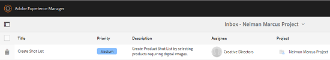
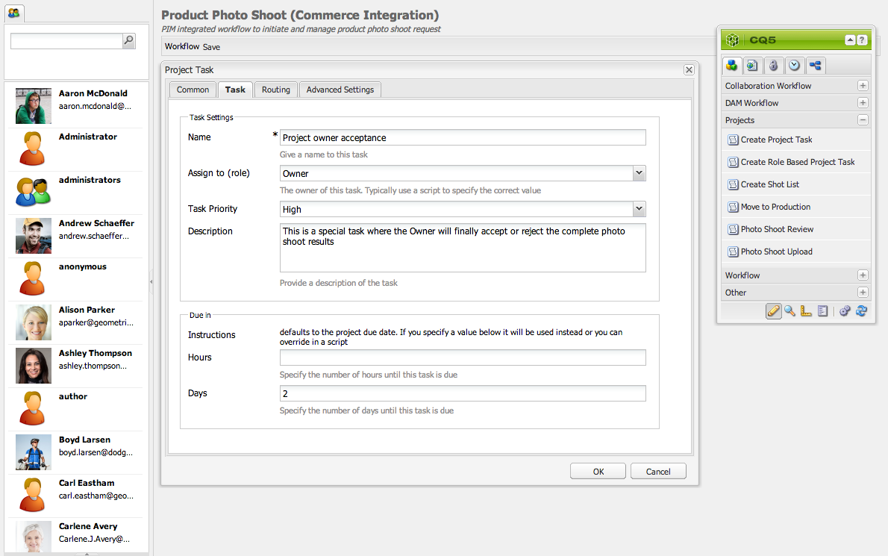
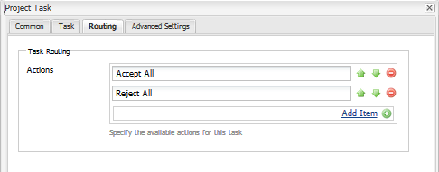

# 創意專案與PIM整合{#creative-project-and-pim-integration}

如果您是行銷人員或創意專業人員，則可以使用Adobe Experience Manager(AEM)中的Creative project工具來管理組織內與電子商務相關的產品攝影和相關的創意程式。

尤其是，您可以使用Creative project簡化像片拍攝工作流程中的下列工作：

* 產生像片拍攝要求
* 上傳像片
* 協作拍攝像片
* 封裝已核准的資產

>[!NOTE]
>
>如需 [將使用者角色和工作流程指派給特定類型使用者的詳細資訊](/help/sites-authoring/projects.md#user-roles-in-a-project) ，請參閱專案使用者角色。

## 探索產品像片拍攝工作流程 {#exploring-product-photo-shoot-workflows}

Creative project提供各種專案範本，以符合不同的專案需求。 「產 **品像片拍攝專案** 」範本現已推出。 此範本包含像片拍攝工作流程，可讓您開始並管理產品像片拍攝要求。 它也包含一系列工作，讓您透過適當的審查與核准程式，取得產品的數位影像。

範本包含下列工作流程：

* **產品像片拍攝（商務整合）工作流程**:此工作流程運用與產品資訊管理(PIM)系統的商務整合，自動產生所選產品（階層）的鏡頭清單。 在工作流程完成後，您可以將產品資料視為資產中繼資料的一部分來檢視。
* **產品像片拍攝工作流程**:此工作流程可讓您提供快照清單，而非視商務整合而定。 它會將上傳的影像對應至專案資產檔案夾中的CSV檔案。

>[!NOTE]
>
>在「產品像片拍攝」工作流程的「上傳像片」清單工作中上傳的CSV檔案應該有shotlist.csv檔案名稱。

## 建立產品像片拍攝專案 {#create-a-product-photo-shoot-project}

1. 在「專 **案** 」主控台中，點選／按一 **下「建立** 」，然後從清單 **中選擇「建立專案** 」。

   

1. 在「建 **立專案** 」頁面中，選取像片專案範本並點選／按「下 **一步」**。

   

1. 輸入專案詳細資訊，包括標題、說明和到期日。 新增使用者並指派不同的角色給他們。 您也可以新增專案的縮圖。

   

1. 點選／按一下「 **建立**」。 會出現確認訊息，通知專案已建立。
1. 點選／按一 **下「完成** 」，返回 **「專案** 」主控台。 或者，點選／按一 **下** 「開啟」，以檢視像片專案中的資產。

## 在產品像片拍攝專案中開始工作 {#starting-work-in-a-product-photo-shoot-project}

若要起始像片拍攝請求，請點選或按一下專案，然後點選／按一下專案詳細資訊頁面中的「 **Add Work** 」（新增作品），以開始工作流程。


產品像片拍攝專案包含下列現成可用的工作流程：

* 產品像片拍攝（商務整合）工作流程
* 產品像片拍攝工作流程

使用「產品像片拍攝（商務整合）」工作流程，將影像資產與AEM中的產品對應。 此工作流程運用「商務整合」，將已核准的影像連結至位於位置／等/商務 *的現有產品資料*。

「產品像片拍攝（商務整合）」工作流程包含下列工作：

* 建立鏡頭清單
* 上傳拍照
* 潤飾像片拍攝
* 審查和批准
* 移至生產任務

如果AEM中沒有產品資訊，請使用「產品像片拍攝」工作流程，根據您以CSV檔案上傳的詳細資訊，將影像資產與產品對應。 CSV檔案必須包含基本產品資訊，例如產品ID、類別和說明。 工作流程會擷取產品的已核准資產。

此工作流程包含下列工作：

* 上傳鏡頭清單
* 上傳拍照
* 潤飾像片拍攝
* 審查和批准
* 移至生產任務

您可以使用工作流程設定選項來自訂此工作流程。

這兩個工作流程都包含將產品與其核准資產連結的步驟。 每個工作流程都包含下列步驟：

* 工作流程設定：說明自訂工作流程的選項
* 啟動專案工作流程：說明如何開始拍攝產品像片
* 工作流任務詳細資訊：提供工作流中可用任務的詳細資訊

## 追蹤專案進度 {#tracking-project-progress}

您可以監控項目中的活動／完成任務，以跟蹤項目的進度。

使用下列功能來監控專案進度：

* **工作卡**

* **任務清單**

「任務卡」顯示項目的整體進度。 只有在項目具有任何相關任務時，它才會出現在「項目詳細資訊」頁面上。 「任務卡」根據完成的任務數顯示項目的當前完成狀態。 它不包含未來的工作。

任務卡提供以下詳細資訊：

* 活動任務的百分比
* 已完成任務的百分比


「任務」清單提供了有關項目當前活動工作流任務的詳細資訊。 若要顯示清單，請點選／按一下「工作卡」。 「任務」清單還顯示元資料，如開始日期、到期日、受託人、優先順序和任務狀態。



## 工作流程設定 {#workflow-configuration}

此任務涉及根據用戶的角色將工作流步驟分配給用戶。

若要設定「產 **品像片拍攝」工作流程** :

1. 導覽至「工 **具** >工 **作流程**」，然後點選「模型」 **方塊** ，以開啟「工作流模 **** 型」頁面。
1. 選取「 **Product Photo Shoot** 」(產品像片拍攝 **)工作流程，然後點選工具列中的「** Edit」（編輯）圖示，以在編輯模式中開啟它。

   

1. 在「產 **品像片拍攝工作流程** 」頁面中，開啟專案工作。 例如，開啟「上傳 **拍攝清單」工作** 。

   

1. 按一下「任 **務** 」頁籤以配置以下內容：

   * 任務的名稱
   * 接收任務的預設用戶（角色）
   * 任務的預設優先順序，顯示在用戶的任務清單中
   * 工作負責人開啟任務時將顯示的任務說明
   * 任務的到期日期，根據任務開始的時間計算

1. 按一下 **確定** ，保存配置設定。

   同樣地，您也可以為「產品像片拍攝」工作 **流程設定下列工作** :

   * 上傳拍照
   * 潤飾產品像片拍攝
   * 拍照評論
   * 移至生產環境
   執行類似的程式，在「產品像片拍攝(商 **務整合)」工作流程中設定工作**。

本節說明如何將產品資訊管理與您的創意專案整合。

## 啟動項目工作流 {#starting-a-project-workflow}

1. 導覽至「產品像片拍攝」專案，然後點選／按一下「工 **作流程」卡上的** 「新增工 **作** 」圖示。
1. 選取「 **產品像片拍攝（商務整合）** 」工作流程卡，以啟動「產品像片拍攝（商務整合）」工作流程。 如果/etc/commerce下方未提供產品資訊，請選取「產品像片拍攝」工作流程，然後啟動「產品像片拍攝 **** 」工作流程。

   

1. 點選／按一 **下「下一** 步」，以啟動專案中的工作流程。
1. 在下一頁輸入工作流詳細資訊。

   

   按一 **下「送出** 」以啟動像片拍攝工作流程。 隨即顯示像片拍攝專案的專案詳細資訊頁面。

   

### 工作流任務詳細資訊 {#workflow-tasks-details}

像片拍攝工作流程包含數項工作。 根據為任務定義的配置，將每個任務分配給用戶組。

#### 建立快照清單任務 {#create-shot-list-task}

「建 **立拍攝清單** 」工作可讓專案擁有者選擇需要影像的產品。 根據用戶選擇的選項，生成包含基本產品資訊的CSV檔案。

1. 在專案資料夾中，點選／按一下「工作卡」中的省略號 [](#tracking-project-progress) ，以在工作流程中檢視工作項目。

   

1. 選擇「 **Create Shot List** 」(建立拍攝清單 **)任務，然後從工具欄中點選／按一下「** Open」（開啟）表徵圖。

   

1. 檢閱工作詳細資訊，然後點選／按一下「建 **立快照清單** 」按鈕。

   

1. 選擇產品資料不含關聯影像的產品。

   

1. 點選／按一 **下「新增至分鏡清單** 」圖示，建立包含所有此類產品清單的CSV檔案。 訊息會確認已針對選取的產品建立拍攝清單。 按一 **下「關閉** 」以完成工作流程。
1. 在您建立快照清單後，會出 **現「檢視快照清單** 」連結。 若要新增更多產品至鏡頭清單，請點選／按一下「新 **增至鏡頭清單」**。 在這種情況下，資料會附加至最初建立的快照清單。

   

1. 點選／按一 **下「檢視鏡頭清單** 」以檢視新的鏡頭清單。

   

   若要編輯現有資料或新增資料，請點選／按一下工具 **列中的** 「編輯」。 只有**Product **和 **Description** 欄位可編輯。

   

   更新檔案後，點選／按一下工具列上的 **「儲存** 」以儲存檔案。

1. 新增產品後，點選／按一下「 ****建立快照清單** **任務詳細資訊」頁面上的「完成」圖示，將任務標示為完成。 您可以新增選用的註解。

   任務完成後，項目中將進行以下更改：

   * 與產品階層對應的資產會建立在與工作流程標題同名的檔案夾中。
   * 即使在攝影師提供影像之前，資產的中繼資料也會使用「資產」主控台進行編輯。
   * 會建立「像片拍攝」檔案夾，儲存攝影師提供的影像。 「像片拍攝」檔案夾包含「拍攝清單」中每個產品項目的子檔案夾。
   對於「產品像片拍攝」（不含商務整合）工作流程，「上傳像片清單」是第一項工作。 點選／按一 **下「上傳鏡頭清單** 」以上 **傳shotlist.csv檔案** 。 CSV檔案應包含產品ID。 其他欄位則為選用。 您可使用它們將資產對應至產品。

### 上傳鏡頭清單工作 {#upload-shot-list-task}

這項工作是「產品像片拍攝」工作流程的一部分。 如果AEM中沒有產品資訊，請執行此工作。 在這種情況下，您會以需要影像資產的CSV檔案上傳產品清單。 根據CSV檔案中的詳細資訊，您可以將影像資產與產品對應。

使用上 **一程式專案卡下方的「檢視快照清單** 」連結，下載範例CSV檔案。 檢閱範例檔案，瞭解CSV檔案的一般內容。

產品清單或CSV檔案可包含欄位，例如「 **類別」、「產品」、「Id」、「說明**」和 **「路徑」**。 「 **Id** 」欄位是必填欄位，並包含產品ID。 其他欄位則為選用。

產品可以屬於特定類別。 產品類別可以列在「類別」欄下方的CSV **中** 。 「產 **品** 」欄位包含產品名稱。 在「說 **明** 」欄位中，輸入攝影師的產品說明或指示。

>[!NOTE]
>
>要上傳的影像名稱應以&quot;**&lt;ProductId>_&quot;開頭** ，其中產品ID是從Shotlist.csv檔案的 **Id欄位** 引用的 ** 。 例如，對於 **Id 397122**&#x200B;的拍攝清單中的產品，您可以上傳名稱為 **397122_highcontrast.jpg**、 **397122_lowlight.png**，依此類推。

1. 在專案資料夾中，點選／按一下「工作卡」中的省略號 [](#tracking-project-progress) ，以檢視工作流程中的工作清單。
1. 選取「上 **傳鏡頭清單** 」工作，然後點選／按一下工具列中的「 **Open** 」圖示。

   

1. 檢閱工作詳細資訊，然後點選／按一下「上 **傳鏡頭清單** 」按鈕。

   

1. 點選／按一下「 **上傳鏡頭清單」按鈕** ，以上傳檔案名稱shotlist.csv的CSV檔案。 工作流程會將此檔案辨識為用來擷取下一工作產品資料的來源。
1. 上傳包含適當格式產品資訊的CSV檔案。 CSV檔 **案上傳後** ,「檢視已上傳的資產」連結會顯示在卡片下方。

   

   按一下「 **完成** 」圖示以完成工作。

1. 點選／按一下「 **完成** 」圖示以完成工作。

### 上傳像片拍攝工作 {#upload-photo-shoot-task}

如果您是編輯者，則可上傳前一個工作中建立或上傳之 **shotlist.csv** 檔案中所列產品的像片。

要上傳的影像名稱應以 **&quot;&lt;productId>_&quot;開頭** ，其中Product ID是從Shotlist.csv檔案的 **Id欄位** 引用的 **** 。 例如，對於在拍攝清單中 **ID為397122** 的產品，您可以上傳名稱為 **397122_highcontrast.jpg**、 **397122_lowlight.png**，依此類推。

您可以直接上傳影像，或上傳包含影像的ZIP檔案。 根據影像的名稱，影像會放在像片拍攝資料夾中的相 **應產品** 資料夾中。

1. 在項目資料夾下，點選／按一下「任務卡」中的 [橢圓](#tracking-project-progress) ，以查看工作流中的任務項。
1. 選取「 **上傳像片拍攝** 」工作，然後點選／按一下工具列中的「 **Open** 」圖示。

   

1. 點選／按一 **下「上傳像片拍攝** 」並上傳像片拍攝影像。
1. 點選／按一下工 **具列中的** 「完成」圖示以完成工作。

### 潤飾像片拍攝工作 {#retouch-photo-shoot-task}

如果您有編輯權限，請執行「潤飾像片拍攝」工作，以編輯上傳至「像片拍攝」檔案夾的影像。

1. 在項目資料夾下，點選／按一下「任務卡」中的 [橢圓](#tracking-project-progress) ，以查看工作流中的任務項。
1. 選取「潤 **飾像片拍攝」工作** ，然後點選／按一下工具列中的「 **Open** 」（開啟）圖示。

   

1. 點選／按一下「 **潤飾像片拍攝」頁面中的「檢** 視已上傳的資產 **** 」連結，以瀏覽已上傳的影像。

   

   如有需要，請使用Adobe Creative cloud應用程式編輯影像。

   

1. 點選／按一下工 **具列中的** 「完成」圖示以完成工作。

### 審查和批准任務 {#review-and-approve-task}

在此工作中，您會檢閱攝影師上傳的像片像片像片，並將影像標示為已核准使用。

1. 在項目資料夾下，點選／按一下「任務卡」中的 [橢圓](#tracking-project-progress) ，以查看工作流中的任務項。
1. 選取「 **Review &amp; Approve」(審閱和核准** )工作，然後點選／按一下工具列中的「 **Open** 」（開啟）圖示。

   

1. 在「審 **閱與核准** 」頁面中，將審閱工作指派給角色（例如「審閱者」），然後點選／按一下**「審閱」**，開始審閱已上傳的產品影像。

   

1. 選取產品影像，然後點選／按一下工具列中的「核准」圖示，將其標示為已核准。

   

   在您核准影像後，會在影像上顯示已核准的橫幅。

   >[!NOTE]
   您可能會遺漏某些沒有影像的產品。 稍後，您可以重新造訪工作，並標籤完成。

1. 點選／按一下「 **完成**」。 已核准的影像會與已建立的空白資產連結。

您可以使用資產使用者介面導覽至專案資產，並驗證已核准的影像。

點選／按一下下一個層級，以根據您的產品資料階層來檢視產品。

Creative project會將已核准的資產與參考的產品建立關聯。 資產中繼資料會以產品參考和基本資訊更新，這些資料會顯示在「 **Product Data** 」標籤的「AEM資產中繼資料」區段中的資產屬性下。

>[!NOTE]
在「產品像片拍攝」工作流程中（未整合商務），已核准的影像與產品沒有任何關聯。

### 移至生產任務 {#move-to-production-task}

此任務會將已核准的資產移至可立即生產使用的檔案夾，以供使用。

1. 在項目資料夾下，點選／按一下「任務卡」中的 [橢圓](#tracking-project-progress) ，以查看工作流中的任務項。
1. 選取「移 **至生產」工作** ，然後點選／按一下工具列中的「 **Open** 」圖示。

   

1. 若要在將像片拍攝移至生產就緒檔案夾之前檢視已核准的資產，請按一下「移至生產」工作頁面中專案縮圖下方的「檢視已核准的資產 **」連****** 結。

   

1. 在「移至」欄位中輸入生產就緒資料 **夾的路徑** 。

   

   點選／按一 **下「移至生產」**。 關閉確認消息。 資產會移至上述路徑，並根據資料夾階層，為每個產品的已核准資產自動建立回轉集。

1. 點選／按一下工 **具列中** 「完成」圖示。 當最後一個步驟標示為完成時，工作流程便會完成。

## 檢視DAM資產中繼資料 {#viewing-dam-asset-metadata}

在您核准後，資產會連結至對應的產品。 核准 [資產的「屬性](/help/assets/managing-assets-touch-ui.md#editing-properties) 」頁面現在有額外的「產品 **資料** 」（連結的產品資訊）標籤。 此標籤會顯示連結資產的產品詳細資訊、SKU編號和其他產品相關的詳細資訊。 點選／按一下「 **編輯** 」圖示以更新資產屬性。 產品相關資訊仍為唯讀。

點選／按一下顯示的連結，以導覽至與資產相關聯之產品主控台中各自的產品詳細資料頁面。

## 自訂專案像片拍攝工作流程 {#customizing-the-project-photo-shoot-workflows}

您可以根據需求自訂專案像片拍攝工作流程。 這是一項可選的、基於角色的任務，您執行此任務時，可設定項目中變數的值。 之後，您就可以使用設定的值來達成決策。

1. 按一下／點選AEM標誌，然後導覽至「工具 **>工作流程** >模型」 ******** ，以開啟「工作流程模型」頁面。
1. 選取「 **產品像片拍攝（商務整合）** 」工作流程或「產品像片拍攝 **」工作流程，並從工具列按一下／點選「** Edit **** 」（編輯），以在編輯模式中開啟工作流程。
1. 在側腳 **中開啟** 「專案」工作，並將「建立以角 **** 色為基礎的專案任務」步驟拖曳至工作流程。

   

1. 開啟基 **於角色的任務** 。
1. 在「任 **務** 」頁籤中，為將顯示在「任務清單」中的「任 **務** 」提供名稱。 您也可以將任務指派給角色、設定預設優先順序、提供說明，以及指定任務到期的時間。

   

1. 在「路 **由** 」頁籤中，指定任務的操作。 若要新增多個動作，請點選／按一下「**新增項目**」連結。

   

1. 添加選項後，按一下「 **確定** 」(OK)將更改添加到步驟。

   >[!NOTE]
   點選／按一 **下「確定** 」不會儲存工作流程中的變更。 若要儲存工作流程中的變更，請點選／按一下「 **儲存**」。

1. 從側腳 **開啟** 「工作流程」工作，並新增 **Goto** 任務。
1. 開啟「 **Goto** 」工作，點選／按一下「 **Process** 」標籤。
1. 在「指令碼」方塊中指定 **下列程式碼** :

```
   function check() {

   if (workflowData.getMetaDataMap().get("lastTaskAction","") == "Reject All") {

   return true

   }

   // set copywriter user in metadata

   var previousId = workflowData.getMetaDataMap().get("lastTaskCompletedBy", "");

   workflowData.getMetaDataMap().put("copywriter", previousId);

   return false;

   }
```

>[!NOTE]
如需有關工作流程步驟中指令碼的詳細資訊，請 [參閱「定義OR分割的規則」](/help/sites-developing/workflows-models.md)。


1. 點選／按一下「 **確定**」。

1. 點選／按一下「 **儲存** 」以儲存工作流程。

   

1. 現在，在「移至生產」任務完成並分配給所有 [者後](#move-to-production-task) ，將會出現一個新的項目所有者接受任務。

   「擁有者」角色中的使用者可以完成工作，並從「注釋」彈出式清單的清單中選取動作（從工作流程步驟設定中新增的動作清單）。

   

   選擇適當的選項，然後單 **擊** 「完成」(Complete)，在工 **作流中運行「轉到步驟** 」(Goto Step)。

>[!NOTE]
啟動伺服器時，項目任務清單servlet會快取在以下定義的任務類型和URL之間的映射 `/libs/cq/core/content/projects/tasktypes`。 然後，您可以將常用覆蓋放置在下方，並新增自訂工作類型 `/apps/cq/core/content/projects/tasktypes`。

