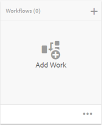
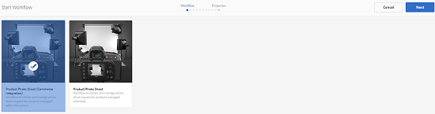
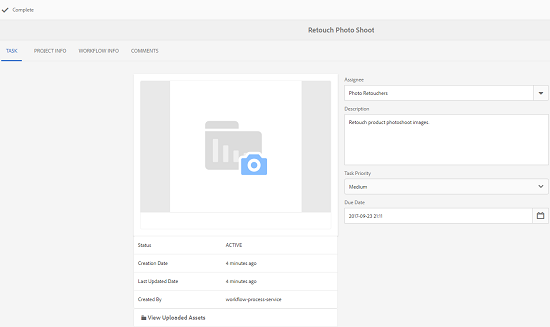

# Creative Project與PIM整合 {#creative-project-and-pim-integration}

如果您是行銷人員或創意專業人員，可以使用Adobe Experience Manager (AEM)中的創意專案工具來管理電子商務相關的產品攝影和您組織內的相關創意流程。

您可以使用Creative Project來簡化您的拍照工作流程中的下列工作：

* 產生拍照要求
* 正在上傳拍照
* 共同作業拍照
* 封裝已核准的資產

>[!NOTE]
>
>如需將使用者角色和工作流程指派給特定使用者型別的相關資訊，請參閱[專案使用者角色](/help/sites-authoring/projects.md#user-roles-in-a-project)。

## 產品拍照工作流程  {#exploring-product-photo-shoot-workflows}

Creative Project提供各種專案範本以滿足各種專案需求。 **產品拍照專案**&#x200B;範本現成可用。 此範本包含拍照工作流程，可讓您起始及管理產品拍照請求。 其中還包括一系列工作，可讓您透過適當的稽核和核准程式取得產品的數位影像。

## 建立產品拍照專案 {#create-a-product-photo-shoot-project}

1. 在&#x200B;**專案**&#x200B;主控台中，按一下&#x200B;**建立**，然後從清單中選擇&#x200B;**建立專案**。

   

1. 在&#x200B;**建立專案**&#x200B;頁面中，選取&#x200B;**產品拍照專案**&#x200B;範本，然後按一下&#x200B;**下一步**。

   

1. 輸入專案詳細資訊，包括標題、說明和到期日。 新增使用者並指派各種角色給他們。 您也可以為專案新增縮圖。

   

1. 按一下「**建立**」。確認訊息會通知專案已建立。
1. 按一下&#x200B;**完成**&#x200B;以返回&#x200B;**專案**&#x200B;主控台。 或者，按一下&#x200B;**開啟**&#x200B;以檢視專案中的資產。

## 在產品像片拍攝專案中開始工作 {#starting-work-in-a-product-photo-shoot-project}

若要起始拍照要求，請按一下專案，然後按一下專案詳細資訊頁面中的[新增工作] ****&#x200B;以開始工作流程。



**產品拍照專案**&#x200B;包含下列現成的工作流程：

* **產品拍照(Commerce整合)工作流程**：此工作流程使用商務整合與產品資訊管理(PIM)系統，以自動產生所選產品（階層）的拍攝清單。 在工作流程完成後，您可以檢視產品資料作為資產中繼資料的一部分。
* **產品拍照工作流程**：此工作流程可讓您提供拍照清單，而非根據商業整合而定。 這會將上傳的影像對應至專案資產資料夾中的CSV檔案。

使用&#x200B;**產品拍照(Commerce整合)**&#x200B;工作流程，將影像資產與AEM中的產品對應。 此工作流程使用商務整合，將核准的影像連結至位置`/etc/commerce`的現有產品資料。

**產品拍照(Commerce整合)**&#x200B;工作流程包含下列工作：

* 建立快照清單
* 上傳拍照
* 潤飾拍照
* 檢閱和核准
* 移至生產任務

如果AEM中沒有可用的產品資訊，請使用&#x200B;**產品拍照**&#x200B;工作流程，根據您在CSV檔案中上傳的詳細資訊，將影像資產與產品對應。 CSV檔案必須包含基本產品資訊，例如產品ID、類別和說明。 工作流程會擷取產品的已核准資產。

此工作流程包含下列作業：

* 上傳快照清單
* 上傳拍照
* 潤飾拍照
* 檢閱和核准
* 移至生產任務

您可以使用工作流程組態選項來自訂此工作流程。

這兩個工作流程都包含將產品與其核准的資產連結的步驟。 每個工作流程都包含下列步驟：

* 工作流程組態：說明自訂工作流程的選項
* 開始專案工作流程：說明如何開始產品像片拍攝
* 工作流程任務詳細資訊：提供工作流程中可用任務的詳細資訊

## 追蹤專案進度 {#tracking-project-progress}

您可以透過監視專案中作用中/已完成的任務來追蹤專案進度。

使用下列專案來監視專案的進度：

* 任務卡
* 任務清單

任務卡可描述專案的整體進度。 只有在專案具有任何相關任務時，它才會出現在專案詳細資訊頁面上。 任務卡會根據完成的任務數顯示專案的目前完成狀態。 其中不包含未來的任務。

任務卡提供下列詳細資訊：

* 作用中任務的百分比
* 已完成任務的百分比


任務清單提供有關專案目前作用中工作流程任務的詳細資訊。 若要顯示清單，請按一下工作卡。 工作清單也會顯示中繼資料，例如工作的開始日期、到期日、受指派人、優先順序和狀態。


## 工作流程設定 {#workflow-configuration}

此任務涉及根據使用者的角色指派工作流程步驟給使用者。

若要設定&#x200B;**產品拍照**&#x200B;工作流程：

1. 導覽至&#x200B;**工具** > **工作流程**，然後選取&#x200B;**模型**&#x200B;圖磚，以開啟&#x200B;**工作流程模型**&#x200B;頁面。
1. 選取&#x200B;**產品拍照**&#x200B;工作流程，然後從工具列選取&#x200B;**編輯**&#x200B;圖示以在編輯模式中開啟。

   

1. 在&#x200B;**產品拍照工作流程**&#x200B;頁面中，開啟專案任務。 例如，開啟&#x200B;**上傳快照清單**&#x200B;工作。

   

1. 按一下「**工作**」標籤以設定下列專案：

   * 任務名稱
   * 接收任務的預設使用者（角色）
   * 任務的預設優先順序，顯示在使用者的任務清單中
   * 受指派人開啟任務時要顯示的任務說明
   * 任務的到期日，根據任務開始時間計算

1. 按一下&#x200B;**確定**&#x200B;以儲存組態設定。

您可以類似方式設定&#x200B;**產品拍照**&#x200B;工作流程的其他工作。

執行相同的步驟來設定&#x200B;**產品拍照(Commerce整合)工作流程**&#x200B;中的工作。

## 啟動專案工作流程 {#starting-a-project-workflow}

本節說明如何將產品資訊管理與您的創意專案整合。

1. 導覽至產品像片拍攝專案，然後按一下&#x200B;**工作流程**&#x200B;卡片上的&#x200B;**新增工作**&#x200B;圖示。
1. 選取&#x200B;**產品拍照(Commerce整合)**&#x200B;工作流程卡以開始&#x200B;**產品拍照(Commerce整合)**&#x200B;工作流程。 如果`/etc/commerce`下沒有產品資訊，請選取&#x200B;**產品拍照**&#x200B;工作流程，並啟動&#x200B;**產品拍照**&#x200B;工作流程。

   

1. 按一下[下一步]****&#x200B;以啟動專案中的工作流程。
1. 在下一頁輸入工作流程詳細資訊。

   

1. 按一下&#x200B;**提交**&#x200B;以開始拍照工作流程。 此時會顯示像片拍攝專案的專案詳細資訊頁面。

   

### 工作流程任務詳細資訊 {#workflow-tasks-details}

拍照工作流程包含數個任務。 根據為任務定義的配置，將每個任務指派給使用者群組。

#### 建立快照清單任務 {#create-shot-list-task}

**建立快照清單**&#x200B;工作可讓專案所有者選取需要影像的產品。 系統會根據使用者選取的選項，產生包含基本產品資訊的CSV檔案。

1. 在專案資料夾中，按一下[任務卡](#tracking-project-progress)右下方的省略符號按鈕，以檢視工作流程中的任務專案。

   

1. 選取&#x200B;**建立快照清單**&#x200B;工作，然後從工具列按一下&#x200B;**開啟**&#x200B;圖示。

   

1. 檢閱工作詳細資訊，然後按一下&#x200B;**建立快照清單**&#x200B;按鈕。

   

1. 選取產品資料不存在相關聯影像的產品。

   

1. 按一下&#x200B;**加入拍攝清單**&#x200B;按鈕，建立包含所有此類產品清單的CSV檔案。 系統會傳送一則訊息，確認系統已針對所選產品建立快照清單。 按一下&#x200B;**關閉**&#x200B;以完成工作流程。

1. 建立快照清單後，**檢視快照清單**&#x200B;連結就會顯示。 若要新增更多產品至快照清單，請按一下&#x200B;**新增至快照清單**。 在這種情況下，資料會附加至最初建立的快照清單。

   

1. 按一下&#x200B;**檢視快照清單**&#x200B;以檢視新的快照清單。

   

   若要編輯現有資料或新增資料，請按一下工具列中的[編輯]。 ****&#x200B;只能編輯**Product**和&#x200B;**Description**&#x200B;欄位。

   

   更新檔案後，按一下工具列上的&#x200B;**儲存**&#x200B;以儲存檔案。

1. 新增產品後，請按一下&#x200B;**建立快照清單**&#x200B;工作詳細資訊頁面上的&#x200B;**完成**&#x200B;圖示，將工作標示為已完成。 您可以新增選擇性註解。

任務的完成會在專案中引進以下變更：

* 與產品階層相對應的Assets會在與工作流程標題同名的資料夾中建立。
* 即使是在攝影師提供影像之前，資產的中繼資料已可使用Assets主控台進行編輯。
* 建立像片拍攝資料夾，用以儲存攝影師提供的影像。 像片拍攝資料夾包含拍攝清單中每個產品專案的子資料夾。

### 上傳快照清單任務 {#upload-shot-list-task}

此工作是產品像片拍攝工作流程的一部分。 如果AEM中沒有產品資訊，請執行此工作。 在此情況下，您會以CSV檔案上傳需要影像資產的產品清單。 您可以根據CSV檔案的詳細資訊，將影像資產與產品對應。 檔案必須是名為`shotlist.csv`的CSV檔案。

使用前一個程式中，專案卡下的&#x200B;**檢視快照清單**&#x200B;連結來下載範例CSV檔案。 檢閱範例檔案以瞭解CSV檔案的常見內容。

產品清單或CSV檔案可以包含欄位，例如&#x200B;**類別、產品、識別碼、描述**&#x200B;和&#x200B;**路徑**。 **Id**&#x200B;欄位是必要欄位，且包含產品ID。 其他欄位為選用欄位。

產品可屬於特定類別。 產品類別可以列在&#x200B;**類別**&#x200B;欄下的CSV中。 **Product**&#x200B;欄位包含產品的名稱。 在&#x200B;**描述**&#x200B;欄位中，輸入攝影師的產品描述或指示。

1. 在專案資料夾中，按一下[任務卡](#tracking-project-progress)右下方的省略符號按鈕，以檢視工作流程中的任務清單。
1. 選取&#x200B;**上傳快照清單**&#x200B;工作，然後從工具列按一下&#x200B;**開啟**&#x200B;圖示。

   

1. 檢閱工作詳細資料，然後按一下&#x200B;**上傳快照清單**&#x200B;按鈕。

   

1. 按一下&#x200B;**上傳快照清單**&#x200B;按鈕上傳CSV檔案。 工作流程會將此檔案辨識為來源，以用於擷取下一個工作的產品資料。
1. 上傳包含適當格式之產品資訊的CSV檔案。 上傳CSV檔案後，卡片下方會顯示&#x200B;**檢視已上傳的Assets**&#x200B;連結。

   

   按一下&#x200B;**完成**&#x200B;圖示以完成工作。

1. 按一下&#x200B;**完成**&#x200B;圖示以完成工作。

### 上傳拍照任務 {#upload-photo-shoot-task}

如果您是編輯者，可以上傳在前一個任務中建立或上傳之&#x200B;**shotlist.csv**&#x200B;檔案中所列產品的快照。

要上傳的影像名稱必須以`<ProductId_>`開頭，其中`ProductId`是從`shotlist.csv`檔案的&#x200B;**Id**&#x200B;欄位中參考的。 例如，對於快照清單中具有&#x200B;**識別碼** `397122`的產品，您可以上傳名稱為`397122_highcontrast.jpg`、`397122_lowlight.png`等等的檔案。

您可以直接上傳影像或上傳包含影像的ZIP檔案。 根據影像的名稱，這些影像會放置在像片拍攝資料夾中個別的產品資料夾內。

1. 在專案資料夾下，按一下[任務卡](#tracking-project-progress)右下方的省略符號按鈕，以檢視工作流程中的任務專案。
1. 選取&#x200B;**上傳拍照**&#x200B;工作，然後從工具列按一下&#x200B;**開啟**&#x200B;圖示。

   

1. 按一下&#x200B;**上傳拍照**&#x200B;並上傳拍照影像。
1. 按一下工具列中的&#x200B;**完成**&#x200B;圖示以完成工作。

### 修飾拍照任務 {#retouch-photo-shoot-task}

如果您有編輯許可權，請執行&#x200B;**潤飾拍照**&#x200B;工作，編輯上傳至拍照資料夾的影像。

1. 在專案資料夾下，按一下[任務卡](#tracking-project-progress)右下方的省略符號按鈕，以檢視工作流程中的任務專案。
1. 選取&#x200B;**潤飾拍照**&#x200B;工作，然後按一下工具列中的&#x200B;**開啟**&#x200B;圖示。

   

1. 按一下「**潤飾拍照**」頁面中的「**檢視已上傳的Assets**」連結，以瀏覽已上傳的影像。

   

   如有必要，請使用Adobe Creative Cloud應用程式編輯影像。

   

1. 按一下工具列中的&#x200B;**完成**&#x200B;圖示以完成工作。

### 檢閱及核准任務 {#review-and-approve-task}

在此任務中，您可以檢閱攝影師上傳的拍照影像，並將影像標示為已核准使用。

1. 在專案資料夾下，按一下[任務卡](#tracking-project-progress)右下方的省略符號按鈕，以檢視工作流程中的任務專案。
1. 選取&#x200B;**檢閱與核准**&#x200B;工作，然後從工具列按一下&#x200B;**開啟**&#x200B;圖示。

   

1. 在&#x200B;**檢閱與核准**&#x200B;頁面中，將檢閱工作指派給角色，然後按一下&#x200B;**檢閱**&#x200B;以開始檢閱上傳的產品影像。

   

1. 選取產品影像，然後按一下工具列中的&#x200B;**核准**&#x200B;圖示，將其標示為已核准。 核准影像後，核准的橫幅就會顯示在影像上方。

   

1. 按一下&#x200B;**完成**。 核准的影像會連結到建立的空白資產。

您可能會遺漏部分沒有任何影像的產品。 稍後，您可以重新造訪任務，並在完成後將其標籤為完成。

您可以使用Assets UI導覽至專案資產，並驗證核准的影像。

按一下下一個層級，即可根據您的產品資料階層檢視產品。

Creative Project會將核准的資產與參考的產品建立關聯。 資產中繼資料會以產品參考和基本資訊更新，位於&#x200B;**產品資料**&#x200B;索引標籤的資產屬性下，並出現在AEM資產中繼資料區段中。

>[!NOTE]
>
>在&#x200B;**產品拍照工作流程** （未進行商務整合）中，核准的影像與產品沒有關聯。

### 移至生產任務 {#move-to-production-task}

此任務會將核准的資產移至生產就緒資料夾，以便日後使用。

1. 在專案資料夾下，按一下[任務卡](#tracking-project-progress)右下方的省略符號按鈕，以檢視工作流程中的任務專案。
1. 選取「**移至生產環境**」任務，然後從工具列按一下「**開啟**」圖示。

   

1. 若要在將核准的資產移至生產就緒資料夾之前檢視照片拍攝的核准資產，請在&#x200B;**移至生產環境**&#x200B;任務頁面上的專案縮圖下方按一下&#x200B;**檢視核准的Assets**&#x200B;連結。

   

1. 在&#x200B;**移至**&#x200B;欄位中輸入生產就緒資料夾的路徑。

   

1. 按一下&#x200B;**移至生產環境**。 關閉確認訊息。資產會移至所述的路徑，並根據資料夾階層，為每個產品的已核准資產自動建立迴轉集。

1. 按一下工具列中的&#x200B;**完成**&#x200B;圖示。 當最後一個步驟標籤為完成時，工作流程即會完成。

## 檢視DAM資產中繼資料 {#viewing-dam-asset-metadata}

核准後，資產會連結至對應的產品。 已核准資產的[屬性頁面](/help/assets/manage-assets.md#editing-properties)現在有額外的&#x200B;**產品資料** （連結的產品資訊）索引標籤。 此索引標籤會顯示產品詳細資訊、SKU編號，以及連結資產的其他產品相關詳細資訊。 按一下&#x200B;**編輯**&#x200B;圖示以更新資產屬性。 產品相關資訊仍維持唯讀狀態。

按一下顯示的連結，即可導覽至與資產相關聯之產品主控台中的個別產品詳細資料頁面。

## 自訂專案拍照工作流程 {#customizing-the-project-photo-shoot-workflows}

您可以根據自己的需求，自訂&#x200B;**專案拍照**&#x200B;工作流程。 這是選用的角色型工作，您可執行此工作來設定專案中變數的值。 之後，您就可以使用設定的值來做出決定。

1. 按一下AEM標誌，然後導覽至&#x200B;**工具** > **工作流程** > **模型**，以開啟&#x200B;**工作流程模型**&#x200B;頁面。
1. 選取&#x200B;**產品拍照(Commerce整合)**&#x200B;工作流程或&#x200B;**產品拍照**&#x200B;工作流程，然後從工具列按一下&#x200B;**編輯**，以在編輯模式中開啟工作流程。
1. 開啟側面板並找到&#x200B;**建立角色型專案任務**&#x200B;步驟，然後將其拖曳至工作流程。

   

1. 開啟&#x200B;**角色型工作**&#x200B;步驟。
1. 在&#x200B;**工作**&#x200B;索引標籤上，為將顯示在工作清單中的工作提供名稱。 您也可以將工作指派給角色、設定預設優先順序、提供說明，以及指定工作到期時間。

   

1. 在&#x200B;**路由**&#x200B;索引標籤上，指定工作的動作。 若要新增多個動作，請按一下&#x200B;**新增專案**&#x200B;連結。

   

1. 新增選項之後，請按一下[確定] ****&#x200B;將變更新增至步驟。

1. 返回&#x200B;**工作流程模型**&#x200B;視窗，按一下&#x200B;**同步**&#x200B;以儲存整個工作流程的變更。 點選或按一下步驟的&#x200B;**確定**&#x200B;不會儲存工作流程中的變更。 若要儲存工作流程中的變更，請按一下[同步]。****

1. 開啟側面板並找到&#x200B;**移至步驟**&#x200B;工作流程，然後將其拖曳至工作流程。

1. 開啟&#x200B;**Goto**&#x200B;工作，然後按一下&#x200B;**處理序**&#x200B;標籤。

1. 選取要移至的&#x200B;**目標步驟**，並指定&#x200B;**路由運算式**&#x200B;是ECMA指令碼。 然後在&#x200B;**指令碼**&#x200B;欄位中提供下列程式碼：

   ```javascript
   function check() {
   
   if (workflowData.getMetaDataMap().get("lastTaskAction","") == "Reject All") {
   
   return true
   
   }
   
   // set copywriter user in metadata
   
   var previousId = workflowData.getMetaDataMap().get("lastTaskCompletedBy", "");
   
   workflowData.getMetaDataMap().put("copywriter", previousId);
   
   return false;
   
   }
   ```

   >[!TIP]
   >
   >如需工作流程步驟中指令碼的詳細資訊，請參閱[定義OR分割的規則](/help/sites-developing/workflows-models.md)。

   

1. 按一下&#x200B;**「確定」**。

1. 按一下&#x200B;**同步**&#x200B;以儲存工作流程。

[移至生產任務](#move-to-production-task)完成並指派給擁有者後，新任務現在就會出現。

具有&#x200B;**所有者**&#x200B;角色的使用者可以完成工作，並從註解快顯視窗的清單中選取動作（從工作流程步驟設定中新增的動作清單中）。

>[!NOTE]
>
>當您啟動伺服器時，專案工作清單servlet會快取工作型別與`/libs/cq/core/content/projects/tasktypes`下定義的URL之間的對應。 然後，您可以透過將自訂任務型別放置在`/apps/cq/core/content/projects/tasktypes`下來執行一般覆蓋並新增這些任務型別。
