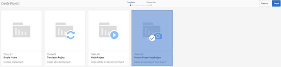
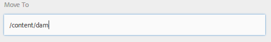

# 創意項目與PIM整合 {#creative-project-and-pim-integration}

如果您是營銷人員或創意專業人士，您可以使用Adobe Experience Manager(AEM)的Creative Project工具管理與電子商務相關的產品圖片和組織內相關的創意流程。

您可以使用Creative Project簡化照片拍攝工作流中的以下任務：

* 生成照片拍攝請求
* 上傳照片
* 合作拍攝照片
* 打包批准的資產

>[!NOTE]
>
>請參閱 [項目用戶角色以獲取資訊](/help/sites-authoring/projects.md#user-roles-in-a-project) 將用戶角色和工作流分配給特定類型的用戶。

## 產品照片拍攝工作流  {#exploring-product-photo-shoot-workflows}

Creative Project提供了各種項目模板以滿足不同的項目要求。 的 **產品照片拍攝項目** 模板可在現成的情況下使用。 此模板包括照片拍攝工作流，您可以啟動和管理產品照片拍攝請求。 它還包括一系列任務，使您能夠通過適當的審核和批准流程獲得產品的數字影像。

## 建立產品照片拍攝項目 {#create-a-product-photo-shoot-project}

1. 在 **項目** 控制台，點擊或按一下 **建立** 然後選擇 **建立項目** 清單中。

   

1. 在 **建立項目** ，選擇 **產品照片拍攝項目** 模板，點擊或按一下 **下一個**。

   

1. 輸入項目詳細資訊，包括標題、說明和到期日期。 添加用戶並為其分配各種角色。 您還可以為項目添加縮略圖。

   

1. 點擊或按一下 **建立**。 確認消息通知項目已建立。
1. 點擊或按一下 **完成** 返回 **項目** 控制台。 或者，點擊或按一下 **開啟** 查看項目中的資產。

## 在產品照片拍攝項目中啟動工作 {#starting-work-in-a-product-photo-shoot-project}

要啟動照片拍攝請求，請點擊或按一下項目，然後點擊或按一下 **添加工作** 在項目詳細資訊頁面中啟動工作流。


A **產品照片拍攝項目** 包括以下現成工作流：

* **產品照片拍攝(Oracle Commerce Integration)工作流**:該工作流利用與產品資訊管理(PIM)系統的商業整合來自動生成所選產品（層次）的快照清單。 在工作流完成後，您可以將產品資料作為資產元資料的一部分進行查看。
* **產品照片拍攝工作流**:通過此工作流，您可以提供快照清單，而不依賴於商業整合。 它將上載的影像映射到項目資產資料夾中的CSV檔案。

使用 **產品照片拍攝(Commerce Integration)** 將影像資產與中的產品映射AEM。 此工作流利用商業整合將批准的映像連結到位置的現有產品資料 `/etc/commerce`。

的 **產品照片拍攝(Commerce Integration)** 工作流包括以下任務：

* 建立鏡頭清單
* 上傳拍照
* 重觸照片拍攝
* 審閱和批准
* 移至生產任務

如果中不提供產品信AEM息，請使用 **產品照片拍攝** 工作流，根據您在CSV檔案中上載的詳細資訊，將影像資產與產品映射。 CSV檔案必須包含基本的產品資訊，如產品ID、類別和說明。 工作流提取產品的批准資產。

此工作流包括以下任務：

* 上載鏡頭清單
* 上傳拍照
* 重觸照片拍攝
* 審閱和批准
* 移至生產任務

可以使用工作流配置選項自定義此工作流。

兩個工作流都包括將產品與其批准的資產連結的步驟。 每個工作流都包括以下步驟：

* 工作流配置：介紹自定義工作流的選項
* 啟動項目工作流：說明如何啟動產品照片拍攝
* 工作流任務詳細資訊：提供工作流中可用任務的詳細資訊

## 跟蹤項目進度 {#tracking-project-progress}

您可以通過監視項目內的活動/已完成任務來跟蹤項目的進度。

使用以下方法監視項目進度：

* 任務卡
* 任務清單

任務卡描述了項目的整體進度。 僅當項目具有任何相關任務時，它才會出現在項目詳細資訊頁面上。 任務卡根據完成的任務數顯示項目的當前完成狀態。 它不包括將來的任務。

任務卡提供以下詳細資訊：

* 活動任務的百分比
* 已完成任務的百分比


任務清單提供有關項目當前活動工作流任務的詳細資訊。 要顯示清單，請點擊或按一下任務卡。 任務清單還顯示元資料，如任務的開始日期、到期日、受分配人、優先順序和狀態。


## 工作流程設定 {#workflow-configuration}

此任務涉及根據用戶的角色將工作流步驟分配給用戶。

配置 **產品照片拍攝** 工作流：

1. 導航到 **工具** > **工作流**，然後點擊 **模型** 平鋪以開啟 **工作流模型** 的子菜單。
1. 選擇 **產品照片拍攝** 工作流，點擊 **編輯** 的子菜單。

   

1. 在 **產品照片拍攝工作流** 的子菜單。 例如，開啟 **上載鏡頭清單** 的子菜單。

   

1. 點擊或按一下 **任務** 頁籤來配置以下內容：

   * 任務名稱
   * 接收任務的預設用戶（角色）
   * 任務的預設優先順序，顯示在用戶的任務清單中
   * 受分配人開啟任務時要顯示的任務說明
   * 任務的到期日期，根據任務開始的時間計算

1. 按一下 **確定** 的子菜單。

您可以為 **產品照片拍攝** 工作流。

執行相同步驟以配置 **產品照片拍攝(Oracle Commerce Integration)工作流**。

## 啟動項目工作流 {#starting-a-project-workflow}

本節介紹如何將產品資訊管理與創意項目整合。

1. 導航到產品照片拍攝項目，點擊或按一下 **添加工作** 表徵圖 **工作流** 卡。
1. 選擇 **產品照片拍攝(Commerce Integration)** 要啟動的工作流卡 **產品照片拍攝(Commerce Integration)** 工作流。 如果產品資訊不在 `/etc/commerce`，選擇 **產品照片拍攝** 工作流並啟動 **產品照片拍攝** 工作流。

   

1. 點擊或按一下 **下一個** 啟動項目中的工作流。
1. 在下一頁上輸入工作流詳細資訊。

   

1. 點擊或按一下 **提交** 啟動照片拍攝工作流。 此時將顯示照片拍攝項目的項目詳細資訊頁面。

   

### 工作流任務詳細資訊 {#workflow-tasks-details}

照片拍攝工作流包括多個任務。 每個任務都根據為任務定義的配置分配給用戶組。

#### 建立快照清單任務 {#create-shot-list-task}

的 **建立鏡頭清單** 任務使項目所有者能夠選擇需要映像的產品。 基於用戶選擇的選項，生成包含基本產品資訊的CSV檔案。

1. 在項目資料夾中，按一下或按一下位於 [任務卡](#tracking-project-progress) 查看工作流中的任務項。

   

1. 選擇 **建立鏡頭清單** 任務，然後點擊/按一下 **開啟** 的子菜單。

   

1. 查看任務詳細資訊，然後點擊/按一下 **建立鏡頭清單** 按鈕

   

1. 選擇存在沒有關聯映像的產品資料的產品。

   

1. 點擊或按一下 **添加到鏡頭清單** 的子菜單。 一條消息確認已為所選產品建立快照清單。 按一下 **關閉** 的子菜單。

1. 建立快照清單後， **查看鏡頭清單** 的上界。 若要向鏡頭清單添加更多產品，請點擊或按一下 **添加到鏡頭清單**。 在這種情況下，資料被附加到最初建立的快照清單。

   

1. 點擊或按一下 **查看鏡頭清單** 按鈕。

   

   要編輯現有資料或添加新資料，請點擊/按一下 **編輯** 的子菜單。 僅**產品**和 **說明** 欄位是可編輯的。

   

   更新檔案後，點擊或按一下 **保存** 的子菜單。

1. 添加產品後，點擊或按一下 **完成** 表徵圖 **建立鏡頭清單** 「任務詳細資訊」頁，將任務標籤為已完成。 您可以添加可選注釋。

任務完成後，項目內將發生以下更改：

* 與產品層次結構對應的資產在與工作流標題同名的資料夾中建立。
* 即使在攝影師提供影像之前，使用Assets控制台也可以編輯資產的元資料。
* 建立照片拍攝資料夾，該資料夾儲存攝影者提供的影像。 照片拍攝資料夾包含照片清單中每個產品條目的子資料夾。

### 上載快照清單任務 {#upload-shot-list-task}

此任務是「產品照片拍攝」工作流的一部分。 如果中沒有產品資訊，則執行此任AEM務。 在這種情況下，您將上載CSV檔案中需要映像資產的產品清單。 根據CSV檔案中的詳細資訊，可將影像資產與產品映射。 該檔案必須是名為 `shotlist.csv`。

使用 **查看鏡頭清單** 連結，以下載示例CSV檔案。 查看示例檔案以瞭解CSV檔案的常見內容。

產品清單或CSV檔案可包含欄位，如 **類別、產品、ID、說明**, **路徑**。 的 **ID** 欄位是必需的，並包含產品ID。 其他欄位是可選的。

產品可以屬於特定類別。 產品類別可以列在CSV下 **類別** 的雙曲餘切值。 的 **產品** 欄位包含產品名稱。 在 **說明** 欄位中，輸入攝影師的產品說明或說明。

1. 在項目資料夾中，按一下或按一下位於 [任務卡](#tracking-project-progress) 來查看工作流中的任務清單。
1. 選擇 **上載鏡頭清單** 任務，然後點擊或按一下 **開啟** 的子菜單。

   

1. 查看任務詳細資訊，然後點擊或按一下 **上載鏡頭清單** 按鈕

   

1. 點擊或按一下 **上載鏡頭清單** 按鈕。 工作流將此檔案識別為用於提取下一任務的產品資料的源。
1. 以適當格式上載包含產品資訊的CSV檔案。 的 **查看已上載的資產** 上載CSV檔案後，卡下會出現連結。

   

   按一下 **完成** 表徵圖以完成任務。

1. 點擊/按一下 **完成** 表徵圖以完成任務。

### 上載照片拍攝任務 {#upload-photo-shoot-task}

如果您是編輯器，則可以上載中列出的產品的快照 **shollist.csv** 在上一任務中建立或上載的檔案。

要上載的映像名稱必須以開頭 `<ProductId_>` 何處 `ProductId` 引用自 **ID** 的 `shotlist.csv` 的子菜單。 例如，對於鏡頭清單中具有 **ID** `397122`，您可以上載具有名稱的檔案 `397122_highcontrast.jpg`。 `397122_lowlight.png`等等。

您可以直接上載映像，也可以上載包含映像的ZIP檔案。 根據它們的名稱，影像被放置在照片拍攝資料夾內的相應產品資料夾中。

1. 在項目資料夾下，按一下或按一下位於 [任務卡](#tracking-project-progress) 查看工作流中的任務項。
1. 選擇 **上傳照片拍攝** 任務，然後點擊或按一下 **開啟** 的子菜單。

   

1. 點擊或按一下 **上傳照片拍攝** 並上傳照片。
1. 點擊或按一下 **完成** 的子菜單。

### 重新觸摸照片拍攝任務 {#retouch-photo-shoot-task}

如果您具有編輯權限，請執行 **重觸照片拍攝** 任務：編輯上載到照片拍攝資料夾的影像。

1. 在項目資料夾下，按一下或按一下右下角的橢圓按鈕 [任務卡](#tracking-project-progress) 查看工作流中的任務項。
1. 選擇 **重觸照片拍攝** 任務，然後點擊/按一下 **開啟** 的子菜單。

   

1. 點擊或按一下 **查看已上載的資產** 連結 **重觸照片拍攝** 頁面以瀏覽上載的影像。

   

   如有必要，請使用Adobe Creative Cloud應用程式編輯影像。

   

1. 點擊或按一下 **完成** 的子菜單。

### 審閱和批准任務 {#review-and-approve-task}

在此任務中，您將查看由攝影師上傳的照片照片，並將照片標籤為已批准使用。

1. 在項目資料夾下，按一下或按一下位於 [任務卡](#tracking-project-progress) 查看工作流中的任務項。
1. 選擇 **審閱和批准** 任務，然後點擊或按一下 **開啟** 的子菜單。

   

1. 在 **審閱和批准** 頁，將審閱任務分配給角色，然後點擊或按一下 **審閱** 以開始審閱上載的產品映像。

   

1. 選擇產品映像，點擊或按一下 **批准** 的子菜單。 批准影像後，影像上會顯示一個批准的標題。

   

1. 點擊或按一下 **完成**。 已批准的映像與已建立的空資產連結。

您可以省去一些沒有任何影像的產品。 稍後，您可以重新訪問該任務，並在完成後將其標籤為完成。

您可以使用「資產」UI導航到項目資產並驗證批准的映像。

點擊或按一下下一級別，根據您的產品資料層次結構查看產品。

Creative Project將批准的資產與引用的產品關聯。 資產元資料使用中的產品參考和基本資訊更新 **產品資料** 頁籤頁面中的「AEM Asset Metadata」部分。

>[!NOTE]
>
>在 **產品照片拍攝工作流** （沒有商業整合），批准的影像與產品無關。

### 移至生產任務 {#move-to-production-task}

此任務將批准的資產移至生產就緒資料夾，以使其可用。

1. 在項目資料夾下，按一下或按一下位於 [任務卡](#tracking-project-progress) 查看工作流中的任務項。
1. 選擇 **移至生產** 任務，然後點擊或按一下 **開啟** 的子菜單。

   

1. 要在將照片拍攝移至生產就緒資料夾之前查看批准的資產，請按一下 **查看批准的資產** 連結位於 **移至生產** 的子菜單。

   

1. 在 **移到** 的子菜單。

   

1. 點擊或按一下 **移至生產**。 關閉確認訊息。資產被移動到所述路徑，並且基於資料夾層次結構為每個產品的批准資產自動建立自旋集。

1. 點擊/按一下 **完成** 的子菜單。 工作流完成，因為最後一步標籤為完成。

## 查看DAM資產元資料 {#viewing-dam-asset-metadata}

在您批准後，資產將連結到相應的產品。 的 [「屬性」頁](/help/assets/manage-assets.md#editing-properties) 批准的資產中， **產品資料** （連結的產品資訊）頁籤。 此標籤顯示連結資產的產品詳細資訊、SKU編號和其他產品相關詳細資訊。 點擊或按一下 **編輯** 表徵圖以更新資產屬性。 與產品相關的資訊保持只讀狀態。

點擊或按一下連結，該連結顯示為導航到與資產關聯的產品控制台中的相應產品詳細資訊頁面。

## 自定義項目照片拍攝工作流 {#customizing-the-project-photo-shoot-workflows}

您可以自定義 **項目照片拍攝** 工作流根據您的要求。 這是一個可選的基於角色的任務，您可以執行該任務來設定項目中變數的值。 之後，您就可以使用配置的值來做出決策。

1. 按一下或點AEM擊徽標，然後導航至 **工具** > **工作流** > **模型** 開啟 **工作流模型** 的子菜單。
1. 選擇 **產品照片拍攝(Commerce Integration)** 工作流或 **產品照片拍攝** 工作流，按一下或點擊 **編輯** 的子菜單。
1. 開啟側面板並找到 **建立基於角色的項目任務** 將其拖到工作流中。

   

1. 開啟 **基於角色的任務** 的子菜單。
1. 在 **任務** 頁籤，提供將顯示在任務清單中的任務的名稱。 您還可以將任務分配給角色、設定預設優先順序、提供說明並指定任務到期的時間。

   

1. 在 **路由** 頁籤。 要添加多個操作，請點擊或按一下 **添加項** 的子菜單。

   

1. 添加選項後，按一下 **確定** 的子菜單。

1. 回到 **工作流模型** 按一下 **同步** 的子菜單。 點擊或按一下 **確定** 不保存工作流中的更改。 要保存工作流中的更改，請點擊或按一下 **同步**。

1. 開啟側面板並找到 **轉至步驟** 將其拖到工作流中。

1. 開啟 **轉到** 任務，點擊或按一下 **進程** 頁籤。

1. 選擇 **目標步驟** 轉到並指定 **路由表達式** 是ECMA指令碼。 然後，在 **指令碼** 欄位：

   ```javascript
   function check() {
   
   if (workflowData.getMetaDataMap().get("lastTaskAction","") == "Reject All") {
   
   return true
   
   }
   
   // set copywriter user in metadata
   
   var previousId = workflowData.getMetaDataMap().get("lastTaskCompletedBy", "");
   
   workflowData.getMetaDataMap().put("copywriter", previousId);
   
   return false;
   
   }
   ```

   >[!TIP]
   >
   >有關工作流步驟中指令碼的詳細資訊，請參閱 [定義或分解的規則](/help/sites-developing/workflows-models.md)。

   

1. 點擊或按一下 **確定**。

1. 點擊或按一下 **同步** 的子菜單。

現在在 [移至生產任務](#move-to-production-task) 已完成並分配給所有者。

中的用戶 **所有者** 角色可以完成任務，並從注釋彈出式清單中的清單中選擇操作（從工作流步驟配置中添加的操作清單中）。

>[!NOTE]
>
>啟動伺服器時，Project任務清單servlet會快取在下定義的任務類型和URL之間的映射 `/libs/cq/core/content/projects/tasktypes`。 然後，可以執行通常的覆蓋並添加自定義任務類型，方法是將它們放在 `/apps/cq/core/content/projects/tasktypes`。
